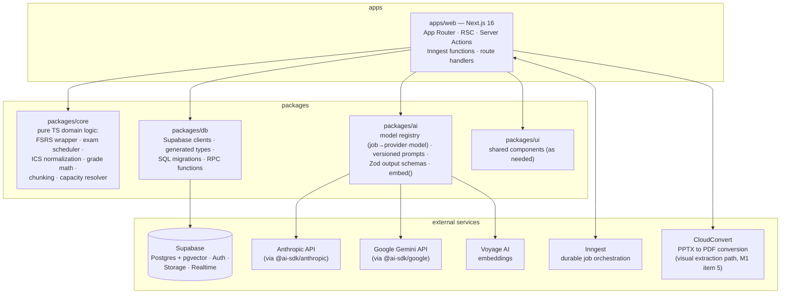
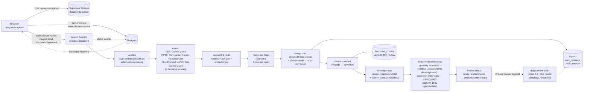
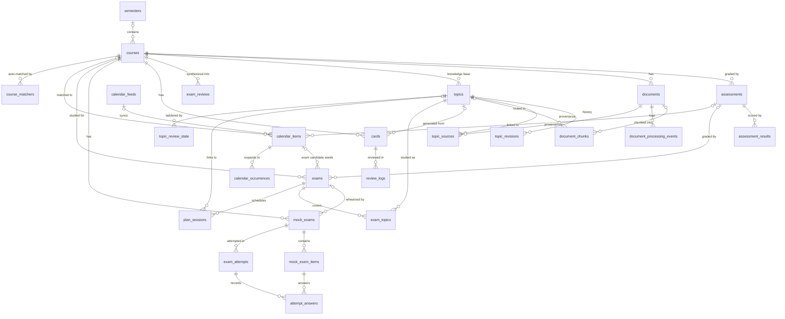

# Alex's Study Dashboard — Product & Technical Plan

> The product bible for Alex's Study Dashboard ("Study Dashboard" for short throughout).
> Any competent engineer (or future Claude Code session)
> should be able to pick up any milestone from this document and execute it without
> guessing. Read `CLAUDE.md` for repo conventions first; this document covers *what* to
> build, *why*, and *how*.

**Status:** M0 + M0.5 shipped (renamed to Alex's Study Dashboard). Complete design system
specified 2026-07-17 (see *Identity & design*) and **implemented 2026-07-18** in M1 Wave 1
(items 13a + 13b) — the azure analyst-terminal system is live in production and the interim
electric-blue cockpit baseline is gone. M1 in progress — see the M1 progress note.
This plan covers M1–M4.
**Last updated:** 2026-07-18.

## Contents

1. [Vision & product principles](#vision--product-principles)
2. [Architecture overview](#architecture-overview)
3. [Core features](#core-features) — document pipeline, calendar hub, exam planner, practice engine, coding trainer
4. [Additional features](#additional-features) — ten curated features beyond the core
5. [Data model](#data-model) — every table, relationships, RLS strategy
6. [AI strategy](#ai-strategy) — models, structured outputs, prompt versioning, costs, caching
7. [Roadmap](#roadmap) — M0 → M4 with definitions of done
8. [Risks & open questions](#risks--open-questions)

---

## Vision & product principles

Study Dashboard consolidates one student's entire academic life — deadlines, lecture notes, exam
prep, and coding practice — into a single dashboard that gets smarter with every upload.
The user: a BBA + Data & Business Analytics dual-degree student at IE University (Madrid)
who is also a startup founder. Time is the scarcest resource; the product's job is to
convert scattered course material into ready-to-use study artifacts and to answer, at any
moment, *"what should I do right now?"*

**The core loop** every feature serves:

```
upload / capture  →  structured knowledge (topic pages)  →  practice artifacts
(cards, plans, drills, lessons)  →  scheduled daily work  →  measured outcomes (grades)
```

### Product principles

1. **Cumulative, not archival.** Notes are organized per *topic*, not per file. Session 7's
   slides refine existing topic pages; they never create "Lecture 7 notes" silos. The
   knowledge base compounds.
2. **Human-reversible AI.** The LLM decides by default; a cheap second-pass **critic**
   verifies its work (silent-pass → auto-retry once where regeneration is cheap → hold the
   flagged minority), and everything it produces is reversible and regenerable — so
   generated cards, glossary terms, coding lessons, and recap quizzes are **born active**,
   not parked in an approval queue. The critic silently holds only the items it flags
   ("18 added · 2 held for review"). A mandatory human confirm is reserved for the two
   places a wrong item is both hard to notice and expensive: **grade-critical** data
   (e.g. syllabus-extracted assessment weights) and **deadline/date-critical** data (e.g.
   calendar quick-add, calendar-derived exam dates). The gates are defined by *data class*,
   not by screen — any new surface producing data of either class inherits the gate, and no
   third class is ever added. Bad AI output must cost seconds to undo, never weeks of
   mis-scheduled reviews.
3. **Deterministic where it counts.** Scheduling, grade math, spaced repetition, and
   capacity planning are pure, unit-tested functions in `packages/core`. The LLM never
   sits inside a loop that must be reproducible, instant, or free.
4. **Solo-first, multi-user-ready.** One user today, but every table carries `user_id`
   with RLS from day one, external auth flows stay standard, and nothing assumes "there is
   only one of me" in the schema.
5. **Boring infrastructure, aggressive product.** Supabase + Vercel + one background-job
   system (Inngest). No second deploy targets, no self-hosted services, no ops burden that
   competes with building features.
6. **The phone is a first-class study surface.** Reviews, capture, and participation
   logging happen standing in hallways — as an installable PWA, not a native app.
7. **Data is the user's.** Everything exports (Anki, Obsidian/Markdown, CSV/JSON), and an
   append-only event stream makes the user's own learning analyzable — fitting for an
   analytics degree.

### Identity & design (design system — decided 2026-07-16, specified 2026-07-17, **implemented 2026-07-18**)

This is the complete visual design system for Alex's Study Dashboard, decided explicitly
by Alexander in a structured design interview (2026-07-17) run against the `impeccable`
skill's product register. It **replaced** the shipped M0.5 "electric-blue cockpit" baseline
(see [M1 progress](#m1--the-app-is-useful-every-day-deadlines--document-pipeline-v1), item 0),
which was ported out in M1 Wave 1 (items 13a + 13b, merged 2026-07-18). The values below are
the **live** system in `apps/web/src/app/globals.css`, not a target; corrections found while
implementing are marked inline. Nothing about the product name, domain, or package scope changes.

Everything here is implementable inside the CLAUDE.md constraints: Tailwind v4 `@theme`
tokens + shadcn/ui on Base UI (Nova preset, `render` prop not `asChild`), fonts as
`--font-sans` / `--font-serif` / `--font-mono` CSS variables via `next/font`, dark mode via
next-themes (`attribute="class"`). Tokens live in `apps/web/src/app/globals.css`.

#### Design thesis

**An analyst's terminal that reads like a book.** The chrome is an *analyst terminal*
(Bloomberg × Linear): hairline grids, dense mono data, a calm deep-dark ground, one
confident owned accent — an instrument for a data-and-analytics student who lives in
"what should I do right now?". But the product's soul is a *cumulative knowledge base*, so
notes get a second, deliberately different **reading register**: a warm, roomy, serif
reading canvas. Two registers, one system.

Three commitments hold it together and keep it off the first-order "dark dashboard + blue +
mono numbers" reflex:

1. **Owned, not default.** The accent is a luminous **electric azure** (hue ≈ 237), not the
   generic electric-blue-259 of every dev dashboard; neutrals are tuned to the same hue so
   surface and accent read as one instrument.
2. **Distinctive through discipline.** Personality is *playful · distinctive* but expressed
   through a contained signature system — the wordmark **dot motif**, mono accent/semantic-
   punctuated hero numbers, and two signature motions — not a second accent color or noise.
3. **Restrained floor, committed peaks.** Tinted neutrals + one accent everywhere (color
   strategy = *Restrained*); specific surfaces earn *Committed* color (a drenched exam
   countdown, a course-colored header, a streak celebration).

**Brand personality:** precise · fast · calm at the core, *playful · distinctive* at the
edges. **Voice:** terse and exact by default, with a little warmth/wit reserved for empty
states, milestones, and celebrations (peak-end rule) — never chatty in the daily driver.
Reference products to emulate: **Linear** (restraint, keyboard-first, motion discipline),
**Bloomberg / a trading terminal** (dense mono data, at-a-glance triage), **Things / iA
Writer** (the reading register's calm). To avoid: SaaS-cream marketing warmth, glassmorphism,
hero-metric templates, anything that reads "AI-generated dashboard."

#### Decisions at a glance

| Decision | Choice |
| --- | --- |
| Name / short form | **Alex's Study Dashboard** / **Study Dashboard** (unchanged) |
| Domain | `www.alexanderkrink.com` (unchanged) |
| Package scope | `@study/*`; root `alex-study-dashboard` (unchanged) |
| Direction | **Analyst terminal** — sharpen the cockpit toward Bloomberg × Linear precision |
| Registers | **Two:** dense dark *cockpit* chrome + warm *reading* canvas for topic pages/notes |
| Color strategy | **Restrained + committed moments** |
| Theme default | **Dark by default**; light + system fully supported (next-themes) |
| Accent | **Electric azure**, hue ≈ 237 — single accent + tint ramp (no second hue) |
| Neutrals | Cool, **accent-aligned** (hue ≈ 237); deep 3-tier surface stack |
| Urgency | **Heat ramp** (overdue red → high amber → medium dim-amber → low neutral); **green = done (status lane)** |
| Course colors | Curated **8-hue** categorical set (per-hue L/C tuned for equal perceived weight) |
| Persona colors | **indigo / violet / emerald** (student / founder / life) |
| Data-viz | **Full system:** 8-hue categorical + azure sequential + diverging |
| Type | **Geist Sans** (UI) · **Newsreader** serif (reading) · **JetBrains Mono** (data/code/wordmark) |
| Hero numbers | **Mono, tabular, accent/semantic-punctuated** |
| Density | **Dual density**, 4px base (compact cockpit / comfortable reading) |
| Radius & border | **Dual:** sharp 6px cockpit / soft 10px reading; **1px hairline** borders |
| Icons | **Phosphor** (multi-weight; fill = active) — migrate off lucide |
| Motion | **Fast, state-only + two signatures** (hero-number roll + sync-pulse) |
| Navigation | **Left sidebar + ⌘K palette**; bottom-tab on mobile |
| Wordmark / motif | `study●dashboard` mono, azure **dot motif** reused system-wide |
| States / voice | Skeletons; teaching empty states; **precise, warm at the edges** |
| Mobile / a11y | **PWA-first**, WCAG **2.2 AA** (AAA reading body), 44px touch targets |

#### Color tokens (OKLCH — both themes fully specified)

Neutrals carry a faint cool cast at the accent's hue (≈ 237) so chrome and accent read as
one instrument. The dark ground is a deep 3-tier stack (canvas → raised → overlay);
elevation is expressed by lightness + hairline borders, **not** shadow (shadows are reserved
for true overlays). Neutral body/label pairings below clear WCAG AA (≥ 4.5:1) and
reading-register body clears AAA (≥ 7:1); **colored text** (links, urgency, semantic marks)
uses the darker *light-mode* variants noted with each palette, because bright azure/amber/
green all fail 4.5:1 as small text on the near-white canvas. Verify every pair with a
contrast checker at implementation.

> **⚠ Gamut warning (learned at implementation, 2026-07-18).** A plain contrast checker is
> **not sufficient for this palette**. Nine of these tokens — including `--primary` in both
> themes, light `--accent`, light `--accent-text`, and the light heat-ramp amber/green — fall
> **outside the sRGB gamut**. Most checkers naively *clip* the negative channel, which reports
> an optimistic ratio; browsers instead **gamut-map** per CSS Color 4 §13.2 (hold L and hue,
> reduce chroma), which lands darker. Two AA failures shipped past a naive check this way and
> were caught only by gamut-aware math: light `--accent-foreground` at L 0.20 measured 4.51:1
> clipped but **4.31:1 mapped** (now L 0.15), and the light `high` amber measured fine on the
> canvas but **4.41:1 on `--accent-subtle`** — the table-hover surface this very document
> mandates below (now L 0.53). **Rule: any future token work must use a gamut-mapping-aware
> checker, and must test colored text against `--accent-subtle`, not just the canvas.**

```css
/* ---- Light (cockpit) ---- */
:root {
  --background:        oklch(0.98 0.004 237);   /* app canvas  ~#f6f8fa */
  --surface:           oklch(0.995 0.002 237);  /* raised card ~#fdfdff */
  --card:              oklch(0.995 0.002 237);
  --popover:           oklch(1 0 0);            /* overlay     ~#ffffff */
  --muted:             oklch(0.965 0.006 237);  /* subtle bg   ~#eef1f5 */
  --secondary:         oklch(0.965 0.006 237);
  --foreground:        oklch(0.21 0.02 237);    /* primary ink ~#1c2531 */
  --muted-foreground:  oklch(0.45 0.02 237);    /* AA on canvas ~#5b6675 */
  --border:            oklch(0.90 0.008 237);   /* hairline    ~#dde1e8 */
  --input:             oklch(0.90 0.008 237);

  --primary:           oklch(0.52 0.16 237);    /* azure btn fill; white text ~5.0:1 (AA) */
  --primary-foreground:oklch(0.99 0.005 237);
  --accent:            oklch(0.58 0.17 237);    /* bright azure: focus ring, wordmark dot, hover/selected bg */
  --accent-foreground: oklch(0.15 0.02 237);    /* DARK ink on solid --accent chips: light-mode --accent (L 0.58) is too light for white text. CORRECTED 2026-07-18 (was 0.20, which fails AA — see the gamut note below) */
  --accent-text:       oklch(0.50 0.15 237);    /* 🔴 DISPROVEN 2026-07-19 (Wave 3): NOT AA-safe. "~5.5:1 on canvas" is the composite on the BARE canvas; on --accent-subtle at 11px/400 it samples 4.04, and 4.31 at weight 500. Now oklch(0.44 0.15 237) — worst site 5.00. Hue/chroma untouched. */
  --ring:              oklch(0.58 0.17 237);    /* = --accent (bright azure); focus rings are non-text, 3:1 suffices */

  --radius:            0.375rem;                /* 6px cockpit base */
  --radius-reading:    0.625rem;                /* 10px reading cards */
}
/* Reading register (light) — a deliberate warm paper surface, NOT the app bg */
:root {
  --reading-bg:        oklch(0.985 0.006 80);   /* warm off-white paper ~#f9f6f0 */
  --reading-foreground:oklch(0.24 0.012 60);    /* warm dark ink ~#2a2620 */
  --reading-muted:     oklch(0.46 0.012 60);    /* captions, meta */
}

/* ---- Dark (cockpit) — default ---- */
.dark {
  --background:        oklch(0.13 0.012 237);   /* canvas   ~#0b0e14 (e0) */
  --surface:           oklch(0.16 0.014 237);   /* raised   ~#10141c (e1) */
  --card:              oklch(0.16 0.014 237);
  --popover:           oklch(0.19 0.016 237);   /* overlay  ~#151b25 (e2) */
  --muted:             oklch(0.22 0.016 237);   /* subtle bg ~#1a212c */
  --secondary:         oklch(0.22 0.016 237);
  --foreground:        oklch(0.94 0.006 237);   /* primary ink ~#e9ecf1 */
  --muted-foreground:  oklch(0.70 0.012 237);   /* AA on card ~#9aa4b2 */
  --border:            oklch(0.94 0.01 237 / 10%);  /* hairline */
  --input:             oklch(0.94 0.01 237 / 14%);

  --primary:           oklch(0.54 0.15 237);    /* azure btn fill; white text ~4.8:1 (AA, tight — do not brighten) */
  --primary-foreground:oklch(0.99 0.005 237);
  --accent:            oklch(0.68 0.16 237);    /* bright azure: focus ring, wordmark dot, hover/selected bg (NOT link text — use --accent-text) */
  --accent-foreground: oklch(0.15 0.02 237);    /* on solid --accent chips/highlights */
  --accent-text:       oklch(0.72 0.15 237);    /* azure link/interactive TEXT on dark (AA-safe) */
  --ring:              oklch(0.68 0.16 237);
}
/* Reading register (dark) — a warm, slightly lifted panel inside the dark app */
.dark {
  --reading-bg:        oklch(0.17 0.006 70);    /* warm graphite ~#1a1713 */
  --reading-foreground:oklch(0.90 0.008 70);    /* warm off-white ink ~#e6ded2 */
  --reading-muted:     oklch(0.66 0.010 70);
}
```

**Accent tint ramp** (the "single accent + ramp" decision — all derived from azure, no
second hue): `accent-subtle` = accent @ 10% over surface (selected rows, active-nav bg);
`accent-border` = accent @ 32%; `accent-base` = `--primary`; `accent-hover` = primary
+5% L; `accent-active` = primary −5% L. Two azure roles keep contrast honest: the **bright**
`--accent` (L ≈ 0.68 dark / 0.58 light) drives focus rings (`--ring` = `--accent` in both
themes), the wordmark dot, and hover/selected backgrounds (with `--accent-foreground`);
**`--accent-text`** (L ≈ 0.72 dark / 0.50 light) is the AA-safe azure for **all colored
link/interactive text in both themes**, since the bright accent alone fails 4.5:1 as text on
the light canvas. Rule of thumb: `--accent` paints, `--accent-text` writes. Note that `--accent-foreground` is
**dark ink in both themes** — the bright accent is too light to carry white text in either —
so a solid azure chip reads dark-on-azure everywhere; the white-on-azure pairing is
`--primary` + `--primary-foreground`, which is what filled buttons use.

**Semantic — urgency heat ramp (green = done in the status lane).** Deadlines run a heat ramp
so nothing in the *urgency/status lane* colors "low priority" green; there, green means only
completion/success. (Categorical greens — course #5, persona *life*, chart-6 — are a separate
identity register that never reads as status, so they don't break the rule.)

| Role | Dark | Light (text) | Use |
| --- | --- | --- | --- |
| `overdue` / danger | `oklch(0.68 0.19 25)` | `oklch(0.53 0.20 27)` | overdue deadlines, destructive |
| `high` / urgent (amber) | `oklch(0.78 0.15 68)` | `oklch(0.53 0.14 65)` | high-weight / due-soon, warnings |
| `medium` (dim amber) | `oklch(0.80 0.09 82)` | `oklch(0.55 0.10 78)` | mid-tier weight |
| `low` / info (neutral) | `--muted-foreground` | `--muted-foreground` | low-weight, classes, info |
| `done` / success (green) | `oklch(0.74 0.15 155)` | `oklch(0.50 0.13 155)` | **only** completed / passed / correct |

The **light** column is tuned for colored **text/numerals** (AA ≥ 4.5:1 on the near-white
canvas — bright amber/green fail as small text, so light-mode text uses these darker
L ≈ 0.50–0.55 values). When a tier renders as a **filled badge** instead, back a lighter
tint of the same hue with dark foreground text. `--destructive` maps to the `overdue`/danger
red; destructive **buttons** deepen to `oklch(0.55 0.20 25)` (dark) / `oklch(0.50 0.20 27)`
(light) so white text clears AA.

⚠ **CORRECTED 2026-07-19 (Wave 2) — the light column above is a PAINTING column; small text
needs a darker sibling.** The values as specified clear AA *composited* and still fail *as
rendered*. A weight badge is 11px 500-weight glyphs on a 10% wash of their own hue, and
anti-aliasing never resolves the glyph body to the specified colour. Measured from rendered
browser pixels at **DPR 1** (both themes, 1280px and 375px, uniform probe label, 20th
percentile of cumulative distance mass):

| tier | composite | sampled | verdict |
| --- | --- | --- | --- |
| `overdue` | 4.89 | 4.74 | ok 🔴 DISPROVEN 2026-07-19 — see below |
| `high` | 4.68 | **4.42** | **FAILS** — the loudest rung, and what §7 ranks by |
| `medium` | 4.80 | 4.55 | thin |
| `done` | 4.76 | **4.50** | on the floor, zero headroom |

🔴 **DISPROVEN 2026-07-19 (Wave 3) — `overdue`'s "ok" was an artefact of measuring one
site.** Every row in the table above is the 11px **weight-500** badge with the uniform probe
label. Production also writes `--urgency-overdue` at **weight 400**, and a 400-weight glyph
surrenders more of its body to anti-aliasing than a 500-weight one. Re-measured across all
five sites that write with the token, same method, DPR 1, both themes, both widths:

| site | weight | composite | sampled (light) | sampled (dark) |
| --- | --- | --- | --- | --- |
| `sync-fail-chip` | 400 | 4.89 / 4.86 | **4.20 FAILS** | **3.99 FAILS** |
| `overdue-badge` | 500 | 4.89 / 4.86 | 4.54 | **4.35 FAILS** |
| `overdue-header` | 500 | 5.08 / 5.48 | 5.06 | 5.39 |
| `exam-conflict` | 400 | 5.80 / 6.16 | 4.81 | 4.75 |
| `due-in` | 400 | 5.80 / 6.16 | 5.19 | 5.22 |

`sync-fail-chip` is the worst reading in the system, and it is the one label on screen saying
the calendar data is stale. So `overdue` gets the same treatment as the other three:
`--urgency-overdue-text` `oklch(0.48 0.2 27)` light / `oklch(0.78 0.16 25)` dark. ⚠ Unlike
`high`/`medium`/`done`, the dark column does **not** alias its paint — overdue is the only
tier that fails in both themes, and dark red at L 0.68 C 0.19 on a 20% wash of itself
composites to only 4.86 before anti-aliasing. Chroma drops to 0.16 there because red at
L 0.78 C 0.19 is outside sRGB. Hue is untouched in both columns.

The general lesson, which outlives these two tokens: **a ramp spec that measures one render
site per token measures the best case.** `e2e/thin-token-contrast.spec.ts` enumerates every
site instead, and carries no per-site allowance.

So the ramp now splits paint from ink, the same rule as `--accent` / `--accent-text`:
`--urgency-high-text` `oklch(0.48 0.14 65)` and `--urgency-done-text` `oklch(0.45 0.13 155)`
join the existing `--urgency-medium-text` `oklch(0.48 0.09 78)`. **Hue and chroma are
untouched on all three — only lightness moves**, so 🎨 no urgency tier drifts toward green
(green stays `done` ONLY) and `done` stays green without drifting toward amber. Every badge
now measures **5.35–5.50 sampled / 5.74–5.83 composite** in light, and the dark column aliases
each `-text` token straight back to its paint (6.23–7.31 sampled), because darkening a colour
that must stay light on a dark surface would wreck it.

The painting tokens keep the 2px row rule, the `--warning` / `--success` aliases, and the
panel icons (a graphical object's floor is 3:1, which they clear). Pinned by
`e2e/urgency-ramp-contrast.spec.ts`, which asserts **both** numbers for every tier across both
themes and both widths and fails if a `-text` token is ever aliased back to its paint in light
mode. ⚠ The failure is **DPR-dependent** — at 2x/3x the glyph core resolves to the full
composite value and everything passes, which is exactly why token math and retina spot-checks
missed it. Do not "fix" a future failure by raising `deviceScaleFactor`.

**Course palette — curated 8-hue categorical.** L/C are tuned *per hue* (L 0.68–0.80 dark,
0.55–0.65 light) rather than held literally constant, because equal L across hues does not
read as equal weight — yellow-greens need lifting, blues need less. The target is equal
*perceived* weight; course chips are small/contextual so mild overlap with semantics is
acceptable. Default course = palette **indigo**.

| # | Hue | Dark | Light |
| --- | --- | --- | --- |
| 1 indigo *(default)* | 265 | `oklch(0.68 0.14 265)` | `oklch(0.55 0.16 265)` |
| 2 violet | 300 | `oklch(0.68 0.16 300)` | `oklch(0.55 0.18 300)` |
| 3 pink | 350 | `oklch(0.72 0.15 350)` | `oklch(0.58 0.17 350)` |
| 4 gold | 85 | `oklch(0.80 0.12 85)` | `oklch(0.65 0.13 85)` |
| 5 green | 150 | `oklch(0.74 0.14 150)` | `oklch(0.55 0.14 150)` |
| 6 teal | 195 | `oklch(0.75 0.11 195)` | `oklch(0.58 0.11 195)` |
| 7 cyan | 225 | `oklch(0.74 0.12 225)` | `oklch(0.58 0.13 225)` |
| 8 rust | 40 | `oklch(0.70 0.14 40)` | `oklch(0.58 0.15 40)` |

**Persona palette** (Founder-Mode weekly ritual time-blocks) — well-separated, clear of the
urgency red/amber lane: **student = indigo** `oklch(0.66 0.15 262)` · **founder = violet**
`oklch(0.62 0.17 300)` · **life = emerald** `oklch(0.70 0.14 160)` (dark). Light: student
`oklch(0.52 0.16 262)` · founder `oklch(0.53 0.18 300)` · life `oklch(0.52 0.14 160)`. (Life
emerald hue ~160 sits deliberately just off status-green ~155 — it's an identity color, never
a status, so the proximity is intentional and lane-separated.)

**Data-viz system** (analytics is a core surface: retention curves, weak-topic heatmaps,
time-vs-weight scatter). Method follows the `dataviz` skill — perceptually-even categorical
hues, single-hue sequential ramp, neutral-midpoint diverging ramp, colorblind-checked
adjacencies.

- **Categorical (`--chart-1..8`)** — reuses **seven course hues plus the accent azure**
  (dropping course-cyan to avoid an azure/cyan clash) in a maximally-distinct order, so charts
  and course chips share one language: `1` azure (accent) · `2` gold · `3` violet · `4` teal ·
  `5` pink · `6` green · `7` indigo · `8` rust. `chart-1` azure = `oklch(0.68 0.16 237)` dark /
  `oklch(0.55 0.16 237)` light; `chart-2..8` take the course-palette dark/light columns above.
- **Sequential** (heatmaps, retention density) — single azure ramp, 6 stops. Dark (low→high):
  `oklch(0.28 0.05 237)` → `0.40 0.09` → `0.52 0.13` → `0.62 0.16` → `0.72 0.15` → `0.82 0.12`.
  Light (low end = light, so value order flips): `oklch(0.95 0.02 237)` → `0.86 0.06` →
  `0.74 0.11` → `0.62 0.15` → `0.50 0.15` → `0.40 0.12`.
- **Diverging** (Δ vs target, actual-vs-predicted retention) — red ↔ neutral ↔ green with a
  low-chroma neutral midpoint. Dark: `oklch(0.62 0.18 25)` ↔ `oklch(0.72 0.01 237)` ↔
  `oklch(0.68 0.15 150)`. Light: `oklch(0.52 0.19 27)` ↔ `oklch(0.92 0.005 237)` ↔
  `oklch(0.50 0.14 150)`.

#### Elevation & surfaces

Deep 3-tier dark stack, borders-first. **e0** canvas (`--background`) · **e1** raised
card/panel (`--surface`, +lightness, 1px hairline border, no shadow) · **e2**
overlay/popover/dropdown (`--popover`, +lightness + subtle shadow) · **e3** modal/dialog
(stronger shadow + scrim `oklch(0 0 0 / 55%)`). Shadows only appear at e2+. **No**
`border + wide-blur shadow` on the same element (the ghost-card anti-pattern); pick one.
Focus: 2px `--ring` (bright azure) + 2px offset in the surface color, always visible.

#### Typography

Three families on clean contrast axes (grotesque + serif + mono), loaded via `next/font`
as `--font-sans`, `--font-serif`, `--font-mono`.

- **Geist Sans** — all cockpit UI: labels, buttons, table headers, dense rows, nav. (Already
  installed.)
- **Newsreader** (Google) — the **reading register** only: topic-page prose, exam-review
  synthesis, lesson text. A warm, screen-optimized serif that makes reading feel like
  reading.
- **JetBrains Mono** — all data (grades, counts, %, dates, tables), the code editor, hero
  numbers, and the wordmark. Tabular figures + slashed zero via CSS
  `font-feature-settings: "tnum" 1, "zero" 1` (the `next/font` loader can't set OpenType
  features). Weights: hero numerals 500–600, table/inline data 400–500. This is the signature
  data face — moved off Geist Mono to match the owned-accent decision.

**Type scale** — fixed rem (product UI wants consistent DPI, not fluid clamp), tight ratio
≈ 1.2. Weights: 400 body, 500 labels/buttons, 600 headings (700 rare). Heading
letter-spacing −0.01em (≥ 20px), −0.02em on the rare display number; **never** tighter than
−0.04em.

| Token | Family | Size / line-height | Use |
| --- | --- | --- | --- |
| `ui-xs` | Geist | 11px / 1.3 | badges, table meta, kbd hints |
| `ui-sm` | Geist | 12px / 1.35 | secondary labels, table meta (**not** primary cell data — see the type floor) |
| `ui-base` | Geist | 13px / 1.45 | default cockpit UI text |
| `ui-md` | Geist | 14px / 1.5 | body-in-chrome, form values |
| `ui-lg` | Geist | 16px / 1.4 | section titles |
| `ui-xl` | Geist | 20px / 1.3 | page/panel headings |
| `read-body` | Newsreader | 18px / 1.65 | topic-page prose (measure 66–70ch) |
| `read-h3/h2/h1` | Newsreader | 20 / 24 / 30px | reading headings (500–600) |
| `read-cap` | Newsreader | 14px / 1.5 | captions, footnotes |
| `mono-data` | JetBrains | 13px / 1.45 | inline data, table numerals |
| `mono-code` | JetBrains | 13–14px / 1.55 | CodeMirror editor |
| `num-hero` | JetBrains | 28–48px / 1.05 | metric tiles, countdowns, GPA |
| `wordmark` | JetBrains | 15–16px, −0.01em | shell header wordmark |

**Hero numbers** (grades, GPA, countdowns, streaks, KPI tiles) are the recurring signature:
big **mono tabular** numeral, unit/label small in sans, and the delta or decimal **punctuated
in accent/semantic color** — e.g. `8.4` big, `/10` muted, `▲ +0.3` in success-green;
`6d 04h` mono countdown with a sans caps label. This is the single most repeated "instrument"
moment; keep it consistent everywhere numbers headline.

#### Spacing, grid & density

4px base unit; scale 4 · 8 · 12 · 16 · 20 · 24 · 32 · 40 · 48 · 64. **Dual density:**

- **Cockpit** — compact: row height 28–32px, gutters 8/12px, table cells 6px vertical
  padding. Max information per screen.
- **Reading** — comfortable: 66–70ch measure, 18px body, 1.65 line-height, 16–20px
  paragraph spacing, generous section breaks.

Content max-widths: cockpit panels fluid within a 12-column grid; reading column capped at
~68ch centered; full-bleed data tables scroll inside their own `overflow-x:auto` container
(the page body never scrolls horizontally). Responsive behavior is **structural** (collapse
sidebar → icon-rail → bottom-tab; tables reflow to stacked cards on mobile), not fluid type.

#### Radius & borders

Dual radius: **cockpit** panels/inputs/buttons 6px (`--radius`); **reading** cards 10px
(`--radius-reading`) for warmth; badges/tags/chips full-pill. Scale: 2 / 4 / 6 / 8 / 10 / 12
/ pill (12px is the card ceiling). Borders are **1px hairlines** (`--border`, ~10% on dark)
carrying most of the elevation work; radius never exceeds 12px on any card (no over-rounding).

#### Iconography

**Phosphor** (`@phosphor-icons/react`) — the only icon set. ✅ `lucide-react` was fully
migrated off and removed in M1 Wave 1 (item 13a), lockfile included.
Weights: `regular` default, `bold` for emphasis, **`fill` for active/selected**, `duotone`
for feature/empty-state moments (the multi-weight range is what serves the "distinctive"
brief). Sizes: 16px inline · 20px nav · 24px feature. Outline default; color inherits
`currentColor` (accent only on active). Consistent metaphor set across every surface. *Impl:
import from `@phosphor-icons/react/dist/ssr` in Server Components and add
`@phosphor-icons/react` to `optimizePackageImports` (its barrel export is a known Next
dev/bundle cost); use per-icon imports.*

#### Motion

Fast, state-conveying, no page-load choreography (product register). Durations:
`instant` 0ms · `fast` 120ms (hover/press) · `base` 180ms (menus, tabs) · `moderate`
240ms · `slow` 320ms (overlays). Easing: `ease-out-quart` `cubic-bezier(0.25,1,0.5,1)`,
`ease-out-expo` for larger moves. **No bounce/spring/elastic.** Route/content transitions do
**not** animate in (RSC renders into a task; no orchestrated load).

Two **signature** motions, used sparingly: (1) **hero-number roll** — a metric counts/ticks
to its new value on change (~600ms ease-out); (2) **sync-pulse** — a faint azure dot/ring
pulse on data refresh (Realtime updates, "Synced just now"), ~800ms once. **Reduced motion
is mandatory:** every animation has a `prefers-reduced-motion: reduce` alternative — number
roll → instant set, pulse → static state text, transitions → crossfade/instant.

#### Wordmark, motif & favicon

- **Wordmark:** `study` + azure **dot** `●` + `dashboard` in JetBrains Mono, weight 500,
  tracking −0.01em, in the sidebar header; full **"Alex's Study Dashboard"** on the login
  page. The dot uses the bright `--accent`.
- **Dot motif** (the signature detail, contained): the azure dot is reused system-wide —
  sync/status indicators (`●` synced / `○` pending / `●` pulsing = live), loading (`●●●`
  pulse instead of a spinner), empty-state marks, list bullets, and active-nav markers.
- **Favicon / PWA icon:** azure dot centered on the deep cockpit canvas in a rounded square
  (~20% corner radius); provide 32/180/512px + a maskable variant with safe-area padding.
  A `s●d` mono monogram is the acceptable large-size variant. Monochrome-accent, no small
  text. No separate logo asset to maintain.

#### Navigation

**Left sidebar + ⌘K.** Collapsible left sidebar (240px expanded / 56px icon-rail); footer
**Courses · Settings · account**. Active item = `accent-subtle` bg + azure dot + 500 weight.
Minimal top bar: page/context title, ⌘K trigger, sync-status chip, theme toggle, account.
Global **⌘K palette**: grouped **Actions** (quick-add NL, capture) / **Search**
(semantic hits across chunks + topic pages) / **Navigate**. **Mobile:** bottom tab bar
(Today · Calendar · Notes · Practice · More) + a thumb-zone capture/quick-add FAB.

**Canonical route map** (the single source of truth for nav labels ↔ routes; feature
sections must not invent competing names):

| Nav label | Route | What lives there |
| --- | --- | --- |
| Today | `/` | The dashboard home: This Week cockpit + the planner's Today view + the gap-time queue entry point |
| Calendar | `/calendar` | Standalone full calendar; same This Week composition |
| Notes | `/courses/[id]/topics/...` | Topic pages (reading register) |
| Practice | `/practice` | Global daily FSRS queue (per-course at `/courses/[id]/practice`) |
| Planner | `/planner` | Exam planner **week + exam-detail** views (its Today view renders as a section of `/`, not here) |
| Coding | `/coding/...` | Coding trainer workspace |
| Analytics | `/analytics` | Learning Analytics Studio (`/analytics/lab` = Data Lab) |

Secondary routes owned by feature sections (not sidebar entries). **⚠ Corrected 2026-07-18
against shipped routes in `apps/web/src/app`** — there is **no `/semester` route**; the
Grade & Semester Cockpit surface is `/courses/semesters`.

- **Shipped in Wave 1:** `/courses` (list), `/courses/new`, `/courses/[id]`,
  `/courses/[id]/edit`, `/courses/semesters` (Grade & Semester Cockpit), `/documents`,
  `/gate` (access-code gate).
- **Planned:** `/courses/[id]/...` (grades, chat, glossary, cards queue, mock exams),
  `/queue/[sessionId]` (the Today Queue runner), `/settings/interop`.

**"Today" disambiguated.** Three things share the word: the **Today nav item**, which is the
route `/`; the planner's **Today view**, a *section* of `/` (see *Exam Planner §3*); and the
**Today Queue**, the gap-time session runner launched from `/` via the 5/15/45-min buttons and
played full-screen at `/queue/[sessionId]` (see *Additional #5*, which owns `queue_sessions`).
There is no `/today` route.

#### Component conventions

Every interactive component ships all states: default · hover · focus · active · disabled ·
loading · error. One vocabulary everywhere (same button shape, same form controls, same
chip style) — Base UI primitives via shadcn (Nova), `render` prop not `asChild`.

- **Buttons:** primary = azure fill + white text; secondary = hairline-bordered neutral;
  ghost = text-only; destructive = danger red. 28px (compact) / 32px (default) heights.
- **Cards/panels:** e1 surface, hairline border, 6px radius, no decorative shadow. Cards are
  used only where they're the right affordance; **never nested**. Prefer hairline-separated
  rows/tables over card grids for dense data.
- **Inputs:** hairline border, 6px radius, `--input` bg; focus = 2px azure ring; error =
  danger border + message below (never wipe the field).
- **Tables (the cockpit's backbone):** hairline row separators, 28–32px rows, mono tabular
  numerals right-aligned, sticky header, hover row-highlight = `accent-subtle`. Horizontal
  scroll contained.
  - **⚠ Corrected 2026-07-18:** "sticky header" and "contained horizontal scroll" are
    **mutually exclusive as originally written**, and the shipped tables have an *inert*
    sticky header because of it. Containing the horizontal scroll makes that wrapper the
    nearest scroll container, and a `sticky` `thead` inside a box that never scrolls
    vertically has nothing to stick to. Proven at implementation: header at `y=-398` after a
    600px scroll. The **only** structure where both hold is a table container carrying a
    `max-height` so it becomes the vertical scroller too.
  - **✅ DECIDED 2026-07-18 (Wave 2) — sticky is opt-in, and only where rows are
    unbounded.** The requirement is no longer global. The rule:
    - **Bounded row count** (a term's courses, one course's grade components, a week of
      deadlines): **no sticky header.** Capping the height would add a second scrollbar and
      hide rows that otherwise all fit. The whole table is on screen, so a sticky header buys
      nothing. The inert `sticky` classes on `/courses`, `/courses/[id]` and
      `/courses/semesters` were **removed**, not left decorative.
    - **Unbounded row count** (the full calendar list — the only such table in M1): the
      container takes `max-height` + `overflow-y-auto` and so becomes the vertical scroller,
      which is what finally gives the `sticky` `thead` something to stick to.
    `Table` now accepts a **`containerClassName`** prop for exactly this — previously the
    container's classes were hardcoded, so no consumer *could* have made a sticky header
    work even if it wanted one. The working pattern is documented on the component:
    `<Table containerClassName="max-h-[60vh] overflow-y-auto">` +
    `<TableHeader className="sticky top-0 z-10 bg-surface">`.
- **Badges/chips:** full-pill; weight badges use the heat ramp (High amber / Med dim-amber /
  Low neutral, **not** green); course chips use the course palette; status chips use the dot
  motif.

#### States & voice

Loading = **skeletons** (not spinners) for content, `●●●` dot-pulse for inline waits, the
sync-pulse for Realtime. Empty states **teach the next action**: one terse line + one CTA
(e.g. "Clear this week. Stats final in 9 days — get ahead? → Plan study"), never a bare
"Nothing here." Errors are plain-language, name the problem, suggest the fix, preserve user
work, and never show a raw stack trace ("This PDF is password-protected — Try again /
Delete"). Voice: precise and terse in the daily driver; a little warmth/wit at empty states,
milestones, and celebrations only.

#### The two registers, explicitly

| | **Cockpit** (chrome) | **Reading** (topic pages, notes, exam review, lessons) |
| --- | --- | --- |
| Surface | deep cool dark (`--background`/`--surface`) | warm canvas (`--reading-bg`) |
| Type | Geist Sans + JetBrains Mono | Newsreader serif body |
| Density | compact (28–32px rows) | comfortable (18px / 1.65 / 66–70ch) |
| Radius | sharp 6px | soft 10px |
| Motion | fast, state-only | quiet, minimal |
| Feel | instrument, at-a-glance | calm, immersive |

Reading is a **surface treatment within each theme**, not a separate theme; both light and
dark carry a reading register. Mechanically it's a wrapper class (e.g. `.reading`) that
remaps `--background`→`--reading-bg`, `--foreground`→`--reading-foreground`, body
`--font-sans`→`--font-serif`, and `--radius`→`--radius-reading`; it nests **inside** either
theme class, so it composes cleanly. Provenance chips, source locators, formulas (KaTeX), and
inline data inside a reading page still use mono, so the two registers interlock rather than
clash.

#### Mobile / PWA & accessibility

**PWA-first** (installable, offline reviews, home-screen icon — the phone is a first-class
study surface): bottom-tab nav, primary actions in the thumb zone, cockpit tables reflow to
stacked cards, **44×44px** minimum touch targets, state preserved across interruptions
(localStorage queue for participation logging). **Accessibility target: WCAG 2.2 AA**
(body ≥ 4.5:1, large text ≥ 3:1), with **AAA (≥ 7:1)** for reading-register body; visible
2px azure focus ring + offset on every focusable; full keyboard path for every primary flow;
meaning never by color alone (weight badges pair color with number/label, status pairs the
dot with text); reduced-motion honored; **type floors: running/body UI ≥ 13px, reading body
≥ 16px (18px default); micro-labels (badges, table meta) ≥ 11px are reserved for
non-essential secondary text only**; screen-reader announcements on async state
(loading/success/error), per the pipeline's Realtime status UX.

#### Per-surface design notes

- **This Week cockpit** (`/`, `/calendar`) — the densest surface. Sync-status strip (dot
  motif, "Synced 12 min ago", Reconnect chip on error); **Overdue** block pinned in danger
  red; **Deadlines** as hairline rows sorted by priority score (not chronologically) with a
  heat-ramp weight badge, course chip, mono due-countdown, checkbox; a visually-secondary
  Mon–Sun class grid; **On the horizon** (next 14d, ≥ Medium); Unassigned bucket. Cancelled
  items struck-through.
- **Topic pages** (reading register) — Newsreader prose on warm canvas, ~68ch; per-block
  provenance chips (mono locator "Lecture 7 · slide 12", azure deep-link); key terms with a
  muted-azure dotted underline → popover; formulas via KaTeX; a History drawer (revisions /
  revert); the exam-weight slider. This is where "reads like a book" is won.
- **Review / flashcard UI** (`/practice`) — full-screen focus card, phone-first, 44px
  targets; front (serif for prose, mono for numeric/cloze) → reveal; 4-grade buttons with
  mono interval previews ("Again 10m · Hard 2d · Good 5d · Easy 11d"), keys 1–4, `Z` undo.
  Session-end summary with a mono streak and an accuracy sparkline (viz).
- **Exam review** — reading register for the synthesized content; sections sized by weight
  (committed color moment: high-weight sections get a fuller treatment), a mono/serif formula
  sheet, likely-questions bank, weak-spots list (heat ramp), and a warning-amber staleness
  banner ("Based on materials through Lecture 9 — 2 topics changed since").
- **Mock-exam mode** — distraction-free full-screen; question navigator with neutral/azure
  (answered) / amber (flagged) states; mono countdown that shifts to amber < 10m, danger red
  < 2m; per-question autosave. Results: a mono accent-punctuated score hero, per-item review,
  one-click "Add as card."
- **Coding workspace** (`/coding/...`) — two panes: left lesson in the reading register with
  inline exercise cards; right = CodeMirror (JetBrains Mono) + output console + test list
  (green ✓ = passing, danger ✗ = failing — green here is a *correct/done* state, consistent
  with the rule). Runtime status chip uses the dot motif ("Python starting… ● Ready").
  Feedback panel slides in on a passing submit.
- **Participation ledger** (phone-first PWA) — four big thumb buttons (Spoke strong / Spoke
  ok / Cold-called / Silent) + attendance toggle; talking points with "used it" checks; a
  desktop strip chart (viz) of pace vs target and absences-vs-threshold.
- **Analytics studio** (`/analytics`) — mono hero stat tiles; retention curves and weak-topic
  heatmaps on the azure sequential ramp; time-vs-weight scatter on the categorical palette
  with a diverging "misallocated" callout. Data Lab = CodeMirror SQL + results grid.
- **Weekly ritual** (`/`, banner-triggered) — 7-day column grid; **persona-colored** blocks
  (indigo student / violet founder / emerald life), draggable + lockable; an auto-generated
  retro summary above the proposed week.
- **⌘K / quick-add & capture** — NL input → compact structured confirm card (deadlines
  confirm before save — a reserved gate); capture inbox items show an AI-suggested
  destination badge (accept / edit / dismiss).
- **Access-code gate & auth** (`/`, unauthenticated) — a spare, mysterious "enter access
  code" screen (single monospace input, dot-motif wordmark) that unlocks the styled
  email+password sign-up/login; login/signup are unreachable without a valid code, and
  every screen matches the analyst-terminal system.

#### Implementation notes

> **✅ Implemented 2026-07-18 (M1 Wave 1, items 13a + 13b).** Everything in this subsection
> has shipped and is merged to `main`. The notes are kept as the record of what was decided;
> corrections found at implementation are marked inline below.

- ✅ Tokens above replace the current `globals.css` values; keep the Tailwind v4 `@theme`
  mapping and shadcn variable names, add `--font-serif`, `--reading-*`, `--surface`,
  `--accent-text`, the heat-ramp/semantic, course, persona, and `--chart-1..8` tokens. The
  reading register is a `.reading` wrapper class (see *The two registers*), not a theme.
  *(The `.reading` class exists and is correct, but has **no consumer surface yet** — topic
  pages arrive with the document pipeline. "Reading register live on topic pages" is
  therefore **not** met, by scope rather than by failure.)*
- ✅ Fonts: add **Newsreader** and **JetBrains Mono** via `next/font/google` (→ `--font-serif`,
  `--font-mono`), keep Geist Sans (`--font-sans`); retire Geist Mono. Add catalog entries in
  `pnpm-workspace.yaml` where a package is introduced.
- ✅ Icons: add `@phosphor-icons/react`, migrate existing `lucide-react` usages, then drop
  lucide (see the perf note in *Iconography*). **⚠ Corrected:** this line reads as trivial but
  there were **four** call sites across two files — `theme-toggle.tsx` (`Sun`, `Moon`) *and*
  the generated `components/ui/dropdown-menu.tsx` (`CheckIcon`, `ChevronRightIcon`). Future
  sweeps must count `src/components/ui/` too. Zero lucide now remains, lockfile included.
- ✅ ⌘K palette — **decided: shadcn Nova's `Command` primitive**, not raw `cmdk`, so the palette
  follows the same Base-UI `render`-prop convention as the rest of the system.
  **⚠ Corrected 2026-07-18 — the parenthetical claiming `cmdk` is "*not* a dependency" was
  wrong, and the either/or framing does not describe reality.** Nova *does* ship `Command`,
  but it is **implemented on top of `cmdk`**, so `cmdk@^1.1.1` is a direct dependency of
  `apps/web` *and* the Nova convention is followed — both at once, not a fallback. Installing
  it also pulls `dialog` + `input-group` as registry dependencies. **Do not try to remove
  `cmdk`.** Note the vendored Nova `CommandDialog` shipped two defects that were fixed
  locally: it never wrapped children in `<Command>` (threw on every palette open) and its
  `DialogHeader` sat outside the portalled content, leaving the dialog with no accessible name.
- **⚠ New, learned at implementation — `form` is not a real component in `base-nova`.** Its
  registry entry resolves to `{"name":"form","type":"registry:ui"}` with **no files**, so
  `shadcn add form` succeeds silently and writes nothing. Base UI's equivalent is **`field`**.
  Any plan item saying "add `form`" means `field`.
- **⚠ New — motion durations cannot be `@theme` entries.** Tailwind v4 has **no `--duration-*`
  namespace** (only `--ease-*` exists), so a `duration-fast` utility written against a theme
  entry compiles to **nothing at all, silently**. Durations must be `:root` variables plus
  `@utility` definitions setting both `--tw-duration` and `transition-duration`. Easing tokens
  *can* be theme entries.
- **⚠ New — the dark-theme `~#hex` annotations beside the OKLCH values are off by roughly one
  lightness step** (e.g. `--background` is annotated `~#0b0e14` but paints `#04080b`). The
  OKLCH values are authoritative and were used verbatim. If the rendered dark canvas reads too
  black, raise the OKLCH lightness — do not "fix" it by trusting the hex comments.
- Additional (later-milestone) dependencies the surfaces imply, tracked here so the
  accounting is honest: **KaTeX** (topic-page/exam formulas), **CodeMirror 6** (coding
  workspace + Data Lab SQL), **Recharts** (via shadcn/ui chart components — analytics studio,
  sparklines, the data-viz system above), **`@duckdb/duckdb-wasm`** (Data Lab + SQL trainer),
  and a **PWA toolchain** (manifest + service worker for install, offline reviews, push).
- New dependencies (Newsreader/JetBrains Mono are `next/font`, no package; Phosphor is a
  package) are the deliberate cost of the identity — the earlier "zero new dependencies"
  goal is superseded by the design decisions here.
- ✅ **Design-system migration is complete** (was: "scheduled, not floating"). Work item 13
  was split into **13a** (`globals.css` tokens, fonts, icons) and **13b** (app shell); both
  shipped 2026-07-18, as did item 12 (the auth-surface redesign). Everything in this section
  describes the **live** system, not a target that item still implements.
- Auth emails send from `Study Dashboard <auth@alexanderkrink.com>` (`EMAIL_FROM`); the email
  button color updates from the old `#2563eb` to an **email-safe azure `#1c74d8`** (≈ light
  `--primary`; white text clears AA). **Open follow-up from Wave 1 (items 12/13a):** confirm
  the live Resend template actually carries `#1c74d8` and not the old `#2563eb`.

---

## Architecture overview

### Monorepo & runtime topology



Boundary rules (enforced; see CLAUDE.md):

- `packages/core` never imports frameworks and never does I/O. Every algorithm that must
  be reproducible, instant, or property-testable lives here.
- `packages/ai` owns every token that goes to or from an LLM or embedding model. No model
  IDs, prompts, or `@ai-sdk/*` imports anywhere else. It never reads `process.env` —
  `apps/web/src/env.ts` injects configuration.
- `packages/db` owns every byte to/from Postgres and Storage. Migrations are hand-written
  SQL under `packages/db/supabase/migrations/`.
- `apps/web` stays thin: RSC for reads, Server Actions for writes, Inngest functions
  (served from `app/api/inngest/route.ts`) for anything heavy, retried, or multi-step.

### Ingestion pipeline data flow (the app's spine)



### Where the LLM sits

- **Never in the read path.** Pages render from Postgres; topic pages, plans, and cards
  are materialized rows, not on-the-fly generations.
- **Interactive AI** (chat/RAG, cold-call drills, quick-add parsing, short-answer
  grading): streamed from route handlers / Server Actions via the AI SDK, on each job's
  pinned model (Gemini Flash-Lite for quick-add/grading, Sonnet 5 for chat/cold-call),
  always behind a Zod schema when the output is data.
- **Bulk AI** (document structuring, topic merges, card generation, mock exams, lesson
  generation, exam reviews): inside Inngest steps — durable, retried, per-step
  checkpointed, cost-metered.
- **Verification AI** (merge critic, card critic, coverage checklist, opt-in deep-review
  completeness audit): a cheap second-pass model that checks generated work against
  deterministic invariants and the source, routing each artifact to silent-pass /
  auto-retry / hold-for-review. It never sits in the read path either — verification runs
  at write time, inside the same Inngest steps (see [AI strategy §2b](#ai-strategy) and the
  pipeline merge algorithm). This is what lets artifacts be born active.
- Every call goes through `packages/ai` and stamps its artifacts with
  `prompt_id, prompt_version, provider, model, input_hash` (see [AI strategy §3](#ai-strategy)).

---

## Core features

The five pillars. Each was designed to the same contract: (a) what & why, (b) UX sketch,
(c) implementation approach, (d) data model additions, (e) dependencies, (f) effort
(S ≤ 1 day, M = 2–4 days, L ≥ 1 week, for a strong engineer with AI assistance),
(g) milestone.

---

## Document & Notes Pipeline

The heart of Study Dashboard: users upload lecture slides (PDF/PPTX) and readings
per course; the pipeline extracts content, structures it into a **cumulative
knowledge base of topic pages**, and keeps a **final-exam review** per course up to date.
Uploading session 7's slides *expands and refines* existing topic pages — it never creates
duplicates.

Everything below respects the repo's package boundaries: LLM calls and prompts live in
`packages/ai` (versioned `definePrompt` + Zod schemas), pure merge/chunking logic in
`packages/core`, SQL migrations and clients in `packages/db`, and the job handlers + upload
UI in `apps/web`.

---

### 1. Architecture overview

```
Client (drag-drop)                     apps/web                          Inngest (durable steps on Vercel fns)
      │                                   │                                   │
      │ 1. direct upload (TUS resumable)  │                                   │
      ├──────────────► Supabase Storage   │                                   │
      │                (documents bucket) │                                   │
      │ 2. Server Action: insert          │                                   │
      ├──────────────► documents row ─────┤ 3. inngest.send("document/uploaded")
      │                (status=queued)    │                                   │
      │                                   │              ┌────────────────────┴───────────────────┐
      │   Supabase Realtime               │              │ validate → extract (PDF/PPTX;          │
      │◄── status updates ────────────────┤              │   visual PPTX → CloudConvert → PDF)    │
      │   (documents.status,              │              │ → route → merge → merge critic         │
      │    processing_events)             │              │ → chunk + embed → coverage map         │
      │                                   │              │ → kind extras (glossary/syllabus/case) │
      │                                   │              │ → ready/partial/failed (+deep-review)  │
      │                                   │              └────────────────────┬───────────────────┘
      │                                   │                                   │
      │                                   │   topics, topic_revisions, topic_sources,
      │                                   │   document_chunks (vector(1024), HNSW)
```

Pipeline model assignments (from the `JOBS` registry in `packages/ai` — call sites name a job, never a model ID; see [AI strategy §1](#ai-strategy)):

| Pipeline stage | Job | Provider · Model | Why |
| --- | --- | --- | --- |
| PDF extraction + structuring | `doc-structuring` | Google · gemini-3.1-pro | Native multimodal on messy/image-dense decks, huge context, $2/$12 per MTok (<200K) — cheaper than Sonnet with stronger visual fidelity |
| Segment & route to topics, tagging | `topic-routing` | Google · gemini-3.1-flash-lite | High-volume classification over extracted text ($0.25/$1.50 per MTok) |
| Topic merge (rewrite topic page) | `topic-merge` | Anthropic · claude-sonnet-5 | Generation, not classification — preserves structure/provenance; $3/$15 per MTok ($2/$10 intro through 2026-08-31) |
| Merge critic (cross-family verify) | `merge-critic` | Google · gemini-3.1-flash-lite | Cheap adversarial verify on every merge, decorrelated from the Sonnet merger |
| Deep-review audit (opt-in 2nd reader) | `deep-review-audit` | Anthropic · claude-opus-4-8 | Independent completeness pass — different family from the Gemini extractor; $5/$25 per MTok |
| Exam review generation | `exam-review` | Anthropic · claude-opus-4-8 | Rare, high-stakes synthesis across all topics ($5/$25 per MTok) |

---

### 2. Data model (new migrations in `packages/db`)

All tables follow the repo RLS pattern: `user_id uuid not null references auth.users(id)
on delete cascade`, RLS enabled, per-operation policies with `(select auth.uid())`.

```sql
-- Extensions (one-time migration)
create extension if not exists vector;

create type document_status as enum (
  'queued', 'validating', 'extracting',
  'structuring', 'merging', 'embedding', 'ready', 'partial', 'failed'
);

create table documents (
  id              uuid primary key default gen_random_uuid(),
  user_id         uuid not null references auth.users(id) on delete cascade,
  course_id       uuid not null references courses(id) on delete cascade,
  kind            text not null check (kind in ('slides','reading','case','syllabus','other')),
  storage_path    text not null,            -- {user_id}/{course_id}/{document_id}/{filename}
  filename        text not null,
  mime_type       text not null,
  size_bytes      bigint not null,
  content_hash    text not null,            -- sha256; dedupe + idempotency key
  status          document_status not null default 'queued',
  failure_reason  text,                     -- user-readable, set on failed/partial
  extraction      jsonb,                    -- structured extraction output (per-page/slide/chapter markdown + declared 'skipped' ranges)
  extraction_fidelity text check (extraction_fidelity in ('text-only','visual')),  -- set explicitly by `extract`, never defaulted: native PDF = 'visual', PPTX XML path = 'text-only', PPTX→PDF conversion = 'visual' (§4.1/§4.2); drives the UI's quality note
  failed_topics   jsonb not null default '[]',  -- [{topicKey, error}] set by finalize on 'partial'; the retry set for document/retry-merges (§7)
  coverage        jsonb,                    -- {pagesTotal, pagesMapped, unmapped:[{from,to,reason}], syllabusChecklist:[{objective, covered, topic_id?}]} (§5, §8)
  deep_review     text not null default 'off' check (deep_review in ('off','requested','running','done')),  -- opt-in 2nd-reader completeness audit (§5 Step D)
  deep_reviewed_at timestamptz,
  session_label   text,                     -- e.g. "Lecture 7" (user-supplied or inferred)
  created_at      timestamptz not null default now(),
  updated_at      timestamptz not null default now(),  -- set_updated_at() trigger; documents is a mutable state machine
  processed_at    timestamptz
);
create unique index documents_dedupe on documents (course_id, content_hash);

-- Fine-grained progress feed for the status UI (Realtime-subscribed)
create table document_processing_events (
  id           bigint generated always as identity primary key,
  user_id      uuid not null references auth.users(id) on delete cascade,
  document_id  uuid not null references documents(id) on delete cascade,
  course_id    uuid not null references courses(id) on delete cascade,  -- Realtime filter
  step         text not null,               -- 'extract', 'merge:topic:<id>', ...
  level        text not null default 'info' check (level in ('info','warn','error')),
  detail       text,
  created_at   timestamptz not null default now()
);

-- The cumulative knowledge base
create table topics (
  id                   uuid primary key default gen_random_uuid(),
  user_id              uuid not null references auth.users(id) on delete cascade,
  course_id            uuid not null references courses(id) on delete cascade,
  title                text not null,
  slug                 text not null,
  summary              text not null default '',
  page                 jsonb not null default '{}',  -- TopicPage: notes blocks, key terms, formulas, examples, open questions
  title_embedding      vector(1024),                 -- for duplicate-title detection at routing time
  summary_embedding    vector(1024),                 -- routing candidate retrieval; refreshed on merge
  exam_weight          real not null default 0.5,    -- computed 0..1
  exam_weight_override real,                         -- user override wins when set
  revision             int not null default 1,
  created_at           timestamptz not null default now(),
  updated_at           timestamptz not null default now(),
  unique (course_id, slug)
);

-- Immutable revision history: every merge, deep-review edit, or revert writes one row (auditable + revertible)
create table topic_revisions (
  id             uuid primary key default gen_random_uuid(),
  user_id        uuid not null references auth.users(id) on delete cascade,
  topic_id       uuid not null references topics(id) on delete cascade,
  revision       int not null,
  page           jsonb not null,            -- full TopicPage snapshot BEFORE this merge applied
  change_summary text not null,             -- LLM-written diff summary
  source         text not null default 'merge' check (source in ('merge','deep_review','revert')),  -- what produced this revision
  needs_review   boolean not null default false,  -- true when the merge critic still flagged it after one auto-retry (§5 Step B2)
  document_id    uuid references documents(id) on delete set null,  -- which upload caused it
  prompt_id      text not null,             -- definePrompt id + version that produced it
  prompt_version int not null,
  provider       text not null,              -- 'anthropic' | 'google' — concrete provider that ran (AI strategy §3)
  model          text not null,              -- concrete model ID that ran
  input_hash     text not null,              -- sha256 of rendered prompt inputs
  created_at     timestamptz not null default now(),
  unique (topic_id, revision)
);

-- Coarse provenance: which document contributed to which topic, where
create table topic_sources (
  id           uuid primary key default gen_random_uuid(),
  user_id      uuid not null references auth.users(id) on delete cascade,
  topic_id     uuid not null references topics(id) on delete cascade,
  document_id  uuid not null references documents(id) on delete cascade,
  locators     jsonb not null default '[]', -- [{page:12},{slide:4}]
  created_at   timestamptz not null default now(),
  unique (topic_id, document_id)
);

-- RAG chunks
create table document_chunks (
  id           uuid primary key default gen_random_uuid(),
  user_id      uuid not null references auth.users(id) on delete cascade,
  course_id    uuid not null references courses(id) on delete cascade,
  -- Null for synthesized chunks (topic-page sections embedded so search covers the notes,
  -- not just raw sources — §6). Exactly one of document_id / topic_id is the owner, per `source`.
  document_id  uuid references documents(id) on delete cascade,
  topic_id     uuid references topics(id) on delete set null,  -- filled after routing; the owner for source='topic_page'
  source       text not null default 'document' check (source in ('document','topic_page')),
  content      text not null,
  chunk_hash   text not null,               -- sha256(normalized content); embedding-reuse key
  token_count  int not null,
  locator      jsonb not null,              -- {page} | {slide} for source='document'; {topicId, section} for source='topic_page'
  embedding    vector(1024),
  created_at   timestamptz not null default now(),
  constraint document_chunks_owner check (
    (source = 'document'   and document_id is not null) or
    (source = 'topic_page' and topic_id is not null)
  )
);
create index document_chunks_embedding_idx on document_chunks
  using hnsw (embedding vector_cosine_ops) with (m = 16, ef_construction = 64);
create index document_chunks_course_idx on document_chunks (course_id);
create index document_chunks_hash_idx on document_chunks (user_id, chunk_hash);

create table exam_reviews (
  id           uuid primary key default gen_random_uuid(),
  user_id      uuid not null references auth.users(id) on delete cascade,
  course_id    uuid not null references courses(id) on delete cascade,
  content      jsonb not null,              -- ExamReview: weighted sections, formula sheet, question bank
  topic_snapshot jsonb not null,            -- [{topic_id, revision}] it was built from → staleness detection
  stale        boolean not null default false,  -- flipped by the course/topics.changed consumer; the snapshot says WHAT changed, this says WHETHER
  prompt_id    text not null,
  prompt_version int not null,
  provider     text not null,               -- 'anthropic' | 'google' (AI strategy §3)
  model        text not null,
  input_hash   text not null,
  created_at   timestamptz not null default now()
);
```

**TopicPage shape** (Zod schema in `packages/ai/src/schemas.ts`, stored as the `topics.page`
JSONB): `summary` (3–5 sentences), `notes` (ordered markdown blocks, each block carries
`sources: [{documentId, locator}]`), `keyTerms[{term, definition, sources}]`,
`formulas[{name, latex, explanation, sources}]`, `workedExamples[{problem, solution, sources}]`,
`openQuestions[{question, context, kind: 'gap' | 'conflict', sources}]`. Block-level `sources`
is the fine-grained provenance; `topic_sources` is the coarse join for fast "what fed this
topic" queries and for idempotent re-processing (see §7).

Storage: private `documents` bucket, path `{user_id}/{course_id}/{document_id}/{filename}`,
storage RLS policy `owner = auth.uid()` on the first path segment. Uploads go client →
Storage directly (resumable TUS for large decks) — file bytes never proxy through a Vercel
function (4.5 MB request body limit). Our 50 MB per-file cap in `validate` matches the
Supabase Free plan's upload ceiling, so the Free plan suffices. Files over the cap are
**not** split or re-compressed by the pipeline (✅ DECIDED 2026-07-18, see open question 1):
`validate` fails them with a specific, actionable message stating the actual size, the
50 MB limit, and how to compress and re-upload.

---

### 3. Background job runner: Vercel functions vs Inngest vs Trigger.dev

Verified current state (July 2026):

| | Vercel alone (Fluid compute, `waitUntil`) | **Inngest (chosen)** | Trigger.dev |
| --- | --- | --- | --- |
| Where code runs | On our Vercel deployment | **On our Vercel deployment** (Inngest calls back into `/api/inngest`) | On Trigger.dev's workers — a second deploy target (`trigger deploy`) |
| Max step/task duration | 300s default all plans; 800s GA on Pro; 1800s beta | Each `step.run` bounded by the Vercel function limit (300s Hobby / 800s Pro), but the *workflow* spans hours via `step.sleep` / `waitForEvent` | Effectively unlimited per task |
| Durability & retries | None — `waitUntil` is fire-and-forget; a crash or redeploy loses the job; Vercel Queues still limited beta | **Durable step functions**: each step checkpointed, automatic per-step retries with backoff, `onFailure` hook, event replay from dashboard | Durable runs, retries, checkpoints |
| Concurrency / rate control | DIY | **Built-in `concurrency` keys + throttling** (we need per-course serialization for merges and LLM rate limiting) | Built-in queues/concurrency |
| Free tier | n/a (just function invocations) | ~50k step-executions/month, 5 concurrent steps; Pro $75/mo (1M executions) | $5 compute credit/month, 20 concurrent runs; usage-based compute after |
| Fan-out / events | DIY | First-class events, `step.waitForEvent` (useful for external webhooks and cross-feature events) | Events supported |

**Decision: Inngest.**

1. **Zero extra infrastructure.** Functions are route handlers inside `apps/web` — one repo,
   one deploy, Vercel preview deployments keep working. Trigger.dev requires a second build
   and deploy pipeline; for a solo-first project that is real ongoing friction.
2. **Durability where Vercel alone has none.** `waitUntil` gives no retries, no persistence,
   no visibility — a poison PDF would just vanish. Inngest checkpoints every step, retries
   only the failed step, and gives a replay/debug dashboard.
3. **The step-duration ceiling doesn't bind us.** No single step needs > 300s: extraction is
   one Gemini call on a PDF (~1–3 min worst case) and merges are per-topic Sonnet calls (~30–60s
   each). If a single
   extraction or merge call ever brushes 300s on Hobby, upgrading Vercel to Pro (800s) is the escape
   hatch, not a re-architecture.
4. **Free tier fits the workload.** ⚠ **Corrected 2026-07-18 — volume is now measured, not
   estimated.** The verified ICS feed gives **7 normalised Fall 2026 courses totalling ~172
   sessions** across 2026-08-31 → 2026-12-18 (~15.5 weeks) ≈ 11 sessions/week ≈ **~46
   documents/month** — not the earlier ~65 docs/month (15 decks/week × 4.3) estimate. At ~15
   steps each that is ~700 executions, and a heavy exam month
   with card and mock-exam generation on top stays under ~2,000 — still ~25–50× under the
   50k/month free quota. Trigger.dev's $5 compute credit would also suffice, but pays for
   compute we already pay Vercel for.

When to revisit: if we ever do CPU-heavy local processing (video, OCR at scale, LibreOffice
conversion in-process), Trigger.dev's unlimited-duration workers become the right home for
those specific tasks. Inngest and Trigger.dev can coexist; don't prematurely migrate.

**Wiring:** `inngest` client + functions defined in `apps/web/src/inngest/`, served from
`app/api/inngest/route.ts`. Job code uses `createAdminSupabaseClient` (RLS bypass is
appropriate here per repo conventions — jobs act on behalf of the system, and every row
still carries `user_id`). New env vars (`INNGEST_SIGNING_KEY`, `INNGEST_EVENT_KEY`,
`VOYAGE_API_KEY`, `GOOGLE_GENERATIVE_AI_API_KEY` — the new Gemini provider — **and
`CLOUDCONVERT_API_KEY` for the visual PPTX path, added 2026-07-18 per §4.2**) go through the
full t3-env checklist. ⚠ As of 2026-07-18 all five sit in `.env.local` only, wired into
**0 of the 4** required locations (`env.ts`, `.env.example`, `turbo.json` `env`, CI
placeholders). The Anthropic key is already fully wired from M0.

> ⚠ **CORRECTED 2026-07-19 (item 2 shipped)** — 2 of those 5 are now fully wired through all
> four locations: `INNGEST_SIGNING_KEY` (**required**, `min(32)` — `/api/inngest` is gate-exempt
> and accepts POST, so the key is its entire authentication boundary; same reasoning as
> `CRON_SECRET`) and `INNGEST_EVENT_KEY` (**optional** — it points outward, so it follows the
> `ANTHROPIC_API_KEY` pattern; CI leaves it unset on purpose to prove the app builds without it).
> Still at 0 of 4: `VOYAGE_API_KEY`, `GOOGLE_GENERATIVE_AI_API_KEY`, `CLOUDCONVERT_API_KEY`.
>
> ⚠ **CORRECTED 2026-07-19** — a sixth Inngest variable exists that this section does not
> mention: **`INNGEST_DEV=1`, required in `.env.local` for local development**, and it must stay
> unset in production. See the dev-mode note under the sketch below.
>
> ⚠ **AMENDED 2026-07-19 (review gate 2)** — `INNGEST_DEV` was initially left off the
> four-location checklist on the grounds that the SDK reads it directly rather than through
> `env.ts`. That reasoning was wrong, and it was wrong in the dangerous direction. The SDK's
> parse is lenient: `Inngest.mode` tries `parseAsBoolean`, and on `undefined` falls through to
> `explicitDevUrl`, which runs the raw value through `new URL(normalizeUrl(value))`. Nearly any
> non-empty string survives that — `INNGEST_DEV=yes` becomes `http://yes`, a valid URL, therefore
> **dev mode, therefore no signature verification on a gate-exempt POST endpoint**. Reproduced
> against a production build: an unsigned POST wrote a real `job_heartbeats` row for a user id of
> the caller's choosing, through the RLS-bypassing admin client. `INNGEST_DEV` is now in `env.ts`
> constrained to `0|1|true|false`, in `turbo.json`, and deliberately unset in CI; and
> `src/inngest/client.ts` throws at startup if dev mode is ever live with `VERCEL_ENV=production`.
>
> ⚠ **CORRECTED 2026-07-19** — `createAdminSupabaseClient` was *not* unused before this item.
> Wave 2 already calls it from `api/cron/calendar-sync/route.ts` and `server/calendar/refresh.ts`;
> the health check is its third call site, not its first.

#### The pipeline as an Inngest function (sketch)

> 🔴 **DISPROVEN 2026-07-19 — the sketch below does not compile on the version we shipped.**
> It uses inngest **v3**'s three-argument form, `createFunction(options, trigger, handler)`.
> We are on **inngest 4.13.0**, where triggers moved *into* the options object:
>
> ```ts
> inngest.createFunction({ id: "process-document", triggers: [documentUploaded], retries: 3 }, handler)
> ```
>
> This is not a soft deprecation. v4 throws `"createFunction" expected a handler function as the
> second argument` **at import time**, so the mistake takes down the whole `/api/inngest` route
> rather than one function. Item 5 must use the two-argument form. Everything else in the sketch
> — `step.run`, `concurrency`, `onFailure`, `step.sendEvent`, per-step retries — is unchanged.
>
> 🔴 **DISPROVEN 2026-07-19 — v4 does not infer dev mode from `NODE_ENV`.** v3 did; v4's
> `Inngest.mode` checks the `isDev` option, then `INNGEST_DEV`, then whether `INNGEST_DEV` holds a
> URL, and otherwise **defaults to `"cloud"`**. With nothing set, `next dev` runs the production
> path and answers `inngest-cli dev` with **401 on every GET and 400 on every PUT** — the app never
> syncs and no function ever runs, with no error naming the cause. `INNGEST_DEV=1` in `.env.local`
> is what fixes it. Defaulting to cloud is the safer default and we do not override it: a
> misconfigured deploy fails closed with a 401 instead of silently skipping signature verification.
>
> ✅ **VERIFIED 2026-07-19** — the round trip runs. `system/health-check.requested` →
> `inngest-cli dev` → `POST /api/inngest?fnId=study-dashboard-health-check` → **Completed**;
> a run with a non-existent `userId` fails as intended with `NonRetriableError: No such user`,
> which is what proves the admin client reaches Postgres rather than a mock.

```ts
export const processDocument = inngest.createFunction(
  {
    id: "process-document",
    retries: 3,
    concurrency: [{ key: "event.data.courseId", limit: 1 }], // serialize merges per course
    onFailure: markDocumentFailed, // writes status='failed' + failure_reason
  },
  { event: "document/uploaded" },
  async ({ event, step }) => {
    const doc = await step.run("validate", () => validateDocument(event.data.documentId));

    const extraction = await step.run("extract", () => extractDocument(doc)); // §4.1/4.2

    const routing = await step.run("segment-and-route", () => routeSegments(doc, extraction));

    // Per-topic merges: isolated steps → partial success (§7).
    // mergeAndVerifyTopic runs the merge, then the deterministic block-diff loss-detector
    // + the LLM merge critic; a flagged merge auto-retries once (§5 Step B2).
    const results = [];
    for (const plan of routing.topicPlans) {
      results.push(await step.run(`merge:${plan.key}`, () => mergeAndVerifyTopic(doc, plan))
        .catch((e) => ({ topic: plan.key, error: serializeError(e) })));
    }

    // Embedding failure must degrade to 'partial', not fail the document (§7) — topic pages
    // stay readable while search indexing lags, so this step is caught like the merges are.
    const embedding = await step.run("chunk-and-embed", () => chunkAndEmbed(doc, extraction, routing))
      .catch((e) => ({ error: serializeError(e) }));

    await step.run("coverage", () => computeCoverage(doc, extraction, routing)); // pages mapped + syllabus checklist (§5/§8)

    // Kind-conditional extras — the steps other feature sections attach to this pipeline.
    await step.run("glossary", () => extractGlossaryTerms(doc, results));            // Additional #7
    if (doc.kind === "syllabus") {
      await step.run("syllabus-components", () => proposeAssessments(doc));          // Additional #3 — lands `confirmed = false`
    }
    // Additional #2 — DESCOPED to opportunistic 2026-07-18 (real cases are rare in the
    // actual corpus). The `kind='case'` enum value and this branch stay; the generator is
    // NOT an item-5 deliverable and must not gate M1.
    if (doc.kind === "case") {
      await step.run("case-brief", () => generateCaseBrief(doc));
    }

    await step.run("finalize", () => finalizeStatus(doc, results, embedding)); // ready | partial
    // Opt-in second-reader completeness audit — only when the upload toggled it on.
    if (doc.deep_review === "requested") {
      await step.run("deep-review", () => runDeepReviewAudit(doc)); // claude-opus-4-8; adds/flags, revertible (§5 Step D)
    }
    // document/ready is consumed by the Today Queue's recap-quiz generator (Additional #5).
    // course/topics.changed is consumed by markExamReviewsStale — a tiny Inngest function that
    // flips exam_reviews.stale on the course's latest review, so the "2 topics changed since"
    // banner (§9) is a cheap boolean read rather than a per-render snapshot comparison.
    await step.sendEvent("doc-ready",     { name: "document/ready",        data: { documentId: doc.id, courseId: doc.course_id } });
    await step.sendEvent("review-stale",  { name: "course/topics.changed", data: { courseId: doc.course_id } });
  },
);
```

---

### 4. Format-specific handling

#### 4.1 PDF (lecture slides, readings) — Gemini-native reading

**No local text-extraction library as the primary path.** Lecture slides are exactly the
case where text-layer extraction fails: diagrams, equations rendered as images, scanned
pages. Gemini reads PDFs natively (each page processed as image + text), so the extraction
model (`gemini-3.1-pro`) sees the slides the way a student does — and its native multimodal
is a step up on image-dense decks over the previous Claude-vision path.

- **Mechanics:** signed URL → fetch bytes in the step → a `file` part (`application/pdf`)
  → one `generateObject` call (AI SDK, `doc-structuring` job) with the *extraction schema*:
  per-page/section markdown rendition, detected structure (headings, definitions, formulas as
  LaTeX, worked examples), `examSignals` (verbatim quotes like "this will be on the exam" with
  page numbers), a proposed `session_label`, and — for completeness accounting — an explicit
  `skipped: [{fromPage, toPage, reason}]` list of material the model deliberately dropped
  (front matter, indexes, appendices), so omissions are reviewable choices, never silent
  losses (feeds `documents.coverage`, §5/§8). This single call yields both the structured
  content for merging **and** the clean text we chunk for embeddings — solving the
  scanned/diagram-slide problem in one pass.
- **Limits to enforce in `validate`:** Gemini reads large PDFs natively (many hundreds of
  pages; big files go through the Gemini File API rather than inline — exact caps verified at
  wiring). Our own caps stay 50 MB and 300 pages, and ⚠ **CORRECTED 2026-07-18 they are hard
  failures, not auto-handled.** The earlier plan here — split oversized PDFs by page range
  (`pdf-lib`, pure JS), extract in parallel steps, concatenate — is **superseded**: it added a
  splitter, a re-assembly path and cross-chunk coherence problems to save a manual step the
  user is happy to do. Instead `validate` **rejects** an oversized file with a specific,
  actionable message stating the actual size, the 50 MB limit, and the fix (e.g. "This deck is
  78 MB; the limit is 50 MB. Compress it and re-upload"). No page-range splitting and no
  re-compression anywhere in the pipeline — see open question 1. Routing and merging see
  extracted *text*, never the PDF, so page/context caps there never bind.
- **Cost:** a 40-page deck ≈ 80–120K input tokens (pages are billed as image+text, under
  Gemini's 200K long-context surcharge) + ~8K output on `gemini-3.1-pro` ≈ **$0.26–0.34**
  (80K × $2/M + 8K × $12/M = $0.256; 120K × $2/M + 8K × $12/M = $0.336).
  Cheap fallback: run `unpdf` text extraction first and attach it as context — negligible
  cost, helps with tiny fonts.

#### 4.2 PPTX — parse the zip; convert to PDF whenever the deck is visual (both paths ship in item 5)

Neither provider reads PPTX natively. Two branches, **both in scope for M1 item 5** — the
"v1 / v1.1" tiering below is retained for history but superseded by the DECIDED note that
follows it:

- **v1 (default): direct XML extraction in Node.** A `.pptx` is a zip of XML. In
  `packages/core`: `jszip` + `fast-xml-parser` over `ppt/slides/slide{N}.xml` (shape text,
  tables) **and `ppt/notesSlides/notesSlide{N}.xml`** — speaker notes are often the richest
  content in lecture decks and are lost by naive converters. Output: per-slide markdown
  fed to the same structuring call as PDFs (text-only, so input is ~10× cheaper). Extraction
  runs in-process; zip-bomb guard: reject archives that inflate > 200 MB or > 1,000 entries.
- **v1.1 (auto-upgrade for image-heavy decks):** if average text yield < ~40 words/slide,
  the deck is visual — convert PPTX→PDF via a **managed conversion API** (CloudConvert,
  ~$0.01/deck) and re-enter the PDF path for full visual fidelity. A managed API, not a
  self-hosted Gotenberg: Principle 5 rules out a second deploy target, and the same argument
  disqualified self-hosted Judge0 in the coding trainer. The
  document records `extraction_fidelity: 'text-only' | 'visual'` so the UI can explain
  quality differences.

> **🔴 Measured against the real corpus 2026-07-18 — v1.1 is NOT an optional upgrade, it is
> the primary path for at least one whole course.** Text yield across the supplied decks
> (words per slide, computed from `ppt/slides/slide*.xml`):
>
> | Deck | Slides | Words/slide | Media | Path |
> | --- | --- | --- | --- | --- |
> | Marketing s13 quantitative | 16 | 52.6 | 1.2 MB | text |
> | Marketing s14 research/sampling | 45 | **39.0** | 38 MB | **visual** |
> | Marketing s18 segmentation | 32 | **23.2** | 17.5 MB | **visual** |
> | Marketing s19 differentiation | 28 | **22.0** | 44 MB | **visual** |
> | Marketing s20 positioning | 28 | **30.7** | 23 MB | **visual** |
> | Micro Unit 2 supply/demand | 76 | 84.2 | 6.9 MB | text |
> | Micro Unit 3 elasticities | 69 | 78.5 | 47.7 MB | text |
> | Micro Unit 4 surplus | 40 | 60.3 | 18.5 MB | text |
>
> **Four of five Marketing decks fall below the 40 words/slide threshold; all three Micro
> decks clear it comfortably.** The threshold itself is well calibrated — the split is clean
> and matches how the decks actually look. But the consequence was under-planned: shipping
> item 5 "text-only for v1, visual later" means the Marketing course extracts at 22–39
> words/slide, i.e. mostly-empty topic pages from decks whose content is in the images.
> **✅ DECIDED 2026-07-18: CloudConvert lands INSIDE item 5, not after it.** Alexander's
> requirement is explicit — images must be extracted and used properly, not skipped. So the
> visual path is part of item 5's definition of done, not a v1.1 follow-up, and the
> "auto-upgrade" framing above is superseded: for a course like Marketing the visual path is
> simply *the* path. Consequences to plan for:
> - **The CloudConvert API key is a real M1 dependency** and needs the full env checklist
>   (`env.ts`, `.env.example`, `turbo.json`, CI, Vercel) — it is the one key the "no env
>   values remain outstanding" claim in open question 1 misses.
> - **Budget**: ~$0.01/deck is negligible, but every visual deck then re-enters the Gemini
>   vision path, which is the expensive branch. Marketing's ~150 slides across five decks is
>   the figure to price against the ~2K tokens/slide assumption.
> - `extraction_fidelity` stops being a rarely-used field and becomes a routine UI state, so
>   the "why does this page look thin?" explanation must be built, not stubbed.
> - The `s01` **.pptx/.pdf pair** is the acceptance test: run both, diff the extracted
>   content, and confirm the visual path recovers what the text path drops.
>
> Two useful properties of the supplied corpus: `Session 1` exists as **both `.pptx` and
> `.pdf`** (9 MB vs 1 MB) — the same lecture through both pipelines, which is the natural
> A/B for validating that the visual path actually recovers what the text path loses. And
> Marketing sessions **1 → 2 → 3 → 4** are consecutive, giving the N→N+1
> *update-not-duplicate* test the DoD requires, with sessions 13–14 and 18→19→20 as
> additional consecutive runs within the same course.


---

### 5. The merge algorithm: update-vs-create, dedupe, provenance

The invariant: **a course's topic set is a stable, growing index — documents contribute to
it; they never own pages.**

#### Step A — Segment & route (`topic-routing` · Gemini Flash-Lite + embeddings as guardrail)

1. Build the **course topic index**: for every existing topic, `{id, title, summary,
   keyTerms[]}` (~100–150 tokens each; a full course is a few thousand tokens). This index —
   plus the frozen routing system prompt — is the stable prompt prefix, prompt-cached across
   the document's routing batches (the merge calls build their own cached prefix — prompt
   caches are per-model and per-prompt).
2. Split the extraction into candidate segments along its structure (slide runs, headings). Embed each segment (§6) and retrieve top-5 nearest existing topics by
   cosine similarity against `topics.title_embedding` + each topic's summary embedding.
3. One Gemini Flash-Lite call per document (segments batched): for each segment, decide
   `assignTo: topicId` **or** `createNew: {title, rationale}` — the schema *requires* it to
   pick from the retrieved candidates or explicitly justify why none fit. This is the
   update-vs-create decision, and it is deliberately biased toward *update*: the prompt
   states that a new topic is only warranted when the segment introduces a concept the index
   cannot host, not merely new detail about an existing one.
4. **Deterministic duplicate guard (code, not LLM):** every `createNew` title is embedded
   and compared to existing topic-title embeddings. Cosine similarity ≥ 0.85 → coerced into
   an assignment to the nearest topic (logged as a `warn` processing event). This catches
   "Neural Networks" vs "Neural Nets — Intro" drift that slips past the LLM. Proposed-new
   titles within the same document are also cross-checked against each other.

#### Step B — Merge per topic (`topic-merge` · Sonnet 5, one step per topic)

For each affected topic, one `generateObject` call: input = current full `TopicPage` JSON +
this document's segments routed to it + document metadata (session label, date). Output =
the complete new `TopicPage`, a `changeSummary`, and per-block `sources`. Prompt rules:

- **Integrate, don't append:** weave new material into existing blocks; expand and refine.
  Existing content may only be *removed* if superseded, and the change summary must say so.
- **Preserve source attribution:** untouched blocks keep their `sources`; edited/new blocks
  must cite this document's locators.
- **Conflicts are surfaced, not resolved silently:** if the new material contradicts the
  page (different formula convention, corrected claim), the model keeps the better-supported
  version *and* records an `openQuestions` entry of `kind: 'conflict'` citing both sources.
  Contradictions between lecture 3 and lecture 9 are study signal, not noise.
- New-topic creations use the same schema with an empty current page.

#### Step B2 — Verify the merge (deterministic loss-detector + cross-family Gemini critic)

Every merge output passes a two-part check **before** it is persisted — this is what lets
topic pages be trusted without a per-merge approval click:

1. **Deterministic block-diff loss-detector (code, not LLM):** diff the pre-merge
   `TopicPage` against the proposed one at the block level. Any block that disappeared
   **without** the `changeSummary` explicitly flagging it as superseded is a red flag; so
   is any new/edited block whose `sources` cite a locator that doesn't exist in this
   document's routed segments. Exact, free, always runs.
2. **`merge-critic`** (Gemini Flash-Lite — a *different family* from the Sonnet merger, so its
   blind spots don't correlate; Zod verdict): fed the old page, the
   proposed page, the change summary, and the routed segments, prompted adversarially to
   find (a) meaningful content dropped without justification, (b) additions unsupported by
   the segments (hallucination), (c) mangled structure. Returns `{ ok, issues[], severity }`.

Routing on the verdict: **clean → persist silently; flagged → one automatic re-merge**
with the critic's issues appended to the prompt; still flagged on the retry → persist the
merge but write the revision with `needs_review = true` and log a `warn` processing event,
so the topic page carries a "⚠ review this change" chip (never a silent bad merge, never a
hard block).

#### Step C — Persist atomically

Per topic, in one transaction: insert `topic_revisions` row (pre-merge snapshot, change
summary, document id, prompt id+version), update `topics.page`/`summary`/`revision` (re-embedding the
new summary into `summary_embedding`), upsert `topic_sources`. Course-level serialization (Inngest concurrency key) means no two
documents merge into the same course concurrently — no lost updates, and the revision
counter is a plain increment.

#### Provenance summary

| Layer | Where | Answers |
| --- | --- | --- |
| Block-level | `sources` on every TopicPage block | "Which page/slide said this?" → deep links in the UI |
| Topic-level | `topic_sources` (topic × document + locators) | "What fed this page?" / drives idempotent re-processing |
| Change-level | `topic_revisions` (snapshots + prompt version) | "What did lecture 7 change?" / one-click revert / prompt audit trail |

#### Completeness & coverage (how we know nothing important was dropped)

Silent omission — a topic from a 600-page book that never became a page — is caught by
*measuring* coverage, not by trusting the model to confess. After chunk + embed:

- **Coverage map (deterministic):** every chunk and topic carries a page/slide locator, so
  a pure function computes pages-mapped vs. pages-total and the unmapped ranges, merged with
  the extractor's declared `skipped[]` (§4.1). Persisted to `documents.coverage`; the status
  card renders it as "587 of 600 pages mapped across 24 topics · 13 unmapped (front matter,
  index)" with the gaps clickable (§8).
- **Syllabus checklist (the importance oracle):** when the course has a syllabus, its
  learning objectives / `examSignals` are the authoritative "must be covered" list. A
  `coverage-checklist` matcher (Gemini Flash-Lite, Zod) maps each objective to a covering
  topic or flags it missing — turning "did I miss anything?" into "these 2 required topics
  have no page yet." Uncovered objectives surface as `openQuestions` of `kind: 'gap'`.
- **Deep-review audit (opt-in, `claude-opus-4-8`):** the heavyweight second reader for prof-flagged
  big documents — Step D.

#### Step D — Deep-review audit (opt-in, `deep-review-audit` · claude-opus-4-8)

Toggled per upload (a **Deep review** switch in the upload dialog, §8; `documents.deep_review`).
After the normal pipeline finishes, an extra Inngest step runs an **independent second reader**
on a *different model family from the Gemini extractor* (`claude-opus-4-8`) with a *different*
objective — "list the concepts a student must know from this material" — and reconciles that
list against the topics just built. Because it is expensive (~$1.50 on a big book), it is
opt-in, not default. It applies its findings as **one
tracked, revertible revision batch** (`topic_revisions.source = 'deep_review'`), split by risk:

- **Missing topics → auto-created** (additive, safe, revertible; labeled `deep_review`).
- **Refinements to existing pages → applied** as normal revisions with a glanceable change
  summary — never a silent overwrite.
- **Genuine contradictions → surfaced as `openQuestions` of `kind: 'conflict'`**, not
  overwritten — the same rule Step B follows, because a "correction" is sometimes the audit
  being wrong.

The status card shows "Deep review changed N things — view / revert"; every change is
undoable from the topic *History* drawer.

**Idempotency & re-processing:** re-uploading a byte-identical file short-circuits on
`content_hash`. "Reprocess" on a document first strips its prior contributions — and this
strip is **deterministic, not an LLM call**: `topic_revisions` stores the full pre-merge
`TopicPage` snapshot for every revision, so the strip replays the topic forward from the
snapshot taken before this document's first merge, re-applying only the revisions from *other*
documents. `topic_sources` rows deleted, chunks deleted — then runs the pipeline
fresh. This keeps merges effectively idempotent despite being LLM-driven.

---

### 6. Chunking + embeddings + pgvector

**Provider — Voyage AI (`voyage-3.5-lite`, 1024-dim).** Anthropic has no embeddings API and
officially points at Voyage as its embeddings partner. Justification vs the field:

| Model | $/1M tokens | Notes |
| --- | --- | --- |
| **voyage-3.5-lite (chosen)** | **$0.02** | Outperforms OpenAI small on retrieval benchmarks at the same price; **first 200M tokens free** (years of runway at our volume); `input_type: 'document' \| 'query'` asymmetry; Matryoshka dims (256/512/1024/2048) |
| OpenAI text-embedding-3-small | $0.02 ($0.01 batch) | Fine fallback; adds an OpenAI dependency for embeddings only |
| voyage-3.5 | $0.06 | Upgrade path if retrieval quality ever disappoints — same API, re-embed for ~pennies |

The embedding client lives in `packages/ai` behind an `embed(texts, inputType)` interface so
the provider is swappable; store `embedding_model` on chunks if/when we ever mix models
(different models' vectors are not comparable).

**Chunking (pure functions in `packages/core`):** structure-aware, not fixed-window. Units:
slide/page for decks, heading sections for readings. Target 300–500 tokens; merge tiny neighbors below ~120 tokens; split
over-800-token units at paragraph boundaries with ~15% overlap. Every chunk keeps its
`locator` and, after routing, its `topic_id` — so RAG answers can cite "Lecture 7, slide 12"
and filter by topic. Topic-page sections themselves are also embedded (into
`document_chunks` with a synthetic locator) so search covers the synthesized notes, not just
raw sources.

**pgvector index — HNSW, cosine:**

```sql
using hnsw (embedding vector_cosine_ops) with (m = 16, ef_construction = 64)
```

HNSW over IVFFlat because IVFFlat requires representative data at index-build time and
periodic re-training as the table grows from zero — exactly our situation — while HNSW
builds incrementally with better recall/latency. `vector(1024)` is well inside HNSW's
2,000-dim limit; at solo scale (tens of thousands of chunks) storage is irrelevant, so no
`halfvec` quantization yet. Queries always filter `course_id` (and RLS filters `user_id`)
before the ANN scan. v2 option: hybrid search (tsvector + RRF) — an additive generated column + GIN index, no
re-embedding or restructuring (Course Copilot implements it).

**Search/RAG surface:** a `match_chunks(course_id, query_embedding, k)` SQL function
(`security invoker`, `set search_path = ''`) powering course search, "ask your notes"
chat with citations, and context retrieval for the exam-review generator.

---

### 7. Failure handling

- **Retries:** Inngest retries per *step* (3 attempts, exponential backoff) — a flaky
  Anthropic 529 on the Sonnet merge step 4 never re-runs the Gemini extraction. Each provider
  SDK's own retries handle transient 429/5xx inside a step; permanent errors (invalid PDF,
  schema-validation failure after one repair attempt) throw `NonRetriableError` to skip
  pointless retries.
- **Poison files:** `validate` rejects early with user-readable reasons — magic-byte MIME
  sniff (not extension), size/page caps, encrypted-PDF detection, zip-bomb guard.
  Files that pass validation but exhaust retries hit the function's `onFailure` handler:
  status `failed`, `failure_reason` set, `error`-level processing event logged. The Inngest
  dashboard retains the run for replay after a fix ships. A repeated-failure guard (same
  `content_hash` failed ≥ 2 times) short-circuits to `failed` immediately with "this file
  keeps failing — it may be corrupted".
- **Partial success:** per-topic merge steps are isolated; one failed merge doesn't doom the
  document. `finalize` computes: all merges ok → `ready`; some failed → `partial` with the
  failed topic list stored; extraction itself failed → `failed`. A `document/retry-merges`
  event re-runs only failed topics. Embedding failures also degrade to `partial` — the topic
  pages are readable even when search indexing lags.
- **Money guard:** per-document LLM spend estimated from token usage and logged to
  processing events; a document exceeding a sanity ceiling (~$5) aborts with `failed` rather
  than looping.

---

### 8. Status tracking & UX

- **Source of truth:** `documents.status` + append-only `document_processing_events`,
  written at every step boundary. UI subscribes via Supabase Realtime (`postgres_changes` on
  both tables filtered by `course_id`) — no polling.
- **Upload flow:** drag-drop → client-side TUS upload with progress bar → row appears
  instantly as `queued`. The upload dialog asks for `kind` (slides / reading / case /
  syllabus), pre-guessed from MIME type and filename, and offers a **Deep review** toggle
  (off by default) — on for a prof-flagged book or a high-stakes reading, it runs the opt-in
  second-reader completeness audit (§5 Step D) after the normal pipeline. The card then walks
  a step checklist with the active step
  marked by the pulsing dot motif: *Validating → (Converting for visual fidelity, when the
  deck is image-heavy) → Extracting → Organizing into topics → Verifying changes → Indexing
  for search → Checking coverage → Extracting terms → Done*
  (plus *Reading the syllabus* when `kind` is `syllabus`, and *Deep review* when toggled;
  *Briefing the case* is **deferred** — the case-brief slice was descoped to opportunistic
  2026-07-18). The conversion step is new as of 2026-07-18: CloudConvert ships inside item 5,
  so a visual deck really does show an extra step. This checklist, the §1 ASCII flow, the §3 Inngest sketch and
  the architecture mermaid are four views of one step list — change them together. Merge steps stream per-topic lines ("Expanded **Eigenvalues** · added 2 formulas";
  a held one reads "⚠ **Jordan forms** · flagged for review")
  from the change summaries and critic verdicts — this is the moment the product's core promise is visible, so
  it gets real UI attention.
- **Terminal states:** `ready` → card collapses to a summary ("Contributed to 4 topics",
  linked) with a **coverage line** ("587 of 600 pages mapped · 13 unmapped" — click to see
  the gaps and any syllabus objectives still missing) and, when deep review ran, a "Deep
  review changed N things — view / revert" note; `partial` → amber banner "3 of 4 topic
  pages updated — retry the rest" with a one-click retry (sends `document/retry-merges`);
  `failed` → human-readable reason ("This PDF is password-protected"), *Try again* and
  *Delete* actions. Never a raw stack trace.
- **Topic pages** show provenance affordances: each block's source chip (Lecture 7 · slide
  12) deep-links to the document viewer; a *History* drawer lists
  revisions labeled by source ("Lecture 7 expanded this page", "Deep review added this
  section", "⚠ flagged — review this change") — each with view diff / revert. Topic pages render via
  unified/remark (`react-markdown` + `remark-gfm`) in RSC — component in
  `apps/web/src/components/topic-page/`; the remark plugin chain is the extension point the
  Bilingual Term Layer and Obsidian export later hook into.

### 9. Exam review (auto-generated, weighted by exam relevance)

- **Weight computation (pure function in `packages/core`), 0–1 per topic:** blend of
  (a) explicit instructor signals harvested at extraction time (`examSignals` quotes — the
  strongest term), (b) coverage: how many documents/sessions touched the topic and how
  recently, (c) artifact density (formulas + worked examples suggest testable material),
  (d) `exam_weight_override` — a slider on each topic page — which wins outright when set.
  Weights recompute after every merge; stored on `topics.exam_weight`.
- **Generation (`exam-review` · claude-opus-4-8, on demand):** one Opus call per course with all
  topic pages + weights + course exam metadata (`courses.exam_format_profile`, plus the
  planner's `exams` row once M2 lands — M1 reviews generate without it). Output schema: prioritized topic sections
  (depth proportional to weight — high-weight topics get condensed notes, formulas, one
  worked example, pitfalls; low-weight get 2–3 lines), consolidated **formula sheet**,
  **likely-exam-questions bank** with answers, and a **weak-spots list** built from open
  questions and conflicts. Every item carries topic ids for click-through.
- **Staleness, not auto-regen:** reviews are expensive (~$0.50–1.50 on Opus) and students
  regenerate near exams anyway. `exam_reviews.topic_snapshot` (topic id + revision pairs) is
  compared against current revisions; the UI shows "Based on materials through Lecture 9 —
  2 topics changed since" with a *Regenerate* button. Generation runs as its own Inngest
  function (`course/generate-review`) with the same status-event pattern.

### 10. Per-document cost envelope (typical)

| Artifact | Extraction | Merge (≈4 topics) | Verify (critics + coverage) | Glossary (extract + critic) | Embeddings | Total |
| --- | --- | --- | --- | --- | --- | --- |
| 40-page slide PDF | $0.26–0.34 (Gemini 3.1 Pro, multimodal) | $0.15–0.35 (Sonnet 5) | ~$0.005–0.01 (Gemini merge critic + checklist) | ~$0.03–0.05 (Sonnet extract + Flash-Lite critic) | <$0.01 | **≈ $0.46–0.76** |
| PPTX (text path) | $0.10–0.13 (Gemini 3.1 Pro; input ~10× cheaper, but the ~8K output is shared with the PDF path at $12/MTok ≈ $0.096) | $0.15–0.35 | ~$0.005–0.01 | ~$0.03–0.05 | <$0.01 | **≈ $0.30–0.55** |
| PPTX (**visual path, converted** — added 2026-07-18; 4 of 5 Marketing decks take this branch) | ~$0.01 CloudConvert + $0.26–0.34 (Gemini 3.1 Pro multimodal) | $0.15–0.35 | ~$0.005–0.01 | ~$0.03–0.05 | <$0.01 | **≈ $0.46–0.76** |
| Exam review (per regen) | — | — | — | — | — | **≈ $0.50–1.50** (Opus 4.8) |
| Deep-review audit (opt-in, per doc) | — | — | — | — | — | **≈ $0.80–2.00** (Opus 4.8, big docs) |

⚠ **Corrected 2026-07-18 against the verified feed** (the old figure assumed a 12-week term
at 3 sessions/week ≈ 36 decks): the Fall term actually runs 2026-08-31 → 2026-12-18
(~15.5 weeks) and real per-course session counts are **20–35 at roughly 2/week** (e.g.
Probability & Statistics 35, Marketing Management 20). A full Fall course at that measured
cadence, plus a few readings and 3 review regens, lands around **$18–30 on the text path**,
and materially higher on the visual path — for a course like Marketing every deck converts
and re-enters the Gemini vision branch, so price it against the visual row above. Gemini
extraction dominates, with the Sonnet topic merges the
second line (glossary is a distant fourth). This pipeline runs three critics — the merge critic and coverage
checklist (both Gemini Flash-Lite, well under a cent per document) and the glossary critic
(Flash-Lite, priced in the glossary column). The Haiku card critic is *not* here: it belongs
to M2 card generation and is billed there.
Opt-in deep-review audits (only on prof-flagged books, on Opus) are extra at ~$1–2 each.
Comfortably fine for a personal tool, and the job registry lets us re-point any stage to a
cheaper model if it isn't.

---

#### Sources

- Vercel function duration & Fluid compute: [Vercel docs — duration](https://vercel.com/docs/functions/configuring-functions/duration), [Fluid compute limits changelog](https://vercel.com/changelog/higher-defaults-and-limits-for-vercel-functions-running-fluid-compute)
- Inngest pricing/limits: [inngest.com/pricing](https://www.inngest.com/pricing), [usage limits](https://www.inngest.com/docs/usage-limits/inngest), [concurrency](https://www.inngest.com/docs/guides/concurrency)
- Trigger.dev pricing/limits: [trigger.dev/pricing](https://trigger.dev/pricing), [limits](https://trigger.dev/docs/limits)
- Embeddings pricing: [Voyage AI pricing](https://docs.voyageai.com/docs/pricing), [voyage-3.5 announcement](https://www.mongodb.com/company/blog/product-release-announcements/introducing-voyage-3-5-voyage-3-5-lite-improved-quality-new-retrieval-frontier), [OpenAI embeddings pricing](https://costgoat.com/pricing/openai-embeddings)
- Model pricing / PDF limits: Anthropic platform docs (models overview, PDF support) + [Google Gemini API docs](https://ai.google.dev/gemini-api/docs/document-processing) (document understanding) — cached via claude-api reference + web sources, July 2026.

**Dependencies:** foundation tables (`courses` — ✅ shipped, item 1b), Inngest wiring, and the `VOYAGE_API_KEY`, `GOOGLE_GENERATIVE_AI_API_KEY` and `CLOUDCONVERT_API_KEY` env keys (the Gemini provider and the visual-deck conversion path — the latter added 2026-07-18 when CloudConvert moved inside this item; Anthropic key already wired from M0). **Effort:** L — the anchor of M1. **Milestone:** M1.

---

## Deadlines & Calendar Hub

One place that answers "what is due, when, and how much does it matter?" Sources: the
university's ICS calendar feed(s) and manual quick-add for everything the feed doesn't
know about. The integration layer is a provider interface from day one, so additional
ICS feeds or a future calendar source are a provider add, not a rewrite.

### 1. Architecture overview

```
University ICS URL(s)
        │
        ▼
┌─ IcsCalendarProvider ─┐
│ fetch + conditional   │
│ GET, parse, expand    │
└───────────┬───────────┘
            ▼
        SyncEngine
  (provider-agnostic: dedup by UID, diff,
   tombstones, course matching, upserts)
            │
            ▼
     Supabase (Postgres)  ◄── manual quick-add (feed_id = null, never synced)
 calendar_feeds · calendar_items · calendar_occurrences
            │
   "This week" view  ·  full calendar  ·  quick-add
```

Package placement (per repo boundary rules):

- `packages/core/src/calendar/` — everything pure: the `CalendarProvider` interface and
  normalized types, ICS parsing + RRULE expansion (`string in → occurrences out`), the
  diff algorithm, the grade-impact scoring function. All heavily unit-tested with fixture
  `.ics` files **derived from the real IE export** (fetched 2026-07-18 to the gitignored
  `apps/web/.local-fixtures/calendar/ie-agenda-20260718.ics`; trim and sanitize before
  committing a fixture) — the export is no longer approximated, so fixtures come *from* it
  rather than being *shaped like* it — plus synthetic files for the generic capabilities the
  IE feed never exercises (RRULE, EXDATE, RECURRENCE-ID, STATUS:CANCELLED).
- `apps/web/src/server/calendar/` — the I/O shells: provider implementations that fetch
  (core does the parsing), the sync engine entry point, cron route handler, server
  actions. Lifted into a `packages/integrations` package only if a second consumer
  appears.
- `packages/db` — migrations + generated types for the four tables below.
- `packages/ai` — the quick-add parse prompt (`definePrompt`) and its Zod output schema.

### 2. Data model

```sql
-- One row per subscribed feed (a user may have one per course or one global).
create table public.calendar_feeds (
  id uuid primary key default gen_random_uuid(),
  user_id uuid not null references auth.users (id) on delete cascade,
  provider text not null default 'ics' check (provider in ('ics')),
  label text not null,
  -- The ICS subscription URL. It embeds a capability token —
  -- treat as a secret: RLS-protected, masked in the UI, never logged in full.
  config jsonb not null,               -- { url, courseId? } — validated by the provider's Zod configSchema; courseId pins a per-course feed (§5.1 step 1)
  sync_cursor jsonb,                   -- { etag, lastModified, contentHash }
  last_synced_at timestamptz,
  last_sync_status text check (last_sync_status in ('ok','unchanged','error')),  -- ⚠ check added 2026-07-18 (Wave 2)
  last_sync_error text,
  active boolean not null default true,
  created_at timestamptz not null default now(),
  updated_at timestamptz not null default now(),
  -- Required so children can declare tenant-scoped composite FKs against this table
  -- (RLS strategy rule 7). Redundant with the pk, but a composite FK needs a matching
  -- unique key on the parent.
  unique (id, user_id)
);

-- One row per VEVENT master (or per manual entry). Holds the recurrence rule.
create table public.calendar_items (
  id uuid primary key default gen_random_uuid(),
  user_id uuid not null references auth.users (id) on delete cascade,
  feed_id uuid,                        -- null = manual; composite FK declared below
  source text not null check (source in ('ics', 'manual')),
  ics_uid text not null,               -- VEVENT UID; generated uuid for manual items
  sequence int not null default 0,     -- ICS SEQUENCE, detects upstream edits
  kind text not null check (kind in ('deadline', 'class', 'event')),
  title text not null,                 -- normalized course-stripped title (§5.1b)
  raw_summary text,                    -- verbatim SUMMARY, kept so the normalizer can be re-run after a rule fix
  description text,
  location text,
  rrule text,                          -- raw RRULE if recurring, else null
  original_tzid text,                  -- TZID as published (e.g. 'Europe/Madrid')
  course_id uuid,                      -- composite FK declared below
  assessment_id uuid,                  -- composite FK declared below
  -- §5.1b session parsing (null for feeds without a session grammar, and for manual items)
  session_from int,                    -- (Ses. N) or the N of (Ses. N-M)
  session_to int,                      -- the M of (Ses. N-M); = session_from for a single session
  descriptor text check (descriptor in ('regular','extra','retake','final_exam')),
  is_exam_candidate boolean not null default false,  -- exam candidate per the §5.1b resolution chain
  detection_source text check (detection_source in ('syllabus_total_sessions','assessment_session_number','feed_max_session','manual')),
                                       -- ⚠ CORRECTED 2026-07-18 (Wave 2) — see the marker below
                                       -- which step of the §5.1b chain resolved it; lets
                                       -- "exam not yet published" be distinguished from "exam found"
  hidden boolean not null default false,             -- retakes are hidden by default, never deleted (§5.1b)
  weight_override numeric(5,2),        -- manual grade-impact override, wins over everything
  user_locked_fields text[] not null default '{}',  -- fields sync must not clobber
  missing_since timestamptz,           -- tombstone: vanished from feed at this time
  created_at timestamptz not null default now(),
  updated_at timestamptz not null default now(),
  unique (feed_id, ics_uid),
  unique (id, user_id),                -- parent key for calendar_occurrences' composite FK
  -- Tenant-scoped composite FKs (RLS strategy rule 7). `on delete set null (col)` names the
  -- column deliberately — the bare form would try to null `user_id`, which is `not null`.
  constraint calendar_items_feed_id_fkey foreign key (feed_id, user_id)
    references public.calendar_feeds (id, user_id) on delete cascade,
  constraint calendar_items_course_id_fkey foreign key (course_id, user_id)
    references public.courses (id, user_id) on delete set null (course_id),
  constraint calendar_items_assessment_id_fkey foreign key (assessment_id, user_id)
    references public.assessments (id, user_id) on delete set null (assessment_id)
);

-- Expanded concrete instances within the sync horizon. Non-recurring items get
-- exactly one row. This is the table every view queries — no RRULE math at read time.
create table public.calendar_occurrences (
  id uuid primary key default gen_random_uuid(),
  user_id uuid not null references auth.users (id) on delete cascade,
  item_id uuid not null,               -- composite FK declared below
  recurrence_id text not null default '',  -- ICS RECURRENCE-ID (UTC ISO) or '' for the sole instance
  starts_at timestamptz not null,
  ends_at timestamptz,
  all_day boolean not null default false,
  status text not null default 'confirmed' check (status in ('confirmed', 'tentative', 'cancelled')),
  overridden boolean not null default false,  -- this instance was individually edited upstream
  completed_at timestamptz,                   -- user checked it off
  updated_at timestamptz not null default now(),  -- row-diff bookkeeping (§3.2)
  unique (item_id, recurrence_id),
  constraint calendar_occurrences_item_id_fkey foreign key (item_id, user_id)
    references public.calendar_items (id, user_id) on delete cascade
);

-- Learned course-matching rules (created when the user assigns an unmatched event).
create table public.course_matchers (
  id uuid primary key default gen_random_uuid(),
  user_id uuid not null references auth.users (id) on delete cascade,
  course_id uuid not null,             -- composite FK declared below
  pattern text not null,               -- substring matched case-insensitively
  created_at timestamptz not null default now(),
  constraint course_matchers_course_id_fkey foreign key (course_id, user_id)
    references public.courses (id, user_id) on delete cascade
);
```

> **⚠ Tenant-scoped composite FKs — added 2026-07-18 (RLS strategy rule 7).** Every FK above
> that crosses between two user-owned tables is composite `(fk_column, user_id)`, replacing the
> single-column `references public.x (id)` form this spec originally carried. Single-column FKs
> let user B point a row at user A's `course_id` and Postgres accepts it — RLS validates only
> the row being *written*, never the row being *pointed at*. That matters more here than
> anywhere else: **calendar sync runs under `createAdminSupabaseClient`**, which bypasses RLS
> entirely, so structural constraints are the only defence.
>
> **The calendar migration must add the parent unique keys before it can declare these FKs.**
> `20260718140050` added `(id, user_id)` unique keys **only to `semesters` and `courses`**.
> `assessments`, `calendar_feeds` and `calendar_items` have none, so the migration must create
> `assessments_id_user_key`, `calendar_feeds_id_user_key` and `calendar_items_id_user_key`
> (the latter two are in the DDL above; `assessments` needs an `alter table`) *first* — a
> composite FK against a parent with no matching unique key fails outright.
>
> Note `on delete set null (course_id)` / `(assessment_id)`: the column list is a PostgreSQL
> 15+ feature and is **required** here, because the bare `on delete set null` would try to null
> `user_id` too, which is `not null`. Nullable FK columns keep `match simple` semantics, so an
> unmatched calendar item (no course assigned) correctly skips the check.

> **⚠ CORRECTED 2026-07-18 (Wave 2) — `detection_source` names the ORACLE, not the place in a
> document.** This spec originally listed
> `('syllabus_header','syllabus_body','max_session','manual')`. Two of those four are wrong in
> kind, not just in spelling: `syllabus_header` and `syllabus_body` describe *where inside a
> syllabus document* a number was found. That is a document-extraction concern from before the
> §5.1b chain was revised, and **no code anywhere produces the distinction** — nothing between
> the parser and the database can tell a header number from a body number, so the two values
> could never be populated differently.
>
> The applied schema (`20260718174222_calendar_tables`) uses `packages/core`'s
> `ExamDetectionSource` instead:
> `('syllabus_total_sessions','assessment_session_number','feed_max_session','manual')`. These
> distinguish **which oracle answered** — step 1 (`courses.total_sessions`), step 2 (an
> `assessments.session_number` match), step 3 (`max(sessionTo)` across the feed) — which is
> both what the code actually branches on and what the UI must label, since a user needs to
> know whether an exam date came from their syllabus or from a guess about the feed.
> `manual` survives unchanged: it is the user setting the flag by hand, which no oracle
> produces. `max_session` is renamed to `feed_max_session` for the same reason — the old name
> did not say *whose* max.
>
> **There is deliberately no `pending` value.** `detectExam()`'s `pending` outcome produces no
> calendar row at all — only an expected session number the feed has not published yet — so a
> row carrying a `detection_source` is by construction a *resolved* one. Adding `pending` here
> would create a state the writer can never write.

> **⚠ Two schema additions beyond this spec — applied 2026-07-18 (Wave 2).**
>
> 1. **`calendar_feeds.last_sync_status` gained a check constraint.** It was specified as a
>    bare `text` with the allowed values in a trailing comment. The data-model *Conventions*
>    require "enums as text + check constraints", and `20260718140050` already closed exactly
>    this omission once, for `courses.grading_scale`. A comment is not a constraint.
>
> 2. **`courses.total_sessions_source text check in ('syllabus','feed_derived','manual')`** —
>    new column, nullable, backfilled to `'feed_derived'` on all 7 seeded rows.
>    **Why it had to exist before any exam detection ships:** the seeded `total_sessions`
>    values were computed *from the feed*, so exam-detection step 1 (the "syllabus oracle")
>    and step 3 (`max(sessionTo)`) are currently reading the same number by two different
>    routes. Their agreement is a tautology, not corroboration. Without provenance nothing in
>    the system can distinguish a syllabus-declared 30 from a feed-derived 30 — which is
>    precisely how that circularity stayed invisible. A row only becomes a genuine step-1
>    oracle when its source reads `'syllabus'`.

All four tables: RLS enabled, per-operation policies on `(select auth.uid()) = user_id` —
the `init_profiles` pattern. `set_updated_at()` triggers on feeds, items, and occurrences;
`course_matchers` is insert/delete-only (no `updated_at`). `semesters`, `courses` and
`assessments` are defined in the Foundation data model (see *Data model*) and already carry
every column the Grade & Semester Cockpit needs; this feature only references them.

### 3. ICS sync mechanics

#### 3.1 Fetch cadence: on-demand with staleness check, daily cron as safety net

Vercel Hobby limits cron to one invocation per day per job, and the university's ICS
feed regenerates lazily upstream anyway — so polling every N minutes buys little. Chosen design:

1. **On-demand, stale-while-revalidate.** When the dashboard or calendar page renders
   and any active feed has `last_synced_at` older than **30 minutes**, the page renders
   immediately from the DB and schedules a background sync via Next 16's `after()`. The
   UI shows "synced 43 min ago" with a manual **Sync now** button (server action,
   rate-limited to 1/min per user).
2. **Daily Vercel cron** (`vercel.json` crons → `/api/cron/calendar-sync`, protected by
   `CRON_SECRET`) at 04:30 UTC as a safety net, so deadlines added while the user isn't
   visiting still generate reminders/notifications. Vercel cron schedules are UTC-only;
   the ±1 h drift across Madrid DST changes is irrelevant for a safety net.
3. If the project moves to Vercel Pro, flip the cron to `*/30 * * * *` and drop the
   on-demand trigger — one config change, the sync route is identical.

> **ℹ️ RECORDED 2026-07-18 (Wave 2, CAL-2) — Alexander upgraded to Vercel Pro, so the
> Hobby "1 cron/day" limit no longer binds. The cadence is nonetheless kept DAILY, and
> deliberately.** `vercel.json` ships `"30 4 * * *"`. Point 3 above is now available as a
> genuine one-line change (`"schedule": "*/30 * * * *"`) whenever it is wanted, but it is
> not taken today because it would mostly burn invocations: the feed regenerates lazily
> upstream, and the on-demand 30-minute staleness check already delivers fresh data
> whenever Alexander actually looks at the app. The cron is a safety net for the days he
> does not.
>
> ⚠ Note the second half of point 3 — "and drop the on-demand trigger" — should **not** be
> followed even if the cron goes to `*/30`. On-demand is what makes the data fresh at the
> moment of reading; a 30-minute cron still leaves a 30-minute worst case in front of a
> user who has the page open.

> **🔴 DISPROVEN 2026-07-18 (Wave 2, CAL-2) — a sync of this feed essentially NEVER reports
> `unchanged`, so nothing may key staleness on the provider reporting no change.**
> Measured against the live endpoint: it sends **no `ETag` at all**, its `Last-Modified` is
> **always the current time**, and its body is **byte-unstable** because `DTSTAMP` is
> re-stamped on every regeneration. All three §3.2 skip layers therefore miss, and every
> observed run — including two back-to-back runs seconds apart during verification —
> returned `status: "ok"` with a full diff rather than `unchanged`.
>
> Consequence: `selectStaleFeeds` keys on **`last_synced_at` only** (§3.1 step 1's own
> wording, and now load-bearing rather than incidental). A rule phrased as "sync again once
> the provider says nothing changed" would re-sync on every render. The three skip layers
> stay in the code as an optimisation that may fire for a better-behaved feed; they are not
> a mechanism anything is allowed to depend on.

Per-feed concurrency guard: the sync engine takes the feed row with
`select ... for update skip locked`; a second overlapping run skips silently.

> **⚠ CORRECTED 2026-07-18 (Wave 2) — the guard is a LEASE; `for update skip locked` alone
> would guard nothing here.** A row lock lives and dies with its transaction. This sync runs
> over supabase-js/PostgREST, where **every statement is its own transaction**, and it spends
> almost all of its wall-clock time inside an HTTP fetch of the ICS feed — outside the database
> entirely. A `for update skip locked` issued from that client releases the instant the
> statement returns, so a second run would take it a millisecond later and both would proceed.
> It would read exactly like this spec and deliver none of its behaviour.
>
> The applied design (`claim_calendar_feed()`, migration `20260718175554`) keeps
> `for update skip locked` for the job it genuinely does — making two *simultaneous claims*
> serialise, with the loser skipping immediately rather than blocking — and adds
> `calendar_feeds.sync_lease_expires_at`, a timestamp that outlives the transaction so the
> claim still holds while the run is off fetching a URL. The lease **expires**, so a run that
> crashes without releasing does not lock its feed out forever; that expiry is the whole
> difference between a lease and a lock.
>
> The observable contract is unchanged: a second overlapping run skips silently.

#### 3.2 Incremental sync (as incremental as ICS allows)

ICS is a full-snapshot format — there is no delta protocol. "Incremental" therefore means
skipping work, in three layers:

1. **HTTP conditional GET**: send `If-None-Match` / `If-Modified-Since` from
   `sync_cursor`; a `304` ends the run (`status = 'unchanged'`). The ICS
   endpoint doesn't reliably honor these, so also:
2. **Content hash**: SHA-256 of the response body compared to `sync_cursor.contentHash`;
   identical → end the run without parsing.
3. **Row-level diff**: parse, normalize, then upsert only occurrences whose payload
   actually changed (compare a per-row hash), so `updated_at` stays meaningful and
   triggers/realtime don't fire on no-ops.

> **⚠ MEASURED 2026-07-18 (Wave 2) — for the IE feed, layers 1 and 2 never fire, and layer 3
> is doing all of the work.** Two consecutive syncs seconds apart, against the live feed:
>
> - **Layer 1 never engaged.** The response carries **no `ETag`** — only `Last-Modified` — and
>   the endpoint answered the conditional `If-Modified-Since` with a full `200`, not a `304`.
> - **Layer 2 never engaged either.** The two bodies hashed **differently** despite describing
>   an identical calendar. The feed regenerates content per request (its `Last Update`
>   pseudo-row is a timestamp), so the SHA-256 of the body is effectively a nonce. This is not
>   a bug to fix by hashing the parsed events instead: that would require parsing first, which
>   is the only cost layer 2 exists to avoid.
>
> So on the real feed **every sync parses, and layer 3 is the only thing standing between a
> no-op run and a full rewrite**. Layers 1 and 2 stay in the code — they are cheap, correct,
> and a different feed will honour them — but the fixture effort belongs on layer 3.
>
> **This made a latent bug load-bearing.** The first implementation fingerprinted timestamps
> as raw strings. The parser emits `2026-06-12T08:00:00.000Z`; PostgREST returns the same
> `timestamptz` as `2026-06-12T08:00:00+00:00`. Same instant, different spelling — so **every
> row compared as changed, and an idempotent re-run rewrote all 374 occurrences and all 374
> items.** Only an end-to-end run against the real database exposed it; the in-memory tests
> passed throughout, because they never round-tripped through Postgres's formatting.
> Fingerprints now compare epoch milliseconds. Measured effect on a no-op second sync:
> **374 writes → 0, and 190 s → 6.5 s** (a run that would have exceeded a serverless
> function's time limit as the calendar grew).
>
> Item rows get the same treatment, which the spec above does not mention — it says
> "occurrences". Restating an unchanged item still fires the `updated_at` trigger and still
> costs a round trip, and there are as many items as occurrences.

#### 3.3 UID-based dedup and the update/delete lifecycle

- Identity is `(feed_id, ics_uid)` for items and `(item_id, recurrence_id)` for
  occurrences — enforced by unique constraints, applied via upsert. Re-running a sync is
  idempotent by construction.
- **Updates**: ICS `SEQUENCE` bumps (and any payload-hash change) overwrite our copy —
  except fields listed in `user_locked_fields`. If the user edited a title, reassigned a
  course, or set `weight_override`, sync records the field as locked and never clobbers
  it again.
- **Disappearance ≠ deletion (immediately)**: ICS feeds are windowed and
  occasionally truncated. A UID present in the DB but absent from the fetched snapshot
  gets `missing_since = now()` (tombstone) and is hidden from views after 24 h; the row
  is hard-deleted after 7 days of continuous absence. If the UID reappears, the
  tombstone clears. This prevents a flaky feed generation from wiping the calendar.
- 🔴 **DISPROVEN 2026-07-19 (Wave 3) — "hard-deleted after 7 days" destroys past
  sessions, and the clause above contains its own refutation.** It correctly says
  *"ICS feeds are windowed"*, then treats every disappearance as a cancellation. Those
  are two different events: a **future** event that vanishes was cancelled, but a
  **past** one vanished because the window's trailing edge rolled past it. The spec had
  no way to tell them apart, and neither did the implementation — `TombstoneCandidate`
  carried no occurrence date at all.
  Found live: all 5 tombstoned items started `2026-01-19` while the feed's
  `earliest_live` had moved to `2026-01-21`. Nothing was cancelled. First hard delete
  was due **2026-07-26**, and 220 of 374 occurrences were on the same timer. Since M1
  item 9 hangs `attendance_records` and `participation_logs` off `calendar_occurrences`,
  from September this would have silently destroyed **graded** participation history as
  sessions aged out.
  **Corrected rule: cancellation is only meaningful for something that has not happened
  yet.** A vanished item whose LAST occurrence is past is retained permanently — no
  clock, no delete (`{action: "retain"}`, distinct from `keep`). An item with no
  occurrences is retained too: deletion requires positive evidence of future-ness, and
  the destructive path must not be the one that fires when the data is most broken. The
  7-day lifecycle is unchanged for future events, which is where it was always correct.
- Manual items (`feed_id is null`) are never touched by sync.

#### 3.4 Timezones: Europe/Madrid + DST, done once at write time

Rules, in order:

1. Everything is stored as `timestamptz` (UTC). Timezone math happens exactly once — at
   sync/parse time — never in the UI.
2. A `DTSTART` with `TZID` is resolved using the feed's embedded `VTIMEZONE` definition —
   `parseIcsToNormalizedEvents()` iterates the calendar's `vtimezone` components and
   registers each with `ICAL.TimezoneService` before expansion (ical.js ships no tz data
   and registers nothing automatically; the registry is scoped per parse). If a `TZID` arrives *without* a `VTIMEZONE`
   block, resolve the offset via the platform IANA database
   (`Intl.DateTimeFormat` — full tz data, zero dependencies) in a small pure helper in
   `core`. **This IANA fallback is the primary path for the IE feed, not an edge case** —
   verified 2026-07-18: the feed carries 738 `TZID=Europe/Madrid` references and **zero
   `VTIMEZONE` blocks**. `Europe/Madrid` is a valid IANA id, so the fallback resolves cleanly;
   a naked TZID that is *not* IANA-resolvable must fail loudly to a processing event rather
   than silently floating. This is what makes a class at "10:00 Europe/Madrid" stay at 10:00 local
   across the March/October DST transitions while its UTC representation shifts (the feed has
   real events on both sides of both 2026 transitions — ⚠ **CORRECTED 2026-07-18 (Wave 2): the
   2026 transitions are 29 March and 25 October, not "27 Mar and 26 Oct"** — so the fixtures
   come from real data).

   > **⚠ CORRECTED 2026-07-18 (Wave 2) — the transition dates in this section were wrong.**
   > EU DST changes on the **last Sunday** of March and October. In 2026 those are **Sunday
   > 29 March** (CET→CEST) and **Sunday 25 October** (CEST→CET), both at 01:00 UTC — verified
   > against the platform IANA database. The previously-named "27 Mar / 26 Oct" are a Friday
   > and a Monday respectively, and **26 Oct is already on the winter side of the change**, so
   > a fixture pair built on those two dates would have straddled nothing in October and
   > proved nothing. The committed fixtures now use event-bearing weekdays that genuinely
   > straddle the real Sundays (27 Mar / 7 Apr, and 23 Oct / 26 Oct), and the tests assert the
   > **local** time is unchanged on both sides — not just the UTC instant, which a
   > UTC-pinning parser would also satisfy.
   >
   > Direction, for the record, since it is easy to invert: a 10:00 Madrid class is **09:00Z
   > in winter (CET, +01)** and **08:00Z in summer (CEST, +02)**.
3. UTC times (`...Z` suffix — the usual output for due dates) pass through.
4. **Floating times** (no TZID, no Z) are interpreted in `profiles.timezone`
   (default `Europe/Madrid` — already in the schema).
5. All-day events (`VALUE=DATE`) set `all_day = true` and are anchored to midnight in
   the profile timezone; views render them as dates, never times, so they can't drift
   across midnight for users who travel.

   > **🔴 DISPROVEN 2026-07-18 (Wave 2) — the IE feed emits ZERO `VALUE=DATE`, and its
   > actual all-day shape crashes ical.js.** Verified against the real export: `VALUE=DATE`
   > appears **0 times**. All **20** all-day rows are written as a *date-only* `DTSTART`
   > carrying a `TZID` and a `DURATION:P1D`, with no `VALUE=DATE` parameter at all —
   > `DTSTART;TZID=Europe/Madrid:20260120`.
   >
   > Because the parameter is absent, ical.js's design layer types the property `date-time`,
   > decodes it to the malformed jCal value `"2026-01-20T::"`, and **throws
   > `invalid date-time value`**. This is not a mis-parse of one row: the throw propagates and
   > fails the *entire feed*. Detecting all-day by testing for the `VALUE=DATE` parameter —
   > the reading this rule invites — never even gets the chance to run.
   >
   > `parseIcsToNormalizedEvents` therefore repairs the value from the raw jCal **before**
   > decoding (`readTime()`), and detects all-day from `isDate` as well as the parameter.
   > Both shapes are covered by fixtures; the real-export test asserts all 20 rows parse.
   >
   > One clarification the rule already implies but is worth stating: the TZID on these rows
   > is **ignored** when anchoring. RFC 5545 forbids a TZID on a DATE value, and honouring
   > IE's would re-anchor the day in Madrid for a travelling user — the exact midnight drift
   > this rule exists to prevent. Anchoring is always in `profiles.timezone`.
6. Rendering always formats in `profiles.timezone`, so the stored UTC never leaks.

#### 3.5 Recurring events (RRULE) — expand at sync, store occurrences

> **Reality check (verified 2026-07-18): the IE feed contains zero recurrence.** All 379
> events are pre-expanded — `RRULE: 0`, `EXDATE: 0`, `RECURRENCE-ID: 0`, and each class
> session is its own `VEVENT`. Everything in this subsection is therefore **generic provider
> capability for other feeds, not the IE path**, and it drops off the CAL-1 critical path:
> build it to spec, but concentrate the fixture effort on tombstones (§3.6) and the session
> grammar (§5.1b), which are what the real feed actually exercises. Keep the code — a
> different university system, or an IE format change, would reintroduce RRULEs overnight.

Lecture schedules are, in the general case, RRULEs (`FREQ=WEEKLY;BYDAY=MO,WE;UNTIL=...`). Design:

- Expansion happens **server-side at sync time** into `calendar_occurrences`, over a
  rolling horizon of **−30 days to +180 days**. Views do zero recurrence math — they
  query indexed `timestamptz` ranges. Each sync re-expands the horizon, so the window
  rolls forward automatically.
- Expansion uses ical.js's `RecurExpansion`, which natively handles `EXDATE` (skipped
  sessions/holidays), `RDATE`, and **`RECURRENCE-ID` overrides** (a single moved
  lecture): the override VEVENT replaces that one occurrence, flagged
  `overridden = true`.
- Crucially, expansion runs **in the event's original TZID**, then converts each
  instance to UTC — a weekly 10:00 Madrid class produces `08:00Z` instances in winter
  and `09:00Z` in summer, correctly. (This is precisely the bug class you get from
  UTC-based expanders; see library choice below.)
- The raw `rrule` string stays on `calendar_items` so the horizon can be re-expanded
  without refetching.

#### 3.6 Cancellations

Three forms, all handled:

1. `STATUS:CANCELLED` on a VEVENT (or an override instance) → occurrence
   `status = 'cancelled'`. Kept and rendered struck-through for 7 days (so a cancelled
   lecture is *visible information*, not a silent gap), then hidden.
2. `METHOD:CANCEL` / an `EXDATE` added to the master → the instance disappears from
   expansion; the diff marks the orphaned occurrence row cancelled (same treatment).
3. Silent removal from the feed → the tombstone grace-period flow from §3.3.

> **The IE feed uses form 3 exclusively — which makes tombstones load-bearing, not a
> safety net.** Verified 2026-07-18: all 379 events are `STATUS:CONFIRMED`; the feed emits
> no `CANCELLED` and no `METHOD:CANCEL` at all. A cancelled lecture therefore simply
> *vanishes* from the next sync, so the §3.3 tombstone flow (24 h hide → 7 d delete) is the
> **only** mechanism that can detect it. This is the highest-risk correctness path in CAL-1
> and is where the fixture tests should concentrate: a dropped-then-restored event must not
> lose its `course_id`, its completion state, or its identity across the grace window.

#### 3.7 Parsing library — decision

**`ical.js` (Mozilla's ICAL.js) v2.2.1** — verified against the npm registry on
2026-07-16: latest release 2025-08-08, actively maintained at `kewisch/ical.js`, and
battle-tested as the parser inside Thunderbird. Chosen because it is pure JS (runs in
Node and edge runtimes), has zero runtime dependencies, and — decisively — does
timezone-aware recurrence expansion with `EXDATE`/`RECURRENCE-ID` support built in.

Rejected alternatives (same registry check):

- `node-ical` 0.26.1 (2026-05-02, active) — delegates recurrence to the `rrule` package.
- `rrule` 2.8.1 — **last published 2023-11-10**, effectively dormant, with
  long-documented DST bugs (it computes in UTC); disqualifying for a Madrid schedule.
- `ts-ics` 2.4.6 (2026-06-26, very active, Zod-based — a nice fit culturally) — younger,
  and its recurrence expansion is far less battle-tested than ICAL.js's. Worth
  revisiting if ical.js ever stalls.

### 4. The provider abstraction

The sync engine owns everything stateful (dedup, diffing, tombstones, course matching,
persistence). A provider only turns a remote source into normalized events plus a new
cursor. That split keeps the engine independent of any particular feed: adding another
ICS feed (or a future calendar source) touches only a provider, never the engine.

```ts
// packages/core/src/calendar/provider.ts  (pure types — no I/O in core)

export type CalendarSource = "ics";

export interface NormalizedEvent {
  uid: string;
  sequence: number;
  kind: "deadline" | "class" | "event";
  title: string;                 // normalized, course prefix stripped
  rawSummary: string;            // verbatim SUMMARY — lets the normalizer be re-run after a rule fix
  description?: string;
  location?: string;
  rrule?: string;
  originalTzid?: string;
  // §5.1b session grammar. Undefined for feeds without one; the engine (not the provider)
  // computes exam candidacy, since it is a per-course max ACROSS events.
  sessionFrom?: number;
  sessionTo?: number;
  descriptor?: "regular" | "extra" | "retake" | "final_exam";
  occurrences: Array<{
    recurrenceId: string;        // '' for the sole instance
    startsAtUtc: string;         // ISO 8601
    endsAtUtc?: string;
    allDay: boolean;
    status: "confirmed" | "tentative" | "cancelled";
    overridden: boolean;
  }>;
  courseHint?: string;           // raw course text for the matcher
}

export interface SyncInput {
  config: unknown;               // provider-specific, validated with the provider's Zod schema
  cursor: unknown | null;        // opaque; engine stores/returns it verbatim
  horizon: { fromUtc: string; toUtc: string };
  defaultTimezone: string;       // profiles.timezone, for floating times
}

export type SyncOutput =
  | { changed: false; cursor: unknown }
  | {
      changed: true;
      cursor: unknown;
      // ICS returns the full window every time → engine runs tombstone diffing.
      events: NormalizedEvent[];
    };

export type SyncError =
  | { kind: "unauthorized" }     // feed URL/token revoked → surface "reconnect" in UI
  | { kind: "unavailable"; retryable: true }
  | { kind: "parse"; detail: string };

export interface CalendarProvider {
  readonly source: CalendarSource;
  readonly configSchema: z.ZodType<unknown>;
  sync(input: SyncInput): Promise<Result<SyncOutput, SyncError>>;
}
```

**`IcsCalendarProvider`** (`apps/web/src/server/calendar/providers/ics.ts`): fetches with
conditional headers, hashes the body, then calls the pure `parseIcsToNormalizedEvents()`
in `core` (ical.js parse → timezone resolution → horizon expansion → summary
normalization (§5.1b) → kind classification).

**Kind classification** (each overridable by the user, which locks the field). Ordered, first
hit wins — and note that **the IE feed is resolved by rules 1 and 1b alone**, since it has no
recurrence, no `CATEGORIES`, and no "due" tokens:

1. **Session-token rule (the IE path).** The §5.1b normalizer parsed a `(Ses. N)` /
   `(Ses. N-M)` token, or an `Extra` / `Retake` / `Final Exam` descriptor → `class`. This
   resolves the session-bearing majority of the IE feed's pre-expanded VEVENTs; a
   recurrence-based rule would misfile every one of them as `event`.
1b. **Known-course fallback.** No session token, but the normalizer matched a known course
   name and the event has a non-zero duration → `class`. This catches the feed's tokenless
   course rows (e.g. `COST ACCOUNTING   |`) that rule 1 alone would drop to `event`.
2. Zero-duration or all-day VEVENT whose summary matches `/\bdue\b/i`, or an
   assignment/test-style `CATEGORIES` value → `deadline`. *(Generic capability — the IE feed
   emits neither, so its deadlines come from quick-add and from `assessments`, not the feed.)*
3. An RRULE plus a duration → `class`. *(Generic capability for feeds that publish real
   recurrence; the IE feed has none — §3.5.)*
4. Everything else → `event`.

A `PROVIDERS: Record<CalendarSource, CalendarProvider>` registry in
`apps/web/src/server/calendar/` is the only place implementations are enumerated.

### 5. Course linking & grade-impact weighting

#### 5.1 Linking synced events to courses

The IE feed is **one global feed** (`X-WR-CALNAME: My IE Agenda`) that prefixes every
`SUMMARY` with the course name; `DESCRIPTION` is **present but blank** on every real event
(literal `\n\n`; only the `Last Update` pseudo-row carries text — ⚠ corrected 2026-07-18 from
"always empty", which made a truthiness test look safe when it is not), so after `.trim()`
the summary is the only matching surface (see §5.1b for its verified grammar). Per-course feeds are still supported
by the provider abstraction. Matching pipeline at sync time, first hit wins:

1. Feed-level default: a feed can be pinned to one course (`config.courseId`) — right
   answer for per-course feeds, zero inference.
2. `course_matchers` patterns (case-insensitive substring) against `courseHint` — which the
   §5.1b normalizer fills with the first multi-space segment of `SUMMARY`, i.e. the clean
   course name. (`description` is *not* a matching surface for this feed: it is **blank after
   trimming** on all 378 real events, and the one non-blank value belongs to the `Last Update`
   pseudo-row — ⚠ corrected 2026-07-18 from "empty on all 379". The provider still falls back
   to `title` for feeds that publish no course prefix.)
3. Course `code` and `title` from the `courses` table as implicit patterns.
4. No match → the event lands in an **Unassigned** bucket surfaced at the top of the
   calendar page. One click assigns a course *and* writes a `course_matchers` row from
   the matched text, so the same feed pattern auto-links forever after. Manual
   assignment locks `course_id` against sync.

> **✅ IMPLEMENTED AND PROVEN AGAINST THE LIVE FEED 2026-07-18 (Wave 2, CAL-2).**
> The chain lives in `server/calendar/course-match.ts` and is shared by the sync path and the
> read path, so the bucket can never show a grouping the next sync disagrees with. Two gaps
> in the pre-existing sync matcher were closed: **step 1 (the feed-level `config.courseId`
> pin) was not consulted at all**, and **step 3 matched `courses.title` only, never
> `courses.code`**. Code matching is whole-word rather than substring — a two-letter code like
> `MM` inside `SUMMER SCHOOL` would file an entire course under the wrong heading silently.
>
> Verified end to end on the real 220-row bucket, filing `FINANCE LAB` (32 events):
> 1. a `course_matchers` row was written with `pattern = 'FINANCE LAB'`;
> 2. all 32 items took the `course_id` **and** `user_locked_fields = {course_id}`;
> 3. a **full sync afterwards left all 32 filed and locked** — the lock holds;
> 4. with the locks and `course_id` then stripped by hand, leaving only the matcher standing,
>    the next sync **re-linked all 32 through `course_matchers` alone** — which is the
>    "auto-links forever after" clause, proven independently of the lock.
>
> (The verification assignment was deliberately wrong — `FINANCE LAB` is a 2025/26 spring
> course, chosen only because it is the largest group — and was reverted afterwards. The
> database is back at 154 matched / 220 unassigned / 0 matchers.)
>
> ⚠ Note `courses.code` is **null on all 7 seeded fall courses**, so step 3's code branch has
> nothing to match today and every live match resolves by title. It is built and unit-tested,
> not exercised by real data.

#### 5.1b IE feed grammar, session parsing & exam detection

*Verified against the real feed on 2026-07-18: 379 events, 2026-01-19 → 2026-12-18 (two
semesters), **15 apparent course-name variants** — ⚠ not 15 courses: the fall term's 9
apparent variants normalise to **7 real courses** (see correction 3 below). All parsing rules
below are grounded in that sample, not assumed.*

**`SUMMARY` grammar** (multi-space delimited, fields optional):

```
<COURSE NAME>␣␣␣[<descriptor / leaked junk>]␣[(Ses. N)|(Ses. N-M)]␣[<room or modality>]
```

Real examples, including the dirty cases the normalizer must survive:

```
CORPORATE FINANCE    (Ses. 3) T-03.01              → clean
CORPORATE FINANCE    (Ses. 6) Asynchronous         → modality, not a room
IE HUMANITIES   | | | , null, null (Ses. 4-5) T-06.04   → leaked empty backend fields
COST ACCOUNTING   |                                → trailing pipe, no session
MICROECONOMICS   Extra T-03.04                     → extra session, not a regular one
CORPORATE FINANCE   Retake Exam ... June 2026      → retake, no (Ses. N)
**Last Update (IE Calendar)**                      → pseudo-event, filtered out
```

**Normalizer** (pure function, `packages/core`): split on 2+ spaces → first segment is the
course name; strip trailing `|`, `, null` sequences, and collapsed whitespace; parse
`(Ses. N)` / `(Ses. N-M)` into `sessionFrom`/`sessionTo` (ranges are real — one calendar
event can cover two sessions); classify `Extra` / `Retake` / `Final Exam` descriptors; take
the room from the `LOCATION` field, never from `SUMMARY` (it is duplicated there). Drop the
**5** pseudo/LMS rows (⚠ corrected 2026-07-18 from 3): `**Last Update (IE Calendar)**`, the
two LMS-style `BBADBA SEP-2025…` rows, and the two `APPLIED BUSINESS MATHEMATICS` proctoring/
upload checks (`Test the download and upload of Excel files`, `Smowl Check-Test: Multiattempt…`).
The last two carry a **real course prefix**, so the filter cannot key on "no course name".

> **✅ Re-fetched and re-verified 2026-07-18 against the live feed** (URL now in
> `apps/web/.env.local` as `DEV_ICS_URL`; export saved to the gitignored
> `apps/web/.local-fixtures/calendar/`). Confirmed **exactly**: 379 VEVENTs · 0 `VTIMEZONE`
> · 738 naked `TZID=Europe/Madrid` · 0 `STATUS:CANCELLED` · 0 `RRULE` · range
> 2026-01-19 → 2026-12-18. The measured properties this plan is built on all hold.
>
> **Three corrections the re-fetch produced:**
> 1. **`DESCRIPTION` is present-but-blank, not absent.** 378 of 379 events carry the literal
>    two-character value `\n\n`; the 379th carries `Last Update Time for this calendar was at:
>    …`. The plan's "empty `DESCRIPTION` on all 379 events" is substantively right but a
>    parser testing `if (description)` will see **truthy** on every event. Test
>    `description.trim()`, and treat the `Last Update` row as the pseudo-event it is.
> 2. **There are 5 pseudo/LMS rows, not 3.** Beyond `**Last Update (IE Calendar)**` and the
>    two `BBADBA SEP-2025…` rows, the feed also carries
>    `APPLIED BUSINESS MATHEMATICS   Test the download and upload of Excel files` and
>    `APPLIED BUSINESS MATHEMATICS   Smowl Check-Test: Multiattempt…`. These are proctoring
>    and file-upload checks, not classes — note they carry a **real course prefix**, so a
>    filter keyed on "no course name" will not catch them. The M1 DoD's "filters the 3
>    pseudo/LMS rows" is understated; the correct figure is **5**.
> 3. **Name fragmentation is worse than the samples suggest, and it splits real courses.**
>    Before normalisation the fall term appears to hold 9 courses; after stripping `|` and
>    `, null` it is **7**. `MARKETING MANAGEMENT` alone fragments across three variants
>    (`MARKETING MANAGEMENT`, `… |`, `… | | , null`) holding 10 + 3 + 2 events — so an
>    un-normalised group-by loses 5 of its 15 events **and** understates its max session.
>    The normalizer is therefore not cosmetic: exam detection is wrong without it.
>
> **Fall 2026 term, after normalisation** (7 courses — the set to build against):
> `ALGORITHMS & DATA STRUCTURES` (30 evts, maxSes 30, final 12-10) ·
> `MATHEMATICS FOR DATA MANAGEMENT AND ANALYSIS` (30/30, 12-18) ·
> `PROGRAMMING FOR DATA MANAGEMENT & ANALYSIS` (30/30, 12-16) ·
> `PROBABILITY & STATISTICS FOR DATA MANAGEMENT AND ANALYSIS` (34 evts/35, 12-11) ·
> `MARKETING MANAGEMENT` (15/20, 12-17) · `BUILDING POWERFUL RELATIONSHIPS` (13/25, 12-09) ·
> `ATTENTION MANAGEMENT FOR LEARNING` (2/2, 09-25).
> Note the last three have far fewer events than sessions because they use `(Ses. N-M)`
> **ranged** rows (one calendar event covering two sessions) — confirmed in the raw data,
> e.g. `BUILDING POWERFUL RELATIONSHIPS  (Ses. 24-25)`. Any per-session logic must expand
> ranges, or it will undercount taught sessions by nearly half on these courses.

**Exam detection — syllabus session count first, max session number as fallback; never
keyword, never chronology.** (⚠ Heading corrected 2026-07-18: it previously read "max session
number, not keyword, not chronology", naming the *fallback* as the rule — see the REVISED note
below.) Two observations from the real feed drive the **fallback** path:

- The `FINAL EXAM` keyword appears on **1 course in the whole feed**. Text matching is useless.
- Exams are the **last regular session** of a course; on the 7 normalised fall courses
  `max(sessionTo)` lands on clean values (35 / 30 / 30 / 30 / 25 / 20 / 2) — but ⚠ only
  *after* normalisation, and only for courses whose feed rows are complete. The earlier
  "resolves 15 of 15 courses" claim was computed over 15 un-normalised name variants and is
  withdrawn: fragmentation understates max session (correction 3 above), and some fall
  courses have feed rows incomplete relative to their true session count (see the revision
  below).

  ✅ **DECIDED 2026-07-19 (Wave 2) — the `2` in that list was a FALSE POSITIVE.**
  `ATTENTION MANAGEMENT FOR LEARNING` is **not a real course**. Alexander confirmed it, so
  its detected "exam" (2026-09-25, session 2 of 2) is not an exam. It has been **rejected
  through the UI** — `setExamDate`, so the `is_exam_candidate` lock is written by the real
  code path — and the **course archived** (`courses.archived = true`). The panel now reads
  6 courses, not 7.

  ⚠ **This is the false positive the pre-implementation review predicted**, and it landed
  exactly as described: a 2-session course whose last session is *trivially* "the final".
  The general limitation is worth stating plainly, because it is not fixed:

  > 🔴 **Known limitation: step 1 has no plausibility floor.** `detectExam` accepts any
  > `courses.total_sessions` that is a finite number `> 0`. A 2-session course resolves
  > "session 2 is the exam" with exactly the same machinery and the same reported confidence
  > as a 30-session course, even though "the last of two sessions" carries essentially no
  > evidence that an exam happened there. Nothing in the chain asks whether a course is long
  > enough for a final to be a meaningful concept. The confirm gate is the only thing
  > standing between that and a wrong date on the dashboard — which is an argument for the
  > gate, not a substitute for a floor.

  A floor was **not** added here: with one known instance, the honest fix is the user's
  rejection (which is now durable and reversible), not a threshold guessed from a single
  data point. Revisit if a second false positive appears.

> **⚠ REVISED 2026-07-18 (Alexander's decision) — the syllabus session count is the PRIMARY
> oracle, and max-session becomes the fallback.** The rule is now:
> **the syllabus declares a total session count `N` → find the calendar event carrying
> session `N` → that is the exam date.** Confirmed against the real material: the
> *Marketing Fundamentals* syllabus states `NUMBER OF SESSIONS: 30` in its header, its
> program runs `SESSION 1 … SESSION 30`, and its evaluation table puts `Final Exam 30%` —
> the session count is a first-class, reliably-placed field, not something inferred.
>
> **✅ Confirmed against a second real syllabus 2026-07-18 — and it is stronger than first
> assessed.** (An earlier draft of this note claimed the *Learning to Observe, Experiment and
> Survey* syllabus lacked session data. That was wrong — it came from scraping only the
> document header. Reading the full 420-paragraph body shows the opposite.)
>
> Both syllabi resolve, by two different routes:
> - *Marketing Fundamentals* — **header field**: `NUMBER OF SESSIONS: 30`.
> - *LOES* (BDBA, first year, Fall 2025) — **no header field**, but the program body lists
>   `SESSION 1` … `SESSION 30`, and, decisively, **labels the exam sessions inline**:
>   `SESSION 30 (LIVE IN-PERSON) Final Exam` and `SESSION 19 (LIVE IN-PERSON) In class
>   Midterm Exam`.
>
> So the syllabus yields more than a count — it yields **which session is which assessment**.
> That is a materially better signal than a bare total: the system learns "session 30 is the
> final, session 19 is the midterm" and needs the calendar only to supply the *dates*.
> Resolution chain: **(1) header session-count field → (2) highest `SESSION n` heading in the
> program body, plus any inline `Final Exam` / `Midterm` labels → (3) `max(sessionTo)` from
> the feed.** Steps 1–2 resolved **2 of 2** real syllabi. Step 3 remains the fallback for
> courses with no syllabus on file.
>
> Implementation note: extract from the **whole document body**, not the header block. Both
> syllabi bury load-bearing data far down — LOES puts its entire evaluation table at
> paragraph ~293 of 420 — and a header-only parse silently produces confident nonsense.
> Also expect combined headings (`SESSION 28 & 29`), which is why LOES shows 28 headings
> spanning a 1..30 range.

> **🔴 DISPROVEN 2026-07-18 (Wave 2) — none of the 3 syllabi on file describe a fall-2026
> course, so the syllabus oracle currently has ZERO coverage of the build target.**
> The syllabi were transcribed by hand (whole body, not header). Every one is a **2025-26,
> DEGREE COURSE: FIRST, SEMESTER: 1º** document, and none matches any of the 7 normalised
> fall-2026 courses:
>
> | Fixture | Real course title | Programme | Declared sessions | Maps to a fall-2026 course? |
> | --- | --- | --- | --- | --- |
> | `mathematics.pdf` | **APPLIED BUSINESS MATHEMATICS** | Dual Degree BBA & DBA | 30 | **No** |
> | `marketing-fundamentals-sem1.pdf` | **MARKETING FUNDAMENTALS** | Dual Degree BBA & DBA | 30 | **No** |
> | `bdba-loes-fall2025.docx` | **LEARNING TO OBSERVE, EXPERIMENT AND SURVEY** | BDBA | 30 (body) | **No** |
>
> The `mathematics.pdf` → `MATHEMATICS FOR DATA MANAGEMENT AND ANALYSIS` guess is **wrong,
> and the feed proves it rather than merely failing to support it**: both names appear in the
> *same* ICS export as **distinct courses**. `MATHEMATICS FOR DATA MANAGEMENT AND ANALYSIS`
> holds 30 real fall events (2026-09-02 → 2026-12-18); `APPLIED BUSINESS MATHEMATICS` holds
> **4** events, all June 2026 (`Final EXAM Retake June ABM30`, `Extra`, and the two Smowl /
> Excel-upload proctoring rows already filtered as pseudo-events). It is a *spring 2025-26*
> course seen only through its June re-sit. Likewise `MARKETING FUNDAMENTALS` (30 sessions) is
> not `MARKETING MANAGEMENT` (20 sessions) — different title, different session count.
>
> Grouping the whole feed by normalised name splits cleanly at the term boundary: everything
> from **2026-01-19 → 2026-06-26** is 2025/26 spring plus June re-sits (`FINANCE LAB`,
> `MICROECONOMICS`, `COST ACCOUNTING`, `APPLIED BUSINESS MATHEMATICS`, …), and everything
> from **2026-09-01 → 2026-12-18** is exactly the 7 fall courses. The three syllabi belong to
> **Fall 2025**, which predates the feed window entirely.
>
> **Consequence for CAL-2:** step 1 of the detection chain (syllabus header session-count) and
> step 2 (in-body `SESSION n` + inline exam labels) currently resolve for **0 of 7** fall
> courses. Every fall course must resolve through **step 3, the `max(sessionTo)` fallback**,
> until a fall-2026 syllabus is supplied. The chain's ordering is still right and the two
> parsers are still validated against real documents — but do not build or test on the
> assumption that a fall course has a syllabus behind it, and do not let the fallback's three
> guards be treated as a rare path. **They are the only path today.**
>
> **Because of this, `assessments` was deliberately left EMPTY.** Writing these weights
> against a fall-2026 course would have fabricated a syllabus→course link the evidence
> contradicts. The transcriptions are recorded below instead, ready to insert if and when the
> matching courses exist (the 2025/26 term has no `semesters` row — see the 2025/26 gap).

> **✅ VALIDATED 2026-07-19 (Wave 3, item 11) — the syllabus oracle now works, and the
> circularity is unchanged.** `syllabus-components` (`claude-sonnet-5`, prompt v1) was run
> against all **3 of 3** real syllabi through the real UI. Measured against the verbatim
> transcriptions below: **17 of 17 components correct** on title, weight and kind, **4 of 4
> session numbers correct** (ABM final `#30` / midterm `#12`; LOES final `30` / midterm `19`),
> and **3 of 3 total session counts correct** — resolved by *both* routes the chain
> describes, header field (`NUMBER OF SESSIONS: 30`, ABM and Marketing) and in-body heading
> (`SESSION 30 (LIVE IN-PERSON) Final Exam`, LOES, which has no header field. The step-2
> parser is therefore no longer theoretical).
>
> Three things worth recording because they were predicted here and held:
> - **The re-take trap is real and was avoided.** All three documents state a second scheme.
>   The model excluded each one and said so — including ABM's third-attempt
>   `Deliverables 20 / Midterm 35 / Final 45`, which is exactly the transcription warned
>   about below. It also recovered both pass gates verbatim (ABM ≥4.0, LOES ≥3.5).
> - **The `SESSIONS 28/29` range did not fit and was not forced to.** It landed
>   `session_number = null` plus a stated range, per the single-int column's limit.
> - **Reading the whole body mattered.** LOES yields nothing from its header.
>
> ⚠ **This does NOT de-circularize the live 7 fall courses, and the M1 DoD clause stays
> MET-CIRCULARLY.** The validation ran against courses created *for the three 2025-26
> documents* under a separate fixture account, precisely so it would not fabricate the
> syllabus→course link this block disproves. All 7 fall-2026 courses still read
> `total_sessions_source = 'feed_derived'` and still resolve only through step 3. What
> changed is that the mechanism is now built and proven against real documents, and
> `total_sessions_source = 'syllabus'` is written **only on human confirm** — so the day a
> fall-2026 syllabus exists, one paste and one confirm breaks the tie for real.
>
> **Measured cost of the three runs** (recorded here because it lives only in
> `ai_generations` rows owned by the fixture account, which `on delete cascade` takes with
> the user the day that account is removed). All three: `claude-sonnet-5`, prompt v1,
> `step = initial`, `attempt = 1`, `outcome = success`, no cache tokens, priced at the
> durable $3/$15 per-Mtok rate:
>
> | in | out | cost |
> | --- | --- | --- |
> | 18 030 | 1 840 | $0.081690 |
> | 8 677 | 1 375 | $0.046656 |
> | 16 483 | 2 676 | $0.089589 |
> | | **total** | **$0.217935** |
>
> ⚠ **The LOES evidence is already gone.** Browser-testing Discard consumed the LOES
> extraction — the run that carried BOTH of the distinctive claims above (`SESSIONS 28/29 →
> null`, and the only session count with no header field). Two of the three extractions
> survive (ABM confirmed, Marketing pending); the LOES `ai_generations` row survives because
> that log is append-only, but the extracted values it produced do not. Re-running LOES is
> one paste if that evidence is wanted before the account is deleted.
>
> **Transcribed evaluation tables** (verbatim weights; `session_number` only where the
> syllabus states it inline; sanitized — no instructor names or contact details):
>
> - **APPLIED BUSINESS MATHEMATICS** (30 sessions) — Final Exam 40% (`SESSION #30`) ·
>   Intermediate tests / Midterm 20% (`SESSION #12`) · Individual work (home exercises) 20% ·
>   Class Participation 20%. ⚠ The document also states a *third-attempt* scheme
>   (Deliverables 20% / Midterm 35% / Final 45%) — that is the re-taker path, **not** the
>   ordinary call, and must not be transcribed as the course's weights. Pass gate: ≥4.0 on the
>   final exam regardless of weighted average.
> - **MARKETING FUNDAMENTALS** (`NUMBER OF SESSIONS: 30`) — Final Exam 30% · Group
>   Presentation 25% · Intermediate tests 15% (3 × 5%) · Individual presentation 10% · Class
>   Participation 10% · Other (peer evaluation) 10%. Totals 100%. No inline session labels for
>   the exams, so **no `session_number` is derivable** beyond the declared total of 30.
> - **LEARNING TO OBSERVE, EXPERIMENT AND SURVEY** (30 sessions, from the body) — Midterm Exam
>   30% (`SESSION 19`) · Final Exam 25% (`SESSION 30`) · MC Quizzes 15% (5 × 3%) ·
>   Participation 10% · Group Research Presentation 10% (`SESSIONS 28/29` — a **range**, so it
>   does not fit the single `session_number` column) · 5 Experiments 5% · Discussion Board
>   Posts 5%. Totals 100%. Pass gate: ≥3.5 on the final exam.
>
> **✅ CONFIRMS the attendance/participation split, in the syllabus's own words.** LOES states:
> *"your attendance in class does not form part of your grade… your grade in this course will
> not be affected by your attendance"* — while separately grading **Participation 10%**. The
> two are independent: attendance is a zero-point pass/fail gate (`courses.absence_fail_pct`,
> IE's universal 80% rule), participation is a graded `assessments` row. Never fold one into
> the other.
>
> **Why this ordering is strictly better than max-session-first.** `max(sessionTo)` silently
> conflates two different states: *"session N is the last one"* and *"session N is the last
> one **published so far**"*. The 2026-07-18 re-fetch shows the second state is real — the
> fall term has courses whose feed rows are incomplete relative to their true session count.
> With the syllabus number in hand the system can distinguish **"exam found"** from
> **"exam not yet published, expect session N"** and say so, instead of confidently naming
> the wrong date. Max-session is retained as the fallback for any course with no syllabus
> on file, and the two disagreeing remains a surfaced conflict (below), not a silent pick.

So (fallback path): `examCandidate(course) = the event holding max(sessionTo)` among regular sessions.
**Retakes cannot be selected by this rule** — verified: every retake/exam-labeled event in
the feed carries *no* `(Ses. N)` token at all (IE writes it in prose: "Session 30", "ABM30"),
so retakes are structurally outside the session-number domain. Guards nonetheless, because
feed formats change:

1. Among events sharing `max(sessionTo)`, **earliest date wins** — defeats a retake that
   ever reuses the final session number.
2. The candidate must fall **inside the semester bounds** (`semesters` row); anything after
   term end cannot be the regular final. ⚠ **Corrected 2026-07-18 — this must not be a hard
   requirement.** Only two `semesters` rows are seeded (2026/27 Fall and Spring); the 2025/26
   term has no row while the verified feed carries 225 events from 2026-01-19, so a strict
   bounds check would silently drop half the sample the fixtures are built from. **If no
   `semesters` row covers the candidate's date, skip the bounds check and flag the candidate
   `unbounded` rather than discarding it.**
3. Events with no session number matching `/retake|resit|convocatoria/i` after the
   max-session date are tagged `retake` and **hidden by default, never deleted**.

**Do not order by date.** Session numbers are *not* monotonic with date in the real feed
(Corporate Finance has `Ses. 11` on 02-27 and `Ses. 10` on 03-02), so "last session" must key
on the session number, never on chronology.

**Confidence signals** (raise trust, never decide alone): a venue change on the final session
(every Corporate Finance class is in `T-03.01`; session 25 is at `IE TOWER`), a >21-day gap
before the candidate (note mid-term breaks legitimately reach 14–16 days, so this alone is
too tight to be a primary rule), and an explicit `Final Exam` string.

**Syllabus reconciliation — where the LLM earns its place.** The calendar can never say
whether the last session is a written exam, a project defense, or nothing at all, nor what it
is *worth*. That comes from the syllabus via `syllabus-components` (`claude-sonnet-5`, §Grade
cockpit), which proposes `assessments` rows. ⚠ **Reordered 2026-07-18 to match the REVISED
chain above** — the join is deterministic and **syllabus-led**, not a co-equal comparison of
two oracles:

- The syllabus declares session `N` (and *which* assessment it is) → find the feed event
  carrying session `N` → prefill with high confidence.
- No event carries session `N` → state **"exam not yet published, expect session N"** rather
  than falling back to a date. This third state is the whole point of the reordering; the
  earlier "agrees / disagrees" framing had no way to express it.
- No syllabus on file → use `max(sessionTo)` and mark the result fallback-derived.
- Syllabus and feed genuinely disagree → surface as a conflict for one-tap resolution, never
  a silent pick.

> **⚠ CORRECTED 2026-07-18 (Wave 2) — step 2 cannot key on `assessments.kind`, and the
> `detection_source` enum above does not match the implemented chain.** Two findings from
> building the detector:
>
> 1. **`kind` cannot identify the final.** `assessments.kind` is constrained to
>    `('exam','quiz','project','participation','paper','other')` (migration `20260717161053`),
>    so a final and a midterm are **both** stored as `'exam'` — no legal value contains the
>    word "final". A step-2 predicate matching on `kind` is not merely dormant for want of
>    rows; it is **structurally dead** and would silently fall through to the max-session
>    fallback even after fall-2026 syllabi are loaded. The discriminator is
>    **`assessments.title`** ("Final Exam", "In class Midterm Exam" — exactly as the real
>    syllabi write it), gated on an exam-like `kind`. Where several exams carry session
>    numbers and none is titled "final", the **highest session number** wins: the final is the
>    last exam.
> 2. **The `calendar_items.detection_source` check constraint predates the REVISED chain.**
>    It allows `('syllabus_header','syllabus_body','max_session','manual')`, while the
>    implemented chain reports `syllabus_total_sessions` (← `courses.total_sessions`),
>    `assessment_session_number` (← `assessments.session_number`) and `feed_max_session`. The
>    mapping is 1:1 but the names differ. The calendar migration has **not been written yet**,
>    so nothing is broken today — whoever writes it must reconcile the two, and this note is
>    the record that the divergence is known rather than accidental.
>
> **RESOLVED 2026-07-18 (Gate 2) — use the core's vocabulary.** Agent 2's calendar migration
> must write the check constraint as
> `('syllabus_total_sessions','assessment_session_number','feed_max_session','manual')`.
> Rationale: the PLAN's original four names describe *where in a syllabus document* a number was
> found (`syllabus_header` vs `syllabus_body`), which is a document-extraction concern from the
> pre-revision design. The implemented chain distinguishes *which oracle answered*, which is what
> the UI actually needs in order to label confidence, and `syllabus_header`/`syllabus_body` have
> no distinct producer in the code. Keep `manual` (user override; no core equivalent because
> `detectExam` is never consulted for one). Do **not** add a `pending` value — that outcome
> produces no row, only an expected session number. If document-level provenance is ever wanted,
> it belongs in a separate `assessments.source`-style column, not multiplexed into this one.

> **⚠ TRUTH-IN-REPORTING, recorded 2026-07-18 (Gate 2) — the M1 DoD clause "the syllabus-first
> exam chain picks a real exam date for 7 of 7 fall courses" is met CIRCULARLY, not genuinely.**
> `courses.total_sessions` is seeded for all 7 fall courses, so the chain does resolve 7 of 7
> through step 1 and does pick a real date. But Agent 0 seeded that column **from feed-derived
> session counts** — `packages/db/supabase/seed/fall-2026-courses.sql` states its source as the
> live IE ICS export normalized by §5.1b — and all 3 syllabi on disk are 2025-26 documents
> matching none of these 7 courses. Verified against the live database: the seeded totals are
> **identical to `max(sessionTo)` for 7 of 7** (ADS 30, MDMA 30, PDMA 30, P&S 35, MM 20, BPR 25,
> AML 2). Steps 1 and 3 are therefore reading the same number by two routes, and agreement
> between them is a tautology, not evidence.
>
> Consequences, all deliberate:
> - The **syllabus oracle has never been exercised against real syllabus data.** Its only honest
>   validation is the unit tests in `exam-detection.test.ts`, which feed it totals that
>   deliberately disagree with the feed (the `pending` cases).
> - Provenance is **not distinguishable at runtime**: `courses` has no `source` column for
>   `total_sessions`, unlike `assessments.source ('manual','syllabus_extract')`.
> - The data was **left as-is on purpose** — the seeded counts are correct, and rewriting them to
>   manufacture an independent-looking oracle would be worse. This is a reporting correction.
> - `real-feed.test.ts` now asserts the equality outright, so the circularity is a tested fact.
>   When a real fall-2026 syllabus disagrees with the feed, that test fails — and that failure is
>   the signal the oracle has finally become independent.
>
> **Do not report this DoD clause as satisfied evidence that syllabus-first detection works.**
> It demonstrates that the chain runs end to end on real data and picks correct dates; it does
> not demonstrate the syllabus path is right.

> **✅ ADDRESSED IN THE UI 2026-07-18 (Wave 2, CAL-2) — the circularity is now visible to the
> user, not just recorded here.**
> The truth-in-reporting note above was a warning to *readers of this document*. It is now
> also a runtime behaviour: `buildExamStatuses` (`server/calendar/exam-status.ts`) computes a
> **confidence** from `courses.total_sessions_source`, never from the detector's own
> `source`, and the UI labels the answer from that.
>
> Concretely, a `syllabus_total_sessions` detection whose course records `feed_derived`
> renders as **"From the feed"**, in amber, with the line *"Session count was read off this
> feed, not a syllabus — the calendar is agreeing with itself."* On the live database that is
> all 7 of 7 fall courses. The panel header additionally states *"7 of these were derived from
> the calendar feed itself — the session count and the exam date come from the same place, so
> them agreeing proves nothing."*
>
> The detector's vocabulary is deliberately left alone: `detectExam` still reports
> `syllabus_total_sessions`, because that IS the step that answered. Provenance is a property
> of the *data*, not of the step, and conflating the two is what made the circularity
> invisible in the first place. When a real fall-2026 syllabus arrives and
> `total_sessions_source` becomes `'syllabus'`, the same row starts reading "From the
> syllabus" with no code change.
>
> ⚠ Also note the three outcomes are re-derived **at read time** rather than read back from
> `calendar_items`. Only `found` leaves a row (`is_exam_candidate` + `detection_source`);
> `pending` produces no row at all, just an expected session number. Reading the column alone
> would make *"exam not yet published, expect session 30"* indistinguishable from *"no exam"*
> — which is the exact distinction the REVISED chain exists to draw.

Either way the result passes the
**mandatory human confirm** gate — exam dates are both date-critical *and* grade-critical, the
two gates deliberately reserved by the Human-reversible-AI principle.

> **✅ IMPLEMENTED 2026-07-18 (Wave 2, CAL-2).** The gate is `confirmExamDate` in
> `app/(app)/calendar/item-actions.ts`, surfaced as **Confirm / Not an exam** on every row of
> the exam panel. Confirming writes `detection_source = 'manual'` and adds
> `is_exam_candidate` to `user_locked_fields`; rejecting clears the flag and locks it the same
> way, so a wrong guess stays rejected instead of being re-derived by the next sync. Nothing
> is recorded as confirmed truth without that explicit action — a detected date renders as a
> proposal until then. A syllabus/feed disagreement surfaces on the same row as a one-tap
> conflict (`ExamStatus.conflict`), never a silent pick.

> ✅ **DECIDED 2026-07-19 (Wave 2) — exam dates are USER-EDITABLE after detection, and no
> state is a dead end.** Alexander's requirement: the six remaining exam dates look right,
> but he must be able to change them later. The 2026-07-18 gate above satisfied "confirm or
> reject" and nothing more, and two of its properties turned out to be defects:
>
> - **Rejection was a one-way door with no visible effect.** It wrote `is_exam_candidate =
>   false` with no marker distinguishing it from "never touched" — and because
>   `buildExamStatuses` **re-runs the chain at read time**, the very next render re-detected
>   the same session and displayed it again. "Not an exam" was a button that appeared to do
>   nothing, and there was no way back from it either.
> - **The wrong session could not be corrected.** Only the detector's own candidate could be
>   accepted or refused; if it picked the wrong session there was no path to the right one.
>
> Three intents replace the two (`setExamDate`): **set** a session as the exam, **reject** the
> course's exam entirely, **reset** back to letting detection propose. `set`/`reject` name a
> session; `reset` names a *course*, because after a rejection there is no session left to
> point at — that asymmetry is precisely what made rejection terminal.
>
> - A rejected course **stays in the panel**, reading *"You said this course has no exam"*,
>   with Undo beside it. A row that disappears is a decision that cannot be found again.
> - **Exactly one `is_exam_candidate` per course** is *planned* in `planExamDecision`, a pure
>   function unit-tested over its own output — including from a corrupted two-candidate start.
>   The UI is not trusted to maintain the invariant and neither is the action.
>
>   ⚠ **CORRECTED 2026-07-19 (Wave 2) — planning it correctly never made it TRUE.** The line
>   above said "enforced", and it was not. The action applies the plan as N separate
>   non-transactional UPDATEs, so two concurrent `set`s each plan correctly against a
>   one-candidate world and both apply, leaving two rows at `detection_source = 'manual'`;
>   `items.find(isUserChosen)` then returns whichever comes back first. And no concurrency is
>   needed for the second hole: **sync runs under `createAdminSupabaseClient`**, which reaches
>   neither RLS nor the Server Action, so a detector answer that moves after a manual pick
>   flags a second row on its own.
>
>   The guarantee now lives in the database — migration `20260718235227`, a partial unique
>   index `calendar_items_one_exam_per_course on (course_id, user_id) where is_exam_candidate`
>   — for the same reason as the tenant-scoped FKs (RLS strategy rule 7): the database is the
>   only layer every writer shares. `course_id is null` rows are deliberately unconstrained
>   (NULLs are distinct in a unique index); "one exam per course" says nothing about a row with
>   no course, and `nulls not distinct` would collapse every unmatched item into one shared
>   slot. Verified against live data before applying: 6 candidates, one per course, 0 unmatched.
>
>   Two consequences the index forced, both now covered by tests:
>   - **Clears must be applied before sets.** A partial unique key can only be an index, and
>     indexes cannot be `DEFERRABLE`, so a legitimate "move the exam" that flags the new
>     session first is rejected. `orderExamPatches` sorts the plan; `planExamDecision` stays a
>     statement about rows, not about write order.
>   - **A unique violation is a sentence, not a 500** — *"Another change set this course's exam
>     date first. Reload to see the current one, then try again."*
> - Every decision locks `is_exam_candidate` via `user_locked_fields`; **`reset` removes the
>   lock**, since leaving it would pin the row to its reset value forever.
>
>   ⚠ **CORRECTED 2026-07-19 (Wave 2) — the lock is written to a ROW, but the decision is about
>   the COURSE.** `markExamCandidates` checked the lock per item, so once the user picked a
>   different session than the detector, sync happily flagged the detector's pick as well — a
>   second candidate for the same course. Two consequences, and the first was observed on the
>   live feed rather than theorised: with the new unique index that write is rejected, and
>   because `syncFeed` turns any throw into `{ status: "error" }`, **one course's disagreement
>   took the entire feed's sync down** (`last_sync_error` read *"duplicate key value violates
>   unique constraint calendar_items_one_exam_per_course"* while the exam panel looked fine).
>   The second: after a rejection it would re-propose a *different* session of a course the
>   user had just said has no exam.
>
>   Sync now skips `is_exam_candidate` for **every item of any course carrying the lock**,
>   which is what the buttons already promise ("Sync won't change it" / "Sync won't flag it
>   again") and what `reset` undoes by dropping the lock. It also orders its own writes
>   clears-before-sets, for the same non-deferrable-index reason as the user path — that case
>   needs no user and no concurrency at all, only a detector answer that moves. Both are
>   regression-tested in `sync.test.ts` against a memory store that enforces the index, and
>   both assert the sync **outcome**, not just the rows: a version that trips the index leaves
>   the rows looking correct because the write simply never landed.
> - Two existing columns carry the decision, so this needed **no migration and no new
>   `detection_source` value**: `'manual'` + flag set = *the user chose this*; the lock + flag
>   clear = *the user said no*. No oracle writes either, so both are unambiguously human.
> - 🚨 **The confirm gate and the honesty signal are both untouched.** Nothing becomes
>   confirmed without an explicit action, and no action on this panel can reach the
>   confidence chip — it is computed from `courses.total_sessions_source` alone. Confirming
>   says *which session*, never *where the session count came from*.
>
> The 6 remaining exams were deliberately **left unconfirmed and editable**: Alexander said
> they look correct but hedged, and the confirm click is his to make.

#### 5.2 Grade-impact weighting

The number that drives ranking is **weight_percent**: how much of the course grade the
item is worth. Resolution order (first non-null wins):

1. `calendar_items.weight_override` — manual, always wins, set inline from the event card.
2. `assessments.weight_percent` via `assessment_id` — the syllabus-derived weights that
   live in the Courses/Grades feature (entered manually now; the document-pipeline
   milestone can extract them from syllabus PDFs later). Linking an event to an
   assessment is a one-click suggestion when titles fuzzy-match, confirmed by the user.
3. Kind-based default: `deadline` → 5 %, `class`/`event` → 0 %.

Priority score — pure function in `core`, unit-tested, no magic at call sites:

```
priority(weight%, daysUntilDue) = (weight% + 1) / max(daysUntilDue, 0.5)
   · overdue items: daysUntilDue clamps to 0.5 and get a pinned "overdue" tier
   · completed items: excluded
```

Badge tiers rendered from weight alone: **High** ≥ 15 %, **Medium** 5–15 %, **Low** < 5 %,
**Info** for classes. A 30 % final project due in 6 days outranks a 2 % quiz due
tomorrow (5.2 vs 3.0) — which matches how a student should triage — while the quiz still
beats a 30 % project due in a month (3.0 vs 1.0).

### 6. Quick-add UX — natural language, form as the floor

**Decision: natural-language input parsed by the `quick-add` job (`gemini-3.1-flash-lite`),
always confirmed through a structured card before save.** One input box ("`ML assignment 3 due next
friday 23:59`", `⌘K` from anywhere). Rationale: capture speed is the whole point of
quick-add, Flash-Lite returns in well under a second at negligible cost, and
the confirm step is one of the **two deliberately-reserved hard gates** (deadlines are
date-critical, per the Human-reversible-AI principle) — no deadline is written to the
calendar unreviewed.

Flow:

1. Input → server action → `generateObject` on the `quick-add` job (`gemini-3.1-flash-lite`)
   with a versioned `definePrompt` (`quick-add`, v1) that receives the utterance **plus today's
   date, `profiles.timezone`, and the user's course list** (so "next Friday" and "ML"
   resolve deterministically).
2. Output validated against `quickAddParseSchema` (packages/ai):

   ```ts
   export const quickAddParseSchema = z.object({
     title: z.string().min(1),
     kind: z.enum(["deadline", "class", "event"]),
     date: z.string().regex(/^\d{4}-\d{2}-\d{2}$/),   // in the user's timezone
     time: z.string().regex(/^\d{2}:\d{2}$/).nullable(), // null → all-day
     durationMinutes: z.number().int().positive().nullable(),
     courseId: z.string().uuid().nullable(),           // chosen from the provided list only
     weightPercent: z.number().min(0).max(100).nullable(), // "worth 20%" → 20
     confidence: z.number().min(0).max(1),
   });
   ```

3. Result pre-fills a compact confirm card (title / kind / datetime / course /
   weight — all editable). `confidence < 0.6`, schema failure, or AI unavailability
   degrades to the same card, empty: **the structured form is the fallback, not a
   separate feature.** Enter saves; parse-to-confirm target < 1 s.
4. Saved as `calendar_items` with `source = 'manual'`, `feed_id = null`, generated UID,
   one occurrence row. Untouchable by sync.

> **⚠ PARTIALLY IMPLEMENTED 2026-07-18 (Wave 2, CAL-2) — step 4 is done; steps 1–3, the
> natural-language parse, are NOT BUILT and are deferred to CAL-3/M2.**
> What ships is the structured form only (`components/calendar/quick-add-form.tsx` →
> `createQuickAddItem`). It writes `source = 'manual'`, `feed_id = null`, a generated UID and
> one occurrence row, and `planTombstones` skips every item with a null `feed_id`, so manual
> entries are genuinely untouchable by sync. Local date+time convert through
> `wallClockToUtcIso` against `profiles.timezone` — verified live: 23:59 on 18 Sept saved as
> `21:59Z`, correct for CEST.
>
> The parse is out of scope because it needs the `packages/ai` provider layer and a versioned
> `definePrompt`, neither of which exists in Wave 2 — and adding an `@ai-sdk/*` import at the
> call site would put a model call outside `packages/ai`, which CLAUDE.md forbids outright.
> This is not a stopgap: §6 step 3 already designates the structured card as *"the fallback,
> not a separate feature"*, so what exists is the floor the parse will land on. `quickAddSchema`
> is deliberately field-for-field with `quickAddParseSchema` minus `confidence`, so wiring the
> parse in later adds a caller rather than a rewrite.
>
> ⚠ One schema note worth keeping: blank numeric fields must parse to **null, never 0**.
> `z.coerce.number()` turns `""` into `0` quite happily, which would make a left-blank "Worth"
> claim the item is worth 0% of the grade — a different and wrong statement that also changes
> its priority tier. `blankToNull` short-circuits before coercion rather than unioning with
> `z.literal("")`.

### 7. The "This week" view

Lives as the top section of the dashboard (and standalone at `/calendar`). One RSC, one
indexed query: all non-hidden occurrences for the user where `starts_at` ∈
[start of week Mon 00:00, Sun 24:00) **computed in `profiles.timezone`**, joined to
items → courses, plus the trailing overdue set. Composition, top to bottom:

1. **Sync status strip** — "Synced 12 min ago · 2 feeds ok" + Sync now; degrades to a
   warning chip with the feed label on sync errors (e.g. revoked ICS token → "Reconnect").
2. **Overdue** (red, pinned) — incomplete past-due deadlines, always carried forward
   until completed or dismissed.
3. **Deadlines this week** — hairline rows sorted by the §5.2 priority score, *not*
   chronologically: heat-ramp weight badge (High = amber / Med = dim-amber / Low = neutral —
   never green, per the urgency system in *Identity & design*), course chip (course-palette
   color), mono due-in countdown ("Thu · in 2 days"), checkbox → `completed_at`, inline
   weight-override on the badge. Overdue rows carry danger red; cancelled items struck through.
4. **Week grid of classes** — a compact Mon–Sun × hours strip of `kind = 'class'`
   occurrences (today highlighted, current time rule). Deliberately visually secondary:
   classes are context, deadlines are the payload.
5. **On the horizon** — next 14 days beyond this week, only weight ≥ Medium, so a big
   exam never ambushes from just outside the week window.
6. **Unassigned bucket** (only when non-empty) — synced events with no course match,
   one-click assign (§5.1).

Empty state ("no deadlines this week") explicitly shows the horizon section — the
correct feeling is "clear this week, exam in 9 days," never false calm.

> **🔴 CORRECTED 2026-07-18 (Wave 2, CAL-2) — part 3 would have been PERMANENTLY EMPTY as
> written, because every event this feed publishes is a `class`.**
> All 374 synced rows classify as `kind = 'class'`: the IE feed is a timetable, and a final
> exam is simply the last *session* of a course, carrying `(Ses. 30)` like any other. Read
> literally, §7 put all seven finals into **part 4, the week grid** — the section this spec
> itself calls "deliberately visually secondary" — and left **part 3, the ranked deadline
> list, empty forever**. "On the horizon" was empty too, since it filters classes out, so
> the one promise it exists to keep ("a big exam never ambushes from just outside the
> window") could never fire. Verified in a browser at a pinned 2026-12-07: three finals
> that week rendered as small grey chips in the class strip and nothing at all in the
> ranked list. **The full verify chain was green the whole time.**
>
> Resolution: `calendar_items.is_exam_candidate` promotes a row to `deadline` for ranking,
> weighting and placement (`rankedKind` in `week-view.ts`). An exam is not context. It also
> lifts the row's default weight from a class's 0% to a deadline's 5%, since a 0%-weight
> final sorts below a 5% homework task under the §5.2 score.
>
> This is a **restatement of §7's own principle**, not a departure from it: *classes are
> context, deadlines are the payload*. The feed's `kind` column describes what the
> university scheduled; it does not describe what the student has to survive.

> **⚠ CLARIFIED 2026-07-18 (Wave 2, CAL-2) — part 6 is NOT scoped to the week query.**
> The Unassigned bucket is queried separately and unbounded. Its 220 live rows are 2025/26
> spring events running 19 Jan → 26 Jun 2026, so scoping it to the week view's −30d/+180d
> range showed an *empty* bucket while 220 rows sat unmatched. Filing a pattern is also
> inherently about every event of that course, past ones included.
>
> It is additionally **grouped by course-name pattern and collapsed by default** (15 rows,
> one line, one click to expand). §5.1's "surface it at the top of the calendar page" is
> unworkable at 220 individual rows — it is a wall that pushes the actual deadlines below
> the fold at every viewport. Grouping also makes one click worth making: assigning a
> pattern files that course's entire history *and* writes the `course_matchers` row that
> files all its future events automatically.

> ✅ **DECIDED 2026-07-19 (Wave 2) — the bucket surfaces ACTIONABLE items; a finished term is
> demoted, not deleted.** Grouping and collapsing were not enough. Once the 2025/26 Spring
> term was decided against ever being seeded (see the M1 note), **all 217 visible unmatched
> items are permanently in the past** — verified: 217 past occurrences, **0 current or
> future**. So the collapsed line read *"217 across 15 courses"* forever, above the
> deadlines, about work that finished in June.
>
> That is worse than clutter. The bucket's entire justification is that it is *actionable*;
> a count that never falls and never matters teaches the reader to skip it, and then it gets
> skipped on the day it finally carries something from this term.
>
> `partitionUnassigned(groups, now)` splits on **"is anything in this group still to come"**,
> keyed on the group's LAST event (a course running Jan→Dec is live in July; keying on the
> first would bury it):
>
> - **Anything still to come** → the section renders as before, counting only the actionable
>   groups, with a *"N more from earlier terms"* sub-disclosure underneath.
> - **A finished term only** → one muted line, no border, no background, below everything:
>   *"217 unmatched entries from earlier terms"*, expanding on click.
>
> **No rows are hidden from the user and none are deleted — this is a display decision.** The
> history stays reachable for two reasons: filing a finished course still writes the
> `course_matchers` rule that auto-links it if it ever returns, and 217 rows that no surface
> renders are 217 rows nobody can ever find, which is the failure the bucket exists to
> prevent. Verified against real data at both ends: pinned to today the bucket is one quiet
> line; pinned to 2026-03-01 it renders 209 actionable items across 13 courses with 8
> historical behind the sub-disclosure.

> ✅ **DECIDED 2026-07-19 (Wave 2) — archiving a course excludes it from NEW matching, and
> existing item links SURVIVE.** Found while archiving `ATTENTION MANAGEMENT FOR LEARNING`.
> Archiving must stop a course claiming newly synced events, or a course archived in June
> keeps absorbing them forever — so archived courses are dropped from the sync's match
> context. ⚠ **That alone was destructive**: `matchCourse` returns `null` for "no answer",
> `toSyncedItemPayload` copies it into `course_id`, and the diff then wrote `course_id →
> null` on every already-linked row, tipping a whole archived course into the Unassigned
> bucket. `preserveCourseLink` closes it with the rule **matching is additive** — it may give
> an unassigned item a course, it may move an item when it positively identifies a different
> one, it may never take a course away on the strength of having no opinion. The same hole
> fired on a course rename and on a deleted `course_matchers` row. Verified end-to-end: after
> archiving and **two real syncs against the live IE feed**, both items stayed linked and the
> unassigned count stayed at 217.

> **🎨 MEASURED 2026-07-18 (Wave 2, CAL-2) — the heat-ramp badge failed WCAG AA in light
> mode and `--urgency-medium` was retuned.**
> The badge renders 11px text in an urgency colour on a low-alpha tint of that *same*
> colour, which is by construction the closest possible surface to the text on it. Measured
> through the browser's own OKLCH→sRGB gamut mapping (nine of these tokens are outside
> sRGB, so computed OKLCH reports optimistically): at the original 12% tint,
> `--urgency-medium` came out at **4.19:1 — an AA failure** — while overdue/high/done
> cleared 4.5 only narrowly at 4.57–4.75.
>
> Fix, in two halves: `--urgency-medium` darkened `oklch(0.55 0.1 78)` → `oklch(0.52 0.09
> 78)`, and the light-mode tint eased 12% → 10%. Every tier now measures ≥ 4.70:1 (light)
> and ≥ 4.86:1 (dark). Chroma dropped alongside lightness because medium must still *read*
> as dimmer than high, and after the change it is no longer meaningfully lighter than it —
> saturation now carries that distinction. `e2e/weight-badge-contrast.spec.ts` pins both
> halves so neither can be reverted alone.

### 8. Milestones & dependencies

| Milestone | Scope |
| --- | --- |
| CAL-1 | Migrations; `CalendarProvider` + normalized types in core; ical.js parse with **naked-TZID IANA fallback** (the IE path — §3.4) and DST fixtures built from real 27 Mar / 26 Oct events; **sync engine with dedup + tombstones — the priority, since the IE feed signals cancellation only by disappearance (§3.6)**; generic RRULE/EXDATE/RECURRENCE-ID expansion built to spec but *not* fixture-heavy (the IE feed has none — §3.5); feed CRUD UI; plain chronological list. |
| CAL-2 | **`SUMMARY` normalizer + session parser (§5.1b)** — course name extraction from the multi-space grammar, `\| , null` junk stripping, `(Ses. N-M)` ranges, `Extra`/`Retake` classification, pseudo-event filtering (**5** pseudo/LMS rows, two of which carry a real course prefix); **exam detection via the REVISED §5.1b oracle chain — syllabus header session-count → in-body `SESSION n` headings + inline exam labels → `max(sessionTo)` from the feed as fallback, with the fallback's three guards**; course matching + matchers; weight resolution + priority scoring in core; full "This week" composition; structured quick-add form; daily cron + on-demand staleness sync. |
| CAL-3 | NL quick-add (the `quick-add` job + prompt, `gemini-3.1-flash-lite`, confirm card); assessment linking suggestions; completed/overdue flows polish. |

Mapping to the roadmap: CAL-1 and CAL-2 land in **M1**, CAL-3 in **M2** (pulled into M1 as
stretch when there's slack).

**Dependencies:** foundation tables (`semesters`, `courses`, `assessments`) — `semesters` is
load-bearing, not incidental: guard 2 of the §5.1b fallback rule uses term bounds (softened
2026-07-18 to skip-and-flag when no row covers the candidate, so a missing row degrades
confidence rather than dropping events).
**Effort:** CAL-1 M–L · CAL-2 **M–L** (it absorbed the whole §5.1b normalizer, session parser
and exam-detection rule) · CAL-3 S–M.

Cross-section dependencies: `semesters`, `courses` and `assessments` tables (Courses/Grades section);
the `quick-add` job (`gemini-3.1-flash-lite`) + prompt registry (AI section); `CRON_SECRET` env var added per the env
checklist in CLAUDE.md. ⚠ **Corrected 2026-07-18 — "nothing here blocks on it" is no longer
true.** Syllabus extraction feeds `assessments` (weights) **and is now the primary oracle for
exam detection** (§5.1b REVISED): CAL-2's detection chain reads the syllabus body first and
only falls back to max-session, so the **syllabus-parsing slice must land with or before
CAL-2**. Only the weight-*writing* half remains deferrable to the document-pipeline milestone.

---

## Exam Planner

The exam planner turns "I have 3 exams in 5 weeks" into a concrete, day-by-day study plan.
The user enters exams (date, weight, topics); the app backwards-plans from each exam date,
interleaves spaced-repetition reviews with first-pass studying, reserves buffer days, and
links every session directly to its topic page and flashcard deck from the document
pipeline. The plan is adaptive: missing a day or marking a topic weak triggers a rebalance
that reflows future work without touching history or user-pinned sessions.

### Design decision: deterministic scheduler in `packages/core`

The scheduler is a **pure, deterministic TypeScript function** in
`packages/core/src/exam-planner/` — no I/O, no framework imports, no LLM in the loop.
Same input always produces the same plan.

Why not LLM-assisted scheduling:

- Rebalances happen constantly (daily rollover, every "mark weak", every drag). They must
  be instant, free, and reproducible — an LLM call for each is slow, costly, and flaky.
- Scheduling is a constrained packing problem; correctness properties ("no day over
  capacity", "every review lands before its exam") must be unit-testable. Vitest property
  tests can hammer a pure function; they cannot pin down an LLM.
- Determinism is what makes rebalancing semantics (below) sane: we can regenerate the
  future from scratch and rely on stable tie-breaks instead of fragile plan-diffing.

The LLM is used only **outside** the loop, for one optional job: the `topic-effort-estimate`
job (`claude-sonnet-5`, per the `JOBS` registry) pre-fills per-topic effort estimates and
difficulty from topic-page content (`topic-effort-estimate` versioned `definePrompt`, Zod schema
`{ estMinutes, difficulty, rationale }`). Estimates are user-editable and the scheduler
never blocks on them — the fallback heuristic derives `estMinutes` from topic source
length (word count of linked documents). A deep-rank model (Opus / Gemini Pro) is not needed for v1.

### Data model (Supabase, RLS per repo convention)

All tables carry `user_id uuid not null references auth.users (id) on delete cascade`,
RLS enabled, per-operation policies with `(select auth.uid())`.

| Table | Key columns |
| --- | --- |
| `exams` | `id`, `course_id`, `assessment_id uuid null → assessments` (the grade component it scores — see the *Data model* cross-feature seams), `title`, `exam_date date`, `weight numeric` (relative importance, e.g. ECTS or % of grade), `status` (`upcoming/done`), `calendar_item_id uuid null → calendar_items` (the §5.1b exam candidate it was confirmed from, when detection seeded it) |
| `exam_topics` | `exam_id`, `topic_id` (FK → document-pipeline topic), `sequence int` (prerequisite order within course), `est_minutes int`, `difficulty numeric` (0–1), `confidence numeric` (0–1, updated by feedback loop), `at_risk boolean not null default false` (set by the feasibility/triage pass, §1 step 2) |
| `plan_sessions` | `id`, `exam_id`, `topic_id` (null for `buffer`), `kind` (`first_pass/review/practice/buffer`), `planned_date date`, `planned_minutes int`, `status` (`planned/done/missed/skipped`), `pinned bool`, `source` (`scheduler/user`), `actual_minutes int`, `completed_at` |
| `topic_review_state` | `topic_id`, `interval_index int`, `last_reviewed_at`, `lapses int` |
| `study_settings` | one row per user: `weekday_minutes int[7]` (default Mon–Fri 120, Sat 180, Sun 0), `max_minutes_per_day`, `session_minutes` (default 50), `max_new_courses_per_day` (default 2) |
| `blackout_dates` | `date`, optional `note` ("holiday", "work shift") |
| `day_capacity_overrides` | `date`, `available_minutes int`, optional `note` — the single-day exception from §4 step 4 ("only 30 min today"); unique `(user_id, date)`. A blackout is *not* a 0-minute override: blackouts are user-declared unavailability, overrides are user-declared capacity |

The plan is **materialized as `plan_sessions` rows**, not recomputed on read — that is
what makes history, pins, deep links, and "what changed" messaging stable. Generation and
rebalancing run in a Server Action that calls the core function and swaps future rows in
one transaction.

### 1. Scheduling algorithm

#### Inputs

```ts
// packages/core/src/exam-planner/types.ts
interface PlanInput {
  today: ISODate;
  exams: ExamInput[];            // date, weight, topics[{id, sequence, estMinutes, difficulty, confidence}]
  capacity: DayCapacity[];       // per-date availableMinutes, from the capacity resolver (§4)
  reviewState: TopicReviewState[];
  history: SessionOutcome[];     // done/missed/skipped/weak marks — immutable facts
  reviewLoad: DailyReviewMinutes[]; // per-day per-course FSRS forecast (practice-engine feed)
  pins: PinnedSession[];         // user-placed sessions with fixed dates
  config: PlannerConfig;         // fill ratio, review offsets, buffer policy, velocityFactor
}
// Output:
// PlanResult = {
//   sessions: PlannedSession[];      // materialized into plan_sessions
//   bufferDays: BufferDay[];         // {date, examId, reservedMinutes} — reserved capacity, NOT sessions
//   atRisk: AtRiskTopic[];           // {examId, topicId, reason} — the triage set (§1 step 2, §2 missed-day)
//   warnings: PlanWarning[];
// }
```

`bufferDays` and `atRisk` are persisted alongside the plan so the week view, exam detail, and
triage banner render from stored state rather than recomputing: they use the `plan_sessions.kind = 'buffer'` value and the
`exam_topics.at_risk` column declared in the table spec above. Both are scheduler-owned and are
swapped in the same transaction as the sessions.

All effort is in minutes; topics are split into chunks of `session_minutes` (min 25).
`velocityFactor` is a per-user EMA of `actual/planned` minutes (clamped 0.5–2.0), applied
to estimates so the planner learns whether the user is faster or slower than estimated.

#### Constraints (hard)

1. Per-day load ≤ `availableMinutes × FILL_RATIO` (0.9 — soft slack is part of the buffer policy).
2. Every topic's first pass completes by its **first-pass deadline**:
   `examDate − max(2, ceil(0.25 × runwayDays))` — the last quarter of the runway (min 2
   days) is consolidation-only, no new material.
3. Reviews of a topic come after its first pass; every examined topic gets a terminal
   review in `[examDate − 2, examDate − 1]`.
4. Topics within a course respect `sequence` (prerequisite order) for first passes.
5. Pinned sessions stay on their pinned date; blackout days receive nothing.
6. On an exam's own date, other exams get **reviews only** — no first passes. (The 50%
   capacity *reduction* for that day is applied once, by `resolveCapacity` (§4 step 3); the
   scheduler consumes the already-reduced `availableMinutes` and must not halve it again.)

#### Objective

Maximize expected readiness `Σ_exams weight_e × Σ_topics mastery(topic, examDate)`, where
mastery follows a simple decay model: retrievability `R = exp(−Δdays / S)` with stability
`S` growing on each review. We do not solve this exactly (no ILP) — a greedy priority
scheduler approximates it, which is standard, fast, explainable, and good enough because
the review-ladder shape already encodes the decay model.

#### Algorithm (two-phase: backwards milestones, forward greedy fill)

1. **Backwards pass (per exam):** from `examDate`, fix the final-review window (E−2..E−1),
   the first-pass deadline (constraint 2), and reserve **buffer days** (§ buffer policy).
2. **Feasibility check:** total first-pass demand × velocityFactor + estimated review
   overhead (~15 min per topic per ladder step) + buffer reserve vs. total capacity in the
   runway. If infeasible → **triage warnings**: the planner proposes cutting the
   lowest-priority topics (low `weight × risk`) and marks them `at_risk`; it never
   silently drops work.
3. **Forward fill (single global loop over days — this is where multi-exam contention is
   resolved):** for each day from `today` to the last exam, fill capacity in this order:
   a. **Pinned sessions** (consume capacity first, immovable).
   b. **Due reviews** (small, 10–20 min, time-critical). A review that doesn't fit may
      slide ±1 day (grace window) before spilling forward.
   c. **First-pass chunks**, picked by priority score until the day is full:

      ```
      priority = weight_e              // normalized across active exams
               × (1 + risk)            // risk = difficulty × (1 − confidence)
               × urgency               // 1 / max(1, firstPassDeadline − day)
               × stickiness            // ×1.1 if this chunk sat on this day in the previous plan
      ```

      Subject to: course `sequence` order, and at most `max_new_courses_per_day`
      (default 2) distinct courses' first passes per day — contention between exams is
      arbitrated by score, but interleaving is capped to avoid context-thrash.
      **Deterministic tie-breaks:** earlier exam date → higher weight → lower topic
      `sequence` → topic id. This plus stickiness is what keeps regenerated plans stable.
   d. **Practice sessions** (past papers) only once all of an exam's first passes are placed.
4. **Review-ladder insertion:** the moment a first pass is placed on day `d`, its review
   events are generated at offsets `d + [1, 3, 7, 16]` (truncated to fit the runway) and
   inserted into the day queue for step 3b of future days. If an offset overshoots the
   exam, it is clamped into the final-review window — a topic never ends its ladder after
   the exam it serves. A topic marked **weak** restarts a densified ladder `[1, 2, 5, …]`.
   Result: early runway days are first-pass-heavy; later days shift to review-heavy;
   final 2 days are review-only — spaced repetition interleaves by construction, and
   "review before new material" is enforced by the day-fill order.
5. **Cram mode** (runway < 3 days for an exam): no ladder fits, so the planner emits
   first passes for only the highest-priority topics up to 60% of capacity and blankets
   the rest with flashcard review sessions across all topics.

#### Buffer-day policy

- **Whole buffer days:** `clamp(floor(runwayDays / 7), 1, 3)` per exam (0 if runway < 5
  days), placed immediately before the final-review window — the point of maximum
  schedule risk. They are materialized as `plan_sessions` rows with `kind = 'buffer'`
  (reserved capacity carrying no work), so the week view and rebalancer see them as state
  rather than recomputing them.
- **Soft slack:** every day is filled only to 90% of capacity (`FILL_RATIO`).
- Buffers absorb, in order: missed-day overflow, weak-topic re-study, underestimated
  topics. An unused buffer day converts — at that morning's rollover rebalance — into
  extra reviews of the exam's weakest topics (lowest confidence).

### 2. Rebalancing semantics

**Triggers** (all funnel into one `rebalance()` call — same pure function, new inputs):

- Daily rollover at local midnight: incomplete sessions from yesterday become `missed`.
- User marks a topic **weak** (explicitly, or flashcard accuracy for the topic < 60% in a
  review session).
- Exam edits: date moved, weight changed, topic added/removed, estimate changed.
- Capacity changes: blackout added/removed, study settings changed, a class/deadline event
  lands in study hours.
- Manual "Rebalance now" button.

**Preserved vs. recomputed — "reflow, not reshuffle":**

| Preserved (input, never touched) | Recomputed |
| --- | --- |
| Completed/missed/skipped sessions (history) | All `planned` scheduler-owned sessions from tomorrow onward |
| Review state (interval index, lapses) | Review ladder placements for not-yet-done reviews |
| **Today's sessions** — unless the trigger is about today (e.g. blackout today) | Buffer placement |
| **Pinned sessions** (user-placed) keep their exact day | |

Mechanically: regeneration deletes `plan_sessions where status = 'planned' and pinned =
false and planned_date > today` and inserts the fresh plan, in one transaction. Because
the scheduler is deterministic with tie-breaks plus the ×1.1 stickiness bonus, an
unchanged world regenerates the identical plan — rebalancing only moves what must move.

**Pinning:** any session the user drags to a specific day (or creates manually) gets
`pinned = true, source = 'user'`. The scheduler treats pins as immovable capacity
consumers. If a pin becomes infeasible (its day is now a blackout, or its topic was
removed), it is **flagged with a warning chip, never silently moved** — the user resolves
it by dragging or unpinning. Un-pinning returns the session to scheduler ownership on the
next rebalance.

**Missed day:** overflow flows into buffer capacity first; if buffers are exhausted,
the priority score naturally squeezes out the lowest-priority first passes, which are
marked `at_risk` and surfaced in a triage banner ("You're 3 h short for Linear Algebra —
drop 'Jordan forms' or add weekend hours?") with one-tap fixes.

**Weak topic:** inserts a re-study session (`0.5 × est_minutes`, funded from buffer),
drops the topic's `confidence` (raising its future priority), and restarts its densified
review ladder.

### 3. Daily-plan UX

**Today view** (dashboard front and center):

- Ordered session cards — reviews first, then first passes — each showing kind badge,
  course color, exam countdown, duration, and the deep link: first-pass cards open the
  **topic page** from the document pipeline; review cards open the **flashcard deck
  filtered to that topic** in review mode.
- Card actions: **checkbox = done** (logs `actual_minutes`, optional focus timer);
  **"felt shaky" = mark weak** (triggers rebalance, shows what it changed);
  kebab → *defer to tomorrow* (pins it there), *skip*, *edit duration*.
- A capacity header ("2 h 10 m planned of 3 h available") and, after a rollover
  rebalance, an explanation line: "Yesterday's 2 missed sessions were rebalanced — 1 into
  Thursday's buffer, 1 pushed to Friday" with undo.

**Week/timeline view:** one column per day through the next exam; per-day capacity meter
(red when over); exam dates and buffer days visibly marked. **Drag a session card to
another day → it becomes pinned** (pin icon appears; unpin returns it to the scheduler).
Drops on blackout days or over-capacity days are rejected with the reason.

**Exam detail view:** per-exam progress ring (first-pass %, review coverage, projected
readiness from the mastery model), topic list with confidence dots and per-topic links to
topic page + deck, buffer status, and the triage banner when at risk.

**Feedback loop:** flashcard grades from review sessions (again/hard/good/easy) update
`topic_review_state` and `exam_topics.confidence`; `actual_minutes` vs planned updates the
user's `velocityFactor`. The plan quietly gets more honest the more it is used.

### 4. Modeling available study time

Capacity is resolved by a second pure core function, so the UI and scheduler always agree:

```ts
resolveCapacity(
  settings, calendarEvents, blackouts, overrides, examDates, reviewLoad, range
): DayCapacity[]
```

Every input is passed in — `core` does no I/O, so the caller (a Server Action) reads
`study_settings`, `blackout_dates`, `day_capacity_overrides`, `exams`, the calendar
occurrences and the `daily_review_load` forecast, then hands them over. `DayCapacity`
carries `{date, availableMinutes, reservedForReviews, isBlackout, isExamDay}` so the
scheduler and the day view read the same reservation.

Resolution order per day:

1. **Base template** from `study_settings.weekday_minutes` — default Mon–Fri 120 min,
   Sat 180, Sun 0; capped by `max_minutes_per_day`.
2. **Calendar-aware subtraction:** events from the deadlines feature (classes, seminars,
   assignment due-dates with time blocks) subtract their duration + 15 min padding when
   they overlap study hours. v1 uses only in-app deadline/class data; external Google
   Calendar sync can plug into the same `calendarEvents` input later without touching the
   scheduler.
3. **Blackout days** force capacity to 0 (vacation, work shifts). Exam days are
   auto-special-cased: after that exam, only 50% capacity, reviews-only for other exams.
4. Manual per-day override from the week view ("only 30 min today") — stored as a
   `day_capacity_overrides` row; it replaces the value from steps 1–2 outright.
5. **FSRS review debt:** forecast minutes from the practice engine's review-load feed
   (`daily_review_load` + `forecastReviewLoad`) are reserved off the top of each day's
   remaining capacity — the scheduler packs first passes into what is left, and the day
   view shows the reservation as its "Reviews: ~34 due (≈9 min)" line.

Every capacity change is a rebalance trigger (§2).

### Module layout & testing

```
packages/core/src/exam-planner/
  types.ts            input/output types, PlannerConfig defaults
  capacity.ts         resolveCapacity()
  review-ladder.ts    offset generation, clamping, weak-reset
  scheduler.ts        generatePlan() — phases 1–5
  rebalance.ts        trigger handling, preserved-set computation
  *.test.ts           colocated Vitest
```

Property tests (Vitest, randomized inputs with fixed seeds): determinism (same input ⇒
byte-identical plan); no day exceeds capacity; every review precedes its exam; terminal
review lands in the final-review window; pins never move; prerequisite order holds;
stability (regenerating with unchanged input ⇒ identical plan; one missed session ⇒ only
downstream days differ). Server Action integration: transactional swap of future rows.

### Acceptance criteria

- Entering an exam 3 weeks out with 10 topics yields a plan where the last 2 days contain
  only reviews, ≥1 buffer day sits before them, and every topic has ≥2 reviews.
- Two exams a day apart produce an interleaved plan with no day over capacity and at most
  2 courses of new material per day.
- Missing a full day changes only future, unpinned sessions and shows an explanation.
- Marking a topic weak schedules a re-study within 2 days plus a densified ladder.
- An infeasible load never silently drops topics — it always produces triage warnings.

**Dependencies:** topics + `exam_weight` (M1), calendar occurrences for capacity, the
practice engine's review-load feed (same milestone). **Effort:** L. **Milestone:** M2.

---

## Active recall & practice engine

The practice engine turns the topic pages produced by the M1 document pipeline into a
daily retention system: auto-drafted cards that are **born active behind a critic** (no
approval-click tax — the critic holds only the ones it flags), FSRS-scheduled review
sessions, and per-course mock exams. Everything schedulable is a pure function in
`packages/core`; everything generative is a versioned prompt in `packages/ai`; all state
is Supabase rows behind RLS.

**Scheduling decision — FSRS over SM-2.** We use FSRS (the algorithm Anki adopted) via
[`ts-fsrs`](https://www.npmjs.com/package/ts-fsrs) rather than implementing SM-2:

- Anki's benchmark over 500M+ real review logs shows FSRS needs ~20–30 % fewer reviews
  than SM-2 for the same retention, and predicts recall more accurately in ~99 % of
  collections (verify exact figures). For a founder-student, fewer redundant reviews *is*
  the product.
- FSRS has an explicit `desired_retention` knob (we default 0.90, per-course override) —
  SM-2 has no retention target at all, and its shared ease factor famously punishes hard
  cards ("ease hell").
- [`ts-fsrs`](https://github.com/open-spaced-repetition/ts-fsrs) is actively maintained
  by the open-spaced-repetition org (the group behind Anki's FSRS integration), MIT
  licensed, current release line v5.4.x implementing FSRS-6, requires Node ≥ 20
  ([releases](https://github.com/open-spaced-repetition/ts-fsrs/releases)). It is pure
  TypeScript with no I/O, so it can live inside `packages/core` without violating the
  "no framework, no I/O" rule (external npm deps are allowed there; only workspace
  imports are banned).
- Mitigation for it being a third-party dep: `packages/core` wraps it behind our own
  `Scheduler` interface (`schedule(state, rating, now) → { next, log }`), and we persist
  full review logs, so the algorithm is swappable (or upgradable to per-user optimized
  FSRS parameters later) without touching call sites or losing history.

---

### Card generation, critic & review queue

#### (a) What it is & why it matters

One click on any topic page drafts a batch of flashcards/quiz items from that page's
content. Cards are **born `active`** and go straight into the rotation — no approval-click
tax — but every draft first passes a **critic** (a cheap second-pass model plus
deterministic checks). LLM-drafted cards are ~80 % usable; the remaining 20 % (wrong
emphasis, untestable phrasing, duplicate of an existing card) are exactly what the critic
catches: it **holds** the flagged minority in a review queue while the clean majority ship
active. A bad card that slips through costs seconds to fix or suspend (it's fully
reversible); the critic keeps that minority small.

#### (b) UX sketch

- **Trigger:** "Generate cards" button on a topic page (and a suggestion chip on newly
  created topic pages). A dialog shows the proposed mix ("~12 cards: 5 basic, 3 cloze,
  3 MCQ, 1 numeric — matches this course's exam format") with sliders to adjust, then
  fires generation. The page shows a progress row ("generating…") — no blocking modal.
  When it finishes it reports the split: **"14 cards added · 2 held for review."**
- **Review queue (held cards only):** `/courses/[courseId]/cards/queue`. Only the
  critic-flagged minority land here (with an optional "show active too"); grouped by topic
  page, one card per row, expandable to full edit form. Each row shows: rendered
  front/back, type badge, the **critic's reason** for holding it, the source snippet from
  the topic page it was derived from (click → scrolls to the section), and a duplicate
  warning when one fired. Keyboard-first: `A` activate, `E` edit inline, `X` reject,
  `J/K` navigate, `⇧A` activate remaining in group. Editing then activating is one flow —
  most fixes are one-word rewords. Active cards stay equally editable/suspendable from the
  card browser at any time — nothing is locked in.
- **Duplicate handling:** exact duplicates are auto-dropped at generation time; near
  duplicates are held side-by-side with the existing card and offer *Keep both / Replace
  existing / Discard draft*.
- Manual card creation lives on the same screen ("New card" → same edit form, born
  `active`, skips the critic).

#### (c) Implementation approach

- **Models:** `cards-basic` (`gemini-3.1-flash-lite`) for basic/cloze drafts — high-volume, low
  stakes, exactly what the cheap tier documents. `cards-mcq-numeric` (`claude-sonnet-5`) for MCQ
  and numeric drafts, because distractor plausibility and worked solutions are where
  cheap-tier drafts fail review most often. One topic page ≈ 3–5k input + ~2k output
  tokens ≈ $0.005–0.05 per batch (verify against current pricing) — negligible.
- **Prompts:** `packages/ai/src/prompts/cards.ts` — one `definePrompt` per card *job*
  (`cards-basic`, `cards-mcq-numeric`), versioned; output validated by a Zod discriminated union (`cardDraftSchema`) shared
  with `packages/core`. The prompt receives the topic page markdown, the course's exam
  format profile, and the fronts of up to 50 existing cards for that topic ("do not
  duplicate these") — cheap prompt-level dedup before any DB check. One topic page = one
  batch of ~12–16 drafts, and because a batch is mixed-type it fans out into **two** calls —
  one per card job, sharing the same input. That pair is the unit the §4 cost model counts.
- **Execution:** Server Action inserts a `card_generation_jobs` row and emits an
  Inngest event (`cards/generate.requested`); the Inngest function runs the batch call,
  validates, dedups, runs the **critic**, then inserts each card as `active` or `held`
  accordingly — the same durable-job pattern as the M1 document pipeline. The client
  subscribes to job status via Supabase Realtime — the pipeline's status pattern.
- **Critic (the born-active gate), routed by generator so it is always cross-family:** after
  dedup, basic/cloze drafts (generated on Gemini) go to the `card-critic` job
  (`claude-haiku-4-5`), and MCQ/numeric drafts (generated on Sonnet) go to the
  `card-critic-objective` job (`gemini-3.1-flash-lite`). **The lane is chosen from the draft's
  recorded `generation.provider`, not from its card type** — so cards arriving from elsewhere
  (a mock-exam "Add as card", a bilingual sibling, a capture-inbox card idea) also land in the
  opposite family's lane, and a manually-typed card skips the critic entirely. Same Zod verdict
  `{ ok, reason?, severity }`, same routing (no auto-retry — a flagged card is held, which is
  cheaper than regenerating a batch) — the split exists solely so no critic ever shares
  a family with the generator it checks (AI strategy §2b). Both score each draft for
  testability, unambiguity, and faithfulness to its `source_quote`. `ok` → inserted
  `active`; not-`ok` → inserted `held` with the reason attached. Deterministic checks run
  first and never reach the LLM: schema validity, cloze well-formedness, exactly-one-correct
  MCQ, numeric answer + tolerance present. Cheap (~$0.002/card on Haiku) — it is the safety
  net that lets cards be born active.
- **Dedup, two layers:**
  1. `content_hash` = sha256 of normalized front text (lowercased, punctuation/whitespace
     stripped) — exact dupes dropped server-side, never shown.
  2. pgvector: embed the card front with the same embedding model/column setup the M1
     document pipeline uses (prerequisite); cosine similarity > 0.90 against the user's
     cards in the same course flags "possible duplicate" in the queue. Threshold tuned
     later from queue decisions.
- **Traceability:** each generated card stores `{ prompt_id, prompt_version, provider, model, input_hash }`
  in a `generation` jsonb column, per the prompt-registry convention (AI strategy §3).

#### (d) Data model additions

- `cards`: `course_id uuid fk`, `topic_id uuid fk null` (null = manual),
  `type text check in ('basic','cloze','mcq','numeric','short_answer')`,
  `content jsonb` (type-specific payload, Zod-validated at every boundary),
  `content_hash text`, `embedding vector(1024)` (dimension must match pipeline's model),
  `status text check in ('active','held','suspended','rejected') default 'active'`,
  `critic jsonb null` (critic verdict + reason when `held`),
  `source_quote text null`, `generation jsonb null`, plus the FSRS columns listed in the
  next feature. Partial unique index on `(user_id, course_id, content_hash) where status
  != 'rejected'`. The review queue selects `where status = 'held'`; the daily due queue
  selects `where status = 'active'`, so held cards never enter rotation until activated.
- `card_generation_jobs`: `topic_id fk`, `status text ('queued','running','done','failed')`,
  `requested_mix jsonb`, `error text null`, `cards_created int`,
  `dedupe_key text unique` (= `hash(prompt_id, prompt_version, provider, model, input_hash)`,
  the double-enqueue guard from AI strategy §6).

#### (e) Dependencies / prerequisites

M1 document pipeline (topic pages + its embedding model/pgvector setup), courses table,
`packages/ai` job→(provider,model) registry (M1 item 2b — `cards-basic` on Gemini Flash-Lite,
`cards-mcq-numeric` on Sonnet 5, `card-critic` on Haiku, `card-critic-objective` on Gemini
Flash-Lite).

#### (f) Effort: **M**

#### (g) Milestone: **M2**

---

### Card types & FSRS review sessions

#### (a) What it is & why it matters

Five card types cover how IE actually examines a BBA + DBA dual degree, and one FSRS
scheduler drives them all. (M3 adds a sixth, `code_exercise`, via a check-constraint
migration — coding weak-spots enter this same queue as slim workspace cards; see CT-4.) Mapping to real exam formats keeps practice transfer-valid —
reviewing definitions when the exam is numeric problem sets is wasted time.

| Card type | `content` payload (jsonb) | Business-school exam format it trains |
| --- | --- | --- |
| `basic` | `{ front, back }` | Definition/short-answer items; case-prep concept recall (frameworks, terms) |
| `cloze` | `{ text, cloze_indices }` — `{{c1::…}}` syntax | Fill-in-the-blank; memorizing framework components (Porter's five forces, 4 Ps) and formula shapes |
| `mcq` | `{ question, options[4], correct_index, per_option_explanations }` | The dominant midterm/final format for core courses |
| `numeric` | `{ prompt, answer, tolerance, unit, solution_steps[] }` | Accounting/finance/statistics problem sets — answer checked with tolerance, worked solution revealed |
| `short_answer` | `{ question, model_answer, rubric_points[] }` | Open/case-exam questions — user types 2–5 sentences, LLM grades against the rubric |

#### (b) UX sketch

- **Session entry:** `/practice` (global daily queue, courses interleaved) and
  `/courses/[id]/practice`. Header: due count, new-cards-remaining, streak. Sessions are
  resumable; the daily new-card cap is **15/day globally** (`practice_settings.new_cards_per_day`),
  with optional per-course caps in `course_overrides`.
- **Card flow:** front shown → `Space` reveals. For `mcq`/`numeric` the user answers
  first (click option / type number) and the check is automatic; for `short_answer` the
  typed answer is graded inline (~1–2 s `●●●` dot-pulse, per the design system's inline-wait
  indicator) showing score, rubric hits/misses, and
  the model answer.
- **Rating:** the FSRS 4-grade scale — `1 Again / 2 Hard / 3 Good / 4 Easy`, keys 1–4,
  each button previewing its next interval Anki-style ("Again 10m · Hard 2d · Good 5d ·
  Easy 11d"). For objective types the engine pre-selects a rating (wrong → Again,
  correct → Good; short-answer maps rubric score <0.4→Again, <0.7→Hard, <0.9→Good,
  else Easy) which the user can override with one keypress — self-assessment stays in the
  loop, per FSRS guidance. `Z` undoes the last review (restores prior state from the log).
- **Session end:** summary (reviewed, accuracy by course, time), plus "hardest cards
  today" with an edit shortcut — bad cards get fixed at the moment they annoy.
- Must be comfortable on a phone browser: reviews happen on the Madrid metro.

#### (c) Implementation approach

- **Algorithm location:** `packages/core/src/scheduler/` wraps `ts-fsrs` (v5.4.x,
  FSRS-6). Exports: `createSchedulingState()` (new card), `schedule(state, rating, now)`,
  `previewIntervals(state, now)` (the four button labels), `retrievability(state, now)`
  (used by mock exams and the planner). Enable ts-fsrs's built-in interval fuzz to avoid
  cards clumping. Pure functions, fully unit-tested in Vitest with fixed dates.
- **Persistence per review:** a Server Action validates the rating (Zod), loads the card,
  calls `schedule`, then writes card update + `review_logs` insert atomically via a
  Postgres RPC (single round trip, no partial state).
- **Offline reviews** (the PWA promise in *Identity & design*) work because `schedule()` is
  pure and runs client-side: the session pre-fetches the due batch, computes each rating's
  next state locally, renders the real interval previews, and queues `{cardId, rating, reviewedAt}`
  in IndexedDB. On reconnect the queue flushes through the same RPC, which **replays ratings
  in `reviewedAt` order** — FSRS state is a fold over the review log, so a replayed session
  lands on the identical state. Conflict rule: the server recomputes from `review_logs` and
  ignores any client-computed state, so a stale device can never overwrite a newer review.
  (This is why `review_logs` stores the verbatim ts-fsrs `ReviewLog`.)
- **Grading:** `mcq`/`numeric`/`cloze` checked by pure functions in `packages/core`
  (numeric uses `abs(answer − expected) ≤ tolerance`). `short_answer` grading is the
  `quiz-grading` job (`gemini-3.1-flash-lite`) in `packages/ai` (prompt `quiz-grading`, versioned) returning
  `{ score: 0–1, rubric_results[], feedback }` via Zod schema; ~1k tokens, well under
  interactive latency at Flash-Lite speeds.
- **Queue query:** `select … where user_id = auth.uid() and status='active' and due <= now()
  order by due limit …` on an index over `(user_id, due) where status = 'active'`; new
  cards drawn separately up to the daily cap, interleaved client-side.

#### (d) Data model additions

- On `cards` (FSRS state, mirrors the ts-fsrs `Card` object so upgrades stay lossless):
  `state text check in ('new','learning','review','relearning') default 'new'`,
  `due timestamptz not null default now()`, `stability real`, `difficulty real`,
  `reps int default 0`, `lapses int default 0`, `last_review timestamptz null`,
  `scheduled_days int default 0`, `elapsed_days int default 0`,
  `learning_steps int default 0`.
- `review_logs`: `card_id fk`, `rating smallint (1–4)`, `state_before text`,
  `stability_after real`, `difficulty_after real`, `scheduled_days int`,
  `elapsed_days int`, `review_time_ms int`, `graded_answer jsonb null` (what the user
  typed/picked + LLM feedback), `fsrs_log jsonb` (verbatim ts-fsrs `ReviewLog` — enables
  undo and future per-user FSRS parameter optimization). Insert-only.
- `practice_settings`: one row per user — `desired_retention real default 0.90`,
  `new_cards_per_day int default 15`, `course_overrides jsonb` (per-course retention and
  new-card caps).

#### (e) Dependencies / prerequisites

Card generation & critic (cards must exist), `ts-fsrs` added to `packages/core`
(catalog entry in `pnpm-workspace.yaml`).

#### (f) Effort: **L**

#### (g) Milestone: **M2**

---

### Mock-exam mode

#### (a) What it is & why it matters

Generates a timed practice exam per course — question mix matching that course's real
exam format, content weighted toward exam-relevant and weak topics — then grades it and
explains every item. Flashcards build retention; mock exams build the thing IE actually
grades: performing under time pressure across mixed formats. Attempt history is the
ground truth the exam planner uses to find weak topics.

#### (b) UX sketch

- **Setup:** `/courses/[id]/exams/practice` → "New mock exam". Form pre-filled from the
  course's exam profile (e.g., "30 MCQ + 3 numeric + 1 case question, 90 min") with the
  linked real exam (from the exam planner's `exams` table — its migration lands with or
  before this feature) selectable, editable mix/duration.
  Generation runs in the background (~1–3 min); the exam card flips to "Ready".
- **Taking it:** distraction-free full-screen route. Question navigator sidebar
  (answered/flagged states), countdown timer, one question per screen, flag-for-review.
  Answers autosave per question (a refresh loses nothing). Timer expiry auto-submits;
  attempts are resumable only within the time budget.
- **Results:** instant score for objective items; open answers show "grading…" and fill
  in within ~30 s. Review screen per item: your answer, correct answer, explanation
  (per-option for MCQ, worked steps for numeric, rubric breakdown + model answer for
  open), topic-page link, and **"Add as card"** — a wrong exam item becomes a card with one
  click, born `active` through the same critic (held only if the critic flags it).
- **History:** attempts list with score trend sparkline and a per-topic accuracy
  breakdown ("Regression: 55 % over 2 attempts").

#### (c) Implementation approach

- **Item sampling weight** (in `packages/core`):
  `weight(topic) = exam_weight × (1 − mastery)`, where `exam_weight` (0–1) is
  `topics.exam_weight` from the pipeline (user-overridable), and `mastery` = mean FSRS
  `retrievability` of that topic's active cards (0 if it has none). Topics are sampled
  proportionally; a floor guarantees every relevant topic ≥1 item so blind spots can't
  hide.
- **Generation models:** objective items (MCQ/numeric) with the `mock-exam-objective` job
  (`claude-sonnet-5`) in parallel batched calls (~5 items per call, grouped by topic, topic-page
  markdown as context); case/open questions and their rubrics with `mock-exam-open`
  (`claude-opus-4-8`) — rare, high-stakes synthesis, exactly what the registry reserves Opus for.
  **All explanations, solutions, and rubrics are generated at creation time**, so objective
  grading is instant and offline.
  Cost per 30-item exam roughly $0.30–1.00 (verify) — fine for a handful per exam period.
- **Execution:** same durable-job pattern as card generation: an Inngest function
  drives `mock_exams.status` ('generating'→'ready'/'failed') with one step per item
  batch and per-batch Zod validation; a failed batch retries once, then the exam fails
  loudly rather than shipping short.
- **Grading:** objective — pure `packages/core` functions at submit time. Open answers —
  the `grade-exam-answer` job (`claude-sonnet-5`, per the `JOBS` registry — a separate job from
  the in-session `quiz-grading`, because exam rubrics are longer and higher-stakes):
  rubric + model answer + student answer →
  `{ points_awarded, per_rubric_point_results, feedback }` (Zod). Grading runs in a
  Server Action with `after()` for the LLM part; results stream into the review screen
  via polling.
- **Timing integrity:** `started_at` set server-side on first open; submissions after
  `started_at + duration + 30 s grace` are marked `late` (it's self-study — no
  anti-cheat theater, just honest data).

#### (d) Data model additions

- `mock_exams`: `course_id fk`, `exam_id uuid fk null` (real exam it rehearses), `title
  text`, `blueprint jsonb` (mix, duration_min, topic weights snapshot), `status text
  check in ('generating','ready','failed')`, `generation jsonb`.
- `mock_exam_items`: `mock_exam_id fk`, `position int`, `type text` (mcq/numeric/
  short_answer/case), `content jsonb` (question, options, answer, explanation, rubric,
  model_answer, solution_steps), `topic_id fk null`, `points numeric`.
- `exam_attempts`: `mock_exam_id fk`, `started_at timestamptz`, `submitted_at timestamptz
  null`, `status text check in ('in_progress','submitted','graded','late')`,
  `score numeric null`, `max_score numeric`.
- `attempt_answers`: `attempt_id fk`, `item_id fk`, `answer jsonb`, `is_correct bool
  null`, `points_awarded numeric null`, `feedback jsonb null`, `time_spent_ms int`,
  unique `(attempt_id, item_id)`.

#### (e) Dependencies / prerequisites

Topics with `exam_weight` (M1 pipeline), card engine (for mastery signal and "Add as
card"), `exams` table from the exam planner.

#### (f) Effort: **L**

#### (g) Milestone: **M2**

---

### Review-load feed into the exam planner

#### (a) What it is & why it matters

The planner can only budget study time honestly if it knows the review debt FSRS has
already scheduled. This feature exposes per-day, per-course due-count forecasts so the
planner reserves real minutes for reviews and ramps new-card introduction ahead of exams
instead of letting a 200-card backlog collide with finals week.

#### (b) UX sketch

Not a screen of its own — it surfaces inside the planner: each planned day shows
"Reviews: ~34 due (≈9 min)" per course, and the plan view warns when a day's forecast
load exceeds the time budget. A course drawer shows a 30-day due-count bar chart.

#### (c) Implementation approach

- **Actual dues:** a SQL view `daily_review_load` — `select user_id, course_id,
  due::date as day, count(*) from cards where status = 'active' group by 1,2,3`. Created
  `with (security_invoker = true)` so the querying user's RLS applies — plain Postgres
  views run with owner privileges and would silently bypass RLS (Supabase advisor lint
  0010). Cheap, always current.
- **Forecast:** review cards have deterministic `due` dates until they're reviewed, so
  the view *is* the baseline forecast; `packages/core` adds
  `forecastReviewLoad(dueCounts, settings, horizonDays)` which layers on (1) projected
  dues from planned new-card introduction (new cards/day × expected early intervals) and
  (2) an expected-lapse correction using `1 − desired_retention` of each day's dues
  re-appearing. Pure function, unit-tested; no simulation of individual ratings needed
  at this fidelity.
- **Minutes conversion:** seconds-per-review computed per card type from the user's own
  `review_logs` median (default 12 s until enough data).
- **Pre-exam ramp:** `newCardRampForExam(examDate, unseenCount, settings)` in core returns
  the per-day new-card quota such that every `active` card still unseen is introduced ≥7 days before
  the exam (interval coverage), tapering to zero in the final 3 days. The practice engine
  consumes it as a dynamic override of `new_cards_per_day`; the planner only displays it.

#### (d) Data model additions

None beyond the `daily_review_load` view — everything derives from `cards`,
`review_logs`, and `practice_settings`.

#### (e) Dependencies / prerequisites

Card engine with FSRS state; exam planner (consumer) with `exams` dates.

#### (f) Effort: **S**

#### (g) Milestone: **M2** (ship with the exam planner)

---

## Coding trainer (Python & beyond)

Turns pasted course material (syllabus, session plans, slides already in the M1 document
pipeline) into a structured micro-course: short lessons mapped to the actual semester
schedule, each with in-browser exercises that are auto-graded by test cases and reviewed
for style by an LLM. Misses feed the app-wide FSRS engine (see *Practice engine*, M2) so
weak concepts come back as spaced reviews. Built Python-first (the 3rd-semester
"Programming for Data Analytics" workload), with SQL and R adapters following in M4 —
both certain to appear later in a Data & Business Analytics degree.

Feature IDs in this section: CT-1 … CT-5.

---

### Execution engine decision: Pyodide (client-side WASM), not a sandboxed execution API

The one architectural decision everything else hangs on. Two credible options were
evaluated: **Pyodide** (CPython compiled to WebAssembly, runs in the user's browser) and
a **sandboxed execution API** (Judge0 as the reference; Piston/E2B/Modal are variations
of the same shape: ship code to a server, run it in an isolated container, return
stdout/verdict).

| Criterion | Pyodide (WASM, client) | Judge0-style execution API (server) |
| --- | --- | --- |
| Package availability | numpy, pandas, scipy, matplotlib, scikit-learn ship as prebuilt wheels in the official distribution (current release **314.0.2**, June 2026 — versioning now tracks the bundled CPython, i.e. 3.14); pure-Python PyPI packages install at runtime via `micropip`. Exactly the data-analytics stack this degree uses. | Judge0 CE ships bare CPython; the data-science stack needs Judge0 Extra CE or a custom image — more images to maintain, and every `pip install` variation is an ops task. |
| Cold start / latency | First visit downloads ~7 MB runtime + stdlib, plus ~10–11 MB for numpy + pandas (verify exact sizes per release); interpreter boot 2–5 s. All of it HTTP-cached, so subsequent visits boot in ~1 s and every *run* is local — single-digit ms dispatch, no network. | No download, but every run is a network round trip: 200–500 ms typical on the hosted cloud plus queue time under load; ~50 ms self-hosted. Feels sluggish for tight edit-run loops, which is the core interaction here. |
| Memory limits | Bounded by the browser tab: wasm32 heap tops out around 2 GB (verify). Ample for coursework-scale DataFrames; genuinely large datasets are out of scope for exercises anyway. | Configurable cgroup limits (default ~128 MB, raisable). More precise control — the one axis where Judge0 wins on paper, but we don't need it. |
| Offline | Works fully offline once assets are cached — study on the Madrid metro / flights home to Germany. | Dead without connectivity. |
| Cost | Zero marginal cost; assets served from jsDelivr's Pyodide CDN (free). | Sulu, Judge0's pay-per-use marketplace, announced discontinuation (judge0/judge0 issue #572); RapidAPI plans start ~$10/mo with daily caps (verify); self-hosting needs a privileged-Docker VM (Hetzner ~€6–10/mo) that Vercel cannot host — a second deployment target for a solo project. |
| Security | User code runs in the user's own browser tab inside the WASM sandbox. Zero server-side RCE surface; nothing to patch. | An internet-facing remote-code-execution service by definition. Judge0 had three sandbox-escape CVEs in 2024 (CVE-2024-28185, -28189, -29021). Self-hosting one as a solo founder is unjustifiable ops risk. |
| Fidelity gaps | No subprocess/threads/sockets; `input()` and mid-run interrupts need SharedArrayBuffer (COOP/COEP headers); an infinite loop blocks its Web Worker until we kill it. All mitigable (below), none matter for function-style exercises. | Real CPython, real OS, per-run rlimits, 60+ languages incl. Java/C — the right tool for a public multi-tenant judge, which this is not. |

**Decision: Pyodide.** For a solo-first study app whose core loop is "edit → run → see
tests" dozens of times per session, local execution wins on latency, cost, offline, and
security simultaneously; the browser pays a one-time ~18 MB cached download instead of
us operating a hardened exec service. The fidelity gaps are designed around: exercises
are function-based (no `input()`), runaway code is handled by worker termination, and
the analytics packages the degree needs are first-class in Pyodide.

**Escape hatch (deliberate, cheap):** `packages/core` defines an `ExerciseRunner`
interface — `run(language, code, spec) → RunReport` — and all grading logic consumes
`RunReport` only. If M4+ ever needs a language WASM can't serve (Java) or server-side
grading, a Judge0/Modal-backed runner implements the same interface; nothing above the
runner changes.

---

### CT-1 · In-browser Python runtime & auto-graded test runner

#### (a) What it is & why it matters
The execution foundation: a Pyodide-powered sandbox in a Web Worker plus a Python test
harness that runs an exercise's test cases against user code and returns a structured,
scored report. Every other coding-trainer feature is UI or content on top of this. For
the user it means instant feedback ("2/5 tests passing, here's the diff") without
leaving the dashboard — the difference between actually drilling Python between classes
and "I'll open VS Code later" (never).

#### (b) UX sketch
Invisible when it works: a status chip in the lesson workspace ("Python starting… →
Ready") while the worker warms up in the background as soon as a lesson page opens.
`Run` (Cmd+Enter) executes visible tests only; `Submit` runs visible + hidden tests.
Results render as a test list — green check / red cross per case, expandable to show
input, expected vs. actual (`repr` diff), captured stdout, and a trimmed traceback
pointing at the user's line, not harness internals. Runaway code shows a "Still
running… Stop" affordance; auto-kill at 10 s with a timeout verdict. matplotlib figures
render as inline PNGs in the output panel.

#### (c) Implementation approach
- **Worker**: a dedicated module worker in `apps/web` (`src/workers/python-runner.ts`)
  loads Pyodide 314.x from the jsDelivr CDN (`indexURL`), preloads `numpy`/`pandas` via
  `pyodide.loadPackage` when a lesson declares them. Message protocol (Zod-validated in
  `packages/core`): `{type:'run', runId, code, spec, assetUrls}` in;
  `{type:'result', runId, report}` / streamed `{type:'stdout', chunk}` out.
- **Harness** (Python, shipped as a string constant): `exec(user_code, fresh_ns)`;
  resolve the entry point named in the exercise spec (`checker_kind='function'`); for
  each test case, deep-copy JSON-decoded args, seed `random`/`numpy.random`, call under
  `contextlib.redirect_stdout`, compare via the declared comparator: `exact`,
  `float_tol` (abs/rel tolerance), `unordered` (multiset), `frame_equal`
  (`pandas.testing.assert_frame_equal`), or `stdout_match` (for `checker_kind='stdout'`
  print-exercises, normalized whitespace). Exceptions become `status:'error'` with a
  traceback filtered to user frames.
- **Report & scoring** (`packages/core`): `RunReport` Zod schema — per-test
  `{id, status: pass|fail|error, expectedRepr, actualRepr, stdout, message, timeMs}`
  plus overall `status: ok|setup_error|timeout` and `totalMs`. Score = passed/total;
  *exercise passed* = all visible + hidden pass. Hidden tests block hardcoded answers.
- **Isolation & timeouts**: fresh namespace dict per run; main thread runs a 10 s
  watchdog → `worker.terminate()` + respawn (re-boot from HTTP cache ≈ 1–2 s). Serve
  `/coding/*` routes with COOP/COEP headers (scoped in `next.config.ts` so the rest of
  the app keeps loading cross-origin images) to enable `pyodide.setInterruptBuffer` —
  graceful KeyboardInterrupt-style cancel instead of a hard kill where supported.
- **Datasets**: exercise assets (CSV/Parquet) live in a Supabase Storage bucket
  `exercise_assets`; the workspace fetches signed URLs and writes bytes into the Pyodide
  FS (`pyodide.FS.writeFile('/data/…')`) before the run.
- Editor is CT-3's concern; the runner exposes a plain async API
  (`runExercise(code, spec): Promise<RunReport>`).

#### (d) Data model additions
- `coding_attempt`: `exercise_id fk → coding_exercise`, `code text`,
  `run_report jsonb` (RunReport), `passed boolean`, `is_submission boolean`,
  `duration_ms int`. Every Submit persists; plain Runs persist only the latest per
  exercise (cheap resume). (`coding_exercise` is defined in CT-2.)

#### (e) Dependencies / prerequisites
None beyond M0 scaffold. CT-2 provides real content; the runner is developed against
fixture exercises. COOP/COEP header change is self-contained.

#### (f) Effort
**L** — worker lifecycle, harness comparators (esp. `frame_equal` ergonomics), timeout
robustness, and traceback trimming each have real edge cases.

#### (g) Milestone
M3 (first item — everything else builds on it).

---

### CT-2 · Syllabus → micro-course generator

#### (a) What it is & why it matters
Paste a syllabus (or select course documents already ingested by the M1 document
pipeline) and get a semester-aligned micro-course: one module per course session/week,
each with a short lesson (5–10 min read) and 2–4 auto-graded exercises. The point is
alignment: generic Python courses don't match IE's session order or emphasis; this
generates practice that tracks *this* course, dated to *this* calendar, so "what should
I drill before Thursday's session?" always has an answer.

#### (b) UX sketch
`/coding` → "New course": pick an existing course (M1 `courses` row), then either paste
syllabus text or check off ingested documents. → **Outline review screen**: the LLM
proposes the outline and it **proceeds by default** (no mandatory approval click — a course
outline is neither grade- nor deadline-critical, per the Human-reversible-AI principle). It
renders as an editable table of proposed modules — title, week, mapped date, objectives,
concept tags — with inline rename, merge, delete, reorder, and date-fixing, plus a
**coverage check** against the syllabus objectives (any objective with no module is
flagged), so gaps are visible without blocking. The next ~2 weeks of modules generate
eagerly (progress indicators per module: pending → generating → ready / failed with a retry
button); later modules generate lazily on first open. Editing the outline or hitting
**Regenerate outline** reflows it. Each lesson has a **Regenerate** button with a free-text
instruction box ("harder", "more pandas, less pure Python", "explain like I know Excel")
and a version badge (v1 → v2) with a "progress preserved" note.

#### (c) Implementation approach
LLM pipeline lives entirely in `packages/ai` as versioned `definePrompt` templates with
Zod output schemas; orchestration in Server Actions + background continuation.

1. **`syllabus-outline` v1** (job `syllabus-outline` · `claude-sonnet-5`): input = syllabus/doc text + semester
   date range + known session events from the M1 calendar. Output =
   `{units: [{title, week_label, iso_date?, objectives[], concepts: [{name, existing_concept_id?}]}]}`.
   The prompt receives the user's existing concept list (the `concepts` table, defined in (d) below) and must
   reuse ids for matching concepts — this is what makes progress durable across
   regenerations.
2. **Outline persists by default** (screen above): the proposed outline is written as
   `coding_module` rows immediately and lessons begin generating; the review screen just
   lets the user edit/reorder/regenerate it. Edits are user-authoritative — later
   regenerations may not override them. A syllabus coverage check flags uncovered
   objectives but never blocks generation.
3. **`lesson-generate` v1** (job `lesson-generate` · `claude-sonnet-5`) per module: input = module objectives +
   concepts, concepts already covered in prior modules (for progression), a short
   learner profile ("BBA + analytics dual degree, knows spreadsheets, English
   non-native"), and any stored revision instructions. Output = lesson markdown +
   exercises, each with `starter_code`, `reference_solution`, `checker_kind`,
   `concept` names/ids, and test cases (`input_json`, `expected_json`, `visibility`,
   `comparator`, `tolerance?`).
4. **Validation gate**: before a lesson is marked `ready`, the generation job executes
   each `reference_solution` against its own test cases using the `pyodide` npm package
   in Node (same harness as CT-1; packages fetched from CDN at runtime, so the function
   bundle stays small). Runs as an Inngest function (`coding/lesson.generate`) —
   one step per lesson, the validation gate as its own retryable step.
   On failure: the **`lesson-generate-repair`** prompt (same `lesson-generate` job and model —
   a repair variant, not a second job) gets the failing report and retries (max 2), else
   the module lands in `failed` with the error surfaced. Users never see a lesson whose
   own solution doesn't pass its own tests. Fallback if Node-side Pyodide proves brittle
   on Vercel: validate in-browser on first open behind a "checking lesson…" state
   (verify Node/serverless compatibility during CT-2 spike).
5. **Regeneration semantics (progress-preserving)**: lessons are immutable versions —
   regenerating inserts `coding_lesson` v(n+1) and marks the old row `superseded`
   (kept for diff/rollback). Progress is keyed to *exercises and concepts*, not lesson
   text: old attempts/progress rows stay attached to old exercise rows; module
   completion is computed as "all module concepts have ≥1 passed exercise (any
   version)". New-version exercises for already-passed concepts are flagged
   `optional_review`. Revision instructions accumulate on the lesson and are replayed
   on every subsequent regeneration. Outline-level regeneration (rare) maps new units
   onto existing `coding_module` ids via the schema (LLM must match-or-mark-new);
   removed modules are archived, never deleted.

#### (d) Data model additions
- `concepts`: `course_id fk → courses`, `name text`, `kind text check (kind in ('coding','general'))`,
  `description text`, unique `(user_id, course_id, lower(name))` — the registry lesson
  generation keys progress to; CT-4's weak-spot stats reference it.
- `coding_course`: `course_id fk → courses`, `title text`, `language text`
  (`python|sql|r`), `source_document_ids uuid[]`, `status text`
  (`active|archived`) default `active` — the outline proceeds by default; no separate
  draft/approved gate.
- `coding_module`: `coding_course_id fk`, `position int`, `title text`,
  `week_label text`, `scheduled_date date`, `objectives text[]`, `status text`
  (`pending|generating|ready|failed|archived`).
- `coding_lesson`: `coding_module_id fk`, `version int` (the *lesson* version — distinct from
  the prompt version), `content_md text`,
  `status text` (`generating|ready|failed|superseded`), `generation jsonb` (the AI strategy §3
  five-column stamp: `prompt_id`, `prompt_version`, `provider`, `model`, `input_hash`),
  `revision_instructions text[]`.
- `coding_exercise`: `coding_lesson_id fk`, `position int`, `title text`,
  `instructions_md text`, `starter_code text`, `reference_solution text`,
  `checker_kind text` (`function|stdout|frame|sql_result`), `entry_point text`,
  `required_packages text[]`, `difficulty smallint`, `concept_ids uuid[]`
  (→ `concepts`, above), `optional_review boolean`, `asset_paths text[]`.
- `coding_test_case`: `exercise_id fk`, `position int`, `visibility text`
  (`visible|hidden`), `input_json jsonb`, `expected_json jsonb`, `comparator text`,
  `tolerance numeric`.

#### (e) Dependencies / prerequisites
M1 document pipeline (doc text as input) and calendar (session dates); CT-1 harness (reused for validation). Degrades gracefully: paste-only input
works without M1 docs.

#### (f) Effort
**L** — two-stage pipeline with an editable-outline UI (default-proceed + coverage check),
background generation with a validation gate, and versioned regeneration semantics.

#### (g) Milestone
M3.

---

### CT-3 · Lesson workspace & LLM style feedback

#### (a) What it is & why it matters
Where studying actually happens: lesson text and code editor side by side, plus
LLM review of *how* the solution was written once tests pass. Auto-graders verify
correctness; they can't say "this triple loop is `df.groupby` in pandas" — exactly the
gap between passing a course and writing employable analytics code.

#### (b) UX sketch
Two-pane lesson page (`/coding/[course]/[module]`): left, lesson markdown with exercise
cards inline; right, editor + output console + test results (CT-1's rendering).
Selecting an exercise loads its starter code; dirty state persists locally
(auto-save draft to the latest `coding_attempt`). After a passing **Submit**, a
"Feedback" panel slides in: overall verdict (idiomatic / fine / needs work), line-level
comments, an optional idiomatic rewrite behind a "show a better way" disclosure (not
shoved in the user's face), and flagged concept gaps. On a failing submit the user can
request a *hint* — guidance, never the solution. "Show solution" (the validated
`reference_solution`) unlocks after 3 failed submissions and marks the exercise
`passed_with_help` at best.

#### (c) Implementation approach
- **Editor**: CodeMirror 6 (`codemirror`, `@codemirror/lang-python`) — ~300 kB vs.
  Monaco's multi-MB, and it's touch-friendly. One wrapper component in `apps/web`
  (promote to `packages/ui` only when a second surface needs it).
- **Feedback**: prompt `code-feedback` v1 in `packages/ai`, job `code-feedback` · `claude-sonnet-5`; input = exercise
  statement, user code, RunReport, concept tags; Zod output =
  `{overall: 'idiomatic'|'ok'|'needs_work', comments: [{line?, severity, text}],`
  `idiomatic_rewrite_md?, concept_gaps: concept_id[]}`. Called from a Server Action on
  submit-pass or explicit request — never per keystroke. ~1–2k tokens per call →
  well under $0.01 on Sonnet 5 pricing (verify against current rates).
- **Hints**: prompt `exercise-hint` v1, job `exercise-hint` · `gemini-3.1-flash-lite`, receives the failing RunReport; schema
  forbids full solutions (short `hint_md` only).
- Feedback rows persist on the attempt (`coding_attempt.feedback jsonb`) so revisiting
  an exercise shows past review; `concept_gaps` feed CT-4.

#### (d) Data model additions
- `coding_attempt.feedback jsonb` (nullable) — no new tables.

#### (e) Dependencies / prerequisites
CT-1 (runner), CT-2 (content). The `packages/ai` job→(provider,model) registry from **M1
item 2b** — CT-3's `code-feedback` and `exercise-hint` jobs span both providers, which the
M0 3-tier `MODELS` map cannot express.

#### (f) Effort
**M** — editor integration and panel UX are well-trodden; prompts + schemas are small.

#### (g) Milestone
M3.

---

### CT-4 · Completion & weak-spot tracking + FSRS integration

#### (a) What it is & why it matters
Makes the trainer cumulative instead of episodic: per-exercise completion rolls up to
module/course progress, failure patterns surface as named weak concepts, and — the key
move — missed concepts enter the **app-wide FSRS review queue built in M2**
(*Practice engine*; referenced, not redesigned), so a `groupby` misconception resurfaces
in tomorrow's review session alongside flashcards, not just when the user happens to
reopen the lesson.

#### (b) UX sketch
Course page: modules on a semester timeline (dates from CT-2) with progress rings; a
**Weak spots** panel listing concepts ranked by recent failure rate, each with a
"Practice now" button that generates a fresh exercise variant on the spot. The M2 review
queue shows coding items as a distinct card type: a micro-exercise variant opens in a
slim workspace (editor + tests, no lesson), and its pass/fail is the FSRS grade signal.
Dashboard widget: "This week in coding — Module 7: DataFrames · 2/4 exercises · 1 weak
spot due for review."

#### (c) Implementation approach
- **Progress**: pure functions in `packages/core` derive exercise → module → course
  completion from `coding_exercise_progress` (rules from CT-2's regeneration
  semantics: concept-level completion survives lesson versions). Server Components read
  via aggregating queries; no client state store needed.
- **Weak-spot signal**: on every submission, a `packages/core` reducer updates
  `coding_concept_stats` from three inputs: test failures per concept tag, attempts
  needed to pass, and `concept_gaps` flagged by CT-3 feedback. Weak = failure-weighted
  score over the last N attempts above threshold.
- **FSRS integration (reference, not redesign)**: when a concept goes weak, create or
  update a `cards` row with `type = 'code_exercise'` and
  `content = {concept_id, coding_exercise_id}` (the check-constraint migration noted in
  the M2 card-types section).
  Grading contract: pass-first-try → Good/Easy, pass-after-retries → Hard, fail →
  Again, mapped in `packages/core` where the M2 FSRS scheduler already lives. The
  practice engine owns scheduling, intervals, and the queue UI; this feature only
  supplies items and grades.
- **Variants**: prompt `exercise-variant` v1 (`packages/ai`, job `exercise-variant` · `gemini-3.1-flash-lite`): same concept +
  difficulty, fresh surface story and test values; validated against its reference
  solution in the CT-1 worker before being shown (client-side — the user is present and
  the runtime is warm). Variants persist as `coding_exercise` rows flagged
  `is_variant=true` under the originating lesson.

#### (d) Data model additions
- `coding_exercise_progress`: `exercise_id fk`, `status text`
  (`not_started|in_progress|passed|passed_with_help`), `best_attempt_id fk`,
  `attempts_count int`, `first_passed_at timestamptz`.
- `coding_concept_stats`: `concept_id fk → concepts`, `passes int`, `fails int`,
  `weighted_weakness numeric`, `last_failed_at timestamptz`. (Display cache; source of
  truth remains attempts.)
- `coding_exercise.is_variant boolean`, `variant_of_exercise_id fk` (nullable).
- Review items live in the M2 practice-engine `cards` table (new `type` value only);
  `concepts` itself is defined in CT-2.

#### (e) Dependencies / prerequisites
M2 practice engine (FSRS scheduler; its card-types section already notes the
`code_exercise` extension). `concepts` from CT-2. CT-1–CT-3.

#### (f) Effort
**M** — reducers and rollups are straightforward; the review-queue card type is the
main cross-feature seam.

#### (g) Milestone
M3 (weak-spot stats + FSRS item creation); the dedicated review-card workspace can
slip to early M4 without blocking anything.

---

### CT-5 · Beyond Python: SQL (DuckDB-WASM) and R (webR)

#### (a) What it is & why it matters
The degree's later semesters bring databases/SQL and statistics in R. Both have mature
in-browser runtimes, so the CT-1 architecture extends without a server: same lessons,
same test-case grading, same FSRS integration — only the runner differs.

#### (b) UX sketch
Identical workspace; the editor swaps language mode and the results panel renders
result *tables* (SQL) instead of value diffs. SQL exercises open with the exercise's
dataset schema visible in a sidebar.

#### (c) Implementation approach
- **SQL — DuckDB-WASM** (`@duckdb/duckdb-wasm`, tracking DuckDB 1.5.x (verify)), chosen
  over sql.js: the coursework is analytical SQL (window functions, CTEs, aggregation),
  DuckDB's dialect and OLAP performance match it, and it queries CSV/Parquet exercise
  assets directly. Bundle ~6 MB compressed (verify), lazy-loaded per language.
  Grading: run user query, compare Arrow result to `expected_json` with ordered/
  unordered comparator (`checker_kind='sql_result'`); hidden tests re-run the query
  against a second dataset to defeat hardcoded outputs.
- **R — webR** (`webr` npm, 0.6.0 / R 4.6.0, June 2026): same worker-adapter pattern;
  harness compares returned values with `all.equal`-based comparators; package support
  via webR's binary repo (tidyverse subset available (verify current coverage)).
- Both implement the CT-1 `ExerciseRunner` interface; `coding_course.language` already
  carries the enum; the `lesson-generate` prompt gains per-language exercise schemas.

#### (d) Data model additions
None — CT-2's schema is language-parameterized already.

#### (e) Dependencies / prerequisites
CT-1–CT-4 shipped for Python; a SQL- or R-bearing course actually on the schedule
(don't build ahead of need).

#### (f) Effort
**M** per language (runner adapter + comparators + generation-prompt variant).

#### (g) Milestone
M4.

---

#### Sources (verified July 2026)

- Pyodide release/version & packages: [pyodide.org](https://pyodide.org/), [Packages built in Pyodide](https://pyodide.org/en/stable/usage/packages-in-pyodide.html), [Loading packages](https://pyodide.org/en/stable/usage/loading-packages.html), [pyodide/pyodide (GitHub)](https://github.com/pyodide/pyodide)
- Download-size/latency figures: [pyodide-pack (PyPI)](https://pypi.org/project/pyodide-pack/), [Pyodide roadmap](https://pyodide.org/en/stable/project/roadmap.html)
- Judge0 pricing/state: [judge0.com](https://judge0.com/), [Judge0 pricing docs](https://docs.judge0.com/products/judge0/pricing/), [Sulu discontinuation — judge0#572](https://github.com/judge0/judge0/issues/572), [Judge0 CE on RapidAPI](https://rapidapi.com/judge0-official/api/judge0-ce/pricing)
- webR 0.6.0: [Posit release post](https://opensource.posit.co/blog/2026-06-18_webr-0-6-0/), [r-wasm/webr releases](https://github.com/r-wasm/webr/releases)
- DuckDB-WASM: [DuckDB Wasm docs](https://duckdb.org/docs/lts/clients/wasm/overview), [@duckdb/duckdb-wasm (npm)](https://www.npmjs.com/package/@duckdb/duckdb-wasm)

---

## Additional features

Selected from 15 candidates across three brainstorm lenses (student life, business school,
data & analytics), judged in this order: (1) leverage on real weekly pain, (2) synergy with
the five core features and reuse of their infrastructure (topic pages, Voyage embeddings +
`match_chunks`, ts-fsrs engine, calendar hub, Inngest jobs), (3) solo-builder feasibility on
Supabase + Vercel, (4) differentiation vs Notion/Anki/Google Calendar. Ordered by value.

**Merged** (two pairs of overlapping candidates became one stronger feature each):

- *Grade Cockpit* (business-school) + *Semester Health Board* (student-life) →
  **#3 Grade & Semester Cockpit**. Same what-if grade math and component tracking; the
  merge keeps the IE-10 ↔ German-scale conversion and scenario solver from one and the
  credit/ECTS header, at-risk flags, and workload sparkline from the other — on one table
  set built around the core `assessments` table instead of two parallel grade schemas.
- *Weekly Review & Planning Ritual* (student-life) + *Founder Mode* (business-school) →
  **#6 Founder-Mode Weekly Ritual**. Both were a Sunday planning flow with blocks and a
  planned-vs-actual retro; the merge keeps the persona budgeting (student/founder/life) and
  one-way ICS export from Founder Mode and the guided retro + AI-drafted week from the
  Ritual, and consumes the exam planner's `plan_sessions` instead of duplicating a scheduler.

**Cut** (3 of 15 — the other 4 non-shipping candidates were *absorbed* by the two merges
above, not cut; 8 standalone + 4 merged into 2 + 3 cut = 15):

- *Group Project Spaces* — L effort carrying the first membership-scoped RLS model, weakest
  differentiation vs Notion/Trello, and it front-loads multi-user plumbing the solo-first
  roadmap doesn't need yet. Revisit post-M4.
- *Personal Knowledge Graph* — the classic admired-not-used graph view; ≥1 week of build for
  low weekly leverage. Its best fragments survive smaller: term chips (#7) and cross-course
  retrieval (#1) already expose the dual-degree overlap.
- *Deck Rehearsal Studio* — best differentiation of the cuts, but presentations are episodic
  (a few per semester), it's L effort, and it would introduce speech-to-text infrastructure
  the product otherwise has no use for (audio is deliberately out of scope). The Cold-Call
  drill (#2) covers the weekly rehearse-under-pressure need in text form.
- *Gamification beyond lightweight streaks* (commissioned direction, considered): streak
  counters already live where they earn their pixels — the practice-session header and the
  participation pace view. Heavier reward mechanics (XP, badges, leagues) add UI weight
  without retention evidence for a single-user tool and were consciously left out.

All features below assume the repo conventions: every table additionally carries
`id uuid pk`, `user_id`, `created_at`, `updated_at`, RLS with `(select auth.uid())`
policies; every persisted AI artifact carries the AI strategy §3 five-column stamp
(`prompt_id`, `prompt_version`, `provider`, `model`, `input_hash`).

---

### 1. Course Copilot — chat with your corpus, with citations (+ global semantic search)

**(a) What it is & why it matters.** A chat interface scoped to a course, a single document,
or everything, answering strictly from ingested material (slides, cases, topic pages) with
inline citations that deep-link to the source chunk. It replaces the nightly ritual of
grepping five PDFs for "where did the prof define contribution margin?" — and because it is
grounded in *his* corpus, it answers in each course's notation, which ChatGPT-without-context
cannot. The same retrieval powers instant semantic search from the command palette. This is
the highest-leverage feature in the plan because the document pipeline already built almost
all of it: chunks, `vector(1024)` Voyage embeddings, the HNSW index, and the
`match_chunks` RPC exist at end of M1.

**(b) UX sketch.** `/courses/:id/chat`: thread list left, chat right, scope chip at top
("This course / This document / Everything"). Answers stream with numbered citation markers;
hover shows the source snippet, click opens the document viewer scrolled to the highlighted
chunk with its locator ("Lecture 7, slide 12"). Empty state offers starter questions
generated from the course's topic pages. Search mode lives in the *existing* ⌘K palette the
M1 shell ships (item 13) — one palette, two result groups (semantic hits across
chunks and topic pages in <300 ms, plus the quick-add action), with "continue in chat" on any
hit. A per-thread language toggle ("Auf Deutsch erklären") switches explanation language to
German without changing the cited English sources (see #7).

**(c) Implementation approach.** Retrieval upgrades the pipeline's documented v2 option:
hybrid search = pgvector HNSW cosine over `document_chunks.embedding` + a generated
`tsvector` column, fused with reciprocal rank fusion inside an extended
`match_chunks(scope jsonb, query_embedding, query_text, k)` SQL function in `packages/db`
(`security invoker`, `set search_path = ''`); RRF math unit-tested in `packages/core`.
Embeddings stay exactly as the pipeline defined them — `voyage-3.5-lite`, 1024-dim, via the
`embed()` interface in `packages/ai` ($0.02/M tokens, first 200M free; a full-degree corpus
is <$1). Chat: Next.js route handler + AI SDK v7 `streamText` with `useChat` in `apps/web`
(retrieve-then-generate; no agentic loop needed at this corpus size), versioned
`definePrompt` (`chat-rag` v1, job `chat-rag` · `claude-sonnet-5` — pinned to Anthropic for
its prompt-cache economics, AI strategy §1b/§5), citations returned as a Zod-validated
structured trailer and stored per message. Palette: the shadcn Nova `Command` primitive
already built by the M1 shell (item 13) — this feature adds a result group, not a palette.

**(d) Data model additions.**
- `chat_threads`: `course_id uuid null → courses`, `title text`, `scope jsonb`,
  `last_message_at timestamptz`
- `chat_messages`: `thread_id uuid → chat_threads`, `role text check (role in
  ('user','assistant'))`, `content text`, `citations jsonb` (array of
  `{chunk_id, document_id, quote, locator}`), `usage jsonb`
- Extension: `document_chunks` gains `tsv tsvector generated always as
  (to_tsvector('english', content)) stored` + GIN index (backfill migration).

**(e) Dependencies / prerequisites.** Document pipeline v1 with embedded chunks (M1). No new
env vars *specific to this feature* — but ⚠ **corrected 2026-07-18**: of the three keys this
relies on, only `ANTHROPIC_API_KEY` is actually through the t3-env checklist. `VOYAGE_API_KEY`
and `GOOGLE_GENERATIVE_AI_API_KEY` exist in `.env.local` only, wired into **0 of 4** required
locations (`env.ts`, `.env.example`, `turbo.json` `env`, CI placeholders). M1 items 2b and 5
must land that wiring first.

**(f) Effort.** M — 2–3 days for chat + citations, ~half a day for the palette group, ~1 day
for the `tsv` column + RRF upgrade.

**(g) Milestone.** M2 — first feature after pipeline v1 lands; also the best demo of the
whole system.

---

### 2. Cold-Call Cockpit — case brief + cold-call simulator

**(a) What it is & why it matters.** IE sections run on cold calls: the professor opens with
"walk us through the situation" and drills into exhibit numbers. ⚠ **Volume premise withdrawn
2026-07-18** — the corpus audit found real HBS-style cases are **rare** in this programme, not
the 2–4/week this section originally assumed, so the feature is **opportunistic**: it runs
when a case actually appears rather than on a weekly cadence. The gap it closes is unchanged
— it is not reading cases, it's being *callable* — able to state a stance, defend it
under pushback, and quote the numbers. This feature produces a one-page structured brief per
case from the already-ingested PDF, then lets the user rehearse the cold call against an AI
professor before class. Prepared talking points flow into the participation ledger (#4) —
the two features together turn case prep into graded participation points.

**(b) UX sketch.** The dashboard's "up next" rail (calendar hub) shows tomorrow's class
occurrences; one with an attached case shows a readiness chip (neutral → amber → green when
ready — green marks the positive terminal state, consistent with the green-means-done rule). Case
page, left column: the brief — SCQA summary (situation/complication/question/answer),
protagonist and decision point, 5–8 key numbers with exhibit references, applicable
frameworks, and a one-sentence "your stance" field. Right column: **Drill me**. Drill mode
is a streamed chat: the AI opens with a realistic cold call, pushes back twice ("your
classmate just argued the opposite — respond"), then fires a 3-question numbers pop quiz
from the key-numbers list. Hard cap 10 minutes. Post-drill: rubric scores (stance clarity,
evidence use, numbers recall, composure), a 0–100 readiness score, and two suggested talking
points sent to #4's pre-class list with one tap.

**(c) Implementation approach.** The case PDF is already a `documents` row; the brief is the
`kind = 'case'` branch of the pipeline function's kind-conditional extras (see the §3 sketch):
`packages/ai` prompt `case-brief` v1 (job `case-brief` · `claude-opus-4-8` — wrong numbers in class are expensive
and volume is *low and sporadic* now that the ~4/week assumption is withdrawn, so the deep
tier costs almost nothing here) with a Zod brief schema. The drill is a route handler using AI SDK v7
`streamText` + `useChat` (same plumbing as #1), prompt `cold-call-drill` v1 (job `cold-call-drill` · `claude-sonnet-5`)
seeded with the brief JSON; a final structured call (prompt `cold-call-rubric` v1, job `cold-call-rubric` · `claude-sonnet-5`)
scores the transcript. Readiness score = pure function in `packages/core` over rubric
scores, drill recency, and stance-filled flag. No new libraries or external APIs.

**(d) Data model additions.**
- `case_briefs`: `course_id → courses`, `document_id → documents`, `occurrence_id uuid null
  → calendar_occurrences` (the class session it's for), `title text`, `protagonist text`,
  `decision_question text`, `brief jsonb` (SCQA, alternatives, frameworks),
  `key_numbers jsonb`, `stance text`, `status text`
- `cold_call_drills`: `case_brief_id → case_briefs`, `mode text check (mode in
  ('open_call','numbers_drill','devils_advocate'))`, `transcript jsonb`,
  `rubric_scores jsonb`, `readiness_score int`, `duration_seconds int`

**(e) Dependencies / prerequisites.** Document pipeline (M1); `courses`; calendar hub for
occurrence linkage (optional — brief works unlinked). Drill shares streaming-chat plumbing
with #1.

**(f) Effort.** L overall, shipped as two M-or-smaller slices: brief generator S–M (rides
the pipeline), drill + rubric + readiness M.

**(g) Milestone.** ⚠ **REVISED 2026-07-18** — the brief slice is **descoped to opportunistic**
(was: "M1, ships with pipeline v1"). Real cases are rare in the corpus, so build it the first
time one actually lands, not on the M1 schedule; **it must not gate M1**. Drill M2 at the
earliest.

---

### 3. Grade & Semester Cockpit *(merged: Grade Cockpit + Semester Health Board)*

**(a) What it is & why it matters.** A dual degree means ~10–12 graded courses a year, each
a different mix of exams, projects, quizzes, and participation. Three questions need answers
on demand: where do I stand in each course, what do I need on the remaining components to
hit a target, and what is my GPA — on IE's 10-point scale *and* converted to the German
1.0–4.0 scale (modified Bavarian formula), which matters for German scholarships and
internships. Above the per-course math sits the semester view: credit/ECTS progress,
per-course workload trend, and an at-risk flag when a course's achievable grade or study
cadence drifts. Every study-time allocation decision ("are 5 more hours on this final worth
it?") is a grade-math question; this is the objective function the exam planner optimizes.

**(b) UX sketch.** Course grade page: component table (assessment, weight, score entered or
pending, inline-editable), a live "current weighted standing: 8.4/10" header, and a what-if
panel — sliders on ungraded components with a solver line ("final exam ≥ 7.9 → course ≥
9.0"); save named scenarios ("realistic", "if group project tanks"). `/courses/semesters`
(⚠ corrected 2026-07-18 — this section previously said `/semester`; there is no such route): GPA tile
showing IE scale and German equivalent side by side, credits earned / in progress /
required, per-course contribution bars weighted by credits, a weekly-study-minutes sparkline
per course (from #9's events), a "biggest lever" callout (largest ungraded weight ×
credits), and at-risk cards floated to the top with a one-line reason ("no sessions in 12
days; 40% of grade still open").

**(c) Implementation approach.** All math is pure `packages/core`: `weighted_standing()`,
`required_score(target)` (closed-form linear solve; degenerate cases handled: already
locked / unreachable), `semester_gpa()`, `bavarian_grade()` (`1 + 3 × (10 − x) / (10 − 5)`,
clamped) — ✅ **confirmed 2026-07-18: IE's pass mark is 5/10**, so the denominator is correct
as written; it maps 10 → 1.0 and exactly 5 → 4.0. Clamp at both ends. What-ifs compute
client-side — no server round-trip.
Component weights are *not* a new schema: they live in the core `assessments` table
(`weight_percent`), which the calendar hub already links events to; the syllabus-extraction
prompt (`syllabus-components` v1, job `syllabus-components` · `claude-sonnet-5`, Zod array) runs as the
`kind = 'syllabus'` branch of the pipeline's kind-conditional extras (see the §3 sketch) and
proposes `assessments` rows with `confirmed = false` behind a **mandatory
confirm step** showing the source snippet. The same gate covers the §5.1b exam date wherever
the two sources disagree — ⚠ note the REVISED §5.1b chain (2026-07-18): the **syllabus is the
primary oracle** (header session-count → in-body `SESSION n` headings and inline labels) and
the calendar-derived max-session date is only the fallback, which is the reverse of the
priority this sentence originally implied. The confirm gate itself is unaffected. This is one of the two deliberately-reserved
hard gates (grade weights are grade-critical, per the Human-reversible-AI principle) — a
wrong weight silently corrupts every "what do I need on the final" answer, so it is never
born active. Deliberately near-zero AI for the numbers themselves — grades must be
deterministic. Grades are entered manually (or extracted from a syllabus behind that
confirm step); there is no automatic grade import.

**(d) Data model additions.**
- `assessment_results`: `assessment_id → assessments`, `score numeric`, `max_score numeric`,
  `graded_at date`, `source text check (source in ('manual'))`, `note text`
- `grade_scenarios`: `course_id → courses`, `name text`, `assumptions jsonb`
- `semesters`, and every column this feature needs on `courses` (`semester_id`, `credits`,
  `target_grade`, `grading_scale`) and on `assessments` (`confirmed` — the reserved hard-gate:
  `false` for unreviewed LLM syllabus extractions, grade-critical, never born active), were
  **already created by the M1 foundation migration** (`20260717161053_…`, applied). This
  feature adds **no** columns to them — it only reads and writes them.

**(e) Dependencies / prerequisites.** `courses` + `assessments` (M1). Syllabus extraction
needs the doc pipeline (M1); manual entry works with zero AI. Participation score can read
live from #4; workload sparkline reads #9's `study_events` (degrades gracefully without).

**(f) Effort.** M.

**(g) Milestone.** M2 (manual-entry core can land late M1).

---

### 4. Participation & Attendance Ledger

**(a) What it is & why it matters.** Participation is a *graded component* at IE — often
10–25% of the course grade (**verified 2026-07-18: 15 % in the first real syllabus**) — and
IE enforces an attendance threshold where excessive absences fail the course.
**⚠ Corrected 2026-07-18: the threshold is an 80 % attendance requirement, i.e. failure at
20 % absences — not the "~30%" previously assumed here.** Missing it "automatically fail[s]
both calls (ordinary and extraordinary) for that Academic Year", so the consequence is a
forced re-take, not a lost sitting. Default `absence_fail_pct = 20`, and surface approach to
that line as a hard alarm. Participation
grades die from unmeasured drift: three quiet weeks in one course and the component is gone.
This is a phone-first ledger: log every comment/cold-call in under two taps during or right
after class, track absences against the failure threshold, and walk into each session with
1–2 prepared talking points (fed by #2). No candidate moves real grade points this cheaply.

**(b) UX sketch.** Mobile view (PWA, home-screen icon): "Today" lists class occurrences from
the calendar hub. Tap a session → four big buttons: **Spoke (strong)**, **Spoke (ok)**,
**Cold-called**, **Silent** — plus an attendance toggle defaulting to present. Below:
today's talking points (from #2 or typed the night before), each with a "used it" check.
Desktop per-course view: participation events per session as a strip chart, pace vs a
per-course target ("aim: ≥1 quality comment per session"), absences used vs the fail
threshold ("2 of 4 remaining in Statistics"). Weekly digest card on the dashboard:
"quietest course this week: Strategy — 0 contributions in 2 sessions."

**(c) Implementation approach.** No LLM on the logging path — every number this feature
computes is deterministic, and the M1 slice ships with zero AI. (The one optional exception
is an M4 digest, below.) Class sessions are *not* a new table — they are the
hub's `calendar_occurrences` rows where `calendar_items.kind = 'class'`; this feature only
attaches attendance and logs to them. `apps/web`: PWA manifest + iOS home-screen meta
(shared with #5); Server Actions for writes; optimistic UI with a localStorage queue so
logging survives flaky campus wifi (flush on reconnect). Pace/streak/threshold math is pure
functions in `packages/core`. Optional M4 only: a weekly digest via the `attendance-summary`
job (`gemini-3.1-flash-lite`) — prose over numbers the deterministic path already produced.

**(d) Data model additions.**
- `attendance_records`: `occurrence_id → calendar_occurrences`, `status text check (status
  in ('present','absent','excused'))`, unique `(user_id, occurrence_id)`
- `participation_logs`: `occurrence_id → calendar_occurrences`, `kind text check (kind in
  ('comment','question','cold_call','presentation'))`, `quality smallint` (1–3), `note text`
- `talking_points`: `occurrence_id → calendar_occurrences`, `case_brief_id uuid null →
  case_briefs`, `body text`, `used boolean default false`
- No `courses` extensions needed: `participation_weight`, `absence_fail_pct` and
  `participation_target` already exist from the M1 foundation migration.

**(e) Dependencies / prerequisites.** Calendar hub ICS ingest + `courses` (M1). The M1 slice
is deliberately AI-free so it ships early and works offline-ish; the only AI here is the
optional M4 digest.

**(f) Effort.** M.

**(g) Milestone.** M1.

---

### 5. Today Queue — gap-time review mode

**(a) What it is & why it matters.** A mobile-first "what should I do right now?" surface
that assembles a time-boxed session from work the pillars already generate: due FSRS cards,
today's `plan_sessions`, a 2-minute recap quiz on the latest lecture's topic page, deadline
nudges — and, once M3 lands, one coding-trainer kata. "I have 12 minutes between lectures,
standing in a hallway. Opening the full dashboard and deciding what to study costs more than
12 minutes of willpower." The pillars produce *material*; this produces *sessions*, which is
where daily retention actually happens — it converts dead between-class minutes, the most
abundant free resource a student has, into spaced-repetition throughput.

**(b) UX sketch.** Launched from the dashboard home `/` via three buttons — 5 / 15 / 45 min —
and played full-screen at `/queue/[sessionId]` (there is no `/today` route; see the canonical
route map in *Identity & design*). Installable PWA (manifest shared with #4/#8),
thumb-reachable single column. The queue plays as
full-screen cards (tap/swipe to answer) with a progress bar and a hard stop at the time box.
Completing a session logs it; the dashboard home shows "today: 2 sessions, 18 min". Optional
web-push reminder at self-chosen gap times derived from the class timetable.

**(c) Implementation approach.** Queue assembly is deterministic scheduling logic in
`packages/core` (pure TS, unit-tested): rank due cards by FSRS urgency, fit today's
`plan_sessions` fragments and deadline nudges into the time box, no LLM at session start
(sessions must open instantly and tolerate bad connectivity). The optional recap quiz is the
`recap-quiz` job (`gemini-3.1-flash-lite`) precomputed by a small Inngest consumer of the
pipeline's `document/ready` event (emitted by `finalize` — see the pipeline function sketch),
stored in `recap_quizzes` (`course_id`, `topic_id`,
`document_id`, `questions jsonb`, `generation jsonb`) — never generated live. Web push via self-generated VAPID keys
(`web-push` npm); PWA push works on iOS 16.4+; native apps explicitly out of scope. Session
completions emit `study_events` (#9).

**(d) Data model additions.**
- `recap_quizzes`: see (c) — one row per processed document, pruned after 14 days.
- `queue_sessions`: `duration_target_s int`, `duration_actual_s int`, `items jsonb`
  (typed refs: `{kind: 'card'|'plan_session'|'recap'|'deadline'|'kata', id}`),
  `completed boolean default false`, `started_at timestamptz`
- `push_subscriptions`: `endpoint text unique`, `keys jsonb`, `active boolean default true`

**(e) Dependencies / prerequisites.** Practice engine cards + FSRS state (M2); calendar hub
(M1); exam planner `plan_sessions` (M2) enrich it but aren't required for the card-only MVP.

**(f) Effort.** M — MVP is 5/15-min queues over cards + deadlines; recap quiz and push
follow.

**(g) Milestone.** M2 (immediately after the practice engine).

---

### 6. Founder-Mode Weekly Ritual *(merged: Weekly Review & Planning Ritual + Founder Mode)*

**(a) What it is & why it matters.** Default failure mode for a founder-student: the startup
eats every unscheduled hour in normal weeks, then exams eat the startup for three weeks and
momentum dies. This is a guided ~10-minute Sunday flow that reconciles three block sources —
fixed classes (calendar hub), study sessions (emitted by the exam planner), founder
commitments (rules like "≥10h deep work/week, blocks ≥90min") — into one visible week, plus
a retro on the week that just ended (sessions done, deadlines hit/missed, planned vs actual
hours per persona). It is a *budgeting* tool, not a time tracker, and the recurring ritual
is the heartbeat that keeps every other feature from going stale.

**(b) UX sketch.** Dashboard banner when review is due ("Weekly review — 10 min"). Step 1:
retro — auto-generated summary (completion rates from `plan_sessions` and `queue_sessions`,
block outcomes, stale capture-inbox items from #8), one editable line of "what went
wrong/right". Step 2: proposed week in a 7-day column view — fixed layer renders first
(classes, deadlines), exam-planner sessions drop in, then "place founder blocks" fills
remaining slots per commitment rules; every block is draggable and lockable, persona-colored
(student = indigo / founder = violet / life = emerald, per *Identity & design*). "Replan
week" re-runs placement when a new deadline lands mid-week,
never moving locked blocks. Step 3: confirm. Each evening, a 10-second strip: yesterday's
blocks with kept/partial/skipped taps. Export: a signed ICS feed URL to subscribe in
Google/Apple Calendar — one-way by design, which avoids Google OAuth entirely.

**(c) Implementation approach.** Placement reuses the exam planner's `packages/core`
machinery: `resolveCapacity()` provides free slots; a greedy interval filler adds
constraint filters (min block length, no-schedule windows, persona weekly minima). Study
blocks stay `plan_sessions` (this feature never duplicates the scheduler — it renders them
and schedules *around* them); confirmed founder/life blocks feed back into
`resolveCapacity`'s busy-time input so the two planners can't double-book. Commitments store
simple structured rules (eligible weekdays/windows, weekly minimum, min block length) as
typed jsonb — no RRULE library needed (`rrule` is dormant and was already rejected by the
calendar hub; nothing here requires full recurrence semantics). Optional AI drafting: one
`study-plan` job (`claude-sonnet-5`) `definePrompt` proposing the week with rationale strings, Zod-validated,
with the deterministic filler as fallback so the ritual works when the LLM call fails. ICS
export via `ical-generator` (npm, actively maintained (verify)) in a route handler at
`/api/calendar/:token.ics`; capability-URL auth (random 128-bit token, revocable) because
calendar apps can't hold Supabase sessions. Sunday-evening nudge via Inngest cron.

**(d) Data model additions.**
- `commitments`: `label text`, `persona text check (persona in
  ('student','founder','life'))`, `rules jsonb` (eligible windows), `min_hours_per_week
  numeric`, `min_block_minutes int`, `priority smallint`, `active boolean default true`
- `time_blocks`: `starts_at timestamptz`, `ends_at timestamptz`, `persona text`,
  `label text`, `commitment_id uuid null → commitments`,
  `weekly_review_id uuid null → weekly_reviews` (the ritual run that placed it; null for
  blocks created outside a review), `source text check (source in
  ('planner','manual'))`, `locked boolean default false`, `outcome text check (outcome in
  ('kept','partial','skipped','unset')) default 'unset'`
- `weekly_reviews`: `week_start date`, `retro jsonb`, `planned_hours jsonb`,
  `actual_hours jsonb`, `reflection text`, unique `(user_id, week_start)`
- `calendar_feed_tokens`: `token_hash text unique`, `label text`,
  `revoked_at timestamptz null`

**(e) Dependencies / prerequisites.** Calendar hub (M1) for the fixed layer; exam planner
(M2) for `plan_sessions` and `resolveCapacity`; #5/#9 session logs enrich the retro.

**(f) Effort.** L — MVP (retro + manual placement + ICS export) ~1 week; AI-drafted plan as
a follow-up slice.

**(g) Milestone.** M3.

---

### 7. Bilingual Term Layer (German ↔ English)

**(a) What it is & why it matters.** German native speaker, all courses in English: the tax
isn't reading prose, it's *terminology* — knowing "Teststärke" but blanking on "statistical
power" in an exam, or absorbing "accruals" without anchoring it to "Rechnungsabgrenzung".
This layer auto-extracts key terms per course during document ingestion, stores EN/DE pairs
with domain-aware definitions and false-friend warnings ("eventually ≠ eventuell", "billion
≠ Billion"), renders hover glosses inline in topic pages, and feeds bilingual card variants
to the practice engine so recall is drilled in both directions. Explicitly *not* translation
of notes — studying stays in English; the layer anchors terms to L1 where anchoring helps
memory. No off-the-shelf tool does this.

**(b) UX sketch.** In topic pages, glossary terms get a subtle dotted underline; hover/tap
opens a popover: EN definition, DE equivalent, one-line DE explanation, false-friend badge,
"add bilingual card" button. `/courses/:id/glossary`: searchable table (EN / DE / definition
/ source doc link), inline edit, bulk "generate cards", CSV export. New extractions are
**born `confirmed`** and highlight inline immediately; the `glossary-critic` demotes only the
ones it flags (uncertain false-friend, low-confidence pair) to a "held" chip for one-tap review.
Course Copilot (#1) gets the per-thread "Auf Deutsch erklären" toggle; a profile setting
picks the default explanation language.

**(c) Implementation approach.** Term extraction rides the pipeline as the `glossary-extract`
job (`claude-sonnet-5`) `definePrompt` step (`glossary-extract`, v1) with a Zod schema `{terms: [{term_en, term_de,
definition_en, explanation_de, false_friend, false_friend_note, confidence}]}`, followed by the
`glossary-critic` job (`gemini-3.1-flash-lite` — cross-family over the Sonnet extractor, per
AI strategy §2b) which returns `{ ok, reason?, severity }` per term and is what demotes the
flagged minority to `held`. Claude Sonnet handles
domain-aware German natively (its bilingual strength is exactly why this job stays on Anthropic
rather than the cheap Gemini tier), so DeepL is rejected (literal translation is wrong for terms
of art: "power" must become "Teststärke" in statistics, not "Kraft" — context a translation
API doesn't have). Inline highlighting: topic pages already render through a markdown
pipeline in RSC; a custom remark plugin wraps matches in a `<TermChip>` component, matching
via a small Aho–Corasick automaton over the course's confirmed terms in `packages/core`
(~50 LOC, rebuilt per course on glossary change, cached). Bilingual cards go through the
practice engine's existing born-active + critic path as EN→DE and DE→EN siblings so FSRS
schedules them independently.

**(d) Data model additions.**
- `glossary_terms`: `course_id uuid null → courses`, `term_en text`, `term_de text`,
  `definition_en text`, `explanation_de text`, `false_friend boolean default false`,
  `false_friend_note text null`, `status text check (status in
  ('confirmed','held','hidden')) default 'confirmed'`, `source_document_id uuid null → documents`,
  unique `(user_id, course_id, lower(term_en))`
- Extension: `profiles` gains `explanation_language text default 'en'`.

**(e) Dependencies / prerequisites.** Document pipeline (M1). Practice engine for card
variants and #1 for the chat toggle — both optional; glossary + hover works standalone.

**(f) Effort.** M — extraction step ~half a day, glossary UI ~1 day, remark plugin +
popover ~1 day, card variants ~half a day.

**(g) Milestone.** M2 — it rides the pipeline's extraction infra and its card variants land
exactly when the practice engine does.

---

### 8. Quick Capture Inbox

**(a) What it is & why it matters.** A single zero-friction capture point — one hotkey on
desktop, a PWA share target on mobile — accepting text, links, photos, and files into an
untriaged inbox. AI classifies each item (deadline? note fragment? card idea? reading link?)
and proposes routing into the right pillar with prefilled fields; the user confirms with one
tap. "A prof mentions the exam format in passing, a friend sends a PDF on WhatsApp — I'm
walking between rooms and have 20 seconds. If it doesn't land in Study Dashboard instantly, it's
lost." Capture is the funnel every other feature depends on; without it the dashboard only
contains what was typed during deliberate sessions.

**(b) UX sketch.** The existing ⌘K palette gains a "capture" action (`c` from the palette or
directly in-app): title + optional body/attachment + optional course chip auto-guessed from
timetable context. Mobile: "Share to Study Dashboard" share target plus a one-field quick-add
screen. Inbox view shows untriaged items as cards with an AI-suggested destination badge
("→ Deadline: Algorithms, guessed June 12") — accept, edit, or dismiss. The weekly ritual
(#6) surfaces stale inbox items so nothing rots.

**(c) Implementation approach.** Deadline-shaped captures reuse the calendar hub's
`quick-add` prompt and confirm card verbatim — this feature adds no second NL-date
parser, and deadlines keep their reserved confirm (date-critical, per the
Human-reversible-AI principle). The `capture-route` job (`gemini-3.1-flash-lite`) classifier (prompt `capture-route` v1, Zod:
`{target: 'deadline'|'note'|'card'|'reading', confidence, extracted}`) runs async on
capture, never blocking the save. Routing writes to the target pillar: deadlines →
`calendar_items` (source `'manual'`, via the confirm card), note fragments → queued as a
small text document into the pipeline, card ideas → the practice engine born `active`
through its critic. The inbox stays a deliberate triage surface (accept / edit / dismiss);
high-confidence non-deadline captures may auto-route on confirm, low-confidence ones wait
in the inbox. Attachments in Supabase Storage; PWA share-target manifest shared with #4/#5.

**(d) Data model additions.**
- `capture_items`: `kind text check (kind in ('text','link','image','file'))`, `body text`,
  `storage_path text null`, `course_id uuid null → courses`, `suggested_target jsonb`,
  `status text check (status in ('inbox','routed','dismissed')) default 'inbox'`,
  `routed_to jsonb`

**(e) Dependencies / prerequisites.** Calendar hub quick-add prompt (CAL-3 — M1 stretch / early M2); pipeline for note
routing (M1); practice engine for card routing (M2). MVP (capture + inbox + manual routing)
needs only M1.

**(f) Effort.** M — MVP hotkey/palette capture + inbox + manual routing; AI suggestions and
share target as a fast follow.

**(g) Milestone.** M2.

---

### 9. Learning Analytics Studio + Data Lab

**(a) What it is & why it matters.** An append-only telemetry stream of every study
interaction (card reviews with grades and latencies, queue/plan sessions, document opens,
kata attempts, deadline completions) plus a dashboard that answers questions no study app
answers honestly: actual retention per course vs FSRS prediction, time-allocation vs
grade-weight mismatch ("40% of study time on a course worth 15% of the semester" — read
against #3's weights), hour-of-day accuracy, pre-exam readiness trajectory. The **Data Lab**
is the power-user kicker: a read-only SQL console (DuckDB-WASM in the browser) over nightly
snapshots of his own data — a Data & Business Analytics student practicing SQL on the one
dataset he genuinely cares about. Complementary to #3: that shows *outcomes*, this shows the
*learning behavior* underneath them.

**(b) UX sketch.** `/analytics`: stat tiles (7-day study minutes, cards due vs done,
retention estimate), then per-course panels — retention curve, weak-topic heatmap (topics ×
predicted recall), time-vs-weight scatter with a "misallocated" callout. Every chart
click-throughs to the underlying items. `/analytics/lab`: SQL editor (CodeMirror), schema
sidebar, results grid with CSV download, and saved queries seeded with 5 examples ("my
forgetting curve by course", "accuracy by hour of day").

**(c) Implementation approach.** Instrumentation: a `log_event()` helper called inside
existing Server Actions — one insert, fire-and-forget, no new job infra. Aggregations start
as plain SQL views in `packages/db`; promote to rollups only if a view exceeds ~100 ms
(it won't at single-user scale for years). Retention/FSRS-fit math is pure functions in
`packages/core`, unit-tested against synthetic review logs. Charts: Recharts via shadcn/ui
chart components. Data Lab: a nightly Inngest cron function exports the user's rows per
table as gzipped CSV to Supabase Storage. Like every background job it runs on
`createAdminSupabaseClient` (per the RLS strategy — a cron has no session), so it must
filter `user_id` explicitly and write to that user's storage prefix; the *read* path
(`/analytics/lab` fetching the CSVs via signed URLs) is session-scoped and RLS-governed.
`/analytics/lab` lazy-loads `@duckdb/duckdb-wasm` (~6 MB compressed (verify),
loaded only on that route) and queries the CSVs via signed URLs. Zero SQL-injection surface,
zero server compute.

**(d) Data model additions.**
- `study_events` (append-only, no `updated_at`): `event_type text` (`card_reviewed`,
  `session_completed`, `doc_opened`, `kata_attempted`, `deadline_completed`, …),
  `course_id uuid null → courses`, `subject_type text`, `subject_id uuid null`,
  `payload jsonb`, `occurred_at timestamptz`; index `(user_id, occurred_at desc)`
- `dataset_snapshots`: `storage_path text`, `format text`, `row_counts jsonb`,
  `built_at timestamptz`

**(e) Dependencies / prerequisites.** M2 features must emit events from day one — the
`study_events` table + `log_event()` ship *with* M2 (S, ~half a day) even though the UI
comes later; dashboards are only as honest as the history they have.

**(f) Effort.** Staged: S (instrumentation) + M (studio) + M (Data Lab). Ship as separate
slices; L if built as one block — don't.

**(g) Milestone.** Instrumentation M2; Studio UI M3; Data Lab M4.

---

### 10. Interop & Automation Hub (Anki, Obsidian, dataset export, personal API + MCP)

**(a) What it is & why it matters.** One-way escape hatches that keep Study Dashboard the source of
truth while meeting the user in tools he already lives in: (1) **Anki `.apkg` export** of
any deck — offline mobile review in the best-in-class client without rebuilding one;
(2) **Obsidian vault export** — topic pages as a zip of Markdown with YAML frontmatter and
wikilinks derived from shared key terms; (3) **dataset export** — #9's snapshots plus JSON;
his data is *his*; (4) a **token-authed read API + MCP server**, so Claude, Raycast, and iOS
Shortcuts can ask "what's due this week?" — for a founder who runs his life through Claude,
Study Dashboard becoming an MCP tool is the difference between "another tab" and "part of the
system". Explicit non-goal: no two-way sync with anything (Notion rejected: 3 req/s rate
limit, block-model impedance, and bidirectional conflict resolution is a product in itself;
AnkiConnect rejected: requires desktop Anki running).

**(b) UX sketch.** `/settings/interop`: three export cards (Anki / Obsidian / Dataset), each
with scope pickers (course or all) and a Download that runs the job and streams progress;
export history below. Token section: create named tokens with scope checkboxes
(`read:deadlines`, `read:cards`, `read:notes`), shown once, revocable; copy-paste snippets
for Claude MCP config and a sample `curl`.

**(c) Implementation approach.** Anki: the library situation is bad (`anki-apkg-export`,
`mkanki` — effectively unmaintained (verify)), but `.apkg` is a zip containing a SQLite db
with a decade-stable schema — generate it directly with `sql.js` (SQLite-in-WASM) + `fflate`
in a route handler, ~150 LOC in `packages/core`, exporting notes/cards/tags but not
scheduler state (Anki re-schedules on import; exporting FSRS state buys nothing). Obsidian:
render `topics.page` JSONB to Markdown via the existing remark stack, frontmatter with
course/date/key-terms, `[[wikilinks]]` where topics share confirmed key terms or
`topic_sources` documents, zip with `fflate`; optional later: push to a private GitHub repo
via `octokit` for true Obsidian sync (PAT, low risk). Dataset: reuses #9's snapshot job
verbatim. API: route handlers under `/api/v1/*`; PAT verified by hash, then the handler
mints a short-lived Supabase JWT with `sub = user_id` (signed with the project JWT secret)
so every query still flows through RLS — no service-role bypass, the multi-user story stays
intact. MCP: `mcp-handler` (formerly `@vercel/mcp-adapter` (verify)) exposing
`list_deadlines`, `search_notes` (reuses #1's retrieval RPC), and `due_cards_summary` over
streamable HTTP at `/api/mcp`, bearer-PAT auth.

**(d) Data model additions.**
- `access_tokens`: `name text`, `token_hash text unique`, `scopes text[]`,
  `last_used_at timestamptz`, `expires_at timestamptz null`, `revoked_at timestamptz null`
- `export_jobs`: `kind text check (kind in ('anki','obsidian','dataset'))`, `params jsonb`,
  `status text`, `storage_path text null`, `error text null`, `dedupe_key text unique`
  (the double-enqueue guard from AI strategy §6)

**(e) Dependencies / prerequisites.** Practice engine (Anki slice), pipeline topic pages
(Obsidian slice), #9's snapshots (dataset slice), #1's retrieval RPC (MCP `search_notes`).

**(f) Effort.** Staged: Anki S, Obsidian S–M, dataset S (shared with #9), API + MCP M.
Ship the Anki export first — it's the highest daily-use item.

**(g) Milestone.** M4 (Anki slice worth pulling into late M2/M3 if there's slack).

---

### Sequencing & external-API exposure

Build order within the milestone frame: **#4 → #1 → #9-instrumentation →
#3 → #5 → #7 → #8 → #2-drill (M2) → #6 → #9-studio (M3) → #9-lab → #10 (M4)**.
⚠ **REVISED 2026-07-18: the #2 case-brief slice is descoped to opportunistic** (real cases are
rare in the corpus) and no longer rides M1 — it has been removed from this order; only #4
does. Note this is a spec-level *dependency* sketch: the executable M1 order is the recorded
wave plan, not these item numbers. #4 rides M1 infrastructure while it's fresh; #9's event logging must start the moment
M2 features generate events; #6 needs the exam planner's output to plan around; #10
consumes everything and belongs last.

| External dependency | Features | Approval risk |
| --- | --- | --- |
| Voyage AI embeddings (arrives with item 5, pipeline) | #1 | None new — but ⚠ 2026-07-18: `VOYAGE_API_KEY` is in `.env.local` **only**, wired into 0 of the 4 required locations (`env.ts`, `.env.example`, `turbo.json` `env`, CI) |
| AI providers — Anthropic + Google Gemini (core stack) | #1, #2, #3, #4 (optional M4 digest only), #5, #6, #7, #8 | No approval risk — Anthropic is fully wired; ⚠ the Gemini key is in `.env.local` only, wired into 0 of 4 locations. Closes in M1 item 2b |
| GitHub PAT (optional Obsidian sync) | #10 | Low — personal token, no app review |
| Google Calendar | #6 | Avoided entirely — one-way signed ICS export instead of OAuth |

Zero mandatory OAuth-review integrations across all ten features — every external
dependency is either already in the stack or an optional, low-risk personal token.

---

## Data model

Feature sections above define their tables in detail; this section is the unified view:
shared conventions, the foundation tables every feature hangs off, the relationship
diagrams, and the complete table inventory with milestones.

### Conventions (apply to every table; never restated)

- Columns `id uuid primary key default gen_random_uuid()`,
  `user_id uuid not null references auth.users (id) on delete cascade`,
  `created_at timestamptz not null default now()`,
  `updated_at timestamptz not null default now()` (maintained by the shared
  `set_updated_at()` trigger). **Tables that drop `updated_at`** are exactly those never
  updated after insert: the append-only logs (`study_events`, `review_logs`,
  `document_processing_events`, `ai_generations`), the immutable-history tables
  (`topic_revisions`, `exam_reviews`), the join/provenance tables
  (`topic_sources`, `document_chunks`, `course_matchers`), and `mock_exam_items`.
  Everything else — including `documents`, which is the pipeline's mutable state machine —
  carries it.
- **RLS on every table**, per-operation policies with the subquery form
  `(select auth.uid()) = user_id` (per-statement caching), `to authenticated`. The
  exemplar lives in `packages/db/supabase/migrations/20260716100000_init_profiles.sql`.
- Background jobs use `createAdminSupabaseClient` (bypasses RLS) but every row they write
  still carries the owning `user_id` — multi-user correctness never depends on "there is
  only one user".
- SQL functions: `set search_path = ''`, fully qualified names, `security invoker` unless
  a written justification says otherwise. Vector search goes through `match_chunks(...)`.
- Every AI-generated row is stamped with the AI strategy §3 **five-column stamp**:
  `prompt_id text`, `prompt_version int`, `provider text`, `model text`, `input_hash text`
  (some tables group these in a `generation jsonb`). `provider` is not redundant with
  `model` — the §6 cost rollup prices each call against its own provider's table.
- Naming: `snake_case`, singular FK names (`course_id`), enums as `text` + `check`
  constraints (cheap to evolve) except high-churn pipeline states where a Postgres enum
  documents the state machine (`document_status`).

### Foundation tables (M1, first migration wave)

```sql
create table semesters (
  name text not null,            -- "2026/27 Fall"
  starts_on date not null,
  ends_on date not null
);

create table courses (
  semester_id uuid references semesters (id) on delete set null,
  code text,                     -- "DBA-301"
  title text not null,
  color text not null default 'indigo',  -- a course-palette KEY (indigo/violet/pink/gold/green/teal/cyan/rust), resolved to OKLCH by the design system — never a raw hex
  credits numeric,               -- ECTS
  target_grade numeric,          -- on grading_scale
  grading_scale text not null default 'ie_10',
  exam_format_profile jsonb,     -- {mcq: 30, numeric: 3, open: 1, duration_min: 90}
  participation_weight numeric,  -- % of grade (Grade Cockpit / Participation Ledger)
  absence_fail_pct numeric,      -- % of sessions missable before the attendance gate fails.
                                 -- ✅ RESOLVED 2026-07-18: IE requires 80% attendance
                                 -- UNIVERSALLY, so 20 is a constant, not a per-course unknown.
                                 -- Shipped without a DB default — the app layer supplies 20.
                                 -- Distinct from participation_weight above: attendance is a
                                 -- pass/fail gate worth ZERO points; never conflate the two.
  participation_target numeric,  -- contributions per session aimed for
  archived boolean not null default false
);

-- ✅ RESOLVED 2026-07-18. The drift is closed: migration `20260718094900_courses_color_palette_key`
-- dropped the '#6366f1' default, set default 'indigo', and added a check constraint on
-- ('indigo','violet','pink','gold','green','teal','cyan','rust'). Applied against 0 rows.
--
-- ✅ Also applied 2026-07-18 — `20260718140050_tenant_scoped_fks_and_grading_scale`:
--   * `grading_scale` gained its check constraint, values ('ie_10','de_1_5'). It was the one
--     text enum in these tables missing one, against the convention above. `de_1_5` (German,
--     1.0 best / 4.0 passes) was added for the dual degree's German half — a superset of the
--     `bavarian_grade()` CONVERSION spec'd in the Grade Cockpit, which is a different thing:
--     a natively-German-graded course is not an IE course with a conversion applied.
--   * `courses.semester_id` and `assessments.course_id` became **tenant-scoped composite
--     foreign keys** — see the RLS strategy section for why RLS alone could not cover this.

-- Graded components of a course (syllabus-derived or manual).
create table assessments (
  course_id uuid not null references courses (id) on delete cascade,
  title text not null,           -- "Midterm", "Group project"
  kind text not null check (kind in ('exam','quiz','project','participation','paper','other')),
  weight_percent numeric(5,2) not null,
  due_hint text,                 -- freeform from syllabus ("week 9")
  confirmed boolean not null default true,  -- reserved hard-gate: false for unreviewed LLM (syllabus) extractions — grade-critical, never born active
  source text not null default 'manual' check (source in ('manual','syllabus_extract'))
);
```

`profiles` already exists (M0) and gains `explanation_language text default 'en'` in M2
(Bilingual Term Layer).

Cross-feature seams worth naming (they are where inconsistency would creep in):

- `exams` (exam planner) and `assessments` (grade book) are different things: an
  assessment is a *grade component*; an exam is a *study target with a date and topics*.
  `exams.assessment_id uuid null references assessments` links them so grade weight can
  inform plan priority without conflating the two.
- `topics.exam_weight` (0–1, pipeline-computed, user-overridable) is the single
  exam-relevance signal consumed by exam reviews, mock-exam sampling, and the planner.
- Card-level FSRS state (`cards.*`, practice engine) and topic-level review ladders
  (`topic_review_state`, exam planner) coexist deliberately: cards schedule *retention
  of atoms*; the planner ladders *study sessions per topic*. They meet in the
  review-load feed (`daily_review_load` view).
- The practice engine's `cards.type` enum gains `'code_exercise'` in M3 — coding
  weak-spots enter the same FSRS queue as flashcards.

### Relationships — core learning loop

`user_id` edges omitted (every table belongs to a user); nullable FKs marked `o|`.



### Relationships — companion features


(The coding tables are written singular in the feature section — `coding_course` etc.;
pluralized here for diagram consistency. Final migration names are plural:
`coding_courses`, `coding_modules`, `coding_lessons`, `coding_exercises`,
`coding_test_cases`, `coding_attempts`.)

### Complete table inventory

| Domain | Tables | Milestone |
| --- | --- | --- |
| Foundation | `profiles` (M0) · `semesters` · `courses` · `assessments` | M1 |
| Calendar hub | `calendar_feeds` · `calendar_items` · `calendar_occurrences` · `course_matchers` | M1 |
| Document pipeline | `documents` · `document_processing_events` · `topics` · `topic_revisions` · `topic_sources` · `document_chunks` · `exam_reviews` | M1 |
| AI infrastructure | `ai_generations` (append-only call log) | M1 |
| Participation ledger | `attendance_records` · `participation_logs` · `talking_points` | M1 |
| Case prep | `case_briefs` (**opportunistic — descoped 2026-07-18, no committed milestone**) · `cold_call_drills` (M2) | opportunistic / M2 |
| Practice engine | `cards` · `review_logs` · `card_generation_jobs` · `practice_settings` · `mock_exams` · `mock_exam_items` · `exam_attempts` · `attempt_answers` (+ `daily_review_load` view) | M2 |
| Exam planner | `exams` · `exam_topics` · `plan_sessions` · `topic_review_state` · `study_settings` · `blackout_dates` · `day_capacity_overrides` | M2 |
| Course Copilot | `chat_threads` · `chat_messages` (+ `document_chunks.tsv` extension) | M2 |
| Grade cockpit | `assessment_results` · `grade_scenarios` | M2 |
| Today queue | `queue_sessions` · `push_subscriptions` · `recap_quizzes` | M2 |
| Bilingual layer | `glossary_terms` (+ `profiles.explanation_language`) | M2 |
| Capture inbox | `capture_items` | M2 |
| Analytics | `study_events` (M2, append-only) · `dataset_snapshots` (M4) | M2–M4 |
| Founder ritual | `commitments` · `time_blocks` · `weekly_reviews` · `calendar_feed_tokens` | M3 |
| Coding trainer | `concepts` · `coding_courses` · `coding_modules` · `coding_lessons` · `coding_exercises` · `coding_test_cases` · `coding_attempts` · `coding_exercise_progress` · `coding_concept_stats` | M3–M4 |
| Interop hub | `access_tokens` · `export_jobs` | M4 |

**62 tables** at full build-out (plus the `daily_review_load` view); each arrives with its
feature's migration, never ahead of need.

### RLS strategy

1. **Default posture:** every table enables RLS in the same migration that creates it,
   with four policies (`select` / `insert` / `update` / `delete`) scoped
   `to authenticated` using `(select auth.uid()) = user_id`. No exceptions for
   "internal" tables — `ai_generations` and job tables included.
2. **Storage:** private buckets (`documents`, `exercise_assets`, `exports`); path
   convention `{user_id}/...` with policies on the first path segment. Uploads are
   client → Storage direct (TUS); a Vercel function never proxies file bytes.
3. **Service-role usage** is confined to Inngest functions and webhook handlers — code
   paths that act on behalf of the system. Request-scoped code (RSC, Server Actions,
   route handlers serving the UI) always uses the session-scoped client so RLS applies.
4. **Views** (`daily_review_load`) are plain views over RLS tables —
   `security_invoker = true` so the querying user's policies apply.
5. **Token-authed surfaces** (ICS export feed, personal API/MCP): capability tokens are
   hashed at rest; the API mints a short-lived user-scoped JWT so *even token access
   flows through RLS* — no service-role reads in any user-facing path.
6. **Multi-user later:** because ownership and policies exist everywhere from day one,
   "invite a classmate" is an auth/signup problem, not a data-model migration. The one
   future exception — shared/group spaces — will introduce membership-scoped policies
   (`exists (select 1 from members ...)`) and was deliberately deferred (see cut
   features).
7. **Tenant-scoped foreign keys — added 2026-07-18 after a hole was found in Wave 1.**
   RLS validates only the row being **written** (`(select auth.uid()) = user_id`). It never
   validates the row being **pointed at**. With single-column foreign keys, user B could
   insert an assessment legitimately owned by B that references user A's `course_id`, and
   Postgres accepted it — verified against the live project (HTTP 201, twice: once via
   `courses.semester_id`, once via `assessments.course_id`).
   **This is not something RLS can express**, so it must be structural: every FK between two
   user-owned tables is widened to `(fk_column, user_id)` referencing a `(id, user_id)` unique
   key on the parent. The parent pair only exists when both rows share an owner, so a
   cross-tenant reference has nothing to resolve against and is rejected outright.
   **This is now a convention: any future FK between user-owned tables must be composite.**
   Application-layer ownership checks are *not* a substitute — the whole point is that
   service-role writers (rule 3: Inngest functions, webhook handlers) bypass both RLS and the
   Server Actions, and they are exactly the code that must not be able to corrupt tenancy.
   Two implementation notes: use `on delete set null (fk_column)` — naming the column, a
   PostgreSQL 15+ feature — because the bare form would try to null `user_id`, which is
   `not null`; and a nullable FK column keeps `match simple` semantics, so an unassigned
   child (a course with no semester) correctly skips the check.
   Applied to the foundation tables in `20260718140050_tenant_scoped_fks_and_grading_scale`.

---

## AI Strategy

✅ **SHIPPED 2026-07-19 (M1 item 2b).** The provider layer described below is live in `packages/ai`: both providers wired, the job registry replacing the 3-tier map, the widened `definePrompt`, `src/prompts/` + `src/schemas/`, per-provider price tables, and the §2 failure ladder (68 unit tests). `GOOGLE_GENERATIVE_AI_API_KEY` and `VOYAGE_API_KEY` are wired into all 4 checklist locations, and CLAUDE.md's rule was rewritten from "by tier" to "by job" in the same change. Real calls to **both** providers verified end-to-end through `createAIRuntime`. Present tense below is now literal — with the two exceptions marked 🔴/⚠ inline. **Still spec, and owned by later agents:** the `ai_generations` table, the cost rollup, the kill switch and budget guard (§6, item 2c), and every prompt/schema (`src/prompts/` and `src/schemas/` ship empty on purpose — see §3).

⚠ **Metering covers `generateStructured` only.** (⚠ UPDATED 2026-07-19 by item 8: the two escapes are now named `AIRuntime.unmeteredLanguageModel()` / `unmeteredProviders()` and require an explicit `UNMETERED_ACKNOWLEDGEMENT` literal, so `grep -r UNMETERED_ACKNOWLEDGEMENT` enumerates every remaining hole and no accidental refactor reaches one. The hole itself is unchanged and still Wave 4's to close.) They hand out a raw AI SDK model, and anything built on them — `streamText` for chat/RAG and lesson prose (§2) — bypasses the logger entirely. The M1 DoD ("every AI call appears in `ai_generations` with cost") is therefore **not** satisfiable for streaming until a metered streaming wrapper exists; that has to land with chat/RAG in Wave 4, not after it. Likewise, an attempt that dies with a *transport* error produces no record in `packages/ai` (it never completes) — §6 wants that error persisted, and that belongs in the Inngest step wrapper where the `NonRetriableError` decision already lives.

All LLM interaction lives in `packages/ai` (providers, prompt templates, Zod output schemas, the model registry). It wires **two providers** through the Vercel AI SDK — `@ai-sdk/anthropic` and `@ai-sdk/google` — and no `@ai-sdk/*` import or model ID appears anywhere else in the repo; the package never reads `process.env` — `apps/web/src/env.ts` injects configuration (both provider keys included). That boundary is what makes the multi-provider network below enforceable: one place to swap models *or providers*, one place to version prompts, one place to meter and kill spend. (The boundary governs prompts, providers, schemas, and model calls — UI streaming hooks like `useChat` from `@ai-sdk/react` live in `apps/web`, pointed at endpoints backed by this package.)

### 1. Model-per-job network

✅ **SHIPPED 2026-07-19 (M1 item 2b).** `packages/ai/src/models.ts` is the job registry below; the 3-tier map and `getModel(provider, tier)` are gone. `getModel(job)` is now pure — it returns `{ job, model, provider, rank }` with no SDK instance and no key, so it is unit-testable and the `AI_MAX_TIER` clamp lives in it as an option. `AIRuntime.languageModel(job)` is what turns a resolution into an SDK model. CLAUDE.md's "model selection by tier" rule was rewritten to "by job" in the same change, as required.

🔴 **DISPROVEN 2026-07-19 — the model ID `gemini-3.1-pro` does not exist.** Probed live against the Generative Language API: `POST /v1beta/models/gemini-3.1-pro:generateContent` returns **HTTP 404** (`"models/gemini-3.1-pro is not found for API version v1beta"`), and `ListModels` has no such entry. The only live Gemini 3.1 Pro ID is **`gemini-3.1-pro-preview`** (1,048,576 input tokens, `generateContent` + `batchGenerateContent` + `createCachedContent` supported), which was called successfully. **The shipped registry pins `doc-structuring` to `gemini-3.1-pro-preview`**; the code block and pricing table below are corrected to match, and every *other* `gemini-3.1-pro` mention in this document (§Document pipeline, §1b, §2b, §4, §6) should be read as that ID until Google promotes a stable one. The other four §1 IDs were probed and all resolve: `claude-sonnet-5` and `claude-opus-4-8` exactly, and `claude-haiku-4-5` resolves as an alias to `claude-haiku-4-5-20251001` (it is absent from `ListModels` but accepted by the Messages API). ⚠ Note the shipped ID is a **preview**: preview IDs get retired, so this pin needs re-checking rather than trusting.

Call sites select a **job**, never a model ID — `getModel("topic-merge")` resolves the job to its pinned `(provider, model)`. The registry in `packages/ai/src/models.ts` pins each job to an explicit model across two providers; coarse capability **ranks** (`fast < balanced < deep`) survive only to drive confidence escalation, the `AI_MAX_TIER` clamp (§6), and 429 failover:

```ts
// Providers wired through the Vercel AI SDK: @ai-sdk/anthropic + @ai-sdk/google.
// (@ai-sdk/openai is deliberately NOT wired — OpenAI is a deferred third family, §1b.)
export const MODELS = {
  "gemini-3.1-flash-lite": { provider: "google",    rank: "fast"     },
  "claude-haiku-4-5":      { provider: "anthropic", rank: "fast"     },
  "claude-sonnet-5":       { provider: "anthropic", rank: "balanced" },
  "gemini-3.1-pro-preview": { provider: "google",   rank: "deep"     }, // long-context/multimodal specialist (🔴 see marker above: `gemini-3.1-pro` 404s)
  "claude-opus-4-8":       { provider: "anthropic", rank: "deep"     },
} as const;

// Every job names its model explicitly — the single source of truth for call sites.
export const JOBS = {
  "doc-structuring":     "gemini-3.1-pro-preview", // long-context + multimodal extraction
  "deep-review-audit":   "claude-opus-4-8",        // independent 2nd reader — different family from the extractor
  "topic-routing":       "gemini-3.1-flash-lite",
  "topic-merge":         "claude-sonnet-5",
  "merge-critic":        "gemini-3.1-flash-lite",  // cross-family over the Sonnet merge
  "coverage-checklist":  "gemini-3.1-flash-lite",
  "cards-basic":         "gemini-3.1-flash-lite",
  "cards-mcq-numeric":   "claude-sonnet-5",
  "card-critic":           "claude-haiku-4-5",       // cross-family over the Gemini-generated basic/cloze cards
  "card-critic-objective": "gemini-3.1-flash-lite",  // cross-family over the Sonnet-generated MCQ/numeric cards
  "case-brief":          "claude-opus-4-8",
  "mock-exam-objective": "claude-sonnet-5",
  "mock-exam-open":      "claude-opus-4-8",
  "quiz-grading":        "gemini-3.1-flash-lite",   // short in-session answers
  "grade-exam-answer":   "claude-sonnet-5",         // mock-exam open answers vs a full rubric — longer, higher-stakes
  "chat-rag":            "claude-sonnet-5",         // stays on Anthropic to keep prompt-cache economics (§5)
  "lesson-generate":     "claude-sonnet-5",
  "code-feedback":       "claude-sonnet-5",
  "exam-review":         "claude-opus-4-8",
  "quick-add":           "gemini-3.1-flash-lite",
  "glossary-extract":    "claude-sonnet-5",
  "glossary-critic":     "gemini-3.1-flash-lite",   // cross-family over the Sonnet glossary extraction
  "capture-route":       "gemini-3.1-flash-lite",
  "recap-quiz":          "gemini-3.1-flash-lite",   // Today Queue 2-min recap, precomputed on document/ready
  "exercise-hint":       "gemini-3.1-flash-lite",
  "exercise-variant":    "gemini-3.1-flash-lite",
  "syllabus-outline":    "claude-sonnet-5",
  "syllabus-components": "claude-sonnet-5",
  "topic-effort-estimate": "claude-sonnet-5",       // exam planner: optional est-minutes/difficulty pre-fill
  "study-plan":          "claude-sonnet-5",
  "cold-call-drill":     "claude-sonnet-5",
  "cold-call-rubric":    "claude-sonnet-5",
  "attendance-summary":  "gemini-3.1-flash-lite",   // optional M4 weekly participation digest
} as const;

// Rank (fast < balanced < deep) drives ONLY escalation, the AI_MAX_TIER clamp, and 429 failover.
export const RANK = { fast: 0, balanced: 1, deep: 2 } as const;
```

#### Job assignments (headline jobs)

| Job | Provider · Model | Why this model |
| --- | --- | --- |
| Doc structuring (slide decks/PDFs → outline, topics, key terms) | **Google · gemini-3.1-pro** | The dominant cost line and Gemini's sweet spot: huge context + native multimodal on messy/image-dense decks, at $2/$12 (<200K) — cheaper than Sonnet with stronger visual fidelity. |
| Topic routing (segment → assign-to-topic / create-new decisions) | **Google · gemini-3.1-flash-lite** | High-volume classification over an embedding-shortlisted candidate set; $0.25/$1.50 undercuts every alternative. Escalate a single call to `claude-sonnet-5` (rank bump) when the model reports low confidence (a field in the output schema). |
| Topic merge (rewrite a topic page to integrate new material) | **Anthropic · claude-sonnet-5** | Rewriting a full TopicPage while preserving structure, provenance, and surfacing conflicts is generation, not classification — Sonnet's generation quality is the sweet spot; cheap-tier drafts lose detail here. |
| Merge critic / verify (loss-detect + faithfulness on each topic merge) | **Google · gemini-3.1-flash-lite** | Cheap adversarial verify over (old page, new page, change summary, segments) on *every* merge — and a **Gemini critic checking a Claude merge has decorrelated failure modes**, which is exactly what a verifier is for. A repeated flag does **not** escalate the critic: the merge is persisted with `needs_review = true` (pipeline §5 Step B2). |
| Coverage checklist matcher (syllabus objectives → covering topic) | **Google · gemini-3.1-flash-lite** | Maps each learning objective to a topic or flags it missing — completeness accounting, small context, strict schema, cheapest capable classifier. |
| Flashcard generation — basic/cloze | **Google · gemini-3.1-flash-lite** | High volume (~200 cards/week), low stakes, trivially regenerable, tightly schema-constrained. The canonical cheap-tier job. |
| Flashcard generation — MCQ/numeric | **Anthropic · claude-sonnet-5** | Distractor plausibility and worked solutions are where cheap-tier drafts fail review most often (see practice engine). |
| Card critic (verify each generated card so cards are born active) | **Anthropic · claude-haiku-4-5** (basic/cloze) + **Google · gemini-3.1-flash-lite** (MCQ/numeric) | Scores testability/faithfulness so clean cards ship active. Two lanes exist for one reason: the critic must never share a family with the generator, and the two card generators are on *different* families — Haiku checks the Gemini basic/cloze cards, Flash-Lite checks the Sonnet MCQ/numeric cards. ~$0.002/card and ~$0.0005/card respectively. |
| Case-brief generation | **Anthropic · claude-opus-4-8** | ~4 briefs/week; wrong numbers quoted in class are expensive and volume is low (see Cold-Call Cockpit). |
| Mock-exam generation & open-answer grading | **Anthropic · claude-sonnet-5 + claude-opus-4-8** | Objective items and grading on Sonnet; case/open questions and rubrics on Opus — exam-period bursts, not steady load. |
| Quiz grading (free-text answers vs. rubric) | **Google · gemini-3.1-flash-lite** | Latency-sensitive (mid-study-session), small context (question + rubric + answer), binary-ish output with a short justification; Flash-Lite is fast *and* cheap. Escalate to `claude-sonnet-5` for long/ambiguous answers. |
| Chat / RAG answers over course material | **Anthropic · claude-sonnet-5** | User-facing quality and citation faithfulness matter, and this flow leans on **Anthropic prompt caching** to keep per-query cost low (§5) — so it deliberately stays on Anthropic. The product's face. |
| Lesson generation (guided explanations from topics) | **Anthropic · claude-sonnet-5** | Long-form pedagogical content; Sonnet 5 is near-Opus on generation quality at a fraction of Opus's price. |
| Code feedback (practice exercise review) | **Anthropic · claude-sonnet-5** | Sonnet 5's coding capability is the sweet spot; per-exercise review doesn't need Opus-level long-horizon reasoning. |
| Exam review synthesis (on demand, per course) | **Anthropic · claude-opus-4-8** | The one genuinely high-stakes synthesis job: cross-lecture reasoning over a whole course corpus, regenerated on demand behind the staleness check. Low volume makes Opus affordable; quality failures directly cost exam prep time. Batch-eligible. |
| Deep-review completeness audit (opt-in 2nd reader over a full document) | **Anthropic · claude-opus-4-8** | Independent second pass on prof-flagged big books — deliberately a **different family from the Gemini extractor** so blind spots don't correlate; top reasoning for the high-stakes completeness check; 1M context holds the book; adds/flags revertibly. Opt-in per upload, low volume, batch-eligible. |
| Quick-add parsing (natural language → task/deadline) | **Google · gemini-3.1-flash-lite** | Tiny prompt, sub-second latency requirement, strict schema. The canonical cheap-tier job. |

Rules of thumb encoded in the registry doc comment: **Google Gemini for long-context/multimodal extraction (`gemini-3.1-pro`) and high-volume classification (`gemini-3.1-flash-lite`); Anthropic Claude for generation, coding, and user-facing chat (`claude-sonnet-5`), high-stakes synthesis (`claude-opus-4-8`), and a cheap cross-family critic (`claude-haiku-4-5`).** Critics deliberately run on a *different family* than the generator they check — with no exceptions, which is why the card critic is split into two lanes: Gemini over Sonnet merges; Haiku over Gemini basic/cloze cards; Flash-Lite over Sonnet MCQ/numeric cards; Flash-Lite over Sonnet glossary extraction; Opus over Gemini extraction. (The `coverage-checklist` matcher is the one Gemini-over-Gemini pairing, and deliberately so: it does not verify the extractor's output — it matches syllabus objectives against the *Sonnet-built topic set*, which is a different generator and a mechanical matching task.) Re-pointing a job is a one-line change in `JOBS`; per-job escalation (rank bump on low confidence) and the deliberate splits above are the only places two models appear in one flow.

#### Pricing (verified July 2026)

| Provider · Model | Rank | Input $/MTok | Output $/MTok | Cache read | Notes |
| --- | --- | --- | --- | --- | --- |
| Google · gemini-3.1-flash-lite | `fast` | $0.25 | $1.50 | ~$0.025 | Flat pricing, 1M ctx; cheapest capable classifier |
| Anthropic · claude-haiku-4-5 | `fast` | $1.00 | $5.00 | $0.10 | 200K ctx; cache write $1.25; Anthropic cross-family critic |
| Anthropic · claude-sonnet-5 | `balanced` | $3.00 ¹ | $15.00 ¹ | $0.30 | 1M ctx; cache write $3.75; batch −50% |
| Google · gemini-3.1-pro-preview | `deep` | $2.00 (<200K) / **$4.00 (>200K)** | $12.00 / **$18.00** | $0.20 | 1M ctx; long-context surcharge above 200K tokens; native multimodal. ⚠ §1 states one cache-read rate and no surcharged variant; `pricing.ts` carries $0.20 through both brackets rather than inventing a >200K figure. No per-token cache-*write* rate is stated for Google (its context caching bills storage per hour), so `pricing.ts` models it as `null`, not `0`. |
| Anthropic · claude-opus-4-8 | `deep` | $5.00 | $25.00 | $0.50 | 1M ctx; cache write $6.25; batch −50% |

¹ Introductory pricing of $2.00/$10.00 applies through 2026-08-31; all math below uses the durable $3/$15 sticker.

**OpenAI (reference only — not wired, §1b):** GPT-5.6 Terra $2.50/$15, Sol $5.00/$30, Luna $1.00/$6.00 (1.05M ctx). Squeezed between Gemini and Claude on every axis today; added only if an eval justifies it.

**Embeddings — Voyage AI `voyage-3.5-lite`**: $0.02/MTok, and the first 200M tokens per account are free — at Study Dashboard volumes (~1M tokens/month, see §4) embeddings are effectively free for years. Chosen because it tops its price class on retrieval quality, and its 1,024-dim default (Matryoshka-truncatable to 512/256 if index size ever matters) stores directly in Supabase `pgvector`. **Embeddings stay single-vendor on Voyage regardless of the two-provider LLM split** — mixing embedding models breaks vector comparability (§5), so the provider decision is about *generation*, never retrieval. Fallback if we ever want a single-vendor bill: OpenAI `text-embedding-3-small` at the same $0.02/MTok.

Sources: [Anthropic pricing docs](https://platform.claude.com/docs/en/about-claude/pricing), [Google Gemini API pricing](https://ai.google.dev/gemini-api/docs/pricing), [Voyage AI pricing](https://docs.voyageai.com/docs/pricing).

### 1b. Provider strategy — two-provider core

The network runs on **two providers**, each used where it is strongest:

- **Google Gemini** — long-context + multimodal **extraction** (`gemini-3.1-pro`: doc structuring) and the **cheap high-volume tier** (`gemini-3.1-flash-lite`: routing, merge/coverage/objective-card/glossary critics, basic cards, quiz grading, quick-add, capture, recap quizzes, exercise hints/variants, attendance summary). Gemini Pro is cheaper per token than Sonnet under 200K *and* stronger on image-dense decks; Flash-Lite at $0.25/$1.50 is the cheapest capable classifier on the market.
- **Anthropic Claude** — **generation, coding, and user-facing chat** (`claude-sonnet-5`: topic merge, MCQ cards, objective mock-exam items, exam-answer grading, lessons, code feedback, chat/RAG, syllabus outline + components, glossary extraction, topic-effort estimates, study plan, cold-call), **high-stakes synthesis** (`claude-opus-4-8`: case briefs, open mock-exam items, exam review, deep-review audit), and a cheap **cross-family critic** (`claude-haiku-4-5`: the basic/cloze card critic).

**OpenAI is deliberately deferred.** GPT-5.6 is squeezed between these two — Terra ($2.50/$15) sits between Sonnet and Gemini Pro, and Sol's output ($30/MTok) exceeds Opus — so wiring a third provider (a third SDK, a third caching model, a third price table, a third key + rate-limit pool) buys little today. `@ai-sdk/openai` is left unwired; adding it is a one-file change (a provider entry + env key) if an eval ever shows GPT-5.6 winning a specific job.

**Why two providers earns its overhead (and where the overhead is):**

- **Verification diversity is the headline win.** Critics run on a *different family* than the generator they check — the merge critic (Gemini) audits Sonnet merges, the card critic (Haiku) audits Gemini-generated cards, the deep-review reader (Opus) audits Gemini extraction. Two models from the same family share blind spots; two families don't. This directly strengthens the born-active model (§2b): the verifier is genuinely independent, not a second opinion from the same mind.
- **Independent rate-limit pools.** A different provider is a separate 429 pool — chat can fail over across the provider boundary (§6) instead of degrading within one vendor's limits.
- **Prompt caching is provider-specific and non-portable** — this is the main tax. The chat/RAG cost model (§4–5) leans on Anthropic ephemeral prompt caching; that is *why chat stays on Sonnet* rather than moving to Gemini. Gemini's own context caching works differently and would need a separate implementation, so we don't scatter cache-dependent flows across providers.
- **The cost rollup carries a per-provider price table.** `ai_generations` stamps the concrete `(provider, model)` and the daily rollup (§6) prices each against its own sticker — Anthropic and Gemini rates live side by side; there is no single price table anymore.
- **Prompts may need per-provider tuning.** The `definePrompt` versioning system (§3) already absorbs this; a job re-pointed to a new provider gets its prompt re-validated like any semantic change.
- **Structured-output escalation goes cross-provider.** A schema failure retried on a different family (Gemini → Claude) clears more often than a same-family retry (§2).

### 2. Structured outputs

Convention (already in CLAUDE.md): **every LLM call that produces data (not prose) goes through a Zod schema via the AI SDK's `generateObject`**. Chat/RAG and lesson prose use `streamText`; everything else is `generateObject`.

- **Schemas live in `packages/ai`** — ✅ split as of 2026-07-19 into `src/schemas/`, one file per feature area (`src/schemas/flashcards.ts`, `src/schemas/documents.ts`, …), re-exported from `src/schemas/index.ts` and the package index. ⚠ The directory ships **empty**: the M0 placeholder `documentSummarySchema` was retired rather than moved, because a plausible-looking `documents.ts` with no prompt and no job behind it would have read as the real document-pipeline contract. Nothing outside the package imported it. First real schemas arrive with `syllabus-components`. Callers import the schema *and* its inferred type from `@study/ai`; the schema is the single source of truth for both the model contract and the TypeScript type.
- **Schema design constraints**: keep schemas flat-ish and non-recursive; skip numeric/string min-max constraints the provider can't enforce (the AI SDK strips unsupported JSON Schema keywords and Zod still validates them client-side, so `z.string().min(1)` is fine — it just means validation, not generation-time constraint). Use `.describe()` on every field; descriptions are prompt surface.
- **Failure handling** — ✅ shipped 2026-07-19 as `runStructuredLadder` in `packages/ai/src/ladder.ts`, driven by `AIRuntime.generateStructured`. The control flow is separated from the SDK call (`attempt` is injected) so all three rungs are unit-tested with no network. Transport errors (429/500/529) deliberately propagate instead of entering the ladder — Inngest owns backoff (§6). Because they propagate, metering is **eager**: the ladder hands each completed attempt to `onAttempt` as it finishes rather than returning them in a batch, so a transport error on rung 3 still leaves rungs 1 and 2 in `ai_generations`. Batching the emits until after the ladder returned dropped both — found and fixed at review gate 3. In order:
  1. `generateObject` throws `NoObjectGeneratedError` when the model's output doesn't parse/validate (it carries `.text`, `.cause`, `.usage`). First response: **one corrective retry** — re-send with the validation error message appended ("Your previous output failed validation: … Return only corrected JSON."). This fixes the large majority of failures.
  2. If the corrective retry fails: **one rank escalation** to a higher-rank model, deliberately *cross-provider* where the job allows it (e.g. `gemini-3.1-flash-lite → claude-sonnet-5`) — a schema failure on one model family often clears on another. Failures that both a Gemini *and* a Claude model reject are almost always schema bugs, not model flakiness.
  3. Then **dead-letter**: mark the job failed, persist the raw `.text` and error in the `ai_generations` log (§5) for debugging, surface a "regenerate" affordance in the UI. Never loop.
- **Refusals** (`stop_reason: "refusal"`, surfaced by the SDK as a generation error): do **not** retry the identical prompt — log it with the prompt id/version and flag for human review. Study content should essentially never trip this; if it does, retrying is noise.
- Boundary rule regardless of source: anything read back *out* of the DB that claims to be a schema type gets `safeParse`d before use — schemas evolve, stored artifacts don't.

### 2b. Verification & the born-active model

AI-generated artifacts are **born active and reversible**, not parked in an approval queue — the friction of confirming every item is replaced by a cheap verifier that flags only the bad minority. The stack, cheapest first (applied in proportion to how expensive a wrong item is):

1. **Deterministic invariants** (free, always on): schema validity, dedup, "every source citation resolves to a real locator", block-diff loss-detection, coverage math. No tokens, no blind spots.
2. **LLM critic** (cheap tier, adversarially prompted to find what's wrong / missing / unsupported, and deliberately on a *different provider* than the generator it checks): merge critic (`gemini-3.1-flash-lite` over Sonnet merges), card critic — two lanes so neither shares a family with its generator (`claude-haiku-4-5` over Gemini basic/cloze cards, `gemini-3.1-flash-lite` over Sonnet MCQ/numeric cards), glossary critic (`gemini-3.1-flash-lite` over Sonnet extraction), coverage-checklist matcher (`gemini-3.1-flash-lite`). The verdict routes the artifact **silent-pass → auto-retry once (only where regeneration is cheaper than review — the topic merge; the per-item card and glossary lanes are no-retry by design, since holding one card is cheaper than re-running a batch) → hold/flag for review**; there is no model escalation on a critic flag — a twice-flagged artifact is persisted and marked for review, never re-critiqued on a bigger model. A held item is a small, glanceable subset ("18 added · 2 held"), never a full-batch chore.
3. **Reserved human confirm** (the only mandatory gates): **grade-critical** data (syllabus-extracted `assessments` weights) and **deadline/date-critical** data (calendar quick-add). Everywhere else, "correct-if-off" via edit / regenerate / revert is the safety net, because those artifacts are cheap to undo.
4. **Opt-in deep review** (`claude-opus-4-8`, per upload — a *different family* from the `gemini-3.1-pro` extractor): an independent second reader for completeness on big high-stakes documents (pipeline §5 Step D). Additions auto-apply revertibly; contradictions surface as conflicts, never silent overwrites.

Two models from the same family can share blind spots, so the whole verification layer is **cross-family by construction** (Gemini critics over Claude generation, Claude critics/readers over Gemini generation) and leans on deterministic checks and coverage *measurement* wherever a mechanical check exists — a verifier is used only for what code can't decide. Critic verdicts are persisted alongside the artifact (`cards.critic`, `topic_revisions.needs_review`, `documents.coverage`) and logged to `ai_generations` like any other call.

### 3. Prompt versioning and traceability

`packages/ai/src/prompts/define.ts` defines the registry primitive (⚠ moved 2026-07-19 from `src/prompts.ts`, which would otherwise be an ambiguous module specifier next to the new `src/prompts/` directory). `TVars` is constrained to JSON-shaped values — objects and arrays, not just `string | number` — because real prompts pass TopicPage JSON, segment lists and critic verdicts. It is deliberately not `Record<string, unknown>`: that would type-check every call but erase the variable names, so a misspelled var would compile and interpolate `undefined`. JSON-shaped also keeps `input_hash` stable, which is what the §5 idempotency short-circuit rests on.

```ts
definePrompt<{ subject: string }>({
  id: "quick-add",          // stable kebab-case id — equal to the JOB key that runs it
  version: 1,               // bump on ANY semantic change
  description: "…",
  render: (vars) => `…`,
});
```

Policy built on top of it:

- **One file per feature area** under `src/prompts/`, all templates exported through the registry. No inline prompt strings at call sites — a prompt that isn't a `definePrompt` doesn't ship. ✅ `src/prompts/index.ts` ships with `PROMPT_REGISTRY`, and it is **empty on purpose**: the M0 placeholder `echo-example` was retired because its id named no job, so it could not satisfy the very convention the registry exists to enforce — a placeholder needing an exemption from the rule is worse than none. First real entry is `syllabus-components`.
- **Id convention (normative)** — ✅ enforced in code as of 2026-07-19, not just in prose: the type `PromptId = JobId | `${JobId}-${string}`` is the compiler half, and `promptIdViolation()` + `src/prompts/registry.test.ts` are the other half (they reject `cards-basic-v2`, `echo-example`, `topic_merge`, and duplicate ids — the template-literal type alone would accept a version suffix). `jobForPromptId()` resolves a variant-suffixed id back to its job, longest-match first, which is how the call wrapper gets from prompt → job → model without the caller naming either. The rule: a prompt's `id` is **kebab-case, stable, and equal to the key of the job that runs it** (`topic-merge`, `cards-basic`, `quick-add`, `case-brief`, `glossary-extract`, …). One job may own several prompt *versions*, never several ids. The version **never** appears in the id — it lives in the separate `version` field, which is what makes the targeted-regeneration query below possible. The one job that legitimately owns two prompts — `lesson-generate`, which has a generation prompt and a repair prompt — distinguishes them by a `variant` suffix on the id (`lesson-generate`, `lesson-generate-repair`), both pinned to the same model.
- **Every persisted AI artifact is stamped** with five columns at write time: `prompt_id`, `prompt_version`, `provider` + `model` (the *concrete* `(provider, model)` resolved from the job at call time — a job can be re-pointed to a different provider/model later, so the stamp must record what actually ran), and `input_hash` (SHA-256 of the rendered prompt inputs). Flashcards, structured docs, lessons, exam reviews — every generated row carries these. The same `(provider, model)` stamp is what lets the §6 cost rollup price each call against its own provider's table.
- **What the stamp buys us**:
  - *Traceability*: any bad output in the UI resolves to the exact template text (git history of the prompt file at that version) and the exact provider + model.
  - *Targeted regeneration*: bumping `cards-basic` from v3 to v4 lets a maintenance job select `where prompt_id = 'cards-basic' and prompt_version < 4` and enqueue regeneration — nothing else is touched, and unchanged inputs skip via `input_hash` (§5).
  - *Eval-by-diff*: regenerate a sample with the new version, diff against stamped v(n−1) outputs before rolling the bump out.
- Version bumps are mandatory on semantic changes (wording that changes behavior, schema changes, few-shot edits) and forbidden for pure typo/comment fixes — reviewers enforce this in PRs touching `src/prompts/`.

### 4. Monthly cost estimate (this user)

Assumptions: 5 courses × 3 lectures/week = 15 decks/week (~30 slides each), ~200 flashcards/week, ~50 chat/RAG queries/week, exam reviews regenerated on demand (≈5 runs/month, clustered into exam periods), ~4 case briefs/week. 4.3 weeks/month.

| Workload | Provider · Model | Arithmetic | $/month |
| --- | --- | --- | --- |
| Doc structuring | Google · gemini-3.1-pro | 15 decks/wk × 4.3 ≈ **65 decks**. Per deck: 30 slides ≈ 60K tok in (≈2K/slide incl. image tokens, under the 200K surcharge), 8K tok out → 60K×$2/M + 8K×$12/M = **$0.216/deck** | **$14.04** |
| Topic merge | Anthropic · claude-sonnet-5 | 65 docs × ~4 topic merges/doc ≈ (24K in × $3/M + 8K out × $15/M) ≈ $0.20/doc | **$13.00** |
| Merge critic + coverage checklist | Google · gemini-3.1-flash-lite | 65 docs × (~4 merges verified + 1 checklist) ≈ 325 Flash-Lite calls × ~$0.001 (≈4× cheaper than Haiku) → ~$0.005/doc, matching §10's verify column | **~$0.35** |
| Flashcards — basic/cloze | Google · gemini-3.1-flash-lite | ~860 cards/mo ÷ ~16 per batch ≈ **54 topic-page batches**. Each batch fans out into one call per card job (a batch is mixed-type), so 54 Flash-Lite calls × (6K in × $0.25/M + ~1.2K out × $1.50/M) = $0.0033/call | **$0.18** |
| Flashcards — MCQ/numeric | Anthropic · claude-sonnet-5 | the same 54 batches × (6K in × $3/M + ~0.8K out × $15/M) = $0.030/call | **$1.62** |
| Card critic (two lanes) | Haiku over Gemini cards + Flash-Lite over Sonnet cards | ~520 basic/cloze × $0.002 + ~340 MCQ/numeric × $0.0005 | **~$1.21** |
| Glossary extract + critic | Anthropic · claude-sonnet-5 + Google · gemini-3.1-flash-lite | 65 docs × (~8K in × $3/M + ~1.5K out × $15/M ≈ $0.046 Sonnet, + ~$0.001 Flash-Lite critic) ≈ $0.047/doc | **~$3.06** |
| Quiz grading | Google · gemini-3.1-flash-lite | ~100 answers/wk → 430/mo × (1.2K in + 0.15K out) ≈ $0.0005/answer | **~$0.22** |
| Chat / RAG | Anthropic · claude-sonnet-5 | 215 queries: 12K course context (cache-read $0.30/M = $0.0036) + 4K fresh in ($0.012) + 0.7K out ($0.0105) ≈ $0.026/query = $5.60, plus ~40 session cache-writes (12K × $3.75/M) ≈ $1.80 | **$7.40** |
| Exam review synthesis | Anthropic · claude-opus-4-8 | on demand: ≈5 runs/month × (50K in × $5/M + 10K out × $25/M) = $0.50/run | **$2.50** |
| Deep-review audits (opt-in) | Anthropic · claude-opus-4-8 | ~2–4/month × ~$1.50 (big prof-flagged books; different family from the extractor) | **~$3–6** (when used) |
| Case briefs | Anthropic · claude-opus-4-8 | ~17 briefs/month × (15K in × $5/M + 3K out × $25/M) ≈ $0.15–0.25/brief | **$3.40** |
| Quick-add, topic routing, misc small jobs | Google · gemini-3.1-flash-lite | ~800 small Flash-Lite calls at ~$0.0003–0.001 each | **~$0.55** |
| Embeddings | Voyage · voyage-3.5-lite | ~1M tok/mo new content × $0.02/M — inside the 200M free allowance | **$0.00** |

**Sum: ≈ $48/month** at standard interactive pricing — down ~$5 from the single-provider
~$53 estimate. Two shifts drive the saving: doc structuring moves to Gemini 3.1 Pro (cheaper
per token *and* stronger on image-dense decks, −$5.50), and the high-volume classification/critic
tier moves to Gemini Flash-Lite (~4× cheaper than Haiku, −$3); the glossary step (+$3.06, a
per-document Sonnet call) gives back about a third of that. The four Sonnet lines — topic merge
$13.00, chat/RAG $7.40, glossary $3.06, MCQ/numeric cards $1.62 = $25.08 — now dominate the bill. Exam months trend $5–10 higher
(mock-exam generation, cold-call drills); opt-in deep-review audits add ~$3–6 only in the months
you toggle them on a big document; capture classification and the small Flash-Lite jobs are sub-dollar noise.

Levers already in the plan:

- **Batch API (−50%)** applies only to genuinely offline work — exam-review regeneration, opt-in deep-review audits, prompt-bump backfills, bulk re-generation. Both providers offer it (Anthropic batch, Gemini batch). Interactive uploads keep the standard API: the pipeline's minutes-level status UX (and the M1 DoD) rules out batch latency there. Net effect: it trims exam-period spikes rather than the steady state.
- Sonnet 5 intro pricing (through 2026-08-31) shaves a further ~⅓ off every Sonnet line (~$7/month) while it lasts.
- **Gemini's long-context surcharge only bites above 200K tokens** — 30-slide decks (~60–120K) stay on the $2/$12 base rate; only very large books cross into $4/$18, and those are the opt-in deep-review path (which runs on Opus anyway).

**Planning range: $35–$60/month expected; budget $75/month soft cap; $110/month hard kill-switch threshold** (§6). The critics are cheap and always-on; deep-review is user-controlled, so the top of the range is only hit in heavy exam months. The dominant cost is now split between Gemini deck structuring and the four Sonnet lines — if real decks tokenize heavier than 2K/slide (image-dense slides can hit 3K+, and can push a big deck over Gemini's 200K surcharge threshold), those lines scale and are the first thing to check against the per-provider `ai_generations` usage rollups after M1.

### 5. Caching and regeneration

Three distinct layers, cheapest first:

1. **Don't call — content hashing.** Every source document stores `content_hash` (SHA-256 of the normalized file bytes). The pipeline is idempotent per `(content_hash, prompt_id, prompt_version, provider, model)`: re-uploading an unchanged deck, or re-running a job, is a no-op. Downstream artifacts (topics, cards, exam reviews) record the hash-set of their inputs and regenerate only when that set changes — an exam-review regeneration requested for a course with no new content short-circuits before any API call (the staleness check).
2. **Embedding reuse.** Chunks are keyed by `document_chunks.chunk_hash` = sha256(normalized chunk text); an embedding-model change re-embeds wholesale (per-chunk `embedding_model` columns arrive only if models are ever mixed — see pipeline §6). An existing hash means the stored vector is reused — no Voyage call. Edited documents re-embed only the chunks that actually changed. Vectors live in Supabase Postgres via `pgvector` (1,024-dim column, HNSW index); at this scale there is no separate vector store.
3. **Anthropic prompt caching** for the chat/RAG flow, where the same long course context is hit repeatedly within a study session. This cache economics is exactly why `chat-rag` is pinned to Anthropic and not moved to Gemini (§1b) — the pattern is provider-specific and non-portable. Via the AI SDK: `providerOptions: { anthropic: { cacheControl: { type: "ephemeral" } } }` on the last stable message part. Prompt assembly order is fixed — system prompt → course context (stable, cached) → retrieved chunks + question (volatile, after the breakpoint) — and the stable prefix must contain **no timestamps, UUIDs, or per-request values** (any byte change invalidates the cache). Economics: reads at 0.1× input price, writes at 1.25×; two hits within the 5-minute TTL already break even, and a study session of 5–10 questions runs ~4× cheaper than uncached. Note the minimum cacheable prefix (~2–4K tokens depending on model) — the course-context block is sized above it by construction. Verify in dev by asserting `cache_read_input_tokens > 0` on the second call of a session.

**Where cached artifacts live (all Postgres, all RLS'd like every other table):**

| Table | Contents |
| --- | --- |
| `documents` | source metadata + `content_hash`, pipeline status |
| `document_chunks` | chunk text, `chunk_hash`, `embedding vector(1024)` |
| generated-artifact tables (`cards`, `topics`, `coding_lessons`, `exam_reviews`, …) | the artifact + the §3 five-column stamp (`prompt_id`, `prompt_version`, `provider`, `model`, `input_hash`) |
| `ai_generations` | append-only call log: stamp, token usage (`input`, `output`, `cache_read`, `cache_write`), latency, error/raw-text on failure — feeds the cost rollup in §6. ✅ **Shipped 2026-07-19.** One row per ladder *attempt*, not per logical call — each rung costs money. `cost_usd` is priced at write time by `priceUsd()` rather than recomputed in SQL, so `pricing.ts` stays the single source of truth for the Gemini >200K bracket and Sonnet's opt-in intro rates, and a later price change cannot retroactively rewrite what a past call cost. `NULL` cost means "the provider reported no usage", which the rollup must not confuse with a genuine $0.00. |

### 6. Rate limits, failure handling, and the kill switch

✅ **SHIPPED 2026-07-19 (M1 item 8).** `ai_generations` and the `ai_daily_cost` rollup are live on the linked project; the kill switch, the `AI_MAX_TIER` clamp and the `AI_MONTHLY_BUDGET_USD` guard are wired through all four env locations and enforced inside `packages/ai`. Verified against the live database, not in memory:

- **A real ladder, fully metered.** One forced schema failure produced three rows — `initial` and `corrective-retry` on `gemini-3.1-flash-lite` (both `schema-failure`, raw text persisted), then `escalation` to `claude-sonnet-5`. Cross-provider escalation and the escalated-model stamp are therefore observed, not just unit-tested.
- **Cost is right per provider.** Every row's `cost_usd` matches an independent SQL recomputation against the §1 table to 8 decimal places, across both providers ($0.00003525 Flash-Lite, $0.001245 Sonnet).
- **The kill switch demonstrably stops spend.** With `AI_KILL_SWITCH` set, `generateStructured` threw `AIPausedError` with the row count unchanged and — measured — *zero* provider calls and zero rollup reads. It is the first statement in the function, before job resolution and before the prompt renders.
- **Append-only is structural.** A `BEFORE UPDATE` trigger refuses `UPDATE` for `postgres` itself (`SQLSTATE 23001`), which is the only form of the invariant that binds the RLS-bypassing admin client that writes the table. `DELETE` is deliberately left open: `user_id` cascades from `auth.users`, and a trigger raising on `DELETE` would make user deletion fail.

⚠ **CORRECTED 2026-07-19 — the rollup is a plain view, not a materialized one.** §6 below says "materializes"; a matview cannot carry RLS (it is owned by the definer, so policies do not apply) and would leak spend across tenants the moment a second user exists. It would also be *stale*, and a lagging rollup is wrong exactly when spend is spiking — the only moment the guard matters. At this volume (thousands of rows/month) live aggregation is microseconds. Shipped as `create view public.ai_daily_cost with (security_invoker = true)`.

🔴 **DISPROVEN 2026-07-19 — PostgREST does not return `numeric` as a JSON string here.** The widely-cited precision-preserving string encoding was expected for `cost_usd`; measured against this project, PostgREST returns a JSON **number** (`0.00005625`), so the generated `number | null` type is honest and no concatenation bug was latent. The Supabase SQL editor / MCP path renders the same column as `"0.00005625"`, which is what made the wrong reading plausible — the difference is in those tools' result encoding, not in the column. `apps/web/src/lib/ai/spend.ts` keeps a `z.coerce.number()` at the boundary anyway, per the repo's Zod-at-every-boundary rule.

- **All non-interactive AI work runs inside Inngest steps** (one step per pipeline stage). Retry policy = the pipeline's: 3 attempts per step with Inngest-managed exponential backoff, applied to retryable errors only (`429` — honoring `retry-after` — `500`, `529`, network); non-retryable `4xx` throws `NonRetriableError` and dead-letters immediately with the error persisted to `ai_generations`. Each provider SDK's built-in retries stay at the default for interactive calls; Inngest owns retries for background work so backoff is visible and bounded in one place.
- **Idempotency.** Inngest event ids + step memoization make re-delivery safe; the artifact layer adds the `(content_hash, prompt_id, prompt_version, provider, model)` short-circuits from §5 so a re-run never double-writes. The feature job tables that do exist (`card_generation_jobs`, `export_jobs`) each carry a `dedupe_key text unique` column = `hash(prompt_id, prompt_version, provider, model, input_hash)` to collapse double-enqueues (declared with those tables in their feature sections).
- **Interactive degradation.** Chat under sustained Anthropic 429s **fails over across the provider boundary** — `claude-sonnet-5 → gemini-3.1-pro`, a wholly separate provider with an independent rate-limit pool (a genuine multi-provider win) — before showing an error. Failover trades the Anthropic prompt cache for availability and is logged.
- **Metering.** Every call writes token usage to `ai_generations` stamped with the concrete `(provider, model)`; a daily rollup materializes cost-per-day per `(provider, model)` using the per-provider §1 price table. This is the input to the budget guard. (⚠ see the CORRECTED marker above: shipped as a plain `security_invoker` view, not a materialized one, and the price lookup happens at *write* time in `priceUsd()` rather than in the view.)
- **Kill switch and budget guard** (env vars defined in `apps/web/src/env.ts` and *injected* into `packages/ai` — the package never reads `process.env`, per repo convention):
  - `AI_KILL_SWITCH=true` — hard stop. `createAIProvider` callers receive a guard that fails fast; queue workers pause AI jobs (jobs remain queued, nothing is lost); chat returns a friendly "AI features are paused" message. Flipping one Vercel env var + redeploy stops all spend within minutes — this is the runaway-cost circuit breaker.
  - `AI_MAX_TIER=fast|balanced|deep` — clamps the resolved model's **rank** in `getModel` (e.g. `fast` forces every job down to its cheapest same-or-lower-rank model — Gemini Flash-Lite / Haiku — to keep the app alive cheaply while investigating a spend spike).
  - `AI_MONTHLY_BUDGET_USD` (default 75) — soft cap checked against the rollup before each background job: past 100%, deep-rank jobs (Opus, Gemini Pro) are deferred; past 125%, balanced-rank background jobs are deferred; past 150% (≈ the $110 hard threshold from §4), behave as if `AI_KILL_SWITCH` were set. Interactive chat is the last thing to die, background regeneration the first.

---

## Roadmap

Milestones are scoped so each one ends with the app being *more useful every single day*,
not with invisible infrastructure. Efforts: S ≤ 1 day, M = 2–4 days, L ≥ 1 week
(strong engineer + AI assistance). "Stretch" items ship in the milestone if momentum
allows, else slide to the next without re-planning.

### M0 — Scaffold ✅ (shipped 2026-07-16)

Turborepo + pnpm 11 monorepo; Next.js 16 (App Router, RSC, Server Actions, Turbopack);
Tailwind v4 + shadcn/ui (Base UI, Nova preset) with dark mode; Supabase magic-link auth
with session refresh in `proxy.ts`; `profiles` migration establishing RLS conventions;
strict TS 5.9 + Biome + Vitest + Playwright + Husky/commitlint; GitHub Actions CI;
t3-env build-time env validation; Vercel-ready.

### M0.5 — Production launch ✅ (shipped 2026-07-16)

Everything needed to run Study Dashboard for real, done the same day:

- **Database live** — `profiles` migration + `handle_new_user` execute-revoke hardening
  applied to the personal Supabase project; security advisor reports zero findings;
  the remote migration ledger matches the checked-in filenames.
- **Deployed on Vercel** at <https://www.alexanderkrink.com> (apex 308-redirects to
  `www`); GoDaddy DNS pointed at Vercel; Node 24 via `.nvmrc`. Env values in the Vercel
  dashboard are stored literally — never paste them with quotes (broke the first deploy).
- **Auth emails via Resend, not Supabase templates** — the Supabase **Send Email Hook**
  POSTs to `/api/hooks/send-email` (standardwebhooks signature verification), which
  renders our own HTML template and sends through Resend from
  `Study Dashboard <auth@alexanderkrink.com>` (domain verified in Resend). Links use the
  server-side `token_hash` → `/auth/confirm` flow, eliminating the URL-fragment token
  loss that broke the default templates. Envs: `RESEND_API_KEY`,
  `SEND_EMAIL_HOOK_SECRET`, `EMAIL_FROM`.
- **Login UX hardening** — submit button disables while pending (double submits were
  causing 429s); rate-limited and error states show distinct messages.
- **Verified end-to-end in production** — magic-link sign-in completes and
  `auth.users.last_sign_in_at` is set.

### M1 — "The app is useful every day": deadlines + document pipeline v1

**Goal:** By the end of M1, the user checks Study Dashboard every morning (This Week view) and
uploads every lecture's materials (topic pages appear minutes later).

**Progress (as of 2026-07-18):**

- **Item 0 shipped** — renamed StudyOS → Alex's Study Dashboard, package scope `@studyos/*` →
  `@study/*`, interim cockpit design system (dark-default, electric-blue OKLCH tokens, sharp
  radius, mono `study.dashboard` wordmark), and all auth-email/user-facing copy. Committed +
  deployed. *Note: the electric-blue baseline is now superseded by the azure analyst-terminal
  system specified 2026-07-17 — see the design note below and* Identity & design.
- **LMS REST-API integration dropped** — IE formally denied programmatic API access to student
  accounts (2026-07-17), so all LMS-API content was removed from this plan; the calendar runs on
  the university's ICS feed + manual entry only, and grades are entered manually. Do not
  reintroduce it (see *External / platform limitations*).
- **Item 1 — foundation migration DONE (commit `7e15ef1`, 2026-07-17)** — the
  `semesters`/`courses`/`assessments` migration
  (`20260717161053_foundation_semesters_courses_assessments.sql`) is **applied to the personal
  Supabase project** (`fvqnscvqysxreetwstgr`, ledger version 20260717161053; RLS +
  `set_updated_at` triggers + FK indexes; security advisor reports no findings), **types
  regenerated**, and **committed**. The Supabase-connector re-scope blocker is resolved.
  ✅ **Item 1 is now fully complete** (was: "Remaining for item 1: the course CRUD UI (not
  started)") — the **course CRUD UI shipped in Wave 1** (`609d211`): `/courses` list +
  create/edit/archive, `/courses/[id]` with inline assessments CRUD, semesters CRUD at
  `/courses/semesters`. Composite tenant-scoped FKs and the `grading_scale` check constraint
  landed in `20260718140050`.
- **External accounts/keys provisioned** (held; each value's *code wiring* lands with the item
  that first needs it — `INNGEST_*` with item 2, `GOOGLE_GENERATIVE_AI_API_KEY` with item 2b,
  `CRON_SECRET` with item 4, `VOYAGE_API_KEY` with item 5, the `AI_*` guards with item 8):
  Anthropic key
  live (local + Vercel); **Google Gemini `GOOGLE_GENERATIVE_AI_API_KEY` created + set in
  `.env.local` and Vercel (2026-07-18)** for the two-provider AI network (AI strategy §1b) —
  the *secret* is in place; the code wiring (`env.ts` schema, `.env.example`, `turbo.json`, CI,
  `@ai-sdk/google` + registry) still lands with item 2b; Inngest account
  + `INNGEST_EVENT_KEY`/`INNGEST_SIGNING_KEY` created; Voyage AI `VOYAGE_API_KEY` created.
  **Self-chosen env values all set in `.env.local` + Vercel (2026-07-18):** `CRON_SECRET`,
  `AI_KILL_SWITCH`, `AI_MAX_TIER=deep` (no clamp; circuit breaker only), `AI_MONTHLY_BUDGET_USD`.
  The *values* are in place; each still needs its code wiring through the full env checklist
  (`env.ts`, `.env.example`, `turbo.json`, CI), per the item mapping above.
- **Design system fully specified (2026-07-17)** — a structured design interview against the
  `impeccable` skill (`.claude/skills/impeccable/`) expanded *Identity & design* into a
  complete, implementable design system: **analyst-terminal** direction, an owned **electric
  azure** accent (hue ≈ 237) with accent-aligned cool neutrals and a deep 3-tier surface
  stack, a **two-register** model (dense dark cockpit + warm Newsreader-serif reading canvas),
  **heat-ramp** urgency (green = done only), a curated 8-hue course palette, indigo/violet/
  emerald personas, a full data-viz system, **Geist Sans + Newsreader + JetBrains Mono**,
  mono accent-punctuated hero numbers, dual density (4px base), dual radius with hairline
  borders, **Phosphor** icons, fast state-motion with a signature number-roll + sync-pulse,
  left-sidebar + ⌘K nav, the `study●dashboard` **dot motif** wordmark, and WCAG 2.2 AA / PWA-
  first targets. No app code changed this session; `globals.css` tokens, the font/icon deps,
  and the email-button color get revised to this system when UI work scales up.
- **Auth model decided (2026-07-17)** — magic-link-only is being replaced by **email +
  password** with self-serve **sign-up + login**, and the whole auth surface is gated behind
  a mysterious **access-code** landing page at the domain root (login/signup unreachable by
  direct URL; enforced in `proxy.ts`, not just hidden in the UI; codes rotatable/per-invite).
  Reuses the M0.5 Resend hook for email verification + password reset; magic-link stays as an
  optional secondary path; the `/login` page is redesigned to the analyst-terminal system.
  Added as M1 work item 12 below. Caveat carried forward: per-user AI-budget metering is still
  wanted before opening the access code widely (a leaked code + shared provider keys — Anthropic
  + Gemini — can drain the global budget, which the kill switch would then pause for everyone).
  **⚠ Corrected 2026-07-18 — "codes rotatable/per-invite" is stale.** Shipped is a **single
  `ACCESS_CODE` env value**; per-invite codes are explicitly deferred to M4. Rotation works
  (each gate cookie is derived from the code, so changing the value invalidates every issued
  cookie — unit-tested), but there is no per-invite table and none is planned before M4.

- **✅ Wave 1 shipped and merged to `main` (2026-07-18, merge `b1f79f3`)** — items **13a, 13b,
  12 and 1b**, built in sequence with an independent review gate after each. 12 commits;
  119 unit tests and 28 Playwright tests green alongside typecheck, lint and build.
  **The review gates caught what the verify chain could not**, which is the transferable
  lesson for later waves:
  - A **complete bypass of the access-code gate via Server Actions**. `UNGATED_PATHS`
    exempted the `/auth/update-password` *page*, and Next bundles Server Actions into pages —
    so `signUp`, `signIn` and `resetPassword` were all invokable with **no code at all**,
    confirmed against a production build with real action digests. The gate was a UI curtain,
    not a boundary. **Rule learned: never exempt a *page* from the gate — only GET-only route
    handlers.** Fixed in `8cb4c68`.
  - An **open redirect** on `/auth/confirm` and `/auth/callback`: `` `${origin}${next}` ``
    resists `//evil.com` but not `next=@evil.com`, where the real host becomes *userinfo*.
    Fixed in `53c560c`.
  - **Two WCAG AA failures that a naive contrast checker passed**, both caused by
    out-of-gamut OKLCH — see the gamut warning in *Identity & design*.
  - **WCAG 3.3.7 (Level A) form-wiping** and a `cn()`/tailwind-merge config that silently
    deleted design-system type classes. Both were in *shared primitives*, so they were
    repaired (`fa49620`) **before** foundation CRUD was built on them rather than after.
  - A `<Button render={<Link/>}>` pattern that **rendered three pages completely blank while
    typecheck, lint, test and build all stayed green.** **Rule learned: the verify chain does
    not catch blank-page rendering — every wave must click through its routes in a real
    browser before being called done.**
  - A **cross-tenant foreign-key hole RLS cannot express** — see *RLS strategy* rule 7.
    Closed structurally in `20260718140050`.

- **✅ Supplied material & remaining human inputs (recorded 2026-07-18).** Everything real
  now lives in the **gitignored** `apps/web/.local-fixtures/` (copyrighted and personal —
  only sanitized derivations may ever be committed; see its `README.md`).

  | Supplied | Where | Unblocks |
  | --- | --- | --- |
  | **Live ICS feed URL** (embeds a capability token) | `DEV_ICS_URL` in `apps/web/.env.local`, gitignored. Production stores it per-user in `calendar_feeds.config`, never as an env var | 3, 4 |
  | **ICS export**, re-fetched and re-verified | `.local-fixtures/calendar/` | 3, 4 |
  | **3 syllabi** (`marketing-fundamentals-sem1.pdf`, `bdba-loes-fall2025.docx`, `mathematics.pdf`) | `.local-fixtures/syllabi/` | 4, 9, 11 |
  | **10 Marketing files** (consecutive `s01→s02→s03→s04`; `s01` as both `.pptx` and `.pdf`) + **3 Micro units** | `.local-fixtures/decks/` | 5, 6, 7 |
  | **3 textbooks** (Kotler 156 MB, Corporate Finance 42 MB, Business in Action 12 MB) | `.local-fixtures/book/` | 5 (Deep review) |
  | **IE Academic Calendar 2026-2027** | `.local-fixtures/reference/` | 4 (term bounds) |
  | **Email sign-up verified end to end** | Confirmed working 2026-07-18 | closes the last Wave 1 auth clause |

  **Semester bounds, read off the official academic calendar** — these are the `semesters`
  rows to create, and they reconcile exactly with the feed (term 1 ends 18 Dec; the feed's
  last fall event is `MATHEMATICS … (Ses. 30)` on 2026-12-18):
  - **Term 1 (Fall 2026): 2026-08-31 → 2026-12-18.** Winter break 19 Dec–10 Jan.
  - **Term 2 (Spring 2027): 2027-01-11 → 2027-05-21.** Spring break 20–29 Mar. Retake period
    31 May–30 Jun. ✅ **End date confirmed 2026-07-18**: Alexander is in the **Dual Degree
    (BBA + Data & Business Analytics), entering 2nd year**, so the *"1st and 2nd year
    students"* line applies → **21 May**. (The other two lines — 7 May for 3rd/4th/5th year,
    28 May for BAS — do not apply. Note the 3rd-year Dual Programs carve-out will matter in
    a future year, so store the rule, not just the date.)

  ✅ **Both `semesters` rows SEEDED 2026-07-18** into production, owned by
  `krinkk02@gmail.com` (`0092dd81-…`, the original account — the second auth user is a test
  account and owns nothing):
  - `2026/27 Fall` — 2026-08-31 (Mon) → 2026-12-18 (Fri), 109 days
  - `2026/27 Spring` — 2027-01-11 (Mon) → 2027-05-21 (Fri), 130 days

  Validated against the live feed: **all 154 fall events fall inside the fall bounds, none
  outside** — so guard 2 of the exam-detection rule (candidate must sit inside term bounds)
  now has real data to test against and passes on the whole term.

  ✅ **DECIDED 2026-07-19 (Wave 2) — the 2025/26 Spring term will NOT be seeded. It is over.**
  Resolves the gap below rather than leaving it open: Alexander confirmed the term has ended,
  so it needs no `semesters` row and the missing 2025-2026 academic calendar stops being an
  input anyone is waiting for.

  Two consequences, both accepted and both now handled as **display**, not data:

  1. **217 visible items stay permanently unmatched** (220 rows, 3 hidden). No rows are
     deleted — they are real history, and filing one still writes the `course_matchers` rule
     that would auto-link the course if it ever returns.
  2. ⚠ The Unassigned bucket had been shouting *"217 across 15 courses"* at the top of the
     calendar page **forever**, about work that finished in June and can never become urgent.
     A count that never falls and never matters trains the reader to skip the bucket — and
     the bucket only earns its position by being actionable. It is therefore **partitioned by
     "is anything in this group still to come"** (`partitionUnassigned`): actionable groups
     render as a normal section, a finished term renders as one muted line with no panel
     chrome. Today that means the bucket is visually quiet, because zero unmatched items are
     current or future. See §7 part 6.

  > ⚠ ~~**Gap: the 2025/26 Spring term has no `semesters` row.**~~ The feed's other 225 events run
  > 2026-01-19 → 2026-07-18 and belong to the academic year that just ended, not to
  > `2026/27 Spring`. That matters because the historical decks and syllabi in
  > `.local-fixtures/` are from that term, so any exam-detection test run against the *sample*
  > data has no term bounds to check. Seeding it needs the **2025-2026** academic calendar,
  > which is not on file — and its end date cannot be inferred from the feed, since the
  > Jun–Jul events are the retake period rather than classes.
  >
  > (Superseded by the decision above. The `unbounded` flag in `boundsFlags` is what makes
  > this harmless: a candidate with no covering semester row is flagged and KEPT, never
  > discarded — so the absent row costs a confidence signal, not a date.)

  **Still outstanding, in priority order:**
  1. ✅ ~~**Lecture decks**~~ — **supplied 2026-07-18.** `.local-fixtures/decks/` holds 10
     Marketing files (including the consecutive `s01→s02→s03→s04` run and the `s01` .pptx/.pdf
     A/B pair; 4 of the 5 .pptx decks measure 22–39 words/slide = visual) and 3 Micro units
     (60–84 words/slide = text). Items 5, 6 and 7 are **unblocked**, and **no M1 item is
     waiting on a human input.** The 40-words/slide routing threshold is well calibrated
     against this corpus.
  2. ✅ ~~**A book-length document**~~ — **supplied**: 3 textbooks in `.local-fixtures/book/`
     (Kotler 156 MB — over the 50 MB cap, so it is also the `validate`-rejection test case;
     Corporate Finance 42 MB; Business in Action 12 MB). The Deep-review DoD clause has real
     material to run against.
  3. ✅ **DECIDED 2026-07-19 (Wave 2) — no fall-2026 syllabus exists yet, so the exam chain
     stays circular BY ACCEPTANCE and stops being a blocker.** Downgraded from 🔴 BLOCKING.
     Alexander confirmed there is no accurate fall-2026 syllabus to supply, so there is
     nothing to wait for and no workaround is to be attempted. The consequences are recorded
     rather than engineered around:
     - `courses.total_sessions_source` stays `'feed_derived'` on **all 7** courses. That is
       the honest label: the counts were read off the same feed the exam date comes from.
     - Steps 1 and 3 of the §5.1b chain therefore remain one oracle read twice, and a
       "7 of 7 resolved" result remains a tautology. **The UI must keep disclosing this** —
       see the exam panel's `feed_derived` chip and its "the calendar is agreeing with
       itself" line, which are computed from `total_sessions_source` and from nothing else.
     - ⚠ **Confirming an exam date must never upgrade that label.** A user agreeing with the
       calendar is not independent corroboration. Guarded by
       `exam-status.test.ts` → *"confirming never upgrades provenance"*.

     The original text is kept below, because it still describes what a syllabus WOULD buy
     if one ever arrives:

     > 🔴 ~~**Fall-2026 syllabi — now BLOCKING for the syllabus oracle, upgraded from 🟡 on
     > 2026-07-18 (Wave 2).**~~ 3 syllabi are on file (`marketing-fundamentals-sem1.pdf`,
     > `bdba-loes-fall2025.docx`, `mathematics.pdf`) and the revised §5.1b chain resolves
     > **3 of 3** as documents — but **0 of 3 describe a fall-2026 course**, so the oracle
     > covers **0 of the 7** courses CAL-2 actually builds against. All three are 2025-26
     > first-year semester-1 documents; `mathematics.pdf` is *Applied Business Mathematics*,
     > which the feed carries as a **separate course** from `MATHEMATICS FOR DATA MANAGEMENT
     > AND ANALYSIS` (see §5.1b). Every fall course therefore resolves through the
     > `max(sessionTo)` fallback today. **A fall-2026 syllabus is the single highest-value
     > input Alexander can supply**; one file would move a course from the guarded fallback to
     > the primary oracle.
  4. ✅ ~~IE's pass mark~~ — **resolved 2026-07-18: 5/10.**
  5. 🟡 **Inngest app sync** — only possible once `/api/inngest` is deployed; needs the
     production hostname, which appears nowhere in the repo.
  6. 🟢 **Favicon / PWA icons** — or approval to generate them from the wordmark and accent.
  8. ✅ ~~**Which auth account is the real one**~~ — **resolved 2026-07-18:
     `krinkk02@gmail.com` (`0092dd81-…`).** The second auth user is a test account and owns no
     rows. Both `semesters` rows are seeded under it.
  7. 🟢 **Case PDFs** — **descoped 2026-07-18: real cases are rarer in this program than the
     plan assumed, so item 10 drops to opportunistic.** Do not let it gate M1.

  **Known gaps carried out of Wave 1** (none blocking, all deliberate): the `.reading`
  register has no consumer surface until topic pages; no sync-status chip (nothing to report
  on until ICS feeds exist — a chip that always reads "ok" is a lie in waiting); ⌘K has
  Navigate + Appearance only (Actions and Search need the deadline model and the pipeline);
  the two signature motions (hero-number roll, sync-pulse) are specified but unimplemented;
  `/calendar` and `/documents` are designed teaching empty states, not features.
  **Defects carried:** ~~sticky table headers are inert~~ — **✅ resolved 2026-07-18 (Wave 2)**,
  see *Component conventions*: sticky is now opt-in via `Table`'s `containerClassName`, and the
  three inert usages were removed. ~~outline-variant button borders sit at ~1.33:1 against a
  3:1 floor (inputs were fixed, buttons missed)~~ — **✅ resolved 2026-07-18 (Wave 2), and the
  diagnosis was understated.** 🔴 **DISPROVEN 2026-07-18:** the figure was never 1.33:1 as
  rendered. The cva base carried `border-transparent` and the `outline` variant tried to
  override it with an equal-specificity utility, so the winner was whichever Tailwind emitted
  later — and it emits `.border-transparent` (offset 27181) *after* `.border-input-border`
  (26858). The outline border therefore resolved to `rgba(0,0,0,0)`: **invisible, a 1.00:1
  edge**, not a low-contrast one. ~1.33:1 was a *token* comparison; no rendered pixel ever
  measured it. Fixed structurally — the base sets border *width* only and every variant names
  its own colour, so each button carries exactly one border-colour utility and ordering cannot
  decide it. ⚠ **CORRECTED 2026-07-18:** dark `--input-border` was also wrong (see
  `globals.css`) — annotated 4.12:1 but measured 2.83:1, because its own alpha was never
  composited onto the dark backdrop; raised 35% → 40%. This means **Wave 1's input fix was
  itself failing SC 1.4.11 in dark**, not just the buttons. Now 3.44:1 (light) / 3.27:1 (dark)
  from rendered pixels, locked by `e2e/control-border-contrast.spec.ts`.
  `notFound()` returns HTTP 200 (no data leaks — verified); and there is
  **no favicon, PWA manifest or app icon of any kind**, so a deployed app shows the browser's
  default globe.

| # | Work item | Effort | Spec |
| --- | --- | --- | --- |
| 0 | ✅ Rename to Alex's Study Dashboard + cockpit design system (scope `@study/*`, tokens, dark default, email copy) — shipped 2026-07-16 | S | Vision § Identity & design |
| 1 | ✅ **DONE** Foundation: `semesters`/`courses`/`assessments` migrations + course CRUD UI — migration applied + types regenerated (`7e15ef1`); CRUD UI shipped in Wave 1 (`609d211`): `/courses` list + create/edit/archive, `/courses/[id]` with inline assessments CRUD and a warn-don't-block weight total, semesters CRUD at `/courses/semesters`. RSC reads, Server Action writes, Zod at every boundary. Full CRUD round-tripped live; RLS verified with two accounts | S–M | Data model |
| 2 | Inngest wiring (`/api/inngest`, client, env, first no-op function) | S | Architecture |
| 2b | **AI provider layer (multi-provider):** wire `@ai-sdk/google` alongside `@ai-sdk/anthropic`; evolve `packages/ai/src/models.ts` from the 3-tier `MODELS` map to the job→(provider,model) registry (`MODELS` + `JOBS` + `RANK`) with `getModel(job)`; add `GOOGLE_GENERATIVE_AI_API_KEY` through the full env checklist (`env.ts`, `.env.example`, `turbo.json`, CI, Vercel); per-provider price tables + `(provider, model)` stamp in the cost rollup. Prerequisite for **items 5, 7, 10 and 11** — every M1 item that makes an LLM call. Items 3 and 4 (CAL-1/CAL-2) are AI-free and can run in parallel with it. | S–M | AI strategy §1/§1b |
| 3 | Calendar hub CAL-1: provider interface, ical.js parsing w/ naked-TZID IANA fallback + real-feed DST fixtures, **sync engine (dedup, tombstones — the priority: IE signals cancellation only by disappearance)**, generic RRULE support to spec (IE feed has none), feed CRUD | M–L | Deadlines & calendar hub §3.4–3.6 |
| 4 | Calendar hub CAL-2: **§5.1b `SUMMARY` normalizer + session parser (`(Ses. N-M)`, `Extra`/`Retake`, junk stripping, pseudo-event filter — 5 rows, two of which carry a real course prefix) + syllabus-first exam detection** (REVISED 2026-07-18; chain: syllabus header session-count → highest `SESSION n` heading in the program *body* plus inline exam labels → `max(sessionTo)` from the feed as fallback, with the fallback's three guards; extraction reads the whole document body, not just the header); course matching + matchers; weight resolution + priority score; This Week view; structured quick-add; daily cron + staleness sync | M–L | Deadlines & calendar hub §5.1b/§8 |
| 5 | Document pipeline: upload (TUS) → validate (rejects >50 MB with a specific, actionable message — no splitting, no re-compression) → extract (PDF via **Gemini** vision; PPTX routed by word density at a **40 words/slide** threshold — text decks via XML, **visual decks via CloudConvert render → PDF → Gemini vision, in scope for M1** per the 2026-07-18 decision, with `CLOUDCONVERT_API_KEY` through the full env checklist) → route (**Gemini Flash-Lite**) → merge (**Sonnet 5**) → **cross-family merge critic (block-diff loss-detect + Gemini verify, auto-retry)** → embed → **coverage map + syllabus checklist** → status UX w/ Realtime; **opt-in Deep-review toggle** (**Opus 4.8** 2nd-reader audit) | L (the big one) | Document & notes pipeline |
| 6 | Topic pages UI: rendered page, provenance chips, revision history/revert | M | Document & notes pipeline §8 |
| 7 | Exam review v1: weight computation + Opus generation + staleness banner | S–M | Document & notes pipeline §9 |
| 8 | `ai_generations` log + cost rollup + kill-switch env vars — ✅ **shipped 2026-07-19** (live table + `ai_daily_cost` view, per-provider costing verified against the live DB, kill switch proven to make zero provider calls). ⚠ The DoD's "every AI call" clause is **not yet fully met**: `streamText` still has no metered wrapper (Wave 4, with chat/RAG) and a transport-killed attempt is still unlogged (Inngest step wrapper) | S | AI strategy §5–6 |
| 9 | Participation & Attendance Ledger (PWA manifest, 2-tap logging) | M | Additional #4 |
| 10 | Case-brief slice (pipeline step for `case`-tagged docs) — 🟡 **descoped to opportunistic 2026-07-18**: real case studies are much rarer in this program than the plan assumed, so this must not gate M1. Build it if a case lands; otherwise slide to M2 | S–M | Additional #2 |
| 11 | *Stretch:* NL quick-add (CAL-3), syllabus → `assessments` extraction — ✅ **syllabus half SHIPPED 2026-07-19 (Wave 3)**: `syllabus-components` v1 on `claude-sonnet-5`, validated 17/17 components against all 3 real syllabi, behind the §2b confirm gate. Takes document **text**; upload/conversion stays with item 5. NL quick-add still open. | S+S | Calendar §6, Additional #3 |
| 12 | ✅ **DONE** Auth v2: access-code gate (landing page + `proxy.ts` enforcement) → email+password sign-up/login (email verify + password reset via the Resend hook) → analyst-terminal `/login` redesign. Shipped Wave 1 (`eed1b12`, `8cb4c68`, `53c560c`). Single `ACCESS_CODE` env var, **not** per-invite (deferred to M4); constant-time Web Crypto comparison (Edge has no `node:crypto`); cookie derived from the code so rotation revokes. ✅ **All clauses met** — sign-up confirmed working end to end 2026-07-18; the earlier 500s were an `@example.com` artifact (Resend refuses that reserved domain) and a retest with a deliverable address passed. Lesson: never probe the Resend path with `example.com`; use a real `+alias` inbox or `generate_link` | M | Vision § Identity & design; Roadmap M0.5 |
| 13 | ✅ **DONE** **Design-system migration**, split into 13a (tokens) + 13b (shell). 13a (`6603b3e`, `06ed42b`): `globals.css` ported to the azure tokens in both themes, Newsreader + JetBrains Mono, Geist Mono retired, Phosphor migrated (lucide gone, lockfile included), email button `#1c74d8`, `courses.color` → palette key. 13b (`2bfde9b`, `f404812`): `(app)` route group, collapsible sidebar + mobile tab bar, ⌘K palette, 12 shadcn components, `loading.tsx`/`error.tsx`, jsdom + RTL test infrastructure, motion + type-scale tokens. ⚠ `.reading` wrapper exists but has **no consumer** until topic pages (item 6) | M | Vision § Identity & design |

**Definition of done**

- Upload a real 40-page lecture deck → topic pages update within **~5 minutes** (the honest
  budget from the §3 step figures: ~1–3 min extraction + ~4 sequential per-topic merges at
  ~30–60 s + embed/coverage; merges are serialized per course by design), with
  per-block source chips that deep-link to the right slide; uploading session N+1
  *changes existing pages* (verified against a real course's decks).
- Upload shows a **coverage map** ("587 of 600 pages mapped · gaps clickable"); a merge
  that would silently drop content is caught by the critic and flagged, not shipped;
  toggling **Deep review** on a book adds/flags topics as revertible revisions.
- Real university ICS feed synced; the §5.1b normalizer filters the **5** pseudo/LMS rows —
  including the two carrying a real course prefix (`…Test the download and upload of Excel
  files`, `…Smowl Check-Test`) — resolves a course name on the remaining **374** events,
  **collapses fragmented name variants** (`MARKETING MANAGEMENT`'s three variants → one), and
  resolves a session number on every event carrying a `(Ses. N)` / `(Ses. N-M)` token; the
  **syllabus-first exam chain** picks a real exam date for **7 of 7** fall courses. (⚠ These
  acceptance numbers were corrected 2026-07-18 from "3 pseudo rows / 376 events / max-session
  rule / 15 of 15 courses" — the old figures counted un-normalised name variants and named the
  superseded primary algorithm.)
  This Week shows deadlines ranked by grade impact; a lecture that **disappears** from the
  feed is tombstoned (hidden at 24 h, deleted at 7 d) and restores its `course_id` and
  completion state if it reappears; events on both sides of the **29 Mar / 25 Oct** DST
  transitions land at the right local time (fixture-tested from the real export).
  (⚠ **CORRECTED 2026-07-18 (Wave 2 review)**: this clause still named "27 Mar / 26 Oct" after
  §3.4 was corrected — the two markers contradicted each other for the length of the branch.
  The real 2026 EU transitions are the last Sundays, **29 March** and **25 October**; the
  committed fixtures straddle them with real events on 27 Mar / 7 Apr and 23 Oct / 26 Oct.)
- Every new table has RLS policies; every AI call appears in `ai_generations` with cost;
  `AI_KILL_SWITCH=true` verifiably stops all spend.
- **🟡 MOSTLY MET (Wave 1, 2026-07-18)** Auth: a visitor to the domain root hits the
  **access-code gate** and cannot reach `/login` or `/signup` without a valid code; with a
  code, email+password sign-up (with email verification) and login work end-to-end; the
  `/login` page matches the design system.
  - ✅ Gate enforced at the **proxy layer**, not the UI — 14 hand-run bypass probes against a
    production build (direct URL, case/slash/encoding variants, Server Action POSTs, matcher
    gaps) all blocked, plus 28 e2e tests.
  - ✅ Login, password reset and email verification each round-tripped live with real tokens;
    `/login` matches the system in both themes.
  - ✅ **Sign-up confirmed working end to end 2026-07-18.** The earlier 500s were an
    artifact of probing with `@example.com`, a reserved domain Resend refuses to deliver to —
    the hook 500s and GoTrue rolls the signup back. Retested with a deliverable address:
    works. **This clause is now fully met.** Lesson for future email testing: never probe
    the Resend path with `example.com`; use a real `+alias` inbox or `generate_link`.
- **🟡 PARTIALLY MET (Wave 1, 2026-07-18)** Every M1 UI surface renders in the azure
  analyst-terminal system (item 13): tokens ported, Newsreader/JetBrains Mono loaded, Phosphor
  icons, sidebar + ⌘K shell, reading register live on topic pages.
  - ✅ Tokens, fonts, Phosphor, and the sidebar + ⌘K shell all shipped; all 8 routes verified
    in a real browser in both themes at desktop and 375px, zero console errors or warnings.
  - ❌ **"Reading register live on topic pages" is not met and was never deliverable in
    Wave 1** — the `.reading` class exists and is correct, but topic pages arrive with the
    document pipeline (item 6). Unmet by scope, not by failure.
  - Note "every M1 UI surface" currently means 8 routes plus 4 auth surfaces; `/calendar` and
    `/documents` are designed empty states awaiting items 3–5.
- Deployed on Vercel; CI green; participation loggable from a phone in < 5 seconds.

### M2 — "The app changes grades": practice engine + exam planner

**Goal:** Daily reviews and exam-driven study plans become the default way to study; the
first real exam period runs through Study Dashboard.

| # | Work item | Effort | Spec |
| --- | --- | --- | --- |
| 1 | Card generation + critic + review queue (born-active, held-minority review, dedup, keyboard-first) | M | Practice engine |
| 2 | FSRS review sessions (`ts-fsrs` in core, 5 card types, review UI, undo) | L | Practice engine |
| 3 | Mock-exam mode (blueprint → generate → take → grade → "Add as card") | L | Practice engine |
| 4 | Review-load feed (`daily_review_load` view + forecast + pre-exam ramp) | S | Practice engine |
| 5 | Exam planner: deterministic scheduler + rebalancing + today/week/exam views | L | Exam planner |
| 6 | CAL-3: NL quick-add (into the existing ⌘K palette), assessment-link suggestions, completed/overdue polish (skipped if the M1 stretch landed) | S–M | Calendar §6/§8 |
| 7 | Course Copilot: hybrid retrieval (tsvector + RRF), streamed chat w/ citations, ⌘K semantic search | M | Additional #1 |
| 8 | Analytics instrumentation (`study_events` + `log_event()`) | S | Additional #9 |
| 9 | Grade & Semester Cockpit (manual-first, what-if solver, German scale) | M | Additional #3 |
| 10 | Today Queue (5/15/45-min gap sessions, PWA) | M | Additional #5 |
| 11 | Bilingual Term Layer (extraction step, glossary UI, hover chips, card variants) | M | Additional #7 |
| 12 | Quick Capture Inbox (palette capture, inbox, AI routing) | M | Additional #8 |
| 13 | Cold-Call Cockpit drill mode (streamed drill + rubric + readiness) | M | Additional #2 |

Items 1–5 are the core and ship first, in order — two glue notes: (a) the `exams`/`exam_topics`
migration lands with item 3, since mock exams link to real exams before the full planner
arrives in item 5; (b) **item 8 (`study_events` + `log_event()`) ships *before* items 1–5
emit their first event** — it is listed 8th because it is a half-day of work, not because it
comes last, and "M2 features must emit events from day one" (Additional #9) is the binding
constraint. Items 6–13 are value slices in the listed order (each independently shippable).
The ⌘K palette itself is built by M1 item 13 (the shell); items 6, 7 and 12 add groups to it.

**Definition of done**

- Topic page → "Generate cards" → cards are born active (the critic-held minority shown as
  "N held for review") and appear in tomorrow's due queue with FSRS intervals; review
  session works one-handed on a phone.
- Enter 3 exams with topics → coherent day-by-day plan (last 2 days review-only, buffer
  before finals window, no day over capacity — property-tested); missing a day visibly
  rebalances with an explanation; marking a topic weak densifies its ladder.
- A generated mock exam can be taken, graded (objective instantly, open answers < 60 s),
  and a missed item becomes an active card (critic-checked) in one click.
- Copilot answers course questions with citations that open the exact slide.
- Grade cockpit answers "what do I need on the final for a 9.0?" and shows the German
  conversion; every M2 surface emits `study_events`.

### M3 — "The app teaches skills": coding trainer

**Goal:** Python practice for the analytics degree happens inside Study Dashboard, mapped to the
real course schedule, with weak spots feeding the same daily review queue.

| # | Work item | Effort | Spec |
| --- | --- | --- | --- |
| 1 | CT-1: Pyodide runner (worker, harness, comparators incl. `frame_equal`, timeouts, COOP/COEP) | L | Coding trainer |
| 2 | CT-2: syllabus → micro-course (editable outline, default-proceed + coverage check, lesson gen + validation gate, versioned regeneration) | L | Coding trainer |
| 3 | CT-3: lesson workspace (CodeMirror 6) + LLM style feedback + hints | M | Coding trainer |
| 4 | CT-4: progress, weak-spot stats, FSRS `code_exercise` cards, variants | M | Coding trainer |
| 5 | Founder-Mode Weekly Ritual (retro, block placement around plan_sessions, ICS export) | L | Additional #6 |
| 6 | Learning Analytics Studio (retention curves, time-vs-weight, heatmaps) | M | Additional #9 |

**Definition of done**

- Paste the real Python course syllabus → editable outline (proceeds by default, syllabus
  gaps flagged) → modules generate lessons whose reference solutions pass their own tests
  (validation gate enforced).
- Exercises run fully client-side (works offline after first load); failing `groupby`
  twice produces a review card that resurfaces in the Today Queue.
- Sunday ritual produces a confirmed, persona-colored week that never double-books
  planner sessions; the analytics studio shows a real FSRS retention curve.

### M4 — "The app is a product": polish, interop

**Goal:** Close the loop on portability; harden for a second user.

| # | Work item | Effort | Spec |
| --- | --- | --- | --- |
| 1 | CT-5: SQL (DuckDB-WASM) and R (webR) runners | M each | Coding trainer |
| 2 | Interop hub: Anki `.apkg` export → Obsidian vault export → personal API + MCP server | S+M+M | Additional #10 |
| 3 | Data Lab (DuckDB-WASM SQL console over own-data snapshots) | M | Additional #9 |
| 4 | Polish pass: a11y sweep, perf (React Compiler, `cacheComponents` evaluation), PWA push, error UX, empty states | M | — |
| 5 | Multi-user hardening: second-account smoke test, invite flow, rate limiting on token surfaces | M | Data model §RLS |

**Definition of done**

- Anki export imports cleanly into desktop Anki; Obsidian export opens as a working
  vault with wikilinks; "what's due this week?" answerable from Claude via MCP.
- A second account sees nothing of the first (automated E2E), and the app survives a
  Lighthouse + axe pass.

---

## Risks & open questions

### Technical risks

| Risk | Likelihood / impact | Mitigation |
| --- | --- | --- |
| **Topic-merge quality drift** — the LLM merge produces duplicated, mangled, or lossy topic pages over a semester of uploads | Medium / High (it's the core promise) | Deterministic duplicate guard (embedding similarity ≥ 0.85 coerces create→update) **and block-diff loss-detector** (a block dropped without a superseded flag is caught); **cross-family merge critic** (`gemini-3.1-flash-lite`, decorrelated from the Sonnet merge) with one auto-retry then a `needs_review` flag; **coverage map + syllabus checklist** so silent omissions are measured, not trusted; **opt-in deep-review second reader** for big docs; immutable `topic_revisions` with one-click revert; eval-by-diff before any prompt-version bump; conflicts surfaced as `openQuestions`, never silently resolved |
| **Born-active AI ships a bad artifact** — the default-active flip removes the mandatory per-item approval gate | Medium / Low | Critic holds the flagged minority; every artifact is reversible (edit / suspend / revert) so a slip costs seconds; mandatory confirm retained where a wrong item is silent + expensive (grade weights, deadlines); "hardest cards today" surfaces bad cards at review time |
| **Access-code gate is a soft secret** — a leaked code + shared provider keys (Anthropic + Gemini) let a new signup drain the global AI budget | Medium / Medium | ⚠ Corrected 2026-07-18 to what actually shipped: a **single `ACCESS_CODE`** env value, `proxy.ts`-enforced and **rotatable** (each gate cookie is derived from the code, so changing the value revokes every issued cookie); **per-invite codes are deferred to M4** with no table planned before then. The `AI_MONTHLY_BUDGET_USD` guard + kill switch bound total spend; per-user metering added before opening the code widely (tracked in M1 auth item / M4 multi-user hardening) |
| **Slide decks tokenize heavier than modeled** (~2K/slide assumed; image-dense decks hit 3K+, and a big deck can cross Gemini's 200K long-context surcharge, $2→$4/M in) → doc-structuring cost balloons | Medium / Medium | per-provider `ai_generations` rollup watched after first real decks; Gemini batch (−50%) on offline backfills; PPTX text path is 10× cheaper; re-point `doc-structuring` to a cheaper model in one line if needed; budget guard defers background jobs at 100% of `AI_MONTHLY_BUDGET_USD` |
| ~~**Vercel Hobby limits bite** (300 s function ceiling, 1 cron/day)~~ ✅ **RETIRED 2026-07-18 — upgraded to Pro** (open question 6). The escape hatch was taken before the risk materialised, for two reasons: item 5's visual-deck extraction is a single Inngest step against a 300 s ceiling, and CAL-2's daily sync had already consumed the whole Hobby cron allowance. | ~~Medium / Low~~ n/a | Retained for history: Inngest steps were each < 300 s by design; on-demand staleness sync made the daily cron a safety net only. Pro (800 s, frequent crons) now removes both constraints — this was always an upgrade, never a re-architecture. |
| **ICS feed fidelity** — verified 2026-07-18 (§3.4–3.6, §5.1b): zero `VTIMEZONE` blocks behind 738 naked `TZID`s, zero `STATUS:CANCELLED` (cancellation shows only as disappearance), `DESCRIPTION` **present but blank** on all 379 events (literal `\n\n` on 378; the 379th holds a "Last Update Time" string — ⚠ corrected 2026-07-18 from "empty": a truthiness test sees a value, so blank-detection must `.trim()`), and a dirty free-text `SUMMARY` grammar carrying the course + session number | **Certain / Medium** (no longer speculative — these are measured properties) | IANA fallback is the *primary* TZID path, and a non-resolvable TZID fails loudly to a processing event; the tombstone grace period (24 h hide, 7 d delete) is the **only** cancellation detector, so it carries the CAL-1 fixture effort; weights come from `assessments` (manual/syllabus-extracted) rather than the feed; the §5.1b normalizer is spec'd against real dirty samples and keeps `raw_summary` so rules can be re-run after a fix |
| **TS 7 / ecosystem gap** (already hit at scaffold: Next 16 needs the JS compiler API) | Certain / Low | Pinned to TS 5.9 with a documented revisit; no code depends on TS 7 features |
| **Node-side Pyodide for the lesson validation gate proves brittle on Vercel** | Medium / Low | Explicit spike early in CT-2; documented fallback = validate in-browser on first open ("checking lesson…" state) |
| **Inngest vendor dependency** | Low / Medium | Free tier is ~25–50× above a heavy month's needs (§3); functions are plain route-handler code — the step structure would port to Trigger.dev with mechanical effort; event names and job tables are ours |
| **`ts-fsrs` / `ical.js` maintenance risk** | Low / Medium | Both verified actively maintained (July 2026); both wrapped behind our own interfaces (`Scheduler`, `CalendarProvider`) with full logs/raw data retained for re-computation |
| **Anki `.apkg` generation from scratch** (chosen over unmaintained libs) | Medium / Low | Schema is decade-stable; export is one-way and non-critical; verified against Anki import before shipping |
| **Prompt-cache invalidation mistakes** (timestamps/UUIDs in the stable prefix silently doubling chat cost) | Medium / Low | Fixed prompt-assembly order; dev-mode assertion that `cache_read_input_tokens > 0` on second session call |

### External / platform limitations

- **No LMS API access.** The university grants no programmatic API access to student
  accounts, so the calendar runs entirely on the exported ICS feed and grades are entered
  manually (or extracted from a syllabus behind a confirm step). This is the plan's
  designed manual-first path — nothing depends on institutional API approval.
- **Supabase auth emails — resolved in M0.5**: the built-in SMTP (and its ~2/hour
  limit) is out of the loop; the Send Email Hook delivers via Resend from a verified
  domain. Supabase's per-address cooldown between magic-link requests still applies and
  surfaces as a friendly "already sent" message on the login page.
- **iOS PWA push** requires iOS 16.4+ and home-screen install; acceptable for a personal
  tool, documented in the Today Queue spec.
- **Sonnet 5 intro pricing ends 2026-08-31** — cost model uses durable pricing, so the
  budget only improves until then.

### Product risks

- **M2 is the make-or-break milestone**: if card quality out of real lecture material is
  poor, the critic holds too many (the review queue becomes a chore) or too few (bad cards
  poison reviews). Mitigation: the born-active + critic model (clean cards ship, only the
  flagged minority is reviewed, and any slip costs seconds to fix or suspend), per-card-type
  prompts, and the "hardest cards today" edit shortcut. Tune the critic threshold after the
  first 200 real cards.
- **Feature breadth vs. solo bandwidth.** The plan is deliberately sliced so every item
  is independently shippable; the milestone DoDs are the commitment, the stretch lists
  are not. If a semester gets heavy, M2 items 6–13 compress to {Copilot,
  instrumentation} without breaking anything downstream.
- **Single-user blindness.** RLS-everywhere plus the M4 second-account E2E keeps the
  multi-user door open without paying multi-user costs now.

### Open questions for Alexander

1. **Supabase + Vercel projects** — ✅ done 2026-07-16: both projects live, envs set
   locally and on Vercel, production deployed, Resend account + sending domain
   verified. **Accounts/keys provisioned 2026-07-17:** Anthropic key live (local +
   Vercel), Inngest account + `INNGEST_EVENT_KEY`/`INNGEST_SIGNING_KEY`, Voyage AI
   `VOYAGE_API_KEY`. **2026-07-18:** ✅ Google Gemini `GOOGLE_GENERATIVE_AI_API_KEY`
   created + set in `.env.local` and Vercel for the two-provider AI network (AI strategy §1b),
   and ✅ all self-chosen env values set in `.env.local` + Vercel: `CRON_SECRET`,
   `AI_KILL_SWITCH`, `AI_MAX_TIER=deep`, `AI_MONTHLY_BUDGET_USD`.
   ⚠ **Corrected 2026-07-18 — the earlier "No env values remain outstanding" claim is false.**
   All *previously-provisioned* values are set, and ✅ **`CLOUDCONVERT_API_KEY` was created
   and set in `.env.local` + Vercel on 2026-07-18** (scopes `task.read` + `task.write`, see
   below) — resolving the 🔴 outstanding item this note previously carried. CloudConvert lands
   **inside item 5** (for a visual course it *is* the extraction path; 4 of 5 Marketing decks
   measure 22–39 words/slide), so it is an unconditional M1 dependency, not the hypothetical
   "if the v1.1 visual path ships" the earlier note treated it as.
   ⚠ **Provisioned ≠ wired — the distinction that keeps biting.** Wiring status as of
   2026-07-19: ✅ `CRON_SECRET` is now through all four checklist locations (`env.ts`,
   `.env.example`, `turbo.json`, `ci.yml`), landed by Wave 2 with the calendar cron. The
   remaining **8** values sit in `.env.local`/Vercel wired into **0 of 4**:
   `INNGEST_EVENT_KEY`, `INNGEST_SIGNING_KEY`, `VOYAGE_API_KEY`,
   `GOOGLE_GENERATIVE_AI_API_KEY`, `AI_KILL_SWITCH`, `AI_MAX_TIER`, `AI_MONTHLY_BUDGET_USD`
   and `CLOUDCONVERT_API_KEY` — landing with items 2 / 2b / 5 / 8 per the mapping in the M1
   progress note. `DEV_ICS_URL` is local-only and deliberately excluded.
   ⚠ **Naming drift, resolved 2026-07-18.** The two Inngest values were stored as
   `INGEST_SIGNING_KEY` / `INGEST_EVENT_KEY` — missing the second `n` — in **both**
   `.env.local` and the Vercel dashboard. This plan always spelled them correctly, so the
   drift was invisible *here* and would have surfaced only as a confusing runtime failure
   the moment item 2 wired them. **Both sides are now renamed to `INNGEST_*` and verified.**
   The lesson generalises to the seven values still unwired: a key's *presence* in
   `.env.local` says nothing about its *name* matching what `env.ts` will ask for, and
   nothing validates the pair until the item that consumes it ships.
   ✅ **DECIDED 2026-07-18 — `CLOUDCONVERT_API_KEY` scopes: `task.read` + `task.write`,
   nothing else.** `task.write` creates the PPTX→PDF job; `task.read` polls it and retrieves
   the export URL. `webhook.*` is **deliberately declined**: a CloudConvert callback needs a
   public non-GET endpoint, and the access-code gate already carries one unavoidable
   exception (`/api/inngest`, authenticated by its signing key rather than the gate). A
   second non-GET hole for a conversion that completes in seconds is a bad trade, so the
   conversion is **polled inside the Inngest step**. `user.*` (account/credit info — the
   ~$0.01/deck is noise against LLM spend) and `preset.*` (the conversion is defined inline)
   are unused. CloudConvert's **Sandbox** offers a separate key that converts whitelisted
   files without consuming credits — noted as an option for exercising the conversion step
   in CI later, not adopted now.
   ✅ **DECIDED 2026-07-18 — keep the Supabase Free plan and the 50 MB cap.** The real corpus
   showed one document over it (*Kotler, Principles of Marketing*, **156 MB**; *Principles of
   Corporate Finance* 42 MB and *Business in Action* 12 MB both fit). Alexander shrinks
   oversized files with an online compressor before upload, so this does not gate item 5.
   Requirement that follows: `validate` must reject an oversized file with a **specific,
   actionable** message — state the actual size, the 50 MB limit, and suggest compressing or
   splitting — never a generic failure.

   **Design idea parked for books (M1 stretch or M2):** an **orchestrator + per-chapter fan-out**
   — one agent detects chapter boundaries and spawns one extraction agent per chapter, each
   persisting independently. This is worth building on its own merits, not just as a
   size workaround: a 156 MB / several-hundred-page textbook is far past the point where a
   single extraction call is sensible, chapters are the natural topic boundary the merge step
   already wants, per-chapter jobs fit comfortably inside Vercel's 300 s Hobby ceiling, and a
   failure costs one chapter rather than the whole book. It also composes with the existing
   Inngest step model rather than needing new infrastructure. Not required for M1 — manual
   compression covers the immediate need — but it is the right long-term shape for books.
2. **The ICS feed URL(s)** — ✅ **resolved 2026-07-18.** URL supplied and the live feed
   fetched and analysed (379 events, 2026-01-19 → 2026-12-18, two semesters, **15 apparent
   course-name variants** — ⚠ corrected 2026-07-18: not 15 courses; the fall term's 9 apparent
   variants normalise to **7 real courses**, see §5.1b correction 3).
   Answers: it is **one global feed** (`X-WR-CALNAME: My IE Agenda`), not per-course; UIDs are
   379/379 unique (clean dedup key); `DESCRIPTION` is **present but blank** on every event
   (literal `\n\n`; one row carries a "Last Update Time" string — ⚠ corrected from "empty"),
   confirming weights must come from `assessments`, never the feed. Structural findings are written into §3.4
   (naked TZIDs), §3.5 (no recurrence), §3.6 (cancellation by disappearance) and §5.1b
   (summary grammar + exam detection). Remaining: commit a **sanitized** fixture subset —
   the raw export contains the real schedule and stays out of git.
3. **One real course bundle for pipeline evaluation** — 2–3 lecture decks (incl. one
   image-heavy) and one reading PDF. The merge algorithm gets tuned
   against real material, not synthetic fixtures. ✅ **RESOLVED 2026-07-18** (this entry
   previously read "🔴 STILL OUTSTANDING — the single largest blocker in M1"; the corpus has
   since landed). `apps/web/.local-fixtures/` holds 10 Marketing files — including the
   consecutive `s01→s02→s03→s04` run and the `s01` .pptx/.pdf A/B pair, with 4 of 5 .pptx decks
   measuring 22–39 words/slide (visual) — plus 3 Micro units (60–84 words/slide, text),
   3 textbooks and 3 syllabi. **Items 5, 6 and 7 are unblocked, and no M1 item is waiting on a
   human input.** The 40-words/slide routing threshold is well calibrated against this corpus.
4. **IE grading specifics** — ✅ **FULLY RESOLVED 2026-07-18** (pass mark 5/10; 80 % attendance
   required → `absence_fail_pct = 20`, confirmed universal; participation is a separate graded
   component — never conflate the two). Answered from the first real syllabus
   (*Marketing Fundamentals*, in `apps/web/.local-fixtures/syllabi/`) plus Alexander's
   confirmations:
   - ✅ **Attendance-failure policy: the threshold is 80 % ATTENDANCE REQUIRED, i.e.
     `absence_fail_pct = 20`.** Quoted: *"Students who do not comply with the 80% attendance
     requirement in each subject during the semester will automatically fail both calls
     (ordinary and extraordinary) for that Academic Year and have to re-take the course."*
     **This corrects the plan's assumed "~30%" at line 3277 — the real limit is materially
     stricter, so the at-risk maths must be rebuilt on 20 %.** Note it also fails *both*
     sittings, not just the ordinary one, which makes the warning far more consequential
     than a normal deadline miss — the Participation Ledger should treat approaching 20 %
     as a hard alarm, not an amber nudge. ✅ **Confirmed university-wide 2026-07-18** (see
     below) — hardcode `absence_fail_pct = 20` as the default; no IE policy-document lookup
     needed. (This closes the earlier "confirm before hardcoding a default" action.)
   - ✅ **Participation weight is real and large: 15 %** in this syllabus, inside the plan's
     assumed 10–25 % band. Full evaluation table, which sums cleanly to 100: Final Exam 30 ·
     Group Presentation 25 · Class Participation 15 · Intermediate tests 15 (3 × 5) ·
     Individual presentation 10 · Other 5. Course is 6 ECTS, 30 sessions.
   - ✅ **Pass mark is 5/10 — confirmed by Alexander 2026-07-18.** The assumption held, so
     `bavarian_grade() = 1 + 3 × (10 − x) / (10 − 5)` is correct as written: it maps 10 → 1.0
     (German best) and exactly 5 → 4.0 (German pass), so a passing IE mark always converts to
     a passing German one and anything below 5 lands above 4.0, i.e. fails on both scales.
     Clamp at both ends. **Open question 4 is now fully resolved.**
   - ✅ **80 % is universal — confirmed by Alexander 2026-07-18.** It applies to every course;
     no need to consult the IE policy document. Hardcode `absence_fail_pct = 20` as the
     default. The LOES syllabus states the consequence precisely: *"Each student has 4
     chances to pass any given course distributed in two consecutive academic years… Students
     who do not attend 80% of each class will lose their 1st and 2nd chance and go directly
     to the 3rd."* So breaching it burns **two of four attempts at once** — materially worse
     than "fails this sitting", and the strongest argument for the ledger treating approach
     to 20 % as an alarm rather than a nudge.
   - 🔴 **ATTENDANCE AND PARTICIPATION ARE DIFFERENT THINGS. Never conflate them.**
     (An earlier draft of this plan did, and concluded `participation_weight = 0` for LOES.
     That was wrong.) They are orthogonal axes:
     - **Attendance** is a **pass/fail gate**, not a grade component. LOES: *"your attendance
       in class does not form part of your grade."* It contributes 0 points and yet can fail
       the course outright.
     - **Participation** is a **graded component**. LOES grades it at **10 %**
       (`Participation in Activities/Discussions, Labs/Workshops`), inside a table summing to
       exactly 100: Midterm Exam 30 · Final Exam 25 · Short Quizzes 15 · Participation 10 ·
       Group Research Presentation 10 · Experiment Participation 5 · Online Discussions 5.
     So `participation_weight` and `absence_fail_pct` are independent columns and must be
     extracted independently — a course can grade participation heavily while attendance
     carries no points, which is exactly the LOES case. A parser keying on the word
     "attendance" to find the participation weight will return the wrong number with high
     confidence.
5. **Budget comfort** — ✅ `AI_MONTHLY_BUDGET_USD` set in `.env.local` + Vercel (2026-07-18).
   The cost model assumes ≈ $35–60/month AI spend at full usage against a $75 soft cap
   (two-provider network, AI strategy §4); if the value set differs from 75, the guard
   thresholds in §6 scale off it, and the §4 planning range is unaffected.
6. **Vercel plan**: ✅ **DONE — Pro upgrade completed 2026-07-18.** The earlier "decide when
   M1 pipeline volume is real" deferral is overtaken by two concrete pressures, one of which
   was not visible when it was written:
   - **Function duration.** Item 5's extraction step sends a CloudConvert-rendered 45-slide
     visual deck through Gemini vision inside a *single* Inngest step. The §3 budget of
     1–3 min sits uncomfortably close to Hobby's 300 s ceiling, and 4 of 5 Marketing decks
     take that branch (§4.2). Pro's 800 s removes the risk instead of mitigating it.
   - **Cron allowance — new as of Wave 2.** CAL-2's daily `/api/cron/calendar-sync`
     consumes the *entire* Hobby daily-cron budget. Item 7's exam-review staleness check and
     every future scheduled job would otherwise have had to share that one handler.
   Pro additionally unblocks the `*/30 * * * *` calendar cadence §3.1 describes, demoting the
   on-demand staleness trigger from necessity to convenience. Both Hobby mitigations recorded
   in *Technical risks* are retired by this.
7. **German grade conversion**: confirm the modified Bavarian formula is what IE/German
   employers expect for the dual degree, or supply the conversion table you want.
8. **Mobile expectation check**: PWA-first (installable, offline reviews, push) — native
   apps are explicitly out of scope for M1–M4. Confirm that matches how you study.
