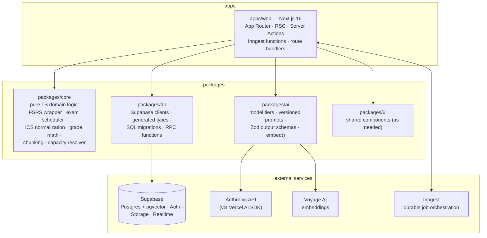
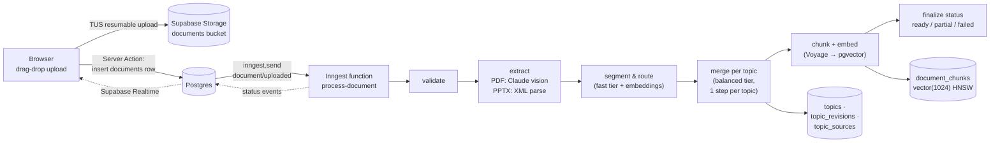
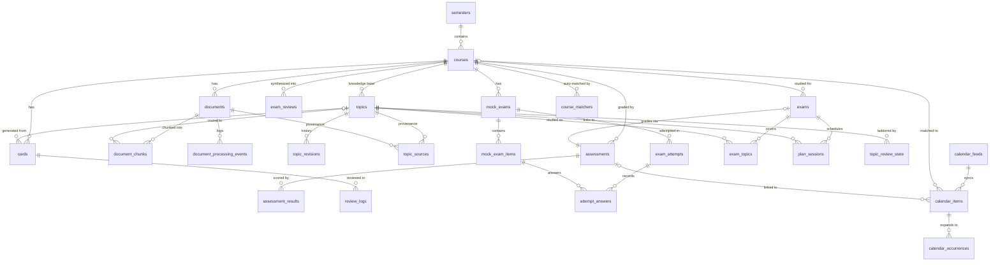
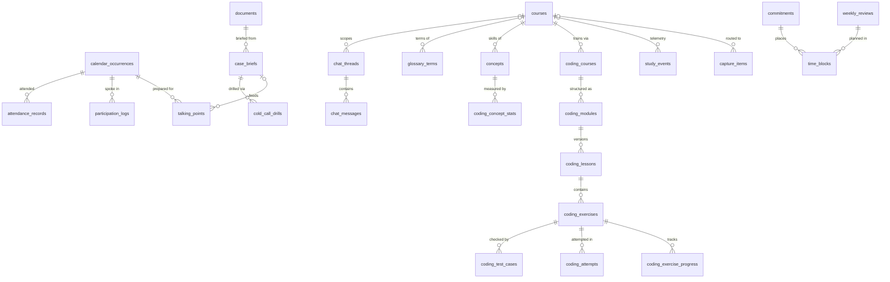

# StudyOS — Product & Technical Plan

> The product bible for StudyOS. Any competent engineer (or future Claude Code session)
> should be able to pick up any milestone from this document and execute it without
> guessing. Read `CLAUDE.md` for repo conventions first; this document covers *what* to
> build, *why*, and *how*.

**Status:** M0 (scaffold) shipped. This plan covers M1–M4.
**Last updated:** 2026-07-16.

## Contents

1. [Vision & product principles](#vision--product-principles)
2. [Architecture overview](#architecture-overview)
3. [Core features](#core-features) — document pipeline, calendar hub, exam planner, practice engine, coding trainer
4. [Additional features](#additional-features) — ten curated features beyond the core
5. [Data model](#data-model) — every table, relationships, RLS strategy
6. [AI strategy](#ai-strategy) — models, structured outputs, prompt versioning, costs, caching
7. [Roadmap](#roadmap) — M0 → M4 with definitions of done
8. [Risks & open questions](#risks--open-questions)

---

## Vision & product principles

StudyOS consolidates one student's entire academic life — deadlines, lecture notes, exam
prep, and coding practice — into a single dashboard that gets smarter with every upload.
The user: a BBA + Data & Business Analytics dual-degree student at IE University (Madrid)
who is also a startup founder. Time is the scarcest resource; the product's job is to
convert scattered course material into ready-to-use study artifacts and to answer, at any
moment, *"what should I do right now?"*

**The core loop** every feature serves:

```
upload / capture  →  structured knowledge (topic pages)  →  practice artifacts
(cards, plans, drills, lessons)  →  scheduled daily work  →  measured outcomes (grades)
```

### Product principles

1. **Cumulative, not archival.** Notes are organized per *topic*, not per file. Session 7's
   slides refine existing topic pages; they never create "Lecture 7 notes" silos. The
   knowledge base compounds.
2. **Human-gated AI.** LLMs draft; the user approves. Nothing generated enters a review
   rotation, a calendar, or a grade book without a confirm step. Bad AI output must cost
   seconds, not weeks of mis-scheduled reviews.
3. **Deterministic where it counts.** Scheduling, grade math, spaced repetition, and
   capacity planning are pure, unit-tested functions in `packages/core`. The LLM never
   sits inside a loop that must be reproducible, instant, or free.
4. **Solo-first, multi-user-ready.** One user today, but every table carries `user_id`
   with RLS from day one, external auth flows stay standard, and nothing assumes "there is
   only one of me" in the schema.
5. **Boring infrastructure, aggressive product.** Supabase + Vercel + one background-job
   system (Inngest). No second deploy targets, no self-hosted services, no ops burden that
   competes with building features.
6. **The phone is a first-class study surface.** Reviews, capture, and participation
   logging happen standing in hallways — as an installable PWA, not a native app.
7. **Data is the user's.** Everything exports (Anki, Obsidian/Markdown, CSV/JSON), and an
   append-only event stream makes the user's own learning analyzable — fitting for an
   analytics degree.

---

## Architecture overview

### Monorepo & runtime topology



Boundary rules (enforced; see CLAUDE.md):

- `packages/core` never imports frameworks and never does I/O. Every algorithm that must
  be reproducible, instant, or property-testable lives here.
- `packages/ai` owns every token that goes to or from an LLM or embedding model. No model
  IDs, prompts, or `@ai-sdk/*` imports anywhere else. It never reads `process.env` —
  `apps/web/src/env.ts` injects configuration.
- `packages/db` owns every byte to/from Postgres and Storage. Migrations are hand-written
  SQL under `packages/db/supabase/migrations/`.
- `apps/web` stays thin: RSC for reads, Server Actions for writes, Inngest functions
  (served from `app/api/inngest/route.ts`) for anything heavy, retried, or multi-step.

### Ingestion pipeline data flow (the app's spine)



### Where the LLM sits

- **Never in the read path.** Pages render from Postgres; topic pages, plans, and cards
  are materialized rows, not on-the-fly generations.
- **Interactive AI** (chat/RAG, cold-call drills, quick-add parsing, short-answer
  grading): streamed from route handlers / Server Actions via the AI SDK, `fast` or
  `balanced` tier, always behind a Zod schema when the output is data.
- **Bulk AI** (document structuring, topic merges, card generation, mock exams, lesson
  generation, exam reviews): inside Inngest steps — durable, retried, per-step
  checkpointed, cost-metered.
- Every call goes through `packages/ai` and stamps its artifacts with
  `prompt_id, prompt_version, model, input_hash` (see [AI strategy](#ai-strategy)).

---

## Core features

The five pillars. Each was designed to the same contract: (a) what & why, (b) UX sketch,
(c) implementation approach, (d) data model additions, (e) dependencies, (f) effort
(S ≤ 1 day, M = 2–4 days, L ≥ 1 week, for a strong engineer with AI assistance),
(g) milestone.

---

## Document & Notes Pipeline

The heart of StudyOS: users upload lecture slides (PDF/PPTX) and readings
per course; the pipeline extracts content, structures it into a **cumulative
knowledge base of topic pages**, and keeps a **final-exam review** per course up to date.
Uploading session 7's slides *expands and refines* existing topic pages — it never creates
duplicates.

Everything below respects the repo's package boundaries: LLM calls and prompts live in
`packages/ai` (versioned `definePrompt` + Zod schemas), pure merge/chunking logic in
`packages/core`, SQL migrations and clients in `packages/db`, and the job handlers + upload
UI in `apps/web`.

---

### 1. Architecture overview

```
Client (drag-drop)                     apps/web                          Inngest (durable steps on Vercel fns)
      │                                   │                                   │
      │ 1. direct upload (TUS resumable)  │                                   │
      ├──────────────► Supabase Storage   │                                   │
      │                (documents bucket) │                                   │
      │ 2. Server Action: insert          │                                   │
      ├──────────────► documents row ─────┤ 3. inngest.send("document/uploaded")
      │                (status=queued)    │                                   │
      │                                   │              ┌────────────────────┴───────────────────┐
      │   Supabase Realtime               │              │ validate → extract (PDF/PPTX)          │
      │◄── status updates ────────────────┤              │ → segment & route → merge per topic    │
      │   (documents.status,              │              │ → chunk + embed (pgvector)             │
      │    processing_events)             │              │ → mark ready / partial / failed        │
      │                                   │              └────────────────────┬───────────────────┘
      │                                   │                                   │
      │                                   │   topics, topic_revisions, topic_sources,
      │                                   │   document_chunks (vector(1024), HNSW)
```

Model tiers (existing `MODELS` registry in `packages/ai` — never hardcode IDs at call sites):

| Pipeline stage | Tier | Model | Why |
| --- | --- | --- | --- |
| Segment & route to topics, tagging | `fast` | claude-haiku-4-5 | High-volume classification over extracted text ($1/$5 per MTok) |
| PDF extraction + structuring, topic merge | `balanced` | claude-sonnet-5 | Native PDF vision, 1M context, $3/$15 per MTok ($2/$10 intro through 2026-08-31) |
| Exam review generation | `deep` | claude-opus-4-8 | Rare, high-stakes synthesis across all topics ($5/$25 per MTok) |

---

### 2. Data model (new migrations in `packages/db`)

All tables follow the repo RLS pattern: `user_id uuid not null references auth.users(id)
on delete cascade`, RLS enabled, per-operation policies with `(select auth.uid())`.

```sql
-- Extensions (one-time migration)
create extension if not exists vector;

create type document_status as enum (
  'queued', 'validating', 'extracting',
  'structuring', 'merging', 'embedding', 'ready', 'partial', 'failed'
);

create table documents (
  id              uuid primary key default gen_random_uuid(),
  user_id         uuid not null references auth.users(id) on delete cascade,
  course_id       uuid not null references courses(id) on delete cascade,
  kind            text not null check (kind in ('slides','reading','case','syllabus','other')),
  storage_path    text not null,            -- {user_id}/{course_id}/{document_id}/{filename}
  filename        text not null,
  mime_type       text not null,
  size_bytes      bigint not null,
  content_hash    text not null,            -- sha256; dedupe + idempotency key
  status          document_status not null default 'queued',
  failure_reason  text,                     -- user-readable, set on failed/partial
  extraction      jsonb,                    -- structured extraction output (per-page/slide/chapter markdown)
  session_label   text,                     -- e.g. "Lecture 7" (user-supplied or inferred)
  created_at      timestamptz not null default now(),
  processed_at    timestamptz
);
create unique index documents_dedupe on documents (course_id, content_hash);

-- Fine-grained progress feed for the status UI (Realtime-subscribed)
create table document_processing_events (
  id           bigint generated always as identity primary key,
  user_id      uuid not null references auth.users(id) on delete cascade,
  document_id  uuid not null references documents(id) on delete cascade,
  course_id    uuid not null references courses(id) on delete cascade,  -- Realtime filter
  step         text not null,               -- 'extract', 'merge:topic:<id>', ...
  level        text not null default 'info' check (level in ('info','warn','error')),
  detail       text,
  created_at   timestamptz not null default now()
);

-- The cumulative knowledge base
create table topics (
  id                   uuid primary key default gen_random_uuid(),
  user_id              uuid not null references auth.users(id) on delete cascade,
  course_id            uuid not null references courses(id) on delete cascade,
  title                text not null,
  slug                 text not null,
  summary              text not null default '',
  page                 jsonb not null default '{}',  -- TopicPage: notes blocks, key terms, formulas, examples, open questions
  title_embedding      vector(1024),                 -- for duplicate-title detection at routing time
  summary_embedding    vector(1024),                 -- routing candidate retrieval; refreshed on merge
  exam_weight          real not null default 0.5,    -- computed 0..1
  exam_weight_override real,                         -- user override wins when set
  revision             int not null default 1,
  created_at           timestamptz not null default now(),
  updated_at           timestamptz not null default now(),
  unique (course_id, slug)
);

-- Immutable revision history: every merge writes one row (auditable + revertible)
create table topic_revisions (
  id             uuid primary key default gen_random_uuid(),
  user_id        uuid not null references auth.users(id) on delete cascade,
  topic_id       uuid not null references topics(id) on delete cascade,
  revision       int not null,
  page           jsonb not null,            -- full TopicPage snapshot BEFORE this merge applied
  change_summary text not null,             -- LLM-written diff summary
  document_id    uuid references documents(id) on delete set null,  -- which upload caused it
  prompt_id      text not null,             -- definePrompt id + version that produced it
  prompt_version int not null,
  model          text not null,              -- concrete model ID that ran
  input_hash     text not null,              -- sha256 of rendered prompt inputs
  created_at     timestamptz not null default now(),
  unique (topic_id, revision)
);

-- Coarse provenance: which document contributed to which topic, where
create table topic_sources (
  id           uuid primary key default gen_random_uuid(),
  user_id      uuid not null references auth.users(id) on delete cascade,
  topic_id     uuid not null references topics(id) on delete cascade,
  document_id  uuid not null references documents(id) on delete cascade,
  locators     jsonb not null default '[]', -- [{page:12},{slide:4}]
  created_at   timestamptz not null default now(),
  unique (topic_id, document_id)
);

-- RAG chunks
create table document_chunks (
  id           uuid primary key default gen_random_uuid(),
  user_id      uuid not null references auth.users(id) on delete cascade,
  course_id    uuid not null references courses(id) on delete cascade,
  document_id  uuid not null references documents(id) on delete cascade,
  topic_id     uuid references topics(id) on delete set null,  -- filled after routing
  content      text not null,
  chunk_hash   text not null,               -- sha256(normalized content); embedding-reuse key
  token_count  int not null,
  locator      jsonb not null,              -- {page} | {slide}
  embedding    vector(1024),
  created_at   timestamptz not null default now()
);
create index document_chunks_embedding_idx on document_chunks
  using hnsw (embedding vector_cosine_ops) with (m = 16, ef_construction = 64);
create index document_chunks_course_idx on document_chunks (course_id);
create index document_chunks_hash_idx on document_chunks (user_id, chunk_hash);

create table exam_reviews (
  id           uuid primary key default gen_random_uuid(),
  user_id      uuid not null references auth.users(id) on delete cascade,
  course_id    uuid not null references courses(id) on delete cascade,
  content      jsonb not null,              -- ExamReview: weighted sections, formula sheet, question bank
  topic_snapshot jsonb not null,            -- [{topic_id, revision}] it was built from → staleness detection
  prompt_id    text not null,
  prompt_version int not null,
  model        text not null,
  input_hash   text not null,
  created_at   timestamptz not null default now()
);
```

**TopicPage shape** (Zod schema in `packages/ai/src/schemas.ts`, stored as the `topics.page`
JSONB): `summary` (3–5 sentences), `notes` (ordered markdown blocks, each block carries
`sources: [{documentId, locator}]`), `keyTerms[{term, definition, sources}]`,
`formulas[{name, latex, explanation, sources}]`, `workedExamples[{problem, solution, sources}]`,
`openQuestions[{question, context, kind: 'gap' | 'conflict', sources}]`. Block-level `sources`
is the fine-grained provenance; `topic_sources` is the coarse join for fast "what fed this
topic" queries and for idempotent re-processing (see §7).

Storage: private `documents` bucket, path `{user_id}/{course_id}/{document_id}/{filename}`,
storage RLS policy `owner = auth.uid()` on the first path segment. Uploads go client →
Storage directly (resumable TUS for large decks) — file bytes never proxy through a Vercel
function (4.5 MB request body limit). Our 50 MB per-file cap in `validate` matches the
Supabase Free plan's upload ceiling, so the Free plan suffices.

---

### 3. Background job runner: Vercel functions vs Inngest vs Trigger.dev

Verified current state (July 2026):

| | Vercel alone (Fluid compute, `waitUntil`) | **Inngest (chosen)** | Trigger.dev |
| --- | --- | --- | --- |
| Where code runs | On our Vercel deployment | **On our Vercel deployment** (Inngest calls back into `/api/inngest`) | On Trigger.dev's workers — a second deploy target (`trigger deploy`) |
| Max step/task duration | 300s default all plans; 800s GA on Pro; 1800s beta | Each `step.run` bounded by the Vercel function limit (300s Hobby / 800s Pro), but the *workflow* spans hours via `step.sleep` / `waitForEvent` | Effectively unlimited per task |
| Durability & retries | None — `waitUntil` is fire-and-forget; a crash or redeploy loses the job; Vercel Queues still limited beta | **Durable step functions**: each step checkpointed, automatic per-step retries with backoff, `onFailure` hook, event replay from dashboard | Durable runs, retries, checkpoints |
| Concurrency / rate control | DIY | **Built-in `concurrency` keys + throttling** (we need per-course serialization for merges and LLM rate limiting) | Built-in queues/concurrency |
| Free tier | n/a (just function invocations) | ~50k step-executions/month, 5 concurrent steps; Pro $75/mo (1M executions) | $5 compute credit/month, 20 concurrent runs; usage-based compute after |
| Fan-out / events | DIY | First-class events, `step.waitForEvent` (useful for external webhooks and cross-feature events) | Events supported |

**Decision: Inngest.**

1. **Zero extra infrastructure.** Functions are route handlers inside `apps/web` — one repo,
   one deploy, Vercel preview deployments keep working. Trigger.dev requires a second build
   and deploy pipeline; for a solo-first project that is real ongoing friction.
2. **Durability where Vercel alone has none.** `waitUntil` gives no retries, no persistence,
   no visibility — a poison PDF would just vanish. Inngest checkpoints every step, retries
   only the failed step, and gives a replay/debug dashboard.
3. **The step-duration ceiling doesn't bind us.** No single step needs > 300s: extraction is
   one Claude call on a PDF (~1–3 min worst case) and merges are per-topic calls (~30–60s
   each). If a single
   Sonnet call ever brushes 300s on Hobby, upgrading Vercel to Pro (800s) is the escape
   hatch, not a re-architecture.
4. **Free tier fits the workload.** A heavy month (~40 documents × ~15 steps) is ~650
   executions — roughly two orders of magnitude under the 50k/month free quota. Trigger.dev's $5
   compute credit would also suffice, but pays for compute we already pay Vercel for.

When to revisit: if we ever do CPU-heavy local processing (video, OCR at scale, LibreOffice
conversion in-process), Trigger.dev's unlimited-duration workers become the right home for
those specific tasks. Inngest and Trigger.dev can coexist; don't prematurely migrate.

**Wiring:** `inngest` client + functions defined in `apps/web/src/inngest/`, served from
`app/api/inngest/route.ts`. Job code uses `createAdminSupabaseClient` (RLS bypass is
appropriate here per repo conventions — jobs act on behalf of the system, and every row
still carries `user_id`). New env vars (`INNGEST_SIGNING_KEY`, `INNGEST_EVENT_KEY`,
`VOYAGE_API_KEY`) go through the full t3-env checklist.

#### The pipeline as an Inngest function (sketch)

```ts
export const processDocument = inngest.createFunction(
  {
    id: "process-document",
    retries: 3,
    concurrency: [{ key: "event.data.courseId", limit: 1 }], // serialize merges per course
    onFailure: markDocumentFailed, // writes status='failed' + failure_reason
  },
  { event: "document/uploaded" },
  async ({ event, step }) => {
    const doc = await step.run("validate", () => validateDocument(event.data.documentId));

    const extraction = await step.run("extract", () => extractDocument(doc)); // §4.1/4.2

    const routing = await step.run("segment-and-route", () => routeSegments(doc, extraction));

    // Per-topic merges: isolated steps → partial success (§7)
    const results = [];
    for (const plan of routing.topicPlans) {
      results.push(await step.run(`merge:${plan.key}`, () => mergeTopic(doc, plan))
        .catch((e) => ({ topic: plan.key, error: serializeError(e) })));
    }

    await step.run("chunk-and-embed", () => chunkAndEmbed(doc, extraction, routing));
    await step.run("finalize", () => finalizeStatus(doc, results)); // ready | partial
    await step.sendEvent("review-stale", { name: "course/topics.changed", data: { courseId: doc.course_id } });
  },
);
```

---

### 4. Format-specific handling

#### 4.1 PDF (lecture slides, readings) — Claude-native reading

**No local text-extraction library as the primary path.** Lecture slides are exactly the
case where text-layer extraction fails: diagrams, equations rendered as images, scanned
pages. Claude reads PDFs natively (document content block; each page processed as image +
text), so the `balanced` model sees the slides the way a student does.

- **Mechanics:** signed URL → fetch bytes in the step → base64 `document` block (no beta
  needed) → one `generateObject` call (AI SDK) with the *extraction schema*: per-page/section
  markdown rendition, detected structure (headings, definitions, formulas as LaTeX,
  worked examples), `examSignals` (verbatim quotes like "this will be on the exam" with page
  numbers), and a proposed `session_label`. This single call yields both the structured
  content for merging **and** the clean text we chunk for embeddings — solving the
  scanned/diagram-slide problem in one pass.
- **Limits to enforce in `validate`:** 32 MB request / 600-page API caps; our own caps 50 MB
  and 300 pages. Oversized PDFs are split by page ranges (`pdf-lib`, pure JS) and extracted
  in parallel steps, then concatenated. Note the 100-page cap applies only to 200K-context
  models — routing/merging on Haiku uses extracted *text*, never the PDF, so it's unaffected.
- **Cost:** a 40-page deck ≈ 80–120K input tokens (pages are billed as image+text) + ~8K
  output on Sonnet 5 ≈ **$0.30–0.50** ($0.20–0.35 at intro pricing). Cheap fallback: run
  `unpdf` text extraction first and attach it as context — negligible cost, helps with tiny
  fonts.

#### 4.2 PPTX — parse the zip; convert-to-PDF as the fidelity upgrade

Claude has no native PPTX input. Two-tier approach:

- **v1 (default): direct XML extraction in Node.** A `.pptx` is a zip of XML. In
  `packages/core`: `jszip` + `fast-xml-parser` over `ppt/slides/slide{N}.xml` (shape text,
  tables) **and `ppt/notesSlides/notesSlide{N}.xml`** — speaker notes are often the richest
  content in lecture decks and are lost by naive converters. Output: per-slide markdown
  fed to the same structuring call as PDFs (text-only, so input is ~10× cheaper). Extraction
  runs in-process; zip-bomb guard: reject archives that inflate > 200 MB or > 1,000 entries.
- **v1.1 (auto-upgrade for image-heavy decks):** if average text yield < ~40 words/slide,
  the deck is visual — convert PPTX→PDF via a conversion API (CloudConvert, ~$0.01/deck; or
  self-hosted Gotenberg later) and re-enter the PDF path for full visual fidelity. The
  document records `extraction_fidelity: 'text-only' | 'visual'` so the UI can explain
  quality differences.


---

### 5. The merge algorithm: update-vs-create, dedupe, provenance

The invariant: **a course's topic set is a stable, growing index — documents contribute to
it; they never own pages.**

#### Step A — Segment & route (`fast` tier + embeddings as guardrail)

1. Build the **course topic index**: for every existing topic, `{id, title, summary,
   keyTerms[]}` (~100–150 tokens each; a full course is a few thousand tokens). This index —
   plus the frozen routing system prompt — is the stable prompt prefix, prompt-cached across
   the document's routing batches (the merge calls build their own cached prefix — prompt
   caches are per-model and per-prompt).
2. Split the extraction into candidate segments along its structure (slide runs, headings). Embed each segment (§6) and retrieve top-5 nearest existing topics by
   cosine similarity against `topics.title_embedding` + each topic's summary embedding.
3. One Haiku call per document (segments batched): for each segment, decide
   `assignTo: topicId` **or** `createNew: {title, rationale}` — the schema *requires* it to
   pick from the retrieved candidates or explicitly justify why none fit. This is the
   update-vs-create decision, and it is deliberately biased toward *update*: the prompt
   states that a new topic is only warranted when the segment introduces a concept the index
   cannot host, not merely new detail about an existing one.
4. **Deterministic duplicate guard (code, not LLM):** every `createNew` title is embedded
   and compared to existing topic-title embeddings. Cosine similarity ≥ 0.85 → coerced into
   an assignment to the nearest topic (logged as a `warn` processing event). This catches
   "Neural Networks" vs "Neural Nets — Intro" drift that slips past the LLM. Proposed-new
   titles within the same document are also cross-checked against each other.

#### Step B — Merge per topic (`balanced` tier, one step per topic)

For each affected topic, one `generateObject` call: input = current full `TopicPage` JSON +
this document's segments routed to it + document metadata (session label, date). Output =
the complete new `TopicPage`, a `changeSummary`, and per-block `sources`. Prompt rules:

- **Integrate, don't append:** weave new material into existing blocks; expand and refine.
  Existing content may only be *removed* if superseded, and the change summary must say so.
- **Preserve source attribution:** untouched blocks keep their `sources`; edited/new blocks
  must cite this document's locators.
- **Conflicts are surfaced, not resolved silently:** if the new material contradicts the
  page (different formula convention, corrected claim), the model keeps the better-supported
  version *and* records an `openQuestions` entry of `kind: 'conflict'` citing both sources.
  Contradictions between lecture 3 and lecture 9 are study signal, not noise.
- New-topic creations use the same schema with an empty current page.

#### Step C — Persist atomically

Per topic, in one transaction: insert `topic_revisions` row (pre-merge snapshot, change
summary, document id, prompt id+version), update `topics.page`/`summary`/`revision` (re-embedding the
new summary into `summary_embedding`), upsert `topic_sources`. Course-level serialization (Inngest concurrency key) means no two
documents merge into the same course concurrently — no lost updates, and the revision
counter is a plain increment.

#### Provenance summary

| Layer | Where | Answers |
| --- | --- | --- |
| Block-level | `sources` on every TopicPage block | "Which slide/timestamp said this?" → deep links in the UI |
| Topic-level | `topic_sources` (topic × document + locators) | "What fed this page?" / drives idempotent re-processing |
| Change-level | `topic_revisions` (snapshots + prompt version) | "What did lecture 7 change?" / one-click revert / prompt audit trail |

**Idempotency & re-processing:** re-uploading a byte-identical file short-circuits on
`content_hash`. "Reprocess" on a document first strips its prior contributions — blocks whose
*only* source is this document are removed via an LLM-assisted revert (guided by the stored
revision snapshots), `topic_sources` rows deleted, chunks deleted — then runs the pipeline
fresh. This keeps merges effectively idempotent despite being LLM-driven.

---

### 6. Chunking + embeddings + pgvector

**Provider — Voyage AI (`voyage-3.5-lite`, 1024-dim).** Anthropic has no embeddings API and
officially points at Voyage as its embeddings partner. Justification vs the field:

| Model | $/1M tokens | Notes |
| --- | --- | --- |
| **voyage-3.5-lite (chosen)** | **$0.02** | Outperforms OpenAI small on retrieval benchmarks at the same price; **first 200M tokens free** (years of runway at our volume); `input_type: 'document' | 'query'` asymmetry; Matryoshka dims (256/512/1024/2048) |
| OpenAI text-embedding-3-small | $0.02 ($0.01 batch) | Fine fallback; adds an OpenAI dependency for embeddings only |
| voyage-3.5 | $0.06 | Upgrade path if retrieval quality ever disappoints — same API, re-embed for ~pennies |

The embedding client lives in `packages/ai` behind an `embed(texts, inputType)` interface so
the provider is swappable; store `embedding_model` on chunks if/when we ever mix models
(different models' vectors are not comparable).

**Chunking (pure functions in `packages/core`):** structure-aware, not fixed-window. Units:
slide/page for decks, heading sections for readings. Target 300–500 tokens; merge tiny neighbors below ~120 tokens; split
over-800-token units at paragraph boundaries with ~15% overlap. Every chunk keeps its
`locator` and, after routing, its `topic_id` — so RAG answers can cite "Lecture 7, slide 12"
and filter by topic. Topic-page sections themselves are also embedded (into
`document_chunks` with a synthetic locator) so search covers the synthesized notes, not just
raw sources.

**pgvector index — HNSW, cosine:**

```sql
using hnsw (embedding vector_cosine_ops) with (m = 16, ef_construction = 64)
```

HNSW over IVFFlat because IVFFlat requires representative data at index-build time and
periodic re-training as the table grows from zero — exactly our situation — while HNSW
builds incrementally with better recall/latency. `vector(1024)` is well inside HNSW's
2,000-dim limit; at solo scale (tens of thousands of chunks) storage is irrelevant, so no
`halfvec` quantization yet. Queries always filter `course_id` (and RLS filters `user_id`)
before the ANN scan. v2 option: hybrid search (tsvector + RRF) — an additive generated column + GIN index, no
re-embedding or restructuring (Course Copilot implements it).

**Search/RAG surface:** a `match_chunks(course_id, query_embedding, k)` SQL function
(`security invoker`, `set search_path = ''`) powering course search, "ask your notes"
chat with citations, and context retrieval for the exam-review generator.

---

### 7. Failure handling

- **Retries:** Inngest retries per *step* (3 attempts, exponential backoff) — a flaky
  Anthropic 529 on merge step 4 never re-runs extraction. Anthropic SDK's own retries handle
  transient 429/5xx inside a step; permanent errors (invalid PDF, schema-validation failure
  after one repair attempt) throw `NonRetriableError` to skip pointless retries.
- **Poison files:** `validate` rejects early with user-readable reasons — magic-byte MIME
  sniff (not extension), size/page caps, encrypted-PDF detection, zip-bomb guard.
  Files that pass validation but exhaust retries hit the function's `onFailure` handler:
  status `failed`, `failure_reason` set, `error`-level processing event logged. The Inngest
  dashboard retains the run for replay after a fix ships. A repeated-failure guard (same
  `content_hash` failed ≥ 2 times) short-circuits to `failed` immediately with "this file
  keeps failing — it may be corrupted".
- **Partial success:** per-topic merge steps are isolated; one failed merge doesn't doom the
  document. `finalize` computes: all merges ok → `ready`; some failed → `partial` with the
  failed topic list stored; extraction itself failed → `failed`. A `document/retry-merges`
  event re-runs only failed topics. Embedding failures also degrade to `partial` — the topic
  pages are readable even when search indexing lags.
- **Money guard:** per-document LLM spend estimated from token usage and logged to
  processing events; a document exceeding a sanity ceiling (~$5) aborts with `failed` rather
  than looping.

---

### 8. Status tracking & UX

- **Source of truth:** `documents.status` + append-only `document_processing_events`,
  written at every step boundary. UI subscribes via Supabase Realtime (`postgres_changes` on
  both tables filtered by `course_id`) — no polling.
- **Upload flow:** drag-drop → client-side TUS upload with progress bar → row appears
  instantly as `queued`. The upload dialog asks for `kind` (slides / reading / case /
  syllabus), pre-guessed from MIME type and filename. The card then walks a step checklist with the active step
  spinning: *Validating → Extracting text → Organizing into topics → Updating 4 topic
  pages → Indexing for search → Done*. Merge steps stream per-topic lines ("Expanded **Eigenvalues** · added 2 formulas")
  from the change summaries — this is the moment the product's core promise is visible, so
  it gets real UI attention.
- **Terminal states:** `ready` → card collapses to a summary ("Contributed to 4 topics",
  linked); `partial` → amber banner "3 of 4 topic pages updated — retry the rest" with a
  one-click retry (sends `document/retry-merges`); `failed` → human-readable reason
  ("This PDF is password-protected"), *Try again* and *Delete* actions. Never a raw stack
  trace.
- **Topic pages** show provenance affordances: each block's source chip (Lecture 7 · slide
  12) deep-links to the document viewer; a *History* drawer lists
  revisions ("Lecture 7 expanded this page — view diff / revert"). Topic pages render via
  unified/remark (`react-markdown` + `remark-gfm`) in RSC — component in
  `apps/web/src/components/topic-page/`; the remark plugin chain is the extension point the
  Bilingual Term Layer and Obsidian export later hook into.

### 9. Exam review (auto-generated, weighted by exam relevance)

- **Weight computation (pure function in `packages/core`), 0–1 per topic:** blend of
  (a) explicit instructor signals harvested at extraction time (`examSignals` quotes — the
  strongest term), (b) coverage: how many documents/sessions touched the topic and how
  recently, (c) artifact density (formulas + worked examples suggest testable material),
  (d) `exam_weight_override` — a slider on each topic page — which wins outright when set.
  Weights recompute after every merge; stored on `topics.exam_weight`.
- **Generation (`deep` tier, on demand):** one claude-opus-4-8 call per course with all
  topic pages + weights + course exam metadata (`courses.exam_format_profile`, plus the
  planner's `exams` row once M2 lands — M1 reviews generate without it). Output schema: prioritized topic sections
  (depth proportional to weight — high-weight topics get condensed notes, formulas, one
  worked example, pitfalls; low-weight get 2–3 lines), consolidated **formula sheet**,
  **likely-exam-questions bank** with answers, and a **weak-spots list** built from open
  questions and conflicts. Every item carries topic ids for click-through.
- **Staleness, not auto-regen:** reviews are expensive (~$0.50–1.50 on Opus) and students
  regenerate near exams anyway. `exam_reviews.topic_snapshot` (topic id + revision pairs) is
  compared against current revisions; the UI shows "Based on materials through Lecture 9 —
  2 topics changed since" with a *Regenerate* button. Generation runs as its own Inngest
  function (`course/generate-review`) with the same status-event pattern.

### 10. Per-document cost envelope (typical)

| Artifact | Extraction | Merge (≈4 topics) | Embeddings | Total |
| --- | --- | --- | --- | --- |
| 40-page slide PDF | $0.30–0.50 (Sonnet 5, vision) | $0.15–0.35 | <$0.01 | **≈ $0.50–0.85** |
| PPTX (text path) | $0.03–0.08 | $0.15–0.35 | <$0.01 | **≈ $0.20–0.45** |
| Exam review (per regen) | — | — | — | **≈ $0.50–1.50** (Opus 4.8) |

A full 12-week course (12 decks + a few readings + 3 review regens) lands
around **$8–15** — comfortably fine for a personal tool, and the tier registry lets us
step any stage down a tier if it isn't.

---

#### Sources

- Vercel function duration & Fluid compute: [Vercel docs — duration](https://vercel.com/docs/functions/configuring-functions/duration), [Fluid compute limits changelog](https://vercel.com/changelog/higher-defaults-and-limits-for-vercel-functions-running-fluid-compute)
- Inngest pricing/limits: [inngest.com/pricing](https://www.inngest.com/pricing), [usage limits](https://www.inngest.com/docs/usage-limits/inngest), [concurrency](https://www.inngest.com/docs/guides/concurrency)
- Trigger.dev pricing/limits: [trigger.dev/pricing](https://trigger.dev/pricing), [limits](https://trigger.dev/docs/limits)
- Embeddings pricing: [Voyage AI pricing](https://docs.voyageai.com/docs/pricing), [voyage-3.5 announcement](https://www.mongodb.com/company/blog/product-release-announcements/introducing-voyage-3-5-voyage-3-5-lite-improved-quality-new-retrieval-frontier), [OpenAI embeddings pricing](https://costgoat.com/pricing/openai-embeddings)
- Claude model pricing/PDF limits: Anthropic platform docs (models overview, PDF support) — cached via claude-api reference, July 2026.

**Dependencies:** foundation tables (`courses`), Inngest wiring, `VOYAGE_API_KEY` env key. **Effort:** L — the anchor of M1. **Milestone:** M1.

---

## Deadlines & Calendar Hub

One place that answers "what is due, when, and how much does it matter?" Sources: the
university's Blackboard-generated ICS feed(s) today, the Blackboard REST API later
(pending institutional approval), and manual quick-add for everything Blackboard doesn't
know about. The integration layer is a provider interface from day one so ICS → REST is
a provider swap, not a rewrite.

### 1. Architecture overview

```
Blackboard ICS URL(s)                 Blackboard REST (future)
        │                                      │
        ▼                                      ▼
┌─ IcsCalendarProvider ─┐        ┌─ BlackboardCalendarProvider ─┐
│ fetch + conditional   │        │ (stub now; OAuth + delta     │
│ GET, parse, expand    │        │  queries when approved)      │
└───────────┬───────────┘        └──────────────┬───────────────┘
            └────────────── SyncEngine ─────────┘
              (provider-agnostic: dedup by UID, diff,
               tombstones, course matching, upserts)
                            │
                     Supabase (Postgres)
        calendar_feeds · calendar_items · calendar_occurrences
                            │
              "This week" view  ·  full calendar  ·  quick-add
```

Package placement (per repo boundary rules):

- `packages/core/src/calendar/` — everything pure: the `CalendarProvider` interface and
  normalized types, ICS parsing + RRULE expansion (`string in → occurrences out`), the
  diff algorithm, the grade-impact scoring function. All heavily unit-tested with
  fixture `.ics` files (including Blackboard-shaped ones).
- `apps/web/src/server/calendar/` — the I/O shells: provider implementations that fetch
  (core does the parsing), the sync engine entry point, cron route handler, server
  actions. Lifted into a `packages/integrations` package only if a second consumer
  appears.
- `packages/db` — migrations + generated types for the four tables below.
- `packages/ai` — the quick-add parse prompt (`definePrompt`) and its Zod output schema.

### 2. Data model

```sql
-- One row per subscribed feed (a user may have one per course or one global).
create table public.calendar_feeds (
  id uuid primary key default gen_random_uuid(),
  user_id uuid not null references auth.users (id) on delete cascade,
  provider text not null check (provider in ('ics', 'blackboard')),
  label text not null,
  -- ICS: the subscription URL. Blackboard embeds a capability token in it —
  -- treat as a secret: RLS-protected, masked in the UI, never logged in full.
  config jsonb not null,               -- { url } for ics; { baseUrl, ... } for blackboard
  sync_cursor jsonb,                   -- { etag, lastModified, contentHash } | { deltaToken }
  last_synced_at timestamptz,
  last_sync_status text,               -- 'ok' | 'unchanged' | 'error'
  last_sync_error text,
  active boolean not null default true,
  created_at timestamptz not null default now(),
  updated_at timestamptz not null default now()
);

-- One row per VEVENT master (or per manual entry). Holds the recurrence rule.
create table public.calendar_items (
  id uuid primary key default gen_random_uuid(),
  user_id uuid not null references auth.users (id) on delete cascade,
  feed_id uuid references public.calendar_feeds (id) on delete cascade,  -- null = manual
  source text not null check (source in ('ics', 'blackboard', 'manual')),
  ics_uid text not null,               -- VEVENT UID; generated uuid for manual items
  sequence int not null default 0,     -- ICS SEQUENCE, detects upstream edits
  kind text not null check (kind in ('deadline', 'class', 'event')),
  title text not null,
  description text,
  location text,
  rrule text,                          -- raw RRULE if recurring, else null
  original_tzid text,                  -- TZID as published (e.g. 'Europe/Madrid')
  course_id uuid references public.courses (id) on delete set null,
  assessment_id uuid references public.assessments (id) on delete set null,
  weight_override numeric(5,2),        -- manual grade-impact override, wins over everything
  user_locked_fields text[] not null default '{}',  -- fields sync must not clobber
  missing_since timestamptz,           -- tombstone: vanished from feed at this time
  created_at timestamptz not null default now(),
  updated_at timestamptz not null default now(),
  unique (feed_id, ics_uid)
);

-- Expanded concrete instances within the sync horizon. Non-recurring items get
-- exactly one row. This is the table every view queries — no RRULE math at read time.
create table public.calendar_occurrences (
  id uuid primary key default gen_random_uuid(),
  user_id uuid not null references auth.users (id) on delete cascade,
  item_id uuid not null references public.calendar_items (id) on delete cascade,
  recurrence_id text not null default '',  -- ICS RECURRENCE-ID (UTC ISO) or '' for the sole instance
  starts_at timestamptz not null,
  ends_at timestamptz,
  all_day boolean not null default false,
  status text not null default 'confirmed' check (status in ('confirmed', 'tentative', 'cancelled')),
  overridden boolean not null default false,  -- this instance was individually edited upstream
  completed_at timestamptz,                   -- user checked it off
  updated_at timestamptz not null default now(),  -- row-diff bookkeeping (§3.2)
  unique (item_id, recurrence_id)
);

-- Learned course-matching rules (created when the user assigns an unmatched event).
create table public.course_matchers (
  id uuid primary key default gen_random_uuid(),
  user_id uuid not null references auth.users (id) on delete cascade,
  course_id uuid not null references public.courses (id) on delete cascade,
  pattern text not null,               -- substring matched case-insensitively
  created_at timestamptz not null default now()
);
```

All four tables: RLS enabled, per-operation policies on `(select auth.uid()) = user_id` —
the `init_profiles` pattern. `set_updated_at()` triggers on feeds, items, and occurrences;
`course_matchers` is insert/delete-only. `courses` and `assessments`
are defined in the Foundation data model (see *Data model*) and expanded by the Grade &
Semester Cockpit feature; this feature only references them.

### 3. ICS sync mechanics

#### 3.1 Fetch cadence: on-demand with staleness check, daily cron as safety net

Vercel Hobby limits cron to one invocation per day per job, and Blackboard regenerates
ICS feeds lazily anyway — so polling every N minutes buys little. Chosen design:

1. **On-demand, stale-while-revalidate.** When the dashboard or calendar page renders
   and any active feed has `last_synced_at` older than **30 minutes**, the page renders
   immediately from the DB and schedules a background sync via Next 16's `after()`. The
   UI shows "synced 43 min ago" with a manual **Sync now** button (server action,
   rate-limited to 1/min per user).
2. **Daily Vercel cron** (`vercel.json` crons → `/api/cron/calendar-sync`, protected by
   `CRON_SECRET`) at 04:30 UTC as a safety net, so deadlines added while the user isn't
   visiting still generate reminders/notifications. Vercel cron schedules are UTC-only;
   the ±1 h drift across Madrid DST changes is irrelevant for a safety net.
3. If the project moves to Vercel Pro, flip the cron to `*/30 * * * *` and drop the
   on-demand trigger — one config change, the sync route is identical.

Per-feed concurrency guard: the sync engine takes the feed row with
`select ... for update skip locked`; a second overlapping run skips silently.

#### 3.2 Incremental sync (as incremental as ICS allows)

ICS is a full-snapshot format — there is no delta protocol. "Incremental" therefore means
skipping work, in three layers:

1. **HTTP conditional GET**: send `If-None-Match` / `If-Modified-Since` from
   `sync_cursor`; a `304` ends the run (`status = 'unchanged'`). Blackboard's ICS
   endpoint doesn't reliably honor these, so also:
2. **Content hash**: SHA-256 of the response body compared to `sync_cursor.contentHash`;
   identical → end the run without parsing.
3. **Row-level diff**: parse, normalize, then upsert only occurrences whose payload
   actually changed (compare a per-row hash), so `updated_at` stays meaningful and
   triggers/realtime don't fire on no-ops.

#### 3.3 UID-based dedup and the update/delete lifecycle

- Identity is `(feed_id, ics_uid)` for items and `(item_id, recurrence_id)` for
  occurrences — enforced by unique constraints, applied via upsert. Re-running a sync is
  idempotent by construction.
- **Updates**: ICS `SEQUENCE` bumps (and any payload-hash change) overwrite our copy —
  except fields listed in `user_locked_fields`. If the user edited a title, reassigned a
  course, or set `weight_override`, sync records the field as locked and never clobbers
  it again.
- **Disappearance ≠ deletion (immediately)**: Blackboard feeds are windowed and
  occasionally truncated. A UID present in the DB but absent from the fetched snapshot
  gets `missing_since = now()` (tombstone) and is hidden from views after 24 h; the row
  is hard-deleted after 7 days of continuous absence. If the UID reappears, the
  tombstone clears. This prevents a flaky feed generation from wiping the calendar.
- Manual items (`feed_id is null`) are never touched by sync.

#### 3.4 Timezones: Europe/Madrid + DST, done once at write time

Rules, in order:

1. Everything is stored as `timestamptz` (UTC). Timezone math happens exactly once — at
   sync/parse time — never in the UI.
2. A `DTSTART` with `TZID` is resolved using the feed's embedded `VTIMEZONE` definition —
   `parseIcsToNormalizedEvents()` iterates the calendar's `vtimezone` components and
   registers each with `ICAL.TimezoneService` before expansion (ical.js ships no tz data
   and registers nothing automatically; the registry is scoped per parse). If a `TZID` arrives *without* a `VTIMEZONE`
   block (Blackboard does this), resolve the offset via the platform IANA database
   (`Intl.DateTimeFormat` — full tz data, zero dependencies) in a small pure helper in
   `core`. This is what makes a class at "10:00 Europe/Madrid" stay at 10:00 local
   across the March/October DST transitions while its UTC representation shifts.
3. UTC times (`...Z` suffix — Blackboard's usual output for due dates) pass through.
4. **Floating times** (no TZID, no Z) are interpreted in `profiles.timezone`
   (default `Europe/Madrid` — already in the schema).
5. All-day events (`VALUE=DATE`) set `all_day = true` and are anchored to midnight in
   the profile timezone; views render them as dates, never times, so they can't drift
   across midnight for users who travel.
6. Rendering always formats in `profiles.timezone`, so the stored UTC never leaks.

#### 3.5 Recurring events (RRULE) — expand at sync, store occurrences

Lecture schedules are RRULEs (`FREQ=WEEKLY;BYDAY=MO,WE;UNTIL=...`). Design:

- Expansion happens **server-side at sync time** into `calendar_occurrences`, over a
  rolling horizon of **−30 days to +180 days**. Views do zero recurrence math — they
  query indexed `timestamptz` ranges. Each sync re-expands the horizon, so the window
  rolls forward automatically.
- Expansion uses ical.js's `RecurExpansion`, which natively handles `EXDATE` (skipped
  sessions/holidays), `RDATE`, and **`RECURRENCE-ID` overrides** (a single moved
  lecture): the override VEVENT replaces that one occurrence, flagged
  `overridden = true`.
- Crucially, expansion runs **in the event's original TZID**, then converts each
  instance to UTC — a weekly 10:00 Madrid class produces `08:00Z` instances in winter
  and `09:00Z` in summer, correctly. (This is precisely the bug class you get from
  UTC-based expanders; see library choice below.)
- The raw `rrule` string stays on `calendar_items` so the horizon can be re-expanded
  without refetching.

#### 3.6 Cancellations

Three forms, all handled:

1. `STATUS:CANCELLED` on a VEVENT (or an override instance) → occurrence
   `status = 'cancelled'`. Kept and rendered struck-through for 7 days (so a cancelled
   lecture is *visible information*, not a silent gap), then hidden.
2. `METHOD:CANCEL` / an `EXDATE` added to the master → the instance disappears from
   expansion; the diff marks the orphaned occurrence row cancelled (same treatment).
3. Silent removal from the feed → the tombstone grace-period flow from §3.3.

#### 3.7 Parsing library — decision

**`ical.js` (Mozilla's ICAL.js) v2.2.1** — verified against the npm registry on
2026-07-16: latest release 2025-08-08, actively maintained at `kewisch/ical.js`, and
battle-tested as the parser inside Thunderbird. Chosen because it is pure JS (runs in
Node and edge runtimes), has zero runtime dependencies, and — decisively — does
timezone-aware recurrence expansion with `EXDATE`/`RECURRENCE-ID` support built in.

Rejected alternatives (same registry check):

- `node-ical` 0.26.1 (2026-05-02, active) — delegates recurrence to the `rrule` package.
- `rrule` 2.8.1 — **last published 2023-11-10**, effectively dormant, with
  long-documented DST bugs (it computes in UTC); disqualifying for a Madrid schedule.
- `ts-ics` 2.4.6 (2026-06-26, very active, Zod-based — a nice fit culturally) — younger,
  and its recurrence expansion is far less battle-tested than ICAL.js's. Worth
  revisiting if ical.js ever stalls.

### 4. The provider abstraction

The sync engine owns everything stateful (dedup, diffing, tombstones, course matching,
persistence). A provider only turns a remote source into normalized events plus a new
cursor. That split is what makes ICS → REST a swap: the engine never changes.

```ts
// packages/core/src/calendar/provider.ts  (pure types — no I/O in core)

export type CalendarSource = "ics" | "blackboard";

export interface NormalizedEvent {
  uid: string;
  sequence: number;
  kind: "deadline" | "class" | "event";
  title: string;
  description?: string;
  location?: string;
  rrule?: string;
  originalTzid?: string;
  occurrences: Array<{
    recurrenceId: string;        // '' for the sole instance
    startsAtUtc: string;         // ISO 8601
    endsAtUtc?: string;
    allDay: boolean;
    status: "confirmed" | "tentative" | "cancelled";
    overridden: boolean;
  }>;
  courseHint?: string;           // raw course text for the matcher
  gradeWeightPercent?: number;   // only REST can populate this (capability-gated)
}

export interface SyncInput {
  config: unknown;               // provider-specific, validated with the provider's Zod schema
  cursor: unknown | null;        // opaque; engine stores/returns it verbatim
  horizon: { fromUtc: string; toUtc: string };
  defaultTimezone: string;       // profiles.timezone, for floating times
}

export type SyncOutput =
  | { changed: false; cursor: unknown }
  | {
      changed: true;
      cursor: unknown;
      // ICS returns the full window every time → engine runs tombstone diffing.
      // REST returns only deltas → engine applies them as patches, no tombstoning.
      snapshot: "full" | "delta";
      events: NormalizedEvent[];
      deletedUids?: string[];    // delta mode only
    };

export type SyncError =
  | { kind: "unauthorized" }     // feed URL/token revoked → surface "reconnect" in UI
  | { kind: "unavailable"; retryable: true }
  | { kind: "parse"; detail: string }
  | { kind: "not-implemented" }; // the stub

export interface CalendarProvider {
  readonly source: CalendarSource;
  readonly capabilities: {
    incremental: boolean;        // true native deltas (REST), not just conditional GET
    gradeWeights: boolean;       // can supply assessment weights itself
    categories: boolean;         // reliable deadline-vs-class typing from the source
  };
  readonly configSchema: z.ZodType<unknown>;
  sync(input: SyncInput): Promise<Result<SyncOutput, SyncError>>;
}
```

**`IcsCalendarProvider`** (`apps/web/src/server/calendar/providers/ics.ts`): fetches with
conditional headers, hashes the body, then calls the pure `parseIcsToNormalizedEvents()`
in `core` (ical.js parse → timezone resolution → horizon expansion → kind
classification). Capabilities: `{ incremental: false, gradeWeights: false, categories: false }`.
Kind classification heuristics (each overridable by the user, which locks the field):
zero-duration or all-day VEVENTs whose summary matches `/\bdue\b/i` or Blackboard's
"Assignment/Test" categories → `deadline`; events with an RRULE and a duration →
`class`; everything else → `event`.

**`BlackboardCalendarProvider`** (stub now, same file layout): declares the target
capabilities `{ incremental: true, gradeWeights: true, categories: true }`, has a real
`configSchema` (`{ baseUrl, courseIds }`), and `sync()` returns
`err({ kind: "not-implemented" })`. The UI already renders provider status from the
registry, so when institutional approval lands the work is confined to: OAuth token
storage on `calendar_feeds.config`, mapping `/learn/api/public/v1/calendars/items` +
gradebook columns (which carry due dates *and* weights natively) into
`NormalizedEvent[]`, and returning `snapshot: "delta"`. No engine, schema, or UI changes.

A `PROVIDERS: Record<CalendarSource, CalendarProvider>` registry in
`apps/web/src/server/calendar/` is the only place implementations are enumerated.

### 5. Course linking & grade-impact weighting

#### 5.1 Linking synced events to courses

Blackboard prefixes summaries or descriptions with the course name/ID, and per-course
feeds exist too. Matching pipeline at sync time, first hit wins:

1. Feed-level default: a feed can be pinned to one course (`config.courseId`) — right
   answer for per-course feeds, zero inference.
2. `course_matchers` patterns (case-insensitive substring) against
   `courseHint ?? title ?? description`.
3. Course `code` and `title` from the `courses` table as implicit patterns.
4. No match → the event lands in an **Unassigned** bucket surfaced at the top of the
   calendar page. One click assigns a course *and* writes a `course_matchers` row from
   the matched text, so the same feed pattern auto-links forever after. Manual
   assignment locks `course_id` against sync.

#### 5.2 Grade-impact weighting

The number that drives ranking is **weight_percent**: how much of the course grade the
item is worth. Resolution order (first non-null wins):

1. `calendar_items.weight_override` — manual, always wins, set inline from the event card.
2. `assessments.weight_percent` via `assessment_id` — the syllabus-derived weights that
   live in the Courses/Grades feature (entered manually now; the document-pipeline
   milestone can extract them from syllabus PDFs later). Linking an event to an
   assessment is a one-click suggestion when titles fuzzy-match, confirmed by the user.
3. Kind-based default: `deadline` → 5 %, `class`/`event` → 0 %.
4. Future: Blackboard REST populates `gradeWeightPercent` directly (capability-gated),
   which auto-creates the assessment link.

Priority score — pure function in `core`, unit-tested, no magic at call sites:

```
priority(weight%, daysUntilDue) = (weight% + 1) / max(daysUntilDue, 0.5)
   · overdue items: daysUntilDue clamps to 0.5 and get a pinned "overdue" tier
   · completed items: excluded
```

Badge tiers rendered from weight alone: **High** ≥ 15 %, **Medium** 5–15 %, **Low** < 5 %,
**Info** for classes. A 30 % final project due in 6 days outranks a 2 % quiz due
tomorrow (5.2 vs 3.0) — which matches how a student should triage — while the quiz still
beats a 30 % project due in a month (3.0 vs 1.0).

### 6. Quick-add UX — natural language, form as the floor

**Decision: natural-language input parsed by the `fast` model tier, always confirmed
through a structured card before save.** One input box ("`ML assignment 3 due next
friday 23:59`", `⌘K` from anywhere). Rationale: capture speed is the whole point of
quick-add, `fast` (Haiku-tier) returns in well under a second at negligible cost, and
the confirm step removes the LLM-error risk — nothing unreviewed is ever written.

Flow:

1. Input → server action → `generateObject` on `MODELS.fast` with a versioned
   `definePrompt` (`quick-add-parse`, v1) that receives the utterance **plus today's
   date, `profiles.timezone`, and the user's course list** (so "next Friday" and "ML"
   resolve deterministically).
2. Output validated against `quickAddParseSchema` (packages/ai):

   ```ts
   export const quickAddParseSchema = z.object({
     title: z.string().min(1),
     kind: z.enum(["deadline", "class", "event"]),
     date: z.string().regex(/^\d{4}-\d{2}-\d{2}$/),   // in the user's timezone
     time: z.string().regex(/^\d{2}:\d{2}$/).nullable(), // null → all-day
     durationMinutes: z.number().int().positive().nullable(),
     courseId: z.string().uuid().nullable(),           // chosen from the provided list only
     weightPercent: z.number().min(0).max(100).nullable(), // "worth 20%" → 20
     confidence: z.number().min(0).max(1),
   });
   ```

3. Result pre-fills a compact confirm card (title / kind / datetime / course /
   weight — all editable). `confidence < 0.6`, schema failure, or AI unavailability
   degrades to the same card, empty: **the structured form is the fallback, not a
   separate feature.** Enter saves; parse-to-confirm target < 1 s.
4. Saved as `calendar_items` with `source = 'manual'`, `feed_id = null`, generated UID,
   one occurrence row. Untouchable by sync.

### 7. The "This week" view

Lives as the top section of the dashboard (and standalone at `/calendar`). One RSC, one
indexed query: all non-hidden occurrences for the user where `starts_at` ∈
[start of week Mon 00:00, Sun 24:00) **computed in `profiles.timezone`**, joined to
items → courses, plus the trailing overdue set. Composition, top to bottom:

1. **Sync status strip** — "Synced 12 min ago · 2 feeds ok" + Sync now; degrades to a
   warning chip with the feed label on sync errors (e.g. revoked ICS token → "Reconnect").
2. **Overdue** (red, pinned) — incomplete past-due deadlines, always carried forward
   until completed or dismissed.
3. **Deadlines this week** — cards sorted by the §5.2 priority score, *not*
   chronologically: weight badge (High/Med/Low), course chip (course color), due-in
   countdown ("Thu · in 2 days"), checkbox → `completed_at`, inline weight-override on
   the badge. Cancelled items struck through.
4. **Week grid of classes** — a compact Mon–Sun × hours strip of `kind = 'class'`
   occurrences (today highlighted, current time rule). Deliberately visually secondary:
   classes are context, deadlines are the payload.
5. **On the horizon** — next 14 days beyond this week, only weight ≥ Medium, so a big
   exam never ambushes from just outside the week window.
6. **Unassigned bucket** (only when non-empty) — synced events with no course match,
   one-click assign (§5.1).

Empty state ("no deadlines this week") explicitly shows the horizon section — the
correct feeling is "clear this week, exam in 9 days," never false calm.

### 8. Milestones & dependencies

| Milestone | Scope |
| --- | --- |
| CAL-1 | Migrations; `CalendarProvider` + normalized types in core; ical.js parse/expand with fixture tests (DST, EXDATE, RECURRENCE-ID, cancelled, floating-time cases); sync engine with dedup/tombstones; feed CRUD UI; plain chronological list. |
| CAL-2 | Course matching + matchers; weight resolution + priority scoring in core; full "This week" composition; structured quick-add form; daily cron + on-demand staleness sync. |
| CAL-3 | NL quick-add (`quick-add-parse` prompt, fast tier, confirm card); assessment linking suggestions; completed/overdue flows polish. |
| CAL-4 *(blocked on institutional approval)* | Blackboard REST provider: OAuth config, delta sync, native grade weights. Engine/UI unchanged by design. |

Mapping to the roadmap: CAL-1 and CAL-2 land in **M1**, CAL-3 in **M2** (pulled into M1 as
stretch when there's slack), CAL-4 in **M4**.

**Dependencies:** foundation tables (`courses`, `assessments`). **Effort:** CAL-1 M–L ·
CAL-2 M · CAL-3 S–M · CAL-4 M.

Cross-section dependencies: `courses` and `assessments` tables (Courses/Grades section);
`MODELS.fast` + prompt registry (AI section); `CRON_SECRET` env var added per the env
checklist in CLAUDE.md. Syllabus-extraction of weights depends on the document pipeline
milestone but only *feeds* `assessments` — nothing here blocks on it.

---

## Exam Planner

The exam planner turns "I have 3 exams in 5 weeks" into a concrete, day-by-day study plan.
The user enters exams (date, weight, topics); the app backwards-plans from each exam date,
interleaves spaced-repetition reviews with first-pass studying, reserves buffer days, and
links every session directly to its topic page and flashcard deck from the document
pipeline. The plan is adaptive: missing a day or marking a topic weak triggers a rebalance
that reflows future work without touching history or user-pinned sessions.

### Design decision: deterministic scheduler in `packages/core`

The scheduler is a **pure, deterministic TypeScript function** in
`packages/core/src/exam-planner/` — no I/O, no framework imports, no LLM in the loop.
Same input always produces the same plan.

Why not LLM-assisted scheduling:

- Rebalances happen constantly (daily rollover, every "mark weak", every drag). They must
  be instant, free, and reproducible — an LLM call for each is slow, costly, and flaky.
- Scheduling is a constrained packing problem; correctness properties ("no day over
  capacity", "every review lands before its exam") must be unit-testable. Vitest property
  tests can hammer a pure function; they cannot pin down an LLM.
- Determinism is what makes rebalancing semantics (below) sane: we can regenerate the
  future from scratch and rely on stable tie-breaks instead of fragile plan-diffing.

The LLM (`packages/ai`, `balanced` tier) is used only **outside** the loop, for one
optional job: pre-filling per-topic effort estimates and difficulty from topic-page
content (`estimateTopicEffort` versioned prompt, Zod schema
`{ estMinutes, difficulty, rationale }`). Estimates are user-editable and the scheduler
never blocks on them — the fallback heuristic derives `estMinutes` from topic source
length (word count of linked documents). The `deep` tier is not needed for v1.

### Data model (Supabase, RLS per repo convention)

All tables carry `user_id uuid not null references auth.users (id) on delete cascade`,
RLS enabled, per-operation policies with `(select auth.uid())`.

| Table | Key columns |
| --- | --- |
| `exams` | `id`, `course_id`, `title`, `exam_date date`, `weight numeric` (relative importance, e.g. ECTS or % of grade), `status` (`upcoming/done`) |
| `exam_topics` | `exam_id`, `topic_id` (FK → document-pipeline topic), `sequence int` (prerequisite order within course), `est_minutes int`, `difficulty numeric` (0–1), `confidence numeric` (0–1, updated by feedback loop) |
| `plan_sessions` | `id`, `exam_id`, `topic_id`, `kind` (`first_pass/review/practice`), `planned_date date`, `planned_minutes int`, `status` (`planned/done/missed/skipped`), `pinned bool`, `source` (`scheduler/user`), `actual_minutes int`, `completed_at` |
| `topic_review_state` | `topic_id`, `interval_index int`, `last_reviewed_at`, `lapses int` |
| `study_settings` | one row per user: `weekday_minutes int[7]` (default Mon–Fri 120, Sat 180, Sun 0), `max_minutes_per_day`, `session_minutes` (default 50), `max_new_courses_per_day` (default 2) |
| `blackout_dates` | `date`, optional `note` ("holiday", "work shift") |

The plan is **materialized as `plan_sessions` rows**, not recomputed on read — that is
what makes history, pins, deep links, and "what changed" messaging stable. Generation and
rebalancing run in a Server Action that calls the core function and swaps future rows in
one transaction.

### 1. Scheduling algorithm

#### Inputs

```ts
// packages/core/src/exam-planner/types.ts
interface PlanInput {
  today: ISODate;
  exams: ExamInput[];            // date, weight, topics[{id, sequence, estMinutes, difficulty, confidence}]
  capacity: DayCapacity[];       // per-date availableMinutes, from the capacity resolver (§4)
  reviewState: TopicReviewState[];
  history: SessionOutcome[];     // done/missed/skipped/weak marks — immutable facts
  reviewLoad: DailyReviewMinutes[]; // per-day per-course FSRS forecast (practice-engine feed)
  pins: PinnedSession[];         // user-placed sessions with fixed dates
  config: PlannerConfig;         // fill ratio, review offsets, buffer policy, velocityFactor
}
// Output: PlanResult = { sessions: PlannedSession[]; warnings: PlanWarning[] }
```

All effort is in minutes; topics are split into chunks of `session_minutes` (min 25).
`velocityFactor` is a per-user EMA of `actual/planned` minutes (clamped 0.5–2.0), applied
to estimates so the planner learns whether the user is faster or slower than estimated.

#### Constraints (hard)

1. Per-day load ≤ `availableMinutes × FILL_RATIO` (0.9 — soft slack is part of the buffer policy).
2. Every topic's first pass completes by its **first-pass deadline**:
   `examDate − max(2, ceil(0.25 × runwayDays))` — the last quarter of the runway (min 2
   days) is consolidation-only, no new material.
3. Reviews of a topic come after its first pass; every examined topic gets a terminal
   review in `[examDate − 2, examDate − 1]`.
4. Topics within a course respect `sequence` (prerequisite order) for first passes.
5. Pinned sessions stay on their pinned date; blackout days receive nothing.
6. On an exam's own date, other exams get at most 50% of remaining capacity and reviews only.

#### Objective

Maximize expected readiness `Σ_exams weight_e × Σ_topics mastery(topic, examDate)`, where
mastery follows a simple decay model: retrievability `R = exp(−Δdays / S)` with stability
`S` growing on each review. We do not solve this exactly (no ILP) — a greedy priority
scheduler approximates it, which is standard, fast, explainable, and good enough because
the review-ladder shape already encodes the decay model.

#### Algorithm (two-phase: backwards milestones, forward greedy fill)

1. **Backwards pass (per exam):** from `examDate`, fix the final-review window (E−2..E−1),
   the first-pass deadline (constraint 2), and reserve **buffer days** (§ buffer policy).
2. **Feasibility check:** total first-pass demand × velocityFactor + estimated review
   overhead (~15 min per topic per ladder step) + buffer reserve vs. total capacity in the
   runway. If infeasible → **triage warnings**: the planner proposes cutting the
   lowest-priority topics (low `weight × risk`) and marks them `at_risk`; it never
   silently drops work.
3. **Forward fill (single global loop over days — this is where multi-exam contention is
   resolved):** for each day from `today` to the last exam, fill capacity in this order:
   a. **Pinned sessions** (consume capacity first, immovable).
   b. **Due reviews** (small, 10–20 min, time-critical). A review that doesn't fit may
      slide ±1 day (grace window) before spilling forward.
   c. **First-pass chunks**, picked by priority score until the day is full:

      ```
      priority = weight_e              // normalized across active exams
               × (1 + risk)            // risk = difficulty × (1 − confidence)
               × urgency               // 1 / max(1, firstPassDeadline − day)
               × stickiness            // ×1.1 if this chunk sat on this day in the previous plan
      ```

      Subject to: course `sequence` order, and at most `max_new_courses_per_day`
      (default 2) distinct courses' first passes per day — contention between exams is
      arbitrated by score, but interleaving is capped to avoid context-thrash.
      **Deterministic tie-breaks:** earlier exam date → higher weight → lower topic
      `sequence` → topic id. This plus stickiness is what keeps regenerated plans stable.
   d. **Practice sessions** (past papers) only once all of an exam's first passes are placed.
4. **Review-ladder insertion:** the moment a first pass is placed on day `d`, its review
   events are generated at offsets `d + [1, 3, 7, 16]` (truncated to fit the runway) and
   inserted into the day queue for step 3b of future days. If an offset overshoots the
   exam, it is clamped into the final-review window — a topic never ends its ladder after
   the exam it serves. A topic marked **weak** restarts a densified ladder `[1, 2, 5, …]`.
   Result: early runway days are first-pass-heavy; later days shift to review-heavy;
   final 2 days are review-only — spaced repetition interleaves by construction, and
   "review before new material" is enforced by the day-fill order.
5. **Cram mode** (runway < 3 days for an exam): no ladder fits, so the planner emits
   first passes for only the highest-priority topics up to 60% of capacity and blankets
   the rest with flashcard review sessions across all topics.

#### Buffer-day policy

- **Whole buffer days:** `clamp(floor(runwayDays / 7), 1, 3)` per exam (0 if runway < 5
  days), placed immediately before the final-review window — the point of maximum
  schedule risk. They are materialized as empty `buffer` capacity, not sessions.
- **Soft slack:** every day is filled only to 90% of capacity (`FILL_RATIO`).
- Buffers absorb, in order: missed-day overflow, weak-topic re-study, underestimated
  topics. An unused buffer day converts — at that morning's rollover rebalance — into
  extra reviews of the exam's weakest topics (lowest confidence).

### 2. Rebalancing semantics

**Triggers** (all funnel into one `rebalance()` call — same pure function, new inputs):

- Daily rollover at local midnight: incomplete sessions from yesterday become `missed`.
- User marks a topic **weak** (explicitly, or flashcard accuracy for the topic < 60% in a
  review session).
- Exam edits: date moved, weight changed, topic added/removed, estimate changed.
- Capacity changes: blackout added/removed, study settings changed, a class/deadline event
  lands in study hours.
- Manual "Rebalance now" button.

**Preserved vs. recomputed — "reflow, not reshuffle":**

| Preserved (input, never touched) | Recomputed |
| --- | --- |
| Completed/missed/skipped sessions (history) | All `planned` scheduler-owned sessions from tomorrow onward |
| Review state (interval index, lapses) | Review ladder placements for not-yet-done reviews |
| **Today's sessions** — unless the trigger is about today (e.g. blackout today) | Buffer placement |
| **Pinned sessions** (user-placed) keep their exact day | |

Mechanically: regeneration deletes `plan_sessions where status = 'planned' and pinned =
false and planned_date > today` and inserts the fresh plan, in one transaction. Because
the scheduler is deterministic with tie-breaks plus the ×1.1 stickiness bonus, an
unchanged world regenerates the identical plan — rebalancing only moves what must move.

**Pinning:** any session the user drags to a specific day (or creates manually) gets
`pinned = true, source = 'user'`. The scheduler treats pins as immovable capacity
consumers. If a pin becomes infeasible (its day is now a blackout, or its topic was
removed), it is **flagged with a warning chip, never silently moved** — the user resolves
it by dragging or unpinning. Un-pinning returns the session to scheduler ownership on the
next rebalance.

**Missed day:** overflow flows into buffer capacity first; if buffers are exhausted,
the priority score naturally squeezes out the lowest-priority first passes, which are
marked `at_risk` and surfaced in a triage banner ("You're 3 h short for Linear Algebra —
drop 'Jordan forms' or add weekend hours?") with one-tap fixes.

**Weak topic:** inserts a re-study session (`0.5 × est_minutes`, funded from buffer),
drops the topic's `confidence` (raising its future priority), and restarts its densified
review ladder.

### 3. Daily-plan UX

**Today view** (dashboard front and center):

- Ordered session cards — reviews first, then first passes — each showing kind badge,
  course color, exam countdown, duration, and the deep link: first-pass cards open the
  **topic page** from the document pipeline; review cards open the **flashcard deck
  filtered to that topic** in review mode.
- Card actions: **checkbox = done** (logs `actual_minutes`, optional focus timer);
  **"felt shaky" = mark weak** (triggers rebalance, shows what it changed);
  kebab → *defer to tomorrow* (pins it there), *skip*, *edit duration*.
- A capacity header ("2 h 10 m planned of 3 h available") and, after a rollover
  rebalance, an explanation line: "Yesterday's 2 missed sessions were rebalanced — 1 into
  Thursday's buffer, 1 pushed to Friday" with undo.

**Week/timeline view:** one column per day through the next exam; per-day capacity meter
(red when over); exam dates and buffer days visibly marked. **Drag a session card to
another day → it becomes pinned** (pin icon appears; unpin returns it to the scheduler).
Drops on blackout days or over-capacity days are rejected with the reason.

**Exam detail view:** per-exam progress ring (first-pass %, review coverage, projected
readiness from the mastery model), topic list with confidence dots and per-topic links to
topic page + deck, buffer status, and the triage banner when at risk.

**Feedback loop:** flashcard grades from review sessions (again/hard/good/easy) update
`topic_review_state` and `exam_topics.confidence`; `actual_minutes` vs planned updates the
user's `velocityFactor`. The plan quietly gets more honest the more it is used.

### 4. Modeling available study time

Capacity is resolved by a second pure core function, so the UI and scheduler always agree:

```ts
resolveCapacity(settings, calendarEvents, blackouts, range): DayCapacity[]
```

Resolution order per day:

1. **Base template** from `study_settings.weekday_minutes` — default Mon–Fri 120 min,
   Sat 180, Sun 0; capped by `max_minutes_per_day`.
2. **Calendar-aware subtraction:** events from the deadlines feature (classes, seminars,
   assignment due-dates with time blocks) subtract their duration + 15 min padding when
   they overlap study hours. v1 uses only in-app deadline/class data; external Google
   Calendar sync can plug into the same `calendarEvents` input later without touching the
   scheduler.
3. **Blackout days** force capacity to 0 (vacation, work shifts). Exam days are
   auto-special-cased: after that exam, only 50% capacity, reviews-only for other exams.
4. Manual per-day override from the week view ("only 30 min today") — stored as a
   single-day settings exception.
5. **FSRS review debt:** forecast minutes from the practice engine's review-load feed
   (`daily_review_load` + `forecastReviewLoad`) are reserved off the top of each day's
   remaining capacity — the scheduler packs first passes into what is left, and the day
   view shows the reservation as its "Reviews: ~34 due (≈9 min)" line.

Every capacity change is a rebalance trigger (§2).

### Module layout & testing

```
packages/core/src/exam-planner/
  types.ts            input/output types, PlannerConfig defaults
  capacity.ts         resolveCapacity()
  review-ladder.ts    offset generation, clamping, weak-reset
  scheduler.ts        generatePlan() — phases 1–5
  rebalance.ts        trigger handling, preserved-set computation
  *.test.ts           colocated Vitest
```

Property tests (Vitest, randomized inputs with fixed seeds): determinism (same input ⇒
byte-identical plan); no day exceeds capacity; every review precedes its exam; terminal
review lands in the final-review window; pins never move; prerequisite order holds;
stability (regenerating with unchanged input ⇒ identical plan; one missed session ⇒ only
downstream days differ). Server Action integration: transactional swap of future rows.

### Acceptance criteria

- Entering an exam 3 weeks out with 10 topics yields a plan where the last 2 days contain
  only reviews, ≥1 buffer day sits before them, and every topic has ≥2 reviews.
- Two exams a day apart produce an interleaved plan with no day over capacity and at most
  2 courses of new material per day.
- Missing a full day changes only future, unpinned sessions and shows an explanation.
- Marking a topic weak schedules a re-study within 2 days plus a densified ladder.
- An infeasible load never silently drops topics — it always produces triage warnings.

**Dependencies:** topics + `exam_weight` (M1), calendar occurrences for capacity, the
practice engine's review-load feed (same milestone). **Effort:** L. **Milestone:** M2.

---

## Active recall & practice engine

The practice engine turns the topic pages produced by the M1 document pipeline into a
daily retention system: auto-drafted cards gated by human approval, FSRS-scheduled review
sessions, and per-course mock exams. Everything schedulable is a pure function in
`packages/core`; everything generative is a versioned prompt in `packages/ai`; all state
is Supabase rows behind RLS.

**Scheduling decision — FSRS over SM-2.** We use FSRS (the algorithm Anki adopted) via
[`ts-fsrs`](https://www.npmjs.com/package/ts-fsrs) rather than implementing SM-2:

- Anki's benchmark over 500M+ real review logs shows FSRS needs ~20–30 % fewer reviews
  than SM-2 for the same retention, and predicts recall more accurately in ~99 % of
  collections (verify exact figures). For a founder-student, fewer redundant reviews *is*
  the product.
- FSRS has an explicit `desired_retention` knob (we default 0.90, per-course override) —
  SM-2 has no retention target at all, and its shared ease factor famously punishes hard
  cards ("ease hell").
- [`ts-fsrs`](https://github.com/open-spaced-repetition/ts-fsrs) is actively maintained
  by the open-spaced-repetition org (the group behind Anki's FSRS integration), MIT
  licensed, current release line v5.4.x implementing FSRS-6, requires Node ≥ 20
  ([releases](https://github.com/open-spaced-repetition/ts-fsrs/releases)). It is pure
  TypeScript with no I/O, so it can live inside `packages/core` without violating the
  "no framework, no I/O" rule (external npm deps are allowed there; only workspace
  imports are banned).
- Mitigation for it being a third-party dep: `packages/core` wraps it behind our own
  `Scheduler` interface (`schedule(state, rating, now) → { next, log }`), and we persist
  full review logs, so the algorithm is swappable (or upgradable to per-user optimized
  FSRS parameters later) without touching call sites or losing history.

---

### Card generation & approval queue

#### (a) What it is & why it matters

One click on any topic page drafts a batch of flashcards/quiz items from that page's
content; nothing enters the review rotation until the user approves or edits it. The gate
matters because LLM-drafted cards are ~80 % usable but the remaining 20 % (wrong emphasis,
untestable phrasing, duplicate of an existing card) would silently poison months of
reviews. Approval takes seconds per card; bad scheduling costs minutes per card forever.

#### (b) UX sketch

- **Trigger:** "Generate cards" button on a topic page (and a suggestion chip on newly
  approved topic pages). A dialog shows the proposed mix ("~12 cards: 5 basic, 3 cloze,
  3 MCQ, 1 numeric — matches this course's exam format") with sliders to adjust, then
  fires generation. The page shows a progress row ("generating…") — no blocking modal.
- **Approval queue:** `/courses/[courseId]/cards/queue`. Drafts grouped by topic page,
  one card per row, expandable to full edit form. Each row shows: rendered front/back,
  type badge, the source snippet from the topic page it was derived from (click →
  scrolls to the section), and a duplicate warning when one fired. Keyboard-first:
  `A` approve, `E` edit inline, `X` reject, `J/K` navigate, `⇧A` approve remaining in
  group. Editing then approving is one flow — most fixes are one-word rewords.
- **Duplicate handling:** exact duplicates are auto-dropped at generation time; near
  duplicates render side-by-side with the existing card and offer *Keep both / Replace
  existing / Discard draft*.
- Manual card creation lives on the same screen ("New card" → same edit form, skips the
  queue, born `active`).

#### (c) Implementation approach

- **Model tier:** `fast` (claude-haiku-4-5) for basic/cloze drafts — high-volume, low
  stakes, exactly what the tier registry documents. `balanced` (claude-sonnet-5) for MCQ
  and numeric drafts, because distractor plausibility and worked solutions are where
  haiku-quality drafts fail review most often. One topic page ≈ 3–5k input + ~2k output
  tokens ≈ $0.01–0.05 per batch (verify against current Anthropic pricing) — negligible.
- **Prompts:** `packages/ai/src/prompts/cards.ts` — one `definePrompt` per card type,
  versioned; output validated by a Zod discriminated union (`cardDraftSchema`) shared
  with `packages/core`. The prompt receives the topic page markdown, the course's exam
  format profile, and the fronts of up to 50 existing cards for that topic ("do not
  duplicate these") — cheap prompt-level dedup before any DB check.
- **Execution:** Server Action inserts a `card_generation_jobs` row and emits an
  Inngest event (`cards/generate.requested`); the Inngest function runs the batch call,
  validates, dedups, and inserts drafts — the same durable-job pattern as the M1
  document pipeline. The client subscribes to job status via Supabase Realtime — the
  pipeline's status pattern.
- **Dedup, two layers:**
  1. `content_hash` = sha256 of normalized front text (lowercased, punctuation/whitespace
     stripped) — exact dupes dropped server-side, never shown.
  2. pgvector: embed the card front with the same embedding model/column setup the M1
     document pipeline uses (prerequisite); cosine similarity > 0.90 against the user's
     cards in the same course flags "possible duplicate" in the queue. Threshold tuned
     later from queue decisions.
- **Traceability:** each generated card stores `{ prompt_id, prompt_version, model, input_hash }`
  in a `generation` jsonb column, per the prompt-registry convention.

#### (d) Data model additions

- `cards`: `course_id uuid fk`, `topic_id uuid fk null` (null = manual),
  `type text check in ('basic','cloze','mcq','numeric','short_answer')`,
  `content jsonb` (type-specific payload, Zod-validated at every boundary),
  `content_hash text`, `embedding vector(1024)` (dimension must match pipeline's model),
  `status text check in ('draft','active','suspended','rejected') default 'draft'`,
  `source_quote text null`, `generation jsonb null`, plus the FSRS columns listed in the
  next feature. Partial unique index on `(user_id, course_id, content_hash) where status
  != 'rejected'`.
- `card_generation_jobs`: `topic_id fk`, `status text ('queued','running','done','failed')`,
  `requested_mix jsonb`, `error text null`, `cards_created int`.

#### (e) Dependencies / prerequisites

M1 document pipeline (topic pages + its embedding model/pgvector setup), courses table,
`packages/ai` tier registry (exists).

#### (f) Effort: **M**

#### (g) Milestone: **M2**

---

### Card types & FSRS review sessions

#### (a) What it is & why it matters

Five card types cover how IE actually examines a BBA + DBA dual degree, and one FSRS
scheduler drives them all. (M3 adds a sixth, `code_exercise`, via a check-constraint
migration — coding weak-spots enter this same queue as slim workspace cards; see CT-4.) Mapping to real exam formats keeps practice transfer-valid —
reviewing definitions when the exam is numeric problem sets is wasted time.

| Card type | `content` payload (jsonb) | Business-school exam format it trains |
| --- | --- | --- |
| `basic` | `{ front, back }` | Definition/short-answer items; case-prep concept recall (frameworks, terms) |
| `cloze` | `{ text, cloze_indices }` — `{{c1::…}}` syntax | Fill-in-the-blank; memorizing framework components (Porter's five forces, 4 Ps) and formula shapes |
| `mcq` | `{ question, options[4], correct_index, per_option_explanations }` | The dominant midterm/final format for core courses |
| `numeric` | `{ prompt, answer, tolerance, unit, solution_steps[] }` | Accounting/finance/statistics problem sets — answer checked with tolerance, worked solution revealed |
| `short_answer` | `{ question, model_answer, rubric_points[] }` | Open/case-exam questions — user types 2–5 sentences, LLM grades against the rubric |

#### (b) UX sketch

- **Session entry:** `/practice` (global daily queue, courses interleaved) and
  `/courses/[id]/practice`. Header: due count, new-cards-remaining, streak. Sessions are
  resumable; daily new-card cap defaults to 15/course (setting).
- **Card flow:** front shown → `Space` reveals. For `mcq`/`numeric` the user answers
  first (click option / type number) and the check is automatic; for `short_answer` the
  typed answer is graded inline (~1–2 s spinner) showing score, rubric hits/misses, and
  the model answer.
- **Rating:** the FSRS 4-grade scale — `1 Again / 2 Hard / 3 Good / 4 Easy`, keys 1–4,
  each button previewing its next interval Anki-style ("Again 10m · Hard 2d · Good 5d ·
  Easy 11d"). For objective types the engine pre-selects a rating (wrong → Again,
  correct → Good; short-answer maps rubric score <0.4→Again, <0.7→Hard, <0.9→Good,
  else Easy) which the user can override with one keypress — self-assessment stays in the
  loop, per FSRS guidance. `Z` undoes the last review (restores prior state from the log).
- **Session end:** summary (reviewed, accuracy by course, time), plus "hardest cards
  today" with an edit shortcut — bad cards get fixed at the moment they annoy.
- Must be comfortable on a phone browser: reviews happen on the Madrid metro.

#### (c) Implementation approach

- **Algorithm location:** `packages/core/src/scheduler/` wraps `ts-fsrs` (v5.4.x,
  FSRS-6). Exports: `createSchedulingState()` (new card), `schedule(state, rating, now)`,
  `previewIntervals(state, now)` (the four button labels), `retrievability(state, now)`
  (used by mock exams and the planner). Enable ts-fsrs's built-in interval fuzz to avoid
  cards clumping. Pure functions, fully unit-tested in Vitest with fixed dates.
- **Persistence per review:** a Server Action validates the rating (Zod), loads the card,
  calls `schedule`, then writes card update + `review_logs` insert atomically via a
  Postgres RPC (single round trip, no partial state).
- **Grading:** `mcq`/`numeric`/`cloze` checked by pure functions in `packages/core`
  (numeric uses `abs(answer − expected) ≤ tolerance`). `short_answer` grading is a
  `fast`-tier prompt in `packages/ai` (`grade-short-answer`, versioned) returning
  `{ score: 0–1, rubric_results[], feedback }` via Zod schema; ~1k tokens, well under
  interactive latency at haiku speeds.
- **Queue query:** `select … where user_id = auth.uid() and status='active' and due <= now()
  order by due limit …` on an index over `(user_id, due) where status = 'active'`; new
  cards drawn separately up to the daily cap, interleaved client-side.

#### (d) Data model additions

- On `cards` (FSRS state, mirrors the ts-fsrs `Card` object so upgrades stay lossless):
  `state text check in ('new','learning','review','relearning') default 'new'`,
  `due timestamptz not null default now()`, `stability real`, `difficulty real`,
  `reps int default 0`, `lapses int default 0`, `last_review timestamptz null`,
  `scheduled_days int default 0`, `elapsed_days int default 0`,
  `learning_steps int default 0`.
- `review_logs`: `card_id fk`, `rating smallint (1–4)`, `state_before text`,
  `stability_after real`, `difficulty_after real`, `scheduled_days int`,
  `elapsed_days int`, `review_time_ms int`, `graded_answer jsonb null` (what the user
  typed/picked + LLM feedback), `fsrs_log jsonb` (verbatim ts-fsrs `ReviewLog` — enables
  undo and future per-user FSRS parameter optimization). Insert-only.
- `practice_settings`: one row per user — `desired_retention real default 0.90`,
  `new_cards_per_day int default 15`, `course_overrides jsonb` (per-course retention and
  new-card caps).

#### (e) Dependencies / prerequisites

Card generation & approval (cards must exist), `ts-fsrs` added to `packages/core`
(catalog entry in `pnpm-workspace.yaml`).

#### (f) Effort: **L**

#### (g) Milestone: **M2**

---

### Mock-exam mode

#### (a) What it is & why it matters

Generates a timed practice exam per course — question mix matching that course's real
exam format, content weighted toward exam-relevant and weak topics — then grades it and
explains every item. Flashcards build retention; mock exams build the thing IE actually
grades: performing under time pressure across mixed formats. Attempt history is the
ground truth the exam planner uses to find weak topics.

#### (b) UX sketch

- **Setup:** `/courses/[id]/exams/practice` → "New mock exam". Form pre-filled from the
  course's exam profile (e.g., "30 MCQ + 3 numeric + 1 case question, 90 min") with the
  linked real exam (from the exam planner's `exams` table — its migration lands with or
  before this feature) selectable, editable mix/duration.
  Generation runs in the background (~1–3 min); the exam card flips to "Ready".
- **Taking it:** distraction-free full-screen route. Question navigator sidebar
  (answered/flagged states), countdown timer, one question per screen, flag-for-review.
  Answers autosave per question (a refresh loses nothing). Timer expiry auto-submits;
  attempts are resumable only within the time budget.
- **Results:** instant score for objective items; open answers show "grading…" and fill
  in within ~30 s. Review screen per item: your answer, correct answer, explanation
  (per-option for MCQ, worked steps for numeric, rubric breakdown + model answer for
  open), topic-page link, and **"Add as card"** — a wrong exam item becomes a draft card
  in the approval queue with one click.
- **History:** attempts list with score trend sparkline and a per-topic accuracy
  breakdown ("Regression: 55 % over 2 attempts").

#### (c) Implementation approach

- **Item sampling weight** (in `packages/core`):
  `weight(topic) = exam_weight × (1 − mastery)`, where `exam_weight` (0–1) is
  `topics.exam_weight` from the pipeline (user-overridable), and `mastery` = mean FSRS
  `retrievability` of that topic's active cards (0 if it has none). Topics are sampled
  proportionally; a floor guarantees every relevant topic ≥1 item so blind spots can't
  hide.
- **Generation tiers:** objective items (MCQ/numeric) with `balanced` in parallel
  batched calls (~5 items per call, grouped by topic, topic-page markdown as context);
  case/open questions and their rubrics with `deep` — rare, high-stakes synthesis,
  exactly what the tier registry reserves opus for. **All explanations, solutions, and
  rubrics are generated at creation time**, so objective grading is instant and offline.
  Cost per 30-item exam roughly $0.30–1.00 (verify) — fine for a handful per exam period.
- **Execution:** same durable-job pattern as card generation: an Inngest function
  drives `mock_exams.status` ('generating'→'ready'/'failed') with one step per item
  batch and per-batch Zod validation; a failed batch retries once, then the exam fails
  loudly rather than shipping short.
- **Grading:** objective — pure `packages/core` functions at submit time. Open answers —
  `balanced`-tier `grade-exam-answer` prompt: rubric + model answer + student answer →
  `{ points_awarded, per_rubric_point_results, feedback }` (Zod). Grading runs in a
  Server Action with `after()` for the LLM part; results stream into the review screen
  via polling.
- **Timing integrity:** `started_at` set server-side on first open; submissions after
  `started_at + duration + 30 s grace` are marked `late` (it's self-study — no
  anti-cheat theater, just honest data).

#### (d) Data model additions

- `mock_exams`: `course_id fk`, `exam_id uuid fk null` (real exam it rehearses), `title
  text`, `blueprint jsonb` (mix, duration_min, topic weights snapshot), `status text
  check in ('generating','ready','failed')`, `generation jsonb`.
- `mock_exam_items`: `mock_exam_id fk`, `position int`, `type text` (mcq/numeric/
  short_answer/case), `content jsonb` (question, options, answer, explanation, rubric,
  model_answer, solution_steps), `topic_id fk null`, `points numeric`.
- `exam_attempts`: `mock_exam_id fk`, `started_at timestamptz`, `submitted_at timestamptz
  null`, `status text check in ('in_progress','submitted','graded','late')`,
  `score numeric null`, `max_score numeric`.
- `attempt_answers`: `attempt_id fk`, `item_id fk`, `answer jsonb`, `is_correct bool
  null`, `points_awarded numeric null`, `feedback jsonb null`, `time_spent_ms int`,
  unique `(attempt_id, item_id)`.

#### (e) Dependencies / prerequisites

Topics with `exam_weight` (M1 pipeline), card engine (for mastery signal and "Add as
card"), `exams` table from the exam planner.

#### (f) Effort: **L**

#### (g) Milestone: **M2**

---

### Review-load feed into the exam planner

#### (a) What it is & why it matters

The planner can only budget study time honestly if it knows the review debt FSRS has
already scheduled. This feature exposes per-day, per-course due-count forecasts so the
planner reserves real minutes for reviews and ramps new-card introduction ahead of exams
instead of letting a 200-card backlog collide with finals week.

#### (b) UX sketch

Not a screen of its own — it surfaces inside the planner: each planned day shows
"Reviews: ~34 due (≈9 min)" per course, and the plan view warns when a day's forecast
load exceeds the time budget. A course drawer shows a 30-day due-count bar chart.

#### (c) Implementation approach

- **Actual dues:** a SQL view `daily_review_load` — `select user_id, course_id,
  due::date as day, count(*) from cards where status = 'active' group by 1,2,3`. Created
  `with (security_invoker = true)` so the querying user's RLS applies — plain Postgres
  views run with owner privileges and would silently bypass RLS (Supabase advisor lint
  0010). Cheap, always current.
- **Forecast:** review cards have deterministic `due` dates until they're reviewed, so
  the view *is* the baseline forecast; `packages/core` adds
  `forecastReviewLoad(dueCounts, settings, horizonDays)` which layers on (1) projected
  dues from planned new-card introduction (new cards/day × expected early intervals) and
  (2) an expected-lapse correction using `1 − desired_retention` of each day's dues
  re-appearing. Pure function, unit-tested; no simulation of individual ratings needed
  at this fidelity.
- **Minutes conversion:** seconds-per-review computed per card type from the user's own
  `review_logs` median (default 12 s until enough data).
- **Pre-exam ramp:** `newCardRampForExam(examDate, unseenCount, settings)` in core returns
  the per-day new-card quota such that all approved cards are introduced ≥7 days before
  the exam (interval coverage), tapering to zero in the final 3 days. The practice engine
  consumes it as a dynamic override of `new_cards_per_day`; the planner only displays it.

#### (d) Data model additions

None beyond the `daily_review_load` view — everything derives from `cards`,
`review_logs`, and `practice_settings`.

#### (e) Dependencies / prerequisites

Card engine with FSRS state; exam planner (consumer) with `exams` dates.

#### (f) Effort: **S**

#### (g) Milestone: **M2** (ship with the exam planner)

---

## Coding trainer (Python & beyond)

Turns pasted course material (syllabus, session plans, slides already in the M1 document
pipeline) into a structured micro-course: short lessons mapped to the actual semester
schedule, each with in-browser exercises that are auto-graded by test cases and reviewed
for style by an LLM. Misses feed the app-wide FSRS engine (see *Practice engine*, M2) so
weak concepts come back as spaced reviews. Built Python-first (the 3rd-semester
"Programming for Data Analytics" workload), with SQL and R adapters following in M4 —
both certain to appear later in a Data & Business Analytics degree.

Feature IDs in this section: CT-1 … CT-5.

---

### Execution engine decision: Pyodide (client-side WASM), not a sandboxed execution API

The one architectural decision everything else hangs on. Two credible options were
evaluated: **Pyodide** (CPython compiled to WebAssembly, runs in the user's browser) and
a **sandboxed execution API** (Judge0 as the reference; Piston/E2B/Modal are variations
of the same shape: ship code to a server, run it in an isolated container, return
stdout/verdict).

| Criterion | Pyodide (WASM, client) | Judge0-style execution API (server) |
| --- | --- | --- |
| Package availability | numpy, pandas, scipy, matplotlib, scikit-learn ship as prebuilt wheels in the official distribution (current release **314.0.2**, June 2026 — versioning now tracks the bundled CPython, i.e. 3.14); pure-Python PyPI packages install at runtime via `micropip`. Exactly the data-analytics stack this degree uses. | Judge0 CE ships bare CPython; the data-science stack needs Judge0 Extra CE or a custom image — more images to maintain, and every `pip install` variation is an ops task. |
| Cold start / latency | First visit downloads ~7 MB runtime + stdlib, plus ~10–11 MB for numpy + pandas (verify exact sizes per release); interpreter boot 2–5 s. All of it HTTP-cached, so subsequent visits boot in ~1 s and every *run* is local — single-digit ms dispatch, no network. | No download, but every run is a network round trip: 200–500 ms typical on the hosted cloud plus queue time under load; ~50 ms self-hosted. Feels sluggish for tight edit-run loops, which is the core interaction here. |
| Memory limits | Bounded by the browser tab: wasm32 heap tops out around 2 GB (verify). Ample for coursework-scale DataFrames; genuinely large datasets are out of scope for exercises anyway. | Configurable cgroup limits (default ~128 MB, raisable). More precise control — the one axis where Judge0 wins on paper, but we don't need it. |
| Offline | Works fully offline once assets are cached — study on the Madrid metro / flights home to Germany. | Dead without connectivity. |
| Cost | Zero marginal cost; assets served from jsDelivr's Pyodide CDN (free). | Sulu, Judge0's pay-per-use marketplace, announced discontinuation (judge0/judge0 issue #572); RapidAPI plans start ~$10/mo with daily caps (verify); self-hosting needs a privileged-Docker VM (Hetzner ~€6–10/mo) that Vercel cannot host — a second deployment target for a solo project. |
| Security | User code runs in the user's own browser tab inside the WASM sandbox. Zero server-side RCE surface; nothing to patch. | An internet-facing remote-code-execution service by definition. Judge0 had three sandbox-escape CVEs in 2024 (CVE-2024-28185, -28189, -29021). Self-hosting one as a solo founder is unjustifiable ops risk. |
| Fidelity gaps | No subprocess/threads/sockets; `input()` and mid-run interrupts need SharedArrayBuffer (COOP/COEP headers); an infinite loop blocks its Web Worker until we kill it. All mitigable (below), none matter for function-style exercises. | Real CPython, real OS, per-run rlimits, 60+ languages incl. Java/C — the right tool for a public multi-tenant judge, which this is not. |

**Decision: Pyodide.** For a solo-first study app whose core loop is "edit → run → see
tests" dozens of times per session, local execution wins on latency, cost, offline, and
security simultaneously; the browser pays a one-time ~18 MB cached download instead of
us operating a hardened exec service. The fidelity gaps are designed around: exercises
are function-based (no `input()`), runaway code is handled by worker termination, and
the analytics packages the degree needs are first-class in Pyodide.

**Escape hatch (deliberate, cheap):** `packages/core` defines an `ExerciseRunner`
interface — `run(language, code, spec) → RunReport` — and all grading logic consumes
`RunReport` only. If M4+ ever needs a language WASM can't serve (Java) or server-side
grading, a Judge0/Modal-backed runner implements the same interface; nothing above the
runner changes.

---

### CT-1 · In-browser Python runtime & auto-graded test runner

#### (a) What it is & why it matters
The execution foundation: a Pyodide-powered sandbox in a Web Worker plus a Python test
harness that runs an exercise's test cases against user code and returns a structured,
scored report. Every other coding-trainer feature is UI or content on top of this. For
the user it means instant feedback ("2/5 tests passing, here's the diff") without
leaving the dashboard — the difference between actually drilling Python between classes
and "I'll open VS Code later" (never).

#### (b) UX sketch
Invisible when it works: a status chip in the lesson workspace ("Python starting… →
Ready") while the worker warms up in the background as soon as a lesson page opens.
`Run` (Cmd+Enter) executes visible tests only; `Submit` runs visible + hidden tests.
Results render as a test list — green check / red cross per case, expandable to show
input, expected vs. actual (`repr` diff), captured stdout, and a trimmed traceback
pointing at the user's line, not harness internals. Runaway code shows a "Still
running… Stop" affordance; auto-kill at 10 s with a timeout verdict. matplotlib figures
render as inline PNGs in the output panel.

#### (c) Implementation approach
- **Worker**: a dedicated module worker in `apps/web` (`src/workers/python-runner.ts`)
  loads Pyodide 314.x from the jsDelivr CDN (`indexURL`), preloads `numpy`/`pandas` via
  `pyodide.loadPackage` when a lesson declares them. Message protocol (Zod-validated in
  `packages/core`): `{type:'run', runId, code, spec, assetUrls}` in;
  `{type:'result', runId, report}` / streamed `{type:'stdout', chunk}` out.
- **Harness** (Python, shipped as a string constant): `exec(user_code, fresh_ns)`;
  resolve the entry point named in the exercise spec (`checker_kind='function'`); for
  each test case, deep-copy JSON-decoded args, seed `random`/`numpy.random`, call under
  `contextlib.redirect_stdout`, compare via the declared comparator: `exact`,
  `float_tol` (abs/rel tolerance), `unordered` (multiset), `frame_equal`
  (`pandas.testing.assert_frame_equal`), or `stdout_match` (for `checker_kind='stdout'`
  print-exercises, normalized whitespace). Exceptions become `status:'error'` with a
  traceback filtered to user frames.
- **Report & scoring** (`packages/core`): `RunReport` Zod schema — per-test
  `{id, status: pass|fail|error, expectedRepr, actualRepr, stdout, message, timeMs}`
  plus overall `status: ok|setup_error|timeout` and `totalMs`. Score = passed/total;
  *exercise passed* = all visible + hidden pass. Hidden tests block hardcoded answers.
- **Isolation & timeouts**: fresh namespace dict per run; main thread runs a 10 s
  watchdog → `worker.terminate()` + respawn (re-boot from HTTP cache ≈ 1–2 s). Serve
  `/coding/*` routes with COOP/COEP headers (scoped in `next.config.ts` so the rest of
  the app keeps loading cross-origin images) to enable `pyodide.setInterruptBuffer` —
  graceful KeyboardInterrupt-style cancel instead of a hard kill where supported.
- **Datasets**: exercise assets (CSV/Parquet) live in a Supabase Storage bucket
  `exercise_assets`; the workspace fetches signed URLs and writes bytes into the Pyodide
  FS (`pyodide.FS.writeFile('/data/…')`) before the run.
- Editor is CT-3's concern; the runner exposes a plain async API
  (`runExercise(code, spec): Promise<RunReport>`).

#### (d) Data model additions
- `coding_attempt`: `exercise_id fk → coding_exercise`, `code text`,
  `run_report jsonb` (RunReport), `passed boolean`, `is_submission boolean`,
  `duration_ms int`. Every Submit persists; plain Runs persist only the latest per
  exercise (cheap resume). (`coding_exercise` is defined in CT-2.)

#### (e) Dependencies / prerequisites
None beyond M0 scaffold. CT-2 provides real content; the runner is developed against
fixture exercises. COOP/COEP header change is self-contained.

#### (f) Effort
**L** — worker lifecycle, harness comparators (esp. `frame_equal` ergonomics), timeout
robustness, and traceback trimming each have real edge cases.

#### (g) Milestone
M3 (first item — everything else builds on it).

---

### CT-2 · Syllabus → micro-course generator

#### (a) What it is & why it matters
Paste a syllabus (or select course documents already ingested by the M1 document
pipeline) and get a semester-aligned micro-course: one module per course session/week,
each with a short lesson (5–10 min read) and 2–4 auto-graded exercises. The point is
alignment: generic Python courses don't match IE's session order or emphasis; this
generates practice that tracks *this* course, dated to *this* calendar, so "what should
I drill before Thursday's session?" always has an answer.

#### (b) UX sketch
`/coding` → "New course": pick an existing course (M1 `courses` row), then either paste
syllabus text or check off ingested documents. → **Outline review screen** (the
human-in-the-loop gate): an editable table of proposed modules — title, week, mapped
date, objectives, concept tags — with inline rename, merge, delete, reorder, and
date-fixing. Nothing is generated beyond the outline until the user hits **Approve**.
After approval, the next ~2 weeks of modules generate eagerly (progress indicators per
module: pending → generating → ready / failed with a retry button); later modules
generate lazily on first open. Each lesson has a **Regenerate** button with a free-text
instruction box ("harder", "more pandas, less pure Python", "explain like I know Excel")
and a version badge (v1 → v2) with a "progress preserved" note.

#### (c) Implementation approach
LLM pipeline lives entirely in `packages/ai` as versioned `definePrompt` templates with
Zod output schemas; orchestration in Server Actions + background continuation.

1. **`syllabus_outline_v1`** (tier `balanced`): input = syllabus/doc text + semester
   date range + known session events from the M1 calendar. Output =
   `{units: [{title, week_label, iso_date?, objectives[], concepts: [{name, existing_concept_id?}]}]}`.
   The prompt receives the user's existing concept list (the `concepts` table, defined in (d) below) and must
   reuse ids for matching concepts — this is what makes progress durable across
   regenerations.
2. **Human approval** (screen above). Approved outline persists as `coding_module`
   rows; edits are user-authoritative — later regenerations may not override them.
3. **`lesson_generate_v1`** (tier `balanced`) per module: input = module objectives +
   concepts, concepts already covered in prior modules (for progression), a short
   learner profile ("BBA + analytics dual degree, knows spreadsheets, English
   non-native"), and any stored revision instructions. Output = lesson markdown +
   exercises, each with `starter_code`, `reference_solution`, `checker_kind`,
   `concept` names/ids, and test cases (`input_json`, `expected_json`, `visibility`,
   `comparator`, `tolerance?`).
4. **Validation gate**: before a lesson is marked `ready`, the generation job executes
   each `reference_solution` against its own test cases using the `pyodide` npm package
   in Node (same harness as CT-1; packages fetched from CDN at runtime, so the function
   bundle stays small). Runs as an Inngest function (`coding/lesson.generate`) —
   one step per lesson, the validation gate as its own retryable step.
   On failure: **`lesson_repair_v1`** gets the failing report and retries (max 2), else
   the module lands in `failed` with the error surfaced. Users never see a lesson whose
   own solution doesn't pass its own tests. Fallback if Node-side Pyodide proves brittle
   on Vercel: validate in-browser on first open behind a "checking lesson…" state
   (verify Node/serverless compatibility during CT-2 spike).
5. **Regeneration semantics (progress-preserving)**: lessons are immutable versions —
   regenerating inserts `coding_lesson` v(n+1) and marks the old row `superseded`
   (kept for diff/rollback). Progress is keyed to *exercises and concepts*, not lesson
   text: old attempts/progress rows stay attached to old exercise rows; module
   completion is computed as "all module concepts have ≥1 passed exercise (any
   version)". New-version exercises for already-passed concepts are flagged
   `optional_review`. Revision instructions accumulate on the lesson and are replayed
   on every subsequent regeneration. Outline-level regeneration (rare) maps new units
   onto existing `coding_module` ids via the schema (LLM must match-or-mark-new);
   removed modules are archived, never deleted.

#### (d) Data model additions
- `concepts`: `course_id fk → courses`, `name text`, `kind text check (kind in ('coding','general'))`,
  `description text`, unique `(user_id, course_id, lower(name))` — the registry lesson
  generation keys progress to; CT-4's weak-spot stats reference it.
- `coding_course`: `course_id fk → courses`, `title text`, `language text`
  (`python|sql|r`), `source_document_ids uuid[]`, `status text`
  (`draft|approved|archived`).
- `coding_module`: `coding_course_id fk`, `position int`, `title text`,
  `week_label text`, `scheduled_date date`, `objectives text[]`, `status text`
  (`pending|generating|ready|failed|archived`).
- `coding_lesson`: `coding_module_id fk`, `version int`, `content_md text`,
  `status text` (`generating|ready|failed|superseded`), `prompt_version text`,
  `revision_instructions text[]`.
- `coding_exercise`: `coding_lesson_id fk`, `position int`, `title text`,
  `instructions_md text`, `starter_code text`, `reference_solution text`,
  `checker_kind text` (`function|stdout|frame|sql_result`), `entry_point text`,
  `required_packages text[]`, `difficulty smallint`, `concept_ids uuid[]`
  (→ `concepts`, above), `optional_review boolean`, `asset_paths text[]`.
- `coding_test_case`: `exercise_id fk`, `position int`, `visibility text`
  (`visible|hidden`), `input_json jsonb`, `expected_json jsonb`, `comparator text`,
  `tolerance numeric`.

#### (e) Dependencies / prerequisites
M1 document pipeline (doc text as input) and calendar (session dates); CT-1 harness (reused for validation). Degrades gracefully: paste-only input
works without M1 docs.

#### (f) Effort
**L** — two-stage pipeline with an approval UI, background generation with validation
gate, and versioned regeneration semantics.

#### (g) Milestone
M3.

---

### CT-3 · Lesson workspace & LLM style feedback

#### (a) What it is & why it matters
Where studying actually happens: lesson text and code editor side by side, plus
LLM review of *how* the solution was written once tests pass. Auto-graders verify
correctness; they can't say "this triple loop is `df.groupby` in pandas" — exactly the
gap between passing a course and writing employable analytics code.

#### (b) UX sketch
Two-pane lesson page (`/coding/[course]/[module]`): left, lesson markdown with exercise
cards inline; right, editor + output console + test results (CT-1's rendering).
Selecting an exercise loads its starter code; dirty state persists locally
(auto-save draft to the latest `coding_attempt`). After a passing **Submit**, a
"Feedback" panel slides in: overall verdict (idiomatic / fine / needs work), line-level
comments, an optional idiomatic rewrite behind a "show a better way" disclosure (not
shoved in the user's face), and flagged concept gaps. On a failing submit the user can
request a *hint* — guidance, never the solution. "Show solution" (the validated
`reference_solution`) unlocks after 3 failed submissions and marks the exercise
`passed_with_help` at best.

#### (c) Implementation approach
- **Editor**: CodeMirror 6 (`codemirror`, `@codemirror/lang-python`) — ~300 kB vs.
  Monaco's multi-MB, and it's touch-friendly. One wrapper component in `apps/web`
  (promote to `packages/ui` only when a second surface needs it).
- **Feedback**: `code_feedback_v1` in `packages/ai`, tier `balanced`; input = exercise
  statement, user code, RunReport, concept tags; Zod output =
  `{overall: 'idiomatic'|'ok'|'needs_work', comments: [{line?, severity, text}],`
  `idiomatic_rewrite_md?, concept_gaps: concept_id[]}`. Called from a Server Action on
  submit-pass or explicit request — never per keystroke. ~1–2k tokens per call →
  well under $0.01 on Sonnet-tier pricing (verify against current rates).
- **Hints**: `exercise_hint_v1`, tier `fast`, receives the failing RunReport; schema
  forbids full solutions (short `hint_md` only).
- Feedback rows persist on the attempt (`coding_attempt.feedback jsonb`) so revisiting
  an exercise shows past review; `concept_gaps` feed CT-4.

#### (d) Data model additions
- `coding_attempt.feedback jsonb` (nullable) — no new tables.

#### (e) Dependencies / prerequisites
CT-1 (runner), CT-2 (content). `packages/ai` registry from M0.

#### (f) Effort
**M** — editor integration and panel UX are well-trodden; prompts + schemas are small.

#### (g) Milestone
M3.

---

### CT-4 · Completion & weak-spot tracking + FSRS integration

#### (a) What it is & why it matters
Makes the trainer cumulative instead of episodic: per-exercise completion rolls up to
module/course progress, failure patterns surface as named weak concepts, and — the key
move — missed concepts enter the **app-wide FSRS review queue built in M2**
(*Practice engine*; referenced, not redesigned), so a `groupby` misconception resurfaces
in tomorrow's review session alongside flashcards, not just when the user happens to
reopen the lesson.

#### (b) UX sketch
Course page: modules on a semester timeline (dates from CT-2) with progress rings; a
**Weak spots** panel listing concepts ranked by recent failure rate, each with a
"Practice now" button that generates a fresh exercise variant on the spot. The M2 review
queue shows coding items as a distinct card type: a micro-exercise variant opens in a
slim workspace (editor + tests, no lesson), and its pass/fail is the FSRS grade signal.
Dashboard widget: "This week in coding — Module 7: DataFrames · 2/4 exercises · 1 weak
spot due for review."

#### (c) Implementation approach
- **Progress**: pure functions in `packages/core` derive exercise → module → course
  completion from `coding_exercise_progress` (rules from CT-2's regeneration
  semantics: concept-level completion survives lesson versions). Server Components read
  via aggregating queries; no client state store needed.
- **Weak-spot signal**: on every submission, a `packages/core` reducer updates
  `coding_concept_stats` from three inputs: test failures per concept tag, attempts
  needed to pass, and `concept_gaps` flagged by CT-3 feedback. Weak = failure-weighted
  score over the last N attempts above threshold.
- **FSRS integration (reference, not redesign)**: when a concept goes weak, create or
  update a `cards` row with `type = 'code_exercise'` and
  `content = {concept_id, coding_exercise_id}` (the check-constraint migration noted in
  the M2 card-types section).
  Grading contract: pass-first-try → Good/Easy, pass-after-retries → Hard, fail →
  Again, mapped in `packages/core` where the M2 FSRS scheduler already lives. The
  practice engine owns scheduling, intervals, and the queue UI; this feature only
  supplies items and grades.
- **Variants**: `exercise_variant_v1` (`packages/ai`, tier `fast`): same concept +
  difficulty, fresh surface story and test values; validated against its reference
  solution in the CT-1 worker before being shown (client-side — the user is present and
  the runtime is warm). Variants persist as `coding_exercise` rows flagged
  `is_variant=true` under the originating lesson.

#### (d) Data model additions
- `coding_exercise_progress`: `exercise_id fk`, `status text`
  (`not_started|in_progress|passed|passed_with_help`), `best_attempt_id fk`,
  `attempts_count int`, `first_passed_at timestamptz`.
- `coding_concept_stats`: `concept_id fk → concepts`, `passes int`, `fails int`,
  `weighted_weakness numeric`, `last_failed_at timestamptz`. (Display cache; source of
  truth remains attempts.)
- `coding_exercise.is_variant boolean`, `variant_of_exercise_id fk` (nullable).
- Review items live in the M2 practice-engine `cards` table (new `type` value only);
  `concepts` itself is defined in CT-2.

#### (e) Dependencies / prerequisites
M2 practice engine (FSRS scheduler; its card-types section already notes the
`code_exercise` extension). `concepts` from CT-2. CT-1–CT-3.

#### (f) Effort
**M** — reducers and rollups are straightforward; the review-queue card type is the
main cross-feature seam.

#### (g) Milestone
M3 (weak-spot stats + FSRS item creation); the dedicated review-card workspace can
slip to early M4 without blocking anything.

---

### CT-5 · Beyond Python: SQL (DuckDB-WASM) and R (webR)

#### (a) What it is & why it matters
The degree's later semesters bring databases/SQL and statistics in R. Both have mature
in-browser runtimes, so the CT-1 architecture extends without a server: same lessons,
same test-case grading, same FSRS integration — only the runner differs.

#### (b) UX sketch
Identical workspace; the editor swaps language mode and the results panel renders
result *tables* (SQL) instead of value diffs. SQL exercises open with the exercise's
dataset schema visible in a sidebar.

#### (c) Implementation approach
- **SQL — DuckDB-WASM** (`@duckdb/duckdb-wasm`, tracking DuckDB 1.5.x (verify)), chosen
  over sql.js: the coursework is analytical SQL (window functions, CTEs, aggregation),
  DuckDB's dialect and OLAP performance match it, and it queries CSV/Parquet exercise
  assets directly. Bundle ~6 MB compressed (verify), lazy-loaded per language.
  Grading: run user query, compare Arrow result to `expected_json` with ordered/
  unordered comparator (`checker_kind='sql_result'`); hidden tests re-run the query
  against a second dataset to defeat hardcoded outputs.
- **R — webR** (`webr` npm, 0.6.0 / R 4.6.0, June 2026): same worker-adapter pattern;
  harness compares returned values with `all.equal`-based comparators; package support
  via webR's binary repo (tidyverse subset available (verify current coverage)).
- Both implement the CT-1 `ExerciseRunner` interface; `coding_course.language` already
  carries the enum; `lesson_generate_v1` gains per-language exercise schemas.

#### (d) Data model additions
None — CT-2's schema is language-parameterized already.

#### (e) Dependencies / prerequisites
CT-1–CT-4 shipped for Python; a SQL- or R-bearing course actually on the schedule
(don't build ahead of need).

#### (f) Effort
**M** per language (runner adapter + comparators + generation-prompt variant).

#### (g) Milestone
M4.

---

#### Sources (verified July 2026)

- Pyodide release/version & packages: [pyodide.org](https://pyodide.org/), [Packages built in Pyodide](https://pyodide.org/en/stable/usage/packages-in-pyodide.html), [Loading packages](https://pyodide.org/en/stable/usage/loading-packages.html), [pyodide/pyodide (GitHub)](https://github.com/pyodide/pyodide)
- Download-size/latency figures: [pyodide-pack (PyPI)](https://pypi.org/project/pyodide-pack/), [Pyodide roadmap](https://pyodide.org/en/stable/project/roadmap.html)
- Judge0 pricing/state: [judge0.com](https://judge0.com/), [Judge0 pricing docs](https://docs.judge0.com/products/judge0/pricing/), [Sulu discontinuation — judge0#572](https://github.com/judge0/judge0/issues/572), [Judge0 CE on RapidAPI](https://rapidapi.com/judge0-official/api/judge0-ce/pricing)
- webR 0.6.0: [Posit release post](https://opensource.posit.co/blog/2026-06-18_webr-0-6-0/), [r-wasm/webr releases](https://github.com/r-wasm/webr/releases)
- DuckDB-WASM: [DuckDB Wasm docs](https://duckdb.org/docs/lts/clients/wasm/overview), [@duckdb/duckdb-wasm (npm)](https://www.npmjs.com/package/@duckdb/duckdb-wasm)

---

## Additional features

Selected from 15 candidates across three brainstorm lenses (student life, business school,
data & analytics), judged in this order: (1) leverage on real weekly pain, (2) synergy with
the five core features and reuse of their infrastructure (topic pages, Voyage embeddings +
`match_chunks`, ts-fsrs engine, calendar hub, Inngest jobs), (3) solo-builder feasibility on
Supabase + Vercel, (4) differentiation vs Notion/Anki/Google Calendar. Ordered by value.

**Merged** (two pairs of overlapping candidates became one stronger feature each):

- *Grade Cockpit* (business-school) + *Semester Health Board* (student-life) →
  **#3 Grade & Semester Cockpit**. Same what-if grade math and component tracking; the
  merge keeps the IE-10 ↔ German-scale conversion and scenario solver from one and the
  credit/ECTS header, at-risk flags, and workload sparkline from the other — on one table
  set built around the core `assessments` table instead of two parallel grade schemas.
- *Weekly Review & Planning Ritual* (student-life) + *Founder Mode* (business-school) →
  **#6 Founder-Mode Weekly Ritual**. Both were a Sunday planning flow with blocks and a
  planned-vs-actual retro; the merge keeps the persona budgeting (student/founder/life) and
  one-way ICS export from Founder Mode and the guided retro + AI-drafted week from the
  Ritual, and consumes the exam planner's `plan_sessions` instead of duplicating a scheduler.

**Cut** (5 of 15):

- *Group Project Spaces* — L effort carrying the first membership-scoped RLS model, weakest
  differentiation vs Notion/Trello, and it front-loads multi-user plumbing the solo-first
  roadmap doesn't need yet. Revisit post-M4.
- *Personal Knowledge Graph* — the classic admired-not-used graph view; ≥1 week of build for
  low weekly leverage. Its best fragments survive smaller: term chips (#7) and cross-course
  retrieval (#1) already expose the dual-degree overlap.
- *Deck Rehearsal Studio* — best differentiation of the cuts, but presentations are episodic
  (a few per semester), it's L effort, and it would introduce speech-to-text infrastructure
  the product otherwise has no use for (audio is deliberately out of scope). The Cold-Call
  drill (#2) covers the weekly rehearse-under-pressure need in text form.
- Two more candidates were absorbed by the merges above rather than cut outright.
- *Gamification beyond lightweight streaks* (commissioned direction, considered): streak
  counters already live where they earn their pixels — the practice-session header and the
  participation pace view. Heavier reward mechanics (XP, badges, leagues) add UI weight
  without retention evidence for a single-user tool and were consciously left out.

All features below assume the repo conventions: every table additionally carries
`id uuid pk`, `user_id`, `created_at`, `updated_at`, RLS with `(select auth.uid())`
policies; every persisted AI artifact is stamped with `prompt_id`, `prompt_version`,
`model`, `input_hash` per the AI strategy.

---

### 1. Course Copilot — chat with your corpus, with citations (+ global semantic search)

**(a) What it is & why it matters.** A chat interface scoped to a course, a single document,
or everything, answering strictly from ingested material (slides, cases, topic pages) with
inline citations that deep-link to the source chunk. It replaces the nightly ritual of
grepping five PDFs for "where did the prof define contribution margin?" — and because it is
grounded in *his* corpus, it answers in each course's notation, which ChatGPT-without-context
cannot. The same retrieval powers instant semantic search from the command palette. This is
the highest-leverage feature in the plan because the document pipeline already built almost
all of it: chunks, `vector(1024)` Voyage embeddings, the HNSW index, and the
`match_chunks` RPC exist at end of M1.

**(b) UX sketch.** `/courses/:id/chat`: thread list left, chat right, scope chip at top
("This course / This document / Everything"). Answers stream with numbered citation markers;
hover shows the source snippet, click opens the document viewer scrolled to the highlighted
chunk with its locator ("Lecture 7, slide 12"). Empty state offers starter questions
generated from the course's topic pages. Search mode lives in the *existing* ⌘K palette the
calendar hub ships for quick-add — one palette, two result groups (semantic hits across
chunks and topic pages in <300 ms, plus the quick-add action), with "continue in chat" on any
hit. A per-thread language toggle ("Auf Deutsch erklären") switches explanation language to
German without changing the cited English sources (see #7).

**(c) Implementation approach.** Retrieval upgrades the pipeline's documented v2 option:
hybrid search = pgvector HNSW cosine over `document_chunks.embedding` + a generated
`tsvector` column, fused with reciprocal rank fusion inside an extended
`match_chunks(scope jsonb, query_embedding, query_text, k)` SQL function in `packages/db`
(`security invoker`, `set search_path = ''`); RRF math unit-tested in `packages/core`.
Embeddings stay exactly as the pipeline defined them — `voyage-3.5-lite`, 1024-dim, via the
`embed()` interface in `packages/ai` ($0.02/M tokens, first 200M free; a full-degree corpus
is <$1). Chat: Next.js route handler + AI SDK v7 `streamText` with `useChat` in `apps/web`
(retrieve-then-generate; no agentic loop needed at this corpus size), versioned
`definePrompt` (`course_copilot@v1`, `balanced` tier), citations returned as a Zod-validated
structured trailer and stored per message. Palette: `cmdk` (already in shadcn/ui).

**(d) Data model additions.**
- `chat_threads`: `course_id uuid null → courses`, `title text`, `scope jsonb`,
  `last_message_at timestamptz`
- `chat_messages`: `thread_id uuid → chat_threads`, `role text check (role in
  ('user','assistant'))`, `content text`, `citations jsonb` (array of
  `{chunk_id, document_id, quote, locator}`), `usage jsonb`
- Extension: `document_chunks` gains `tsv tsvector generated always as
  (to_tsvector('english', content)) stored` + GIN index (backfill migration).

**(e) Dependencies / prerequisites.** Document pipeline v1 with embedded chunks (M1). No new
env vars — `VOYAGE_API_KEY` is already in the pipeline's t3-env checklist.

**(f) Effort.** M — 2–3 days for chat + citations, ~half a day for the palette group, ~1 day
for the `tsv` column + RRF upgrade.

**(g) Milestone.** M2 — first feature after pipeline v1 lands; also the best demo of the
whole system.

---

### 2. Cold-Call Cockpit — case brief + cold-call simulator

**(a) What it is & why it matters.** IE sections run on cold calls: the professor opens with
"walk us through the situation" and drills into exhibit numbers. The user reads 2–4 cases a
week; the gap is not reading them, it's being *callable* — able to state a stance, defend it
under pushback, and quote the numbers. This feature produces a one-page structured brief per
case from the already-ingested PDF, then lets the user rehearse the cold call against an AI
professor before class. Prepared talking points flow into the participation ledger (#4) —
the two features together turn case prep into graded participation points.

**(b) UX sketch.** The dashboard's "up next" rail (calendar hub) shows tomorrow's class
occurrences; one with an attached case shows a readiness chip (grey → amber → green). Case
page, left column: the brief — SCQA summary (situation/complication/question/answer),
protagonist and decision point, 5–8 key numbers with exhibit references, applicable
frameworks, and a one-sentence "your stance" field. Right column: **Drill me**. Drill mode
is a streamed chat: the AI opens with a realistic cold call, pushes back twice ("your
classmate just argued the opposite — respond"), then fires a 3-question numbers pop quiz
from the key-numbers list. Hard cap 10 minutes. Post-drill: rubric scores (stance clarity,
evidence use, numbers recall, composure), a 0–100 readiness score, and two suggested talking
points sent to #4's pre-class list with one tap.

**(c) Implementation approach.** The case PDF is already a `documents` row; the brief is one
extra Inngest step in the existing pipeline function when a document has `kind = 'case'`:
`packages/ai` prompt `case_brief@v1` (`deep` tier — wrong numbers in class are expensive,
volume is ~4/week) with a Zod brief schema. The drill is a route handler using AI SDK v7
`streamText` + `useChat` (same plumbing as #1), prompt `cold_call_drill@v1` (`balanced`)
seeded with the brief JSON; a final structured call (`cold_call_rubric@v1`, `balanced`)
scores the transcript. Readiness score = pure function in `packages/core` over rubric
scores, drill recency, and stance-filled flag. No new libraries or external APIs.

**(d) Data model additions.**
- `case_briefs`: `course_id → courses`, `document_id → documents`, `occurrence_id uuid null
  → calendar_occurrences` (the class session it's for), `title text`, `protagonist text`,
  `decision_question text`, `brief jsonb` (SCQA, alternatives, frameworks),
  `key_numbers jsonb`, `stance text`, `status text`
- `cold_call_drills`: `case_brief_id → case_briefs`, `mode text check (mode in
  ('open_call','numbers_drill','devils_advocate'))`, `transcript jsonb`,
  `rubric_scores jsonb`, `readiness_score int`, `duration_seconds int`

**(e) Dependencies / prerequisites.** Document pipeline (M1); `courses`; calendar hub for
occurrence linkage (optional — brief works unlinked). Drill shares streaming-chat plumbing
with #1.

**(f) Effort.** L overall, shipped as two M-or-smaller slices: brief generator S–M (rides
the pipeline), drill + rubric + readiness M.

**(g) Milestone.** Brief slice M1 (ships with pipeline v1); drill M2.

---

### 3. Grade & Semester Cockpit *(merged: Grade Cockpit + Semester Health Board)*

**(a) What it is & why it matters.** A dual degree means ~10–12 graded courses a year, each
a different mix of exams, projects, quizzes, and participation. Three questions need answers
on demand: where do I stand in each course, what do I need on the remaining components to
hit a target, and what is my GPA — on IE's 10-point scale *and* converted to the German
1.0–4.0 scale (modified Bavarian formula), which matters for German scholarships and
internships. Above the per-course math sits the semester view: credit/ECTS progress,
per-course workload trend, and an at-risk flag when a course's achievable grade or study
cadence drifts. Every study-time allocation decision ("are 5 more hours on this final worth
it?") is a grade-math question; this is the objective function the exam planner optimizes.

**(b) UX sketch.** Course grade page: component table (assessment, weight, score entered or
pending, inline-editable), a live "current weighted standing: 8.4/10" header, and a what-if
panel — sliders on ungraded components with a solver line ("final exam ≥ 7.9 → course ≥
9.0"); save named scenarios ("realistic", "if group project tanks"). `/semester`: GPA tile
showing IE scale and German equivalent side by side, credits earned / in progress /
required, per-course contribution bars weighted by credits, a weekly-study-minutes sparkline
per course (from #9's events), a "biggest lever" callout (largest ungraded weight ×
credits), and at-risk cards floated to the top with a one-line reason ("no sessions in 12
days; 40% of grade still open").

**(c) Implementation approach.** All math is pure `packages/core`: `weighted_standing()`,
`required_score(target)` (closed-form linear solve; degenerate cases handled: already
locked / unreachable), `semester_gpa()`, `bavarian_grade()` (`1 + 3 × (10 − x) / (10 − 5)`,
clamped; verify IE's pass mark of 5). What-ifs compute client-side — no server round-trip.
Component weights are *not* a new schema: they live in the core `assessments` table
(`weight_percent`), which the calendar hub already links events to; the syllabus-extraction
prompt (`syllabus_components@v1`, `balanced` tier, Zod array) runs as a pipeline step when a
document has `kind = 'syllabus'` and proposes `assessments` rows behind a mandatory confirm
step showing the source snippet. Deliberately near-zero AI for the numbers themselves —
grades must be deterministic. Automatic grade import needs the Blackboard REST API — HIGH
approval risk (IE IT must register the app; may never happen); design is manual-first, with
a `source` column making REST import purely additive at M4.

**(d) Data model additions.**
- `assessment_results`: `assessment_id → assessments`, `score numeric`, `max_score numeric`,
  `graded_at date`, `source text check (source in ('manual','blackboard'))`, `note text`
- `grade_scenarios`: `course_id → courses`, `name text`, `assumptions jsonb`
- `semesters` — created by the M1 foundation migration (see *Data model*); no new columns here
- Extensions: `courses` gains `semester_id uuid null → semesters`, `credits numeric`,
  `target_grade numeric`, `grading_scale text default 'ie_10'`; `assessments` gains
  `confirmed boolean default true` (false for unreviewed LLM extractions).

**(e) Dependencies / prerequisites.** `courses` + `assessments` (M1). Syllabus extraction
needs the doc pipeline (M1); manual entry works with zero AI. Participation score can read
live from #4; workload sparkline reads #9's `study_events` (degrades gracefully without).

**(f) Effort.** M.

**(g) Milestone.** M2 (manual-entry core can land late M1; Blackboard import M4).

---

### 4. Participation & Attendance Ledger

**(a) What it is & why it matters.** Participation is a *graded component* at IE — often
10–25% of the course grade (verify per syllabus) — and IE enforces an attendance threshold
where excessive absences (~30%) can fail the course (verify exact policy). Participation
grades die from unmeasured drift: three quiet weeks in one course and the component is gone.
This is a phone-first ledger: log every comment/cold-call in under two taps during or right
after class, track absences against the failure threshold, and walk into each session with
1–2 prepared talking points (fed by #2). No candidate moves real grade points this cheaply.

**(b) UX sketch.** Mobile view (PWA, home-screen icon): "Today" lists class occurrences from
the calendar hub. Tap a session → four big buttons: **Spoke (strong)**, **Spoke (ok)**,
**Cold-called**, **Silent** — plus an attendance toggle defaulting to present. Below:
today's talking points (from #2 or typed the night before), each with a "used it" check.
Desktop per-course view: participation events per session as a strip chart, pace vs a
per-course target ("aim: ≥1 quality comment per session"), absences used vs the fail
threshold ("2 of 4 remaining in Statistics"). Weekly digest card on the dashboard:
"quietest course this week: Strategy — 0 contributions in 2 sessions."

**(c) Implementation approach.** No LLM. Class sessions are *not* a new table — they are the
hub's `calendar_occurrences` rows where `calendar_items.kind = 'class'`; this feature only
attaches attendance and logs to them. `apps/web`: PWA manifest + iOS home-screen meta
(shared with #5); Server Actions for writes; optimistic UI with a localStorage queue so
logging survives flaky campus wifi (flush on reconnect). Pace/streak/threshold math is pure
functions in `packages/core`. Optional M4: weekly `fast`-tier summary.

**(d) Data model additions.**
- `attendance_records`: `occurrence_id → calendar_occurrences`, `status text check (status
  in ('present','absent','excused'))`, unique `(user_id, occurrence_id)`
- `participation_logs`: `occurrence_id → calendar_occurrences`, `kind text check (kind in
  ('comment','question','cold_call','presentation'))`, `quality smallint` (1–3), `note text`
- `talking_points`: `occurrence_id → calendar_occurrences`, `case_brief_id uuid null →
  case_briefs`, `body text`, `used boolean default false`
- Extensions: `courses` gains `participation_weight numeric`, `absence_fail_pct numeric`,
  `participation_target numeric`.

**(e) Dependencies / prerequisites.** Calendar hub ICS ingest + `courses` (M1). Deliberately
AI-free so it ships early and works offline-ish.

**(f) Effort.** M.

**(g) Milestone.** M1.

---

### 5. Today Queue — gap-time review mode

**(a) What it is & why it matters.** A mobile-first "what should I do right now?" surface
that assembles a time-boxed session from work the pillars already generate: due FSRS cards,
today's `plan_sessions`, a 2-minute recap quiz on the latest lecture's topic page, deadline
nudges — and, once M3 lands, one coding-trainer kata. "I have 12 minutes between lectures,
standing in a hallway. Opening the full dashboard and deciding what to study costs more than
12 minutes of willpower." The pillars produce *material*; this produces *sessions*, which is
where daily retention actually happens — it converts dead between-class minutes, the most
abundant free resource a student has, into spaced-repetition throughput.

**(b) UX sketch.** `/today` route, installable PWA (manifest shared with #4/#8),
thumb-reachable single column. Three buttons: 5 / 15 / 45 min. The queue plays as
full-screen cards (tap/swipe to answer) with a progress bar and a hard stop at the time box.
Completing a session logs it; the dashboard home shows "today: 2 sessions, 18 min". Optional
web-push reminder at self-chosen gap times derived from the class timetable.

**(c) Implementation approach.** Queue assembly is deterministic scheduling logic in
`packages/core` (pure TS, unit-tested): rank due cards by FSRS urgency, fit today's
`plan_sessions` fragments and deadline nudges into the time box, no LLM at session start
(sessions must open instantly and tolerate bad connectivity). The optional recap quiz is a
`fast`-tier prompt precomputed by a small Inngest consumer of the pipeline's
`document/ready` event, stored in `recap_quizzes` (`course_id`, `topic_id`,
`document_id`, `questions jsonb`, `generation jsonb`) — never generated live. Web push via self-generated VAPID keys
(`web-push` npm); PWA push works on iOS 16.4+; native apps explicitly out of scope. Session
completions emit `study_events` (#9).

**(d) Data model additions.**
- `recap_quizzes`: see (c) — one row per processed document, pruned after 14 days.
- `queue_sessions`: `duration_target_s int`, `duration_actual_s int`, `items jsonb`
  (typed refs: `{kind: 'card'|'plan_session'|'recap'|'deadline'|'kata', id}`),
  `completed boolean default false`, `started_at timestamptz`
- `push_subscriptions`: `endpoint text unique`, `keys jsonb`, `active boolean default true`

**(e) Dependencies / prerequisites.** Practice engine cards + FSRS state (M2); calendar hub
(M1); exam planner `plan_sessions` (M2) enrich it but aren't required for the card-only MVP.

**(f) Effort.** M — MVP is 5/15-min queues over cards + deadlines; recap quiz and push
follow.

**(g) Milestone.** M2 (immediately after the practice engine).

---

### 6. Founder-Mode Weekly Ritual *(merged: Weekly Review & Planning Ritual + Founder Mode)*

**(a) What it is & why it matters.** Default failure mode for a founder-student: the startup
eats every unscheduled hour in normal weeks, then exams eat the startup for three weeks and
momentum dies. This is a guided ~10-minute Sunday flow that reconciles three block sources —
fixed classes (calendar hub), study sessions (emitted by the exam planner), founder
commitments (rules like "≥10h deep work/week, blocks ≥90min") — into one visible week, plus
a retro on the week that just ended (sessions done, deadlines hit/missed, planned vs actual
hours per persona). It is a *budgeting* tool, not a time tracker, and the recurring ritual
is the heartbeat that keeps every other feature from going stale.

**(b) UX sketch.** Dashboard banner when review is due ("Weekly review — 10 min"). Step 1:
retro — auto-generated summary (completion rates from `plan_sessions` and `queue_sessions`,
block outcomes, stale capture-inbox items from #8), one editable line of "what went
wrong/right". Step 2: proposed week in a 7-day column view — fixed layer renders first
(classes, deadlines), exam-planner sessions drop in, then "place founder blocks" fills
remaining slots per commitment rules; every block is draggable and lockable, persona-colored
(student/founder/life). "Replan week" re-runs placement when a new deadline lands mid-week,
never moving locked blocks. Step 3: confirm. Each evening, a 10-second strip: yesterday's
blocks with kept/partial/skipped taps. Export: a signed ICS feed URL to subscribe in
Google/Apple Calendar — one-way by design, which avoids Google OAuth entirely.

**(c) Implementation approach.** Placement reuses the exam planner's `packages/core`
machinery: `resolveCapacity()` provides free slots; a greedy interval filler adds
constraint filters (min block length, no-schedule windows, persona weekly minima). Study
blocks stay `plan_sessions` (this feature never duplicates the scheduler — it renders them
and schedules *around* them); confirmed founder/life blocks feed back into
`resolveCapacity`'s busy-time input so the two planners can't double-book. Commitments store
simple structured rules (eligible weekdays/windows, weekly minimum, min block length) as
typed jsonb — no RRULE library needed (`rrule` is dormant and was already rejected by the
calendar hub; nothing here requires full recurrence semantics). Optional AI drafting: one
`balanced`-tier `definePrompt` proposing the week with rationale strings, Zod-validated,
with the deterministic filler as fallback so the ritual works when the LLM call fails. ICS
export via `ical-generator` (npm, actively maintained (verify)) in a route handler at
`/api/calendar/:token.ics`; capability-URL auth (random 128-bit token, revocable) because
calendar apps can't hold Supabase sessions. Sunday-evening nudge via Inngest cron.

**(d) Data model additions.**
- `commitments`: `label text`, `persona text check (persona in
  ('student','founder','life'))`, `rules jsonb` (eligible windows), `min_hours_per_week
  numeric`, `min_block_minutes int`, `priority smallint`, `active boolean default true`
- `time_blocks`: `starts_at timestamptz`, `ends_at timestamptz`, `persona text`,
  `label text`, `commitment_id uuid null → commitments`, `source text check (source in
  ('planner','manual'))`, `locked boolean default false`, `outcome text check (outcome in
  ('kept','partial','skipped','unset')) default 'unset'`
- `weekly_reviews`: `week_start date`, `retro jsonb`, `planned_hours jsonb`,
  `actual_hours jsonb`, `reflection text`, unique `(user_id, week_start)`
- `calendar_feed_tokens`: `token_hash text unique`, `label text`,
  `revoked_at timestamptz null`

**(e) Dependencies / prerequisites.** Calendar hub (M1) for the fixed layer; exam planner
(M2) for `plan_sessions` and `resolveCapacity`; #5/#9 session logs enrich the retro.

**(f) Effort.** L — MVP (retro + manual placement + ICS export) ~1 week; AI-drafted plan as
a follow-up slice.

**(g) Milestone.** M3.

---

### 7. Bilingual Term Layer (German ↔ English)

**(a) What it is & why it matters.** German native speaker, all courses in English: the tax
isn't reading prose, it's *terminology* — knowing "Teststärke" but blanking on "statistical
power" in an exam, or absorbing "accruals" without anchoring it to "Rechnungsabgrenzung".
This layer auto-extracts key terms per course during document ingestion, stores EN/DE pairs
with domain-aware definitions and false-friend warnings ("eventually ≠ eventuell", "billion
≠ Billion"), renders hover glosses inline in topic pages, and feeds bilingual card variants
to the practice engine so recall is drilled in both directions. Explicitly *not* translation
of notes — studying stays in English; the layer anchors terms to L1 where anchoring helps
memory. No off-the-shelf tool does this.

**(b) UX sketch.** In topic pages, glossary terms get a subtle dotted underline; hover/tap
opens a popover: EN definition, DE equivalent, one-line DE explanation, false-friend badge,
"add bilingual card" button. `/courses/:id/glossary`: searchable table (EN / DE / definition
/ source doc link), inline edit, bulk "generate cards", CSV export. New extractions arrive
as "suggested" chips for one-tap confirm. Course Copilot (#1) gets the per-thread "Auf
Deutsch erklären" toggle; a profile setting picks the default explanation language.

**(c) Implementation approach.** Term extraction rides the pipeline as a `fast`-tier
`definePrompt` step (`glossary_terms@v1`) with a Zod schema `{terms: [{term_en, term_de,
definition_en, explanation_de, false_friend, false_friend_note}]}` — Claude handles
domain-aware German natively, so DeepL is rejected (literal translation is wrong for terms
of art: "power" must become "Teststärke" in statistics, not "Kraft" — context a translation
API doesn't have). Inline highlighting: topic pages already render through a markdown
pipeline in RSC; a custom remark plugin wraps matches in a `<TermChip>` component, matching
via a small Aho–Corasick automaton over the course's confirmed terms in `packages/core`
(~50 LOC, rebuilt per course on glossary change, cached). Bilingual cards go through the
practice engine's existing generation/approval path as EN→DE and DE→EN siblings so FSRS
schedules them independently.

**(d) Data model additions.**
- `glossary_terms`: `course_id uuid null → courses`, `term_en text`, `term_de text`,
  `definition_en text`, `explanation_de text`, `false_friend boolean default false`,
  `false_friend_note text null`, `status text check (status in
  ('suggested','confirmed','hidden'))`, `source_document_id uuid null → documents`,
  unique `(user_id, course_id, lower(term_en))`
- Extension: `profiles` gains `explanation_language text default 'en'`.

**(e) Dependencies / prerequisites.** Document pipeline (M1). Practice engine for card
variants and #1 for the chat toggle — both optional; glossary + hover works standalone.

**(f) Effort.** M — extraction step ~half a day, glossary UI ~1 day, remark plugin +
popover ~1 day, card variants ~half a day.

**(g) Milestone.** M2 — it rides the pipeline's extraction infra and its card variants land
exactly when the practice engine does.

---

### 8. Quick Capture Inbox

**(a) What it is & why it matters.** A single zero-friction capture point — one hotkey on
desktop, a PWA share target on mobile — accepting text, links, photos, and files into an
untriaged inbox. AI classifies each item (deadline? note fragment? card idea? reading link?)
and proposes routing into the right pillar with prefilled fields; the user confirms with one
tap. "A prof mentions the exam format in passing, a friend sends a PDF on WhatsApp — I'm
walking between rooms and have 20 seconds. If it doesn't land in StudyOS instantly, it's
lost." Capture is the funnel every other feature depends on; without it the dashboard only
contains what was typed during deliberate sessions.

**(b) UX sketch.** The existing ⌘K palette gains a "capture" action (`c` from the palette or
directly in-app): title + optional body/attachment + optional course chip auto-guessed from
timetable context. Mobile: "Share to StudyOS" share target plus a one-field quick-add
screen. Inbox view shows untriaged items as cards with an AI-suggested destination badge
("→ Deadline: Algorithms, guessed June 12") — accept, edit, or dismiss. The weekly ritual
(#6) surfaces stale inbox items so nothing rots.

**(c) Implementation approach.** Deadline-shaped captures reuse the calendar hub's
`quick-add-parse` prompt and confirm card verbatim — this feature adds no second NL-date
parser. A `fast`-tier classifier (`capture_route@v1`, Zod: `{target:
'deadline'|'note'|'card'|'reading', confidence, extracted}`) runs async on capture, never
blocking the save. Routing writes to the target pillar: deadlines → `calendar_items`
(source `'manual'`), note fragments → queued as a small text document into the pipeline,
card ideas → the practice engine's approval queue. Attachments in Supabase Storage; PWA
share-target manifest shared with #4/#5.

**(d) Data model additions.**
- `capture_items`: `kind text check (kind in ('text','link','image','file'))`, `body text`,
  `storage_path text null`, `course_id uuid null → courses`, `suggested_target jsonb`,
  `status text check (status in ('inbox','routed','dismissed')) default 'inbox'`,
  `routed_to jsonb`

**(e) Dependencies / prerequisites.** Calendar hub quick-add prompt (CAL-3 — M1 stretch / early M2); pipeline for note
routing (M1); practice engine for card routing (M2). MVP (capture + inbox + manual routing)
needs only M1.

**(f) Effort.** M — MVP hotkey/palette capture + inbox + manual routing; AI suggestions and
share target as a fast follow.

**(g) Milestone.** M2.

---

### 9. Learning Analytics Studio + Data Lab

**(a) What it is & why it matters.** An append-only telemetry stream of every study
interaction (card reviews with grades and latencies, queue/plan sessions, document opens,
kata attempts, deadline completions) plus a dashboard that answers questions no study app
answers honestly: actual retention per course vs FSRS prediction, time-allocation vs
grade-weight mismatch ("40% of study time on a course worth 15% of the semester" — read
against #3's weights), hour-of-day accuracy, pre-exam readiness trajectory. The **Data Lab**
is the power-user kicker: a read-only SQL console (DuckDB-WASM in the browser) over nightly
snapshots of his own data — a Data & Business Analytics student practicing SQL on the one
dataset he genuinely cares about. Complementary to #3: that shows *outcomes*, this shows the
*learning behavior* underneath them.

**(b) UX sketch.** `/analytics`: stat tiles (7-day study minutes, cards due vs done,
retention estimate), then per-course panels — retention curve, weak-topic heatmap (topics ×
predicted recall), time-vs-weight scatter with a "misallocated" callout. Every chart
click-throughs to the underlying items. `/analytics/lab`: SQL editor (CodeMirror), schema
sidebar, results grid with CSV download, and saved queries seeded with 5 examples ("my
forgetting curve by course", "accuracy by hour of day").

**(c) Implementation approach.** Instrumentation: a `log_event()` helper called inside
existing Server Actions — one insert, fire-and-forget, no new job infra. Aggregations start
as plain SQL views in `packages/db`; promote to rollups only if a view exceeds ~100 ms
(it won't at single-user scale for years). Retention/FSRS-fit math is pure functions in
`packages/core`, unit-tested against synthetic review logs. Charts: Recharts via shadcn/ui
chart components. Data Lab: a nightly Inngest cron function exports the user's rows per
table as gzipped CSV to Supabase Storage through the user-scoped client (RLS never
bypassed); `/analytics/lab` lazy-loads `@duckdb/duckdb-wasm` (~6 MB compressed (verify),
loaded only on that route) and queries the CSVs via signed URLs. Zero SQL-injection surface,
zero server compute.

**(d) Data model additions.**
- `study_events` (append-only, no `updated_at`): `event_type text` (`card_reviewed`,
  `session_completed`, `doc_opened`, `kata_attempted`, `deadline_completed`, …),
  `course_id uuid null → courses`, `subject_type text`, `subject_id uuid null`,
  `payload jsonb`, `occurred_at timestamptz`; index `(user_id, occurred_at desc)`
- `dataset_snapshots`: `storage_path text`, `format text`, `row_counts jsonb`,
  `built_at timestamptz`

**(e) Dependencies / prerequisites.** M2 features must emit events from day one — the
`study_events` table + `log_event()` ship *with* M2 (S, ~half a day) even though the UI
comes later; dashboards are only as honest as the history they have.

**(f) Effort.** Staged: S (instrumentation) + M (studio) + M (Data Lab). Ship as separate
slices; L if built as one block — don't.

**(g) Milestone.** Instrumentation M2; Studio UI M3; Data Lab M4.

---

### 10. Interop & Automation Hub (Anki, Obsidian, dataset export, personal API + MCP)

**(a) What it is & why it matters.** One-way escape hatches that keep StudyOS the source of
truth while meeting the user in tools he already lives in: (1) **Anki `.apkg` export** of
any deck — offline mobile review in the best-in-class client without rebuilding one;
(2) **Obsidian vault export** — topic pages as a zip of Markdown with YAML frontmatter and
wikilinks derived from shared key terms; (3) **dataset export** — #9's snapshots plus JSON;
his data is *his*; (4) a **token-authed read API + MCP server**, so Claude, Raycast, and iOS
Shortcuts can ask "what's due this week?" — for a founder who runs his life through Claude,
StudyOS becoming an MCP tool is the difference between "another tab" and "part of the
system". Explicit non-goal: no two-way sync with anything (Notion rejected: 3 req/s rate
limit, block-model impedance, and bidirectional conflict resolution is a product in itself;
AnkiConnect rejected: requires desktop Anki running).

**(b) UX sketch.** `/settings/interop`: three export cards (Anki / Obsidian / Dataset), each
with scope pickers (course or all) and a Download that runs the job and streams progress;
export history below. Token section: create named tokens with scope checkboxes
(`read:deadlines`, `read:cards`, `read:notes`), shown once, revocable; copy-paste snippets
for Claude MCP config and a sample `curl`.

**(c) Implementation approach.** Anki: the library situation is bad (`anki-apkg-export`,
`mkanki` — effectively unmaintained (verify)), but `.apkg` is a zip containing a SQLite db
with a decade-stable schema — generate it directly with `sql.js` (SQLite-in-WASM) + `fflate`
in a route handler, ~150 LOC in `packages/core`, exporting notes/cards/tags but not
scheduler state (Anki re-schedules on import; exporting FSRS state buys nothing). Obsidian:
render `topics.page` JSONB to Markdown via the existing remark stack, frontmatter with
course/date/key-terms, `[[wikilinks]]` where topics share confirmed key terms or
`topic_sources` documents, zip with `fflate`; optional later: push to a private GitHub repo
via `octokit` for true Obsidian sync (PAT, low risk). Dataset: reuses #9's snapshot job
verbatim. API: route handlers under `/api/v1/*`; PAT verified by hash, then the handler
mints a short-lived Supabase JWT with `sub = user_id` (signed with the project JWT secret)
so every query still flows through RLS — no service-role bypass, the multi-user story stays
intact. MCP: `mcp-handler` (formerly `@vercel/mcp-adapter` (verify)) exposing
`list_deadlines`, `search_notes` (reuses #1's retrieval RPC), and `due_cards_summary` over
streamable HTTP at `/api/mcp`, bearer-PAT auth.

**(d) Data model additions.**
- `access_tokens`: `name text`, `token_hash text unique`, `scopes text[]`,
  `last_used_at timestamptz`, `expires_at timestamptz null`, `revoked_at timestamptz null`
- `export_jobs`: `kind text check (kind in ('anki','obsidian','dataset'))`, `params jsonb`,
  `status text`, `storage_path text null`, `error text null`

**(e) Dependencies / prerequisites.** Practice engine (Anki slice), pipeline topic pages
(Obsidian slice), #9's snapshots (dataset slice), #1's retrieval RPC (MCP `search_notes`).

**(f) Effort.** Staged: Anki S, Obsidian S–M, dataset S (shared with #9), API + MCP M.
Ship the Anki export first — it's the highest daily-use item.

**(g) Milestone.** M4 (Anki slice worth pulling into late M2/M3 if there's slack).

---

### Sequencing & external-API exposure

Build order within the milestone frame: **#4 → #2-brief (M1) → #1 → #9-instrumentation →
#3 → #5 → #7 → #8 → #2-drill (M2) → #6 → #9-studio (M3) → #9-lab → #10 (M4)**. #4 and the
#2 brief ride M1 infrastructure while it's fresh; #9's event logging must start the moment
M2 features generate events; #6 needs the exam planner's output to plan around; #10
consumes everything and belongs last.

| External dependency | Features | Approval risk |
| --- | --- | --- |
| Voyage AI embeddings (existing, from pipeline) | #1 | None new — key already in env chain |
| Anthropic (existing core stack) | #1, #2, #3, #5, #6, #7, #8 | None new |
| GitHub PAT (optional Obsidian sync) | #10 | Low — personal token, no app review |
| Blackboard REST (optional grade import, M4) | #3 | **High** — needs IE IT; manual-first design keeps it purely additive |
| Google Calendar | #6 | Avoided entirely — one-way signed ICS export instead of OAuth |

Zero mandatory OAuth-review integrations across all ten features; the only high-risk API is
optional and additive.

---

## Data model

Feature sections above define their tables in detail; this section is the unified view:
shared conventions, the foundation tables every feature hangs off, the relationship
diagrams, and the complete table inventory with milestones.

### Conventions (apply to every table; never restated)

- Columns `id uuid primary key default gen_random_uuid()`,
  `user_id uuid not null references auth.users (id) on delete cascade`,
  `created_at timestamptz not null default now()`,
  `updated_at timestamptz not null default now()` (maintained by the shared
  `set_updated_at()` trigger; append-only tables like `study_events`, `review_logs`, and
  `document_processing_events` drop `updated_at`).
- **RLS on every table**, per-operation policies with the subquery form
  `(select auth.uid()) = user_id` (per-statement caching), `to authenticated`. The
  exemplar lives in `packages/db/supabase/migrations/20260716100000_init_profiles.sql`.
- Background jobs use `createAdminSupabaseClient` (bypasses RLS) but every row they write
  still carries the owning `user_id` — multi-user correctness never depends on "there is
  only one user".
- SQL functions: `set search_path = ''`, fully qualified names, `security invoker` unless
  a written justification says otherwise. Vector search goes through `match_chunks(...)`.
- Every AI-generated row is stamped: `prompt_id text`, `prompt_version int`,
  `model text`, `input_hash text` (some tables group these in a `generation jsonb`).
- Naming: `snake_case`, singular FK names (`course_id`), enums as `text` + `check`
  constraints (cheap to evolve) except high-churn pipeline states where a Postgres enum
  documents the state machine (`document_status`).

### Foundation tables (M1, first migration wave)

```sql
create table semesters (
  name text not null,            -- "2026/27 Fall"
  starts_on date not null,
  ends_on date not null
);

create table courses (
  semester_id uuid references semesters (id) on delete set null,
  code text,                     -- "DBA-301"
  title text not null,
  color text not null default '#6366f1',
  credits numeric,               -- ECTS
  target_grade numeric,          -- on grading_scale
  grading_scale text not null default 'ie_10',
  exam_format_profile jsonb,     -- {mcq: 30, numeric: 3, open: 1, duration_min: 90}
  participation_weight numeric,  -- % of grade (Grade Cockpit / Participation Ledger)
  absence_fail_pct numeric,      -- attendance failure threshold
  participation_target numeric,  -- contributions per session aimed for
  archived boolean not null default false
);

-- Graded components of a course (syllabus-derived or manual).
create table assessments (
  course_id uuid not null references courses (id) on delete cascade,
  title text not null,           -- "Midterm", "Group project"
  kind text not null check (kind in ('exam','quiz','project','participation','paper','other')),
  weight_percent numeric(5,2) not null,
  due_hint text,                 -- freeform from syllabus ("week 9")
  confirmed boolean not null default true,  -- false for unreviewed LLM extractions
  source text not null default 'manual' check (source in ('manual','syllabus_extract','blackboard'))
);
```

`profiles` already exists (M0) and gains `explanation_language text default 'en'` in M2
(Bilingual Term Layer).

Cross-feature seams worth naming (they are where inconsistency would creep in):

- `exams` (exam planner) and `assessments` (grade book) are different things: an
  assessment is a *grade component*; an exam is a *study target with a date and topics*.
  `exams.assessment_id uuid null references assessments` links them so grade weight can
  inform plan priority without conflating the two.
- `topics.exam_weight` (0–1, pipeline-computed, user-overridable) is the single
  exam-relevance signal consumed by exam reviews, mock-exam sampling, and the planner.
- Card-level FSRS state (`cards.*`, practice engine) and topic-level review ladders
  (`topic_review_state`, exam planner) coexist deliberately: cards schedule *retention
  of atoms*; the planner ladders *study sessions per topic*. They meet in the
  review-load feed (`daily_review_load` view).
- The practice engine's `cards.type` enum gains `'code_exercise'` in M3 — coding
  weak-spots enter the same FSRS queue as flashcards.

### Relationships — core learning loop

`user_id` edges omitted (every table belongs to a user); nullable FKs marked `o|`.



### Relationships — companion features



(The coding tables are written singular in the feature section — `coding_course` etc.;
pluralized here for diagram consistency. Final migration names are plural:
`coding_courses`, `coding_modules`, `coding_lessons`, `coding_exercises`,
`coding_test_cases`, `coding_attempts`.)

### Complete table inventory

| Domain | Tables | Milestone |
| --- | --- | --- |
| Foundation | `profiles` (M0) · `semesters` · `courses` · `assessments` | M1 |
| Calendar hub | `calendar_feeds` · `calendar_items` · `calendar_occurrences` · `course_matchers` | M1 |
| Document pipeline | `documents` · `document_processing_events` · `topics` · `topic_revisions` · `topic_sources` · `document_chunks` · `exam_reviews` | M1 |
| AI infrastructure | `ai_generations` (append-only call log) | M1 |
| Participation ledger | `attendance_records` · `participation_logs` · `talking_points` | M1 |
| Case prep | `case_briefs` (M1) · `cold_call_drills` (M2) | M1–M2 |
| Practice engine | `cards` · `review_logs` · `card_generation_jobs` · `practice_settings` · `mock_exams` · `mock_exam_items` · `exam_attempts` · `attempt_answers` (+ `daily_review_load` view) | M2 |
| Exam planner | `exams` · `exam_topics` · `plan_sessions` · `topic_review_state` · `study_settings` · `blackout_dates` | M2 |
| Course Copilot | `chat_threads` · `chat_messages` (+ `document_chunks.tsv` extension) | M2 |
| Grade cockpit | `assessment_results` · `grade_scenarios` (+ `courses`/`assessments` extensions) | M2 |
| Today queue | `queue_sessions` · `push_subscriptions` · `recap_quizzes` | M2 |
| Bilingual layer | `glossary_terms` (+ `profiles.explanation_language`) | M2 |
| Capture inbox | `capture_items` | M2 |
| Analytics | `study_events` (M2, append-only) · `dataset_snapshots` (M4) | M2–M4 |
| Founder ritual | `commitments` · `time_blocks` · `weekly_reviews` · `calendar_feed_tokens` | M3 |
| Coding trainer | `concepts` · `coding_courses` · `coding_modules` · `coding_lessons` · `coding_exercises` · `coding_test_cases` · `coding_attempts` · `coding_exercise_progress` · `coding_concept_stats` | M3–M4 |
| Interop hub | `access_tokens` · `export_jobs` | M4 |

≈ 55 tables at full build-out; each arrives with its feature's migration, never ahead of
need.

### RLS strategy

1. **Default posture:** every table enables RLS in the same migration that creates it,
   with four policies (`select` / `insert` / `update` / `delete`) scoped
   `to authenticated` using `(select auth.uid()) = user_id`. No exceptions for
   "internal" tables — `ai_generations` and job tables included.
2. **Storage:** private buckets (`documents`, `exercise_assets`, `exports`); path
   convention `{user_id}/...` with policies on the first path segment. Uploads are
   client → Storage direct (TUS); a Vercel function never proxies file bytes.
3. **Service-role usage** is confined to Inngest functions and webhook handlers — code
   paths that act on behalf of the system. Request-scoped code (RSC, Server Actions,
   route handlers serving the UI) always uses the session-scoped client so RLS applies.
4. **Views** (`daily_review_load`) are plain views over RLS tables —
   `security_invoker = true` so the querying user's policies apply.
5. **Token-authed surfaces** (ICS export feed, personal API/MCP): capability tokens are
   hashed at rest; the API mints a short-lived user-scoped JWT so *even token access
   flows through RLS* — no service-role reads in any user-facing path.
6. **Multi-user later:** because ownership and policies exist everywhere from day one,
   "invite a classmate" is an auth/signup problem, not a data-model migration. The one
   future exception — shared/group spaces — will introduce membership-scoped policies
   (`exists (select 1 from members ...)`) and was deliberately deferred (see cut
   features).

---

## AI Strategy

All LLM interaction lives in `packages/ai` (providers, prompt templates, Zod output schemas, model tier registry). No `@ai-sdk/*` import or model ID appears anywhere else in the repo, and the package never reads `process.env` — `apps/web/src/env.ts` injects configuration. That boundary is what makes everything below enforceable: one place to swap models, one place to version prompts, one place to meter and kill spend. (The boundary governs prompts, providers, schemas, and model calls — UI streaming hooks like `useChat` from `@ai-sdk/react` live in `apps/web`, pointed at endpoints backed by this package.)

### 1. Model-per-job matrix

Call sites select a **tier**, never a model ID. The registry in `packages/ai/src/models.ts`:

```ts
export const MODELS = {
  fast: "claude-haiku-4-5",
  balanced: "claude-sonnet-5",
  deep: "claude-opus-4-8",
} as const;
```

#### Job assignments

| Job | Tier | Model | Why |
| --- | --- | --- | --- |
| Doc structuring (slide decks/PDFs → outline, topics, key terms) | `balanced` | claude-sonnet-5 | Needs vision + layout inference on messy decks and reliable structured output; runs 15×/week so Opus is overkill, but Haiku degrades noticeably on dense/visual slides. |
| Topic routing (segment → assign-to-topic / create-new decisions) | `fast` | claude-haiku-4-5 | A classification decision over an embedding-shortlisted candidate set with short summaries — cheap and frequent. Escalate a single call to `balanced` when the model reports low confidence (a field in the output schema). |
| Topic merge (rewrite a topic page to integrate new material) | `balanced` | claude-sonnet-5 | Rewriting a full TopicPage while preserving structure, provenance, and surfacing conflicts is generation, not classification — Haiku drafts lose detail here. |
| Flashcard generation — basic/cloze | `fast` | claude-haiku-4-5 | High volume (~200 cards/week), low stakes, trivially regenerable, tightly schema-constrained. Quality bar is "good enough to edit", not "publishable". |
| Flashcard generation — MCQ/numeric | `balanced` | claude-sonnet-5 | Distractor plausibility and worked solutions are where Haiku drafts fail review most often (see practice engine). |
| Case-brief generation | `deep` | claude-opus-4-8 | ~4 briefs/week; wrong numbers quoted in class are expensive and volume is low (see Cold-Call Cockpit). |
| Mock-exam generation & open-answer grading | `balanced` + `deep` | sonnet + opus | Objective items and grading on Sonnet; case/open questions and rubrics on Opus — exam-period bursts, not steady load. |
| Quiz grading (free-text answers vs. rubric) | `fast` | claude-haiku-4-5 | Latency-sensitive (mid-study-session), small context (question + rubric + answer), binary-ish output with a short justification. Escalate to `balanced` for long/ambiguous answers. |
| Chat / RAG answers over course material | `balanced` | claude-sonnet-5 | User-facing quality and citation faithfulness matter; this is the product's face. Prompt-cached course context keeps per-query cost low (see §5). |
| Lesson generation (guided explanations from topics) | `balanced` | claude-sonnet-5 | Long-form pedagogical content; Sonnet 5 is near-Opus on generation quality at 60% of Opus's price. |
| Code feedback (practice exercise review) | `balanced` | claude-sonnet-5 | Sonnet 5's coding capability is the tier sweet spot; per-exercise review doesn't need Opus-level long-horizon reasoning. |
| Exam review synthesis (weekly, per course) | `deep` | claude-opus-4-8 | The one genuinely high-stakes synthesis job: cross-lecture reasoning over a whole course corpus, regenerated on demand behind the staleness check (a few runs per course per exam period), quality failures directly cost exam prep time. Low volume makes Opus affordable. Batch-eligible. |
| Quick-add parsing (natural language → task/deadline) | `fast` | claude-haiku-4-5 | Tiny prompt, sub-second latency requirement, strict schema. The canonical Haiku job. |

Rules of thumb encoded in the registry doc comment: `fast` for high-volume extraction/classification, `balanced` as the default for content generation, `deep` only where a wrong answer is expensive and volume is low. Tier upgrades are a one-line change in `models.ts`; per-job escalation (fast → balanced on low confidence) and the deliberate per-type splits above are the only places two tiers appear in one flow.

#### Pricing (verified July 2026)

| Model | Input $/MTok | Output $/MTok | Cache write (5m) | Cache read | Batch API |
| --- | --- | --- | --- | --- | --- |
| claude-haiku-4-5 (`fast`) | $1.00 | $5.00 | $1.25 | $0.10 | −50% on all tokens |
| claude-sonnet-5 (`balanced`) | $3.00 ¹ | $15.00 ¹ | $3.75 | $0.30 | −50% |
| claude-opus-4-8 (`deep`) | $5.00 | $25.00 | $6.25 | $0.50 | −50% |

¹ Introductory pricing of $2.00/$10.00 applies through 2026-08-31; all math below uses the durable $3/$15 sticker.

**Embeddings — Voyage AI `voyage-3.5-lite`**: $0.02/MTok, and the first 200M tokens per account are free — at StudyOS volumes (~1M tokens/month, see §4) embeddings are effectively free for years. Chosen because it is Anthropic's recommended embedding partner (Anthropic has no first-party embeddings), tops its price class on retrieval quality, and its 1,024-dim default (Matryoshka-truncatable to 512/256 if index size ever matters) stores directly in Supabase `pgvector`. Fallback if we ever want a single-vendor bill: OpenAI `text-embedding-3-small` at the same $0.02/MTok.

Sources: [Anthropic pricing docs](https://platform.claude.com/docs/en/about-claude/pricing), [Voyage AI pricing](https://docs.voyageai.com/docs/pricing).

### 2. Structured outputs

Convention (already in CLAUDE.md): **every LLM call that produces data (not prose) goes through a Zod schema via the AI SDK's `generateObject`**. Chat/RAG and lesson prose use `streamText`; everything else is `generateObject`.

- **Schemas live in `packages/ai`** — `src/schemas.ts` today, splitting into one file per feature area (`src/schemas/flashcards.ts`, `src/schemas/documents.ts`, …) as M1 lands, re-exported from the package index. Callers import the schema *and* its inferred type from `@studyos/ai`; the schema is the single source of truth for both the model contract and the TypeScript type.
- **Schema design constraints**: keep schemas flat-ish and non-recursive; skip numeric/string min-max constraints the provider can't enforce (the AI SDK strips unsupported JSON Schema keywords and Zod still validates them client-side, so `z.string().min(1)` is fine — it just means validation, not generation-time constraint). Use `.describe()` on every field; descriptions are prompt surface.
- **Failure handling**, in order:
  1. `generateObject` throws `NoObjectGeneratedError` when the model's output doesn't parse/validate (it carries `.text`, `.cause`, `.usage`). First response: **one corrective retry** — re-send with the validation error message appended ("Your previous output failed validation: … Return only corrected JSON."). This fixes the large majority of failures.
  2. If the corrective retry fails: **one tier escalation** (fast → balanced) with the original prompt. Schema failures on Haiku that Sonnet also fails are almost always schema bugs, not model flakiness.
  3. Then **dead-letter**: mark the job failed, persist the raw `.text` and error in the `ai_generations` log (§5) for debugging, surface a "regenerate" affordance in the UI. Never loop.
- **Refusals** (`stop_reason: "refusal"`, surfaced by the SDK as a generation error): do **not** retry the identical prompt — log it with the prompt id/version and flag for human review. Study content should essentially never trip this; if it does, retrying is noise.
- Boundary rule regardless of source: anything read back *out* of the DB that claims to be a schema type gets `safeParse`d before use — schemas evolve, stored artifacts don't.

### 3. Prompt versioning and traceability

`packages/ai/src/prompts.ts` already defines the registry primitive:

```ts
definePrompt<{ subject: string }>({
  id: "echo-example",      // stable kebab-case id
  version: 1,               // bump on ANY semantic change
  description: "…",
  render: (vars) => `…`,
});
```

Policy built on top of it:

- **One file per feature area** under `src/prompts/`, all templates exported through the registry. No inline prompt strings at call sites — a prompt that isn't a `definePrompt` doesn't ship.
- **Every persisted AI artifact is stamped** with four columns at write time: `prompt_id`, `prompt_version`, `model` (the *concrete* model ID resolved from the tier at call time — tiers can be remapped later, the stamp must record what actually ran), and `input_hash` (SHA-256 of the rendered prompt inputs). Flashcards, structured docs, lessons, exam reviews — every generated row carries these.
- **What the stamp buys us**:
  - *Traceability*: any bad output in the UI resolves to the exact template text (git history of the prompt file at that version) and the exact model.
  - *Targeted regeneration*: bumping `flashcard-gen` from v3 to v4 lets a maintenance job select `where prompt_id = 'flashcard-gen' and prompt_version < 4` and enqueue regeneration — nothing else is touched, and unchanged inputs skip via `input_hash` (§5).
  - *Eval-by-diff*: regenerate a sample with the new version, diff against stamped v(n−1) outputs before rolling the bump out.
- Version bumps are mandatory on semantic changes (wording that changes behavior, schema changes, few-shot edits) and forbidden for pure typo/comment fixes — reviewers enforce this in PRs touching `src/prompts/`.

### 4. Monthly cost estimate (this user)

Assumptions: 5 courses × 3 lectures/week = 15 decks/week (~30 slides each), ~200 flashcards/week, ~50 chat/RAG queries/week, exam reviews regenerated on demand (≈5 runs/month, clustered into exam periods), ~4 case briefs/week. 4.3 weeks/month.

| Workload | Tier | Arithmetic | $/month |
| --- | --- | --- | --- |
| Doc structuring | balanced | 15 decks/wk × 4.3 ≈ **65 decks**. Per deck: 30 slides as PDF pages ≈ 60K tok in (≈2K/slide incl. image tokens), 8K tok out → 60K×$3/M + 8K×$15/M = **$0.30/deck** | **$19.50** |
| Topic merge | balanced | 65 docs × ~4 topic merges/doc ≈ (24K in × $3/M + 8K out × $15/M) ≈ $0.20/doc | **$13.00** |
| Flashcards — basic/cloze | fast | ~26 calls × (6K in × $1/M + 2K out × $5/M) = $0.016/call | **$0.42** |
| Flashcards — MCQ/numeric | balanced | ~17 calls × (6K in × $3/M + 2K out × $15/M) = $0.048/call | **$0.82** |
| Quiz grading | fast | ~100 answers/wk → 430/mo × (1.2K in + 0.15K out) ≈ $0.002/answer | **$0.85** |
| Chat / RAG | balanced | 215 queries: 12K course context (cache-read $0.30/M = $0.0036) + 4K fresh in ($0.012) + 0.7K out ($0.0105) ≈ $0.026/query = $5.60, plus ~40 session cache-writes (12K × $3.75/M) ≈ $1.80 | **$7.40** |
| Exam review synthesis | deep | on demand: ≈5 runs/month × (50K in × $5/M + 10K out × $25/M) = $0.50/run | **$2.50** |
| Case briefs | deep | ~17 briefs/month × (15K in × $5/M + 3K out × $25/M) ≈ $0.15–0.25/brief | **$3.40** |
| Quick-add, topic routing, misc small jobs | fast | ~800 small Haiku calls at ~$0.001–0.003 each | **~$2.00** |
| Embeddings | voyage-3.5-lite | ~1M tok/mo new content × $0.02/M — inside the 200M free allowance | **$0.00** |

**Sum: ≈ $50/month** at standard interactive pricing. Exam months trend $5–10 higher
(mock-exam generation, cold-call drills); glossary extraction and capture classification
are sub-dollar noise.

Levers already in the plan:

- **Batch API (−50%)** applies only to genuinely offline work — exam-review regeneration, prompt-bump backfills, bulk re-generation. Interactive uploads keep the standard API: the pipeline's minutes-level status UX (and the M1 DoD) rules out batch latency there. Net effect: it trims exam-period spikes rather than the steady state.
- Sonnet 5 intro pricing (through 2026-08-31) shaves a further ~⅓ off every `balanced` line (~$7/month) while it lasts.

**Planning range: $35–$65/month expected; budget $75/month soft cap; $110/month (~2× expected) hard kill-switch threshold** (§6). The dominant cost is deck structuring — if real decks tokenize heavier than 2K/slide (image-dense slides can hit 3K+), that line scales linearly and is the first thing to check against `ai_generations` usage rollups after M1.

### 5. Caching and regeneration

Three distinct layers, cheapest first:

1. **Don't call — content hashing.** Every source document stores `content_hash` (SHA-256 of the normalized file bytes). The pipeline is idempotent per `(content_hash, prompt_id, prompt_version, model)`: re-uploading an unchanged deck, or re-running a job, is a no-op. Downstream artifacts (topics, cards, exam reviews) record the hash-set of their inputs and regenerate only when that set changes — an exam-review regeneration requested for a course with no new content short-circuits before any API call (the staleness check).
2. **Embedding reuse.** Chunks are keyed by `document_chunks.chunk_hash` = sha256(normalized chunk text); an embedding-model change re-embeds wholesale (per-chunk `embedding_model` columns arrive only if models are ever mixed — see pipeline §6). An existing hash means the stored vector is reused — no Voyage call. Edited documents re-embed only the chunks that actually changed. Vectors live in Supabase Postgres via `pgvector` (1,024-dim column, HNSW index); at this scale there is no separate vector store.
3. **Anthropic prompt caching** for the chat/RAG flow, where the same long course context is hit repeatedly within a study session. Via the AI SDK: `providerOptions: { anthropic: { cacheControl: { type: "ephemeral" } } }` on the last stable message part. Prompt assembly order is fixed — system prompt → course context (stable, cached) → retrieved chunks + question (volatile, after the breakpoint) — and the stable prefix must contain **no timestamps, UUIDs, or per-request values** (any byte change invalidates the cache). Economics: reads at 0.1× input price, writes at 1.25×; two hits within the 5-minute TTL already break even, and a study session of 5–10 questions runs ~4× cheaper than uncached. Note the minimum cacheable prefix (~2–4K tokens depending on model) — the course-context block is sized above it by construction. Verify in dev by asserting `cache_read_input_tokens > 0` on the second call of a session.

**Where cached artifacts live (all Postgres, all RLS'd like every other table):**

| Table | Contents |
| --- | --- |
| `documents` | source metadata + `content_hash`, pipeline status |
| `document_chunks` | chunk text, `chunk_hash`, `embedding vector(1024)` |
| generated-artifact tables (`cards`, `topics`, `coding_lessons`, `exam_reviews`, …) | the artifact + the §3 stamp (`prompt_id`, `prompt_version`, `model`, `input_hash`) |
| `ai_generations` | append-only call log: stamp, token usage (`input`, `output`, `cache_read`, `cache_write`), latency, error/raw-text on failure — feeds the cost rollup in §6 |

### 6. Rate limits, failure handling, and the kill switch

- **All non-interactive AI work runs inside Inngest steps** (one step per pipeline stage). Retry policy = the pipeline's: 3 attempts per step with Inngest-managed exponential backoff, applied to retryable errors only (`429` — honoring `retry-after` — `500`, `529`, network); non-retryable `4xx` throws `NonRetriableError` and dead-letters immediately with the error persisted to `ai_generations`. The Anthropic SDK's built-in retries stay at the default 2 for interactive calls; Inngest owns retries for background work so backoff is visible and bounded in one place.
- **Idempotency.** Inngest event ids + step memoization make re-delivery safe; the artifact layer adds the `(content_hash, prompt_id, prompt_version, model)` short-circuits from §5 so a re-run never double-writes. The feature job tables that do exist (`card_generation_jobs`, `export_jobs`) carry a unique key of `hash(prompt_id, prompt_version, model, input_hash)` to collapse double-enqueues.
- **Interactive degradation.** Chat under sustained 429s degrades `balanced → fast` for the remainder of the session (Haiku has a separate rate-limit pool) before showing an error. Tier degradation is logged.
- **Metering.** Every call writes token usage to `ai_generations`; a daily rollup materializes cost-per-day per tier using the §1 price table. This is the input to the budget guard.
- **Kill switch and budget guard** (env vars defined in `apps/web/src/env.ts` and *injected* into `packages/ai` — the package never reads `process.env`, per repo convention):
  - `AI_KILL_SWITCH=true` — hard stop. `createAIProvider` callers receive a guard that fails fast; queue workers pause AI jobs (jobs remain queued, nothing is lost); chat returns a friendly "AI features are paused" message. Flipping one Vercel env var + redeploy stops all spend within minutes — this is the runaway-cost circuit breaker.
  - `AI_MAX_TIER=fast|balanced|deep` — clamps tier resolution in `getModel` (e.g. set to `fast` to keep the app alive cheaply while investigating a spend spike).
  - `AI_MONTHLY_BUDGET_USD` (default 75) — soft cap checked against the rollup before each background job: past 100%, `deep` jobs are deferred; past 125%, `balanced` background jobs are deferred; past 150% (≈ the $110 hard threshold from §4), behave as if `AI_KILL_SWITCH` were set. Interactive chat is the last thing to die, background regeneration the first.

---

## Roadmap

Milestones are scoped so each one ends with the app being *more useful every single day*,
not with invisible infrastructure. Efforts: S ≤ 1 day, M = 2–4 days, L ≥ 1 week
(strong engineer + AI assistance). "Stretch" items ship in the milestone if momentum
allows, else slide to the next without re-planning.

### M0 — Scaffold ✅ (shipped 2026-07-16)

Turborepo + pnpm 11 monorepo; Next.js 16 (App Router, RSC, Server Actions, Turbopack);
Tailwind v4 + shadcn/ui (Base UI, Nova preset) with dark mode; Supabase magic-link auth
with session refresh in `proxy.ts`; `profiles` migration establishing RLS conventions;
strict TS 5.9 + Biome + Vitest + Playwright + Husky/commitlint; GitHub Actions CI;
t3-env build-time env validation; Vercel-ready.

### M0.5 — Production launch ✅ (shipped 2026-07-16)

Everything needed to run StudyOS for real, done the same day:

- **Database live** — `profiles` migration + `handle_new_user` execute-revoke hardening
  applied to the personal Supabase project; security advisor reports zero findings;
  the remote migration ledger matches the checked-in filenames.
- **Deployed on Vercel** at <https://www.alexanderkrink.com> (apex 308-redirects to
  `www`); GoDaddy DNS pointed at Vercel; Node 24 via `.nvmrc`. Env values in the Vercel
  dashboard are stored literally — never paste them with quotes (broke the first deploy).
- **Auth emails via Resend, not Supabase templates** — the Supabase **Send Email Hook**
  POSTs to `/api/hooks/send-email` (standardwebhooks signature verification), which
  renders our own HTML template and sends through Resend from
  `StudyOS <auth@alexanderkrink.com>` (domain verified in Resend). Links use the
  server-side `token_hash` → `/auth/confirm` flow, eliminating the URL-fragment token
  loss that broke the default templates. Envs: `RESEND_API_KEY`,
  `SEND_EMAIL_HOOK_SECRET`, `EMAIL_FROM`.
- **Login UX hardening** — submit button disables while pending (double submits were
  causing 429s); rate-limited and error states show distinct messages.
- **Verified end-to-end in production** — magic-link sign-in completes and
  `auth.users.last_sign_in_at` is set.

### M1 — "The app is useful every day": deadlines + document pipeline v1

**Goal:** By the end of M1, the user checks StudyOS every morning (This Week view) and
uploads every lecture's materials (topic pages appear minutes later).

| # | Work item | Effort | Spec |
| --- | --- | --- | --- |
| 1 | Foundation: `semesters`/`courses`/`assessments` migrations + course CRUD UI | S–M | Data model |
| 2 | Inngest wiring (`/api/inngest`, client, env, first no-op function) | S | Architecture |
| 3 | Calendar hub CAL-1: provider interface, ical.js parsing + RRULE expansion w/ fixture tests, sync engine (dedup, tombstones), feed CRUD | M–L | Deadlines & calendar hub |
| 4 | Calendar hub CAL-2: course matching, weight resolution + priority score, This Week view, structured quick-add, daily cron + staleness sync | M | Deadlines & calendar hub |
| 5 | Document pipeline: upload (TUS) → validate → extract (PDF via Claude vision, PPTX via XML) → route → merge → embed → status UX w/ Realtime | L (the big one) | Document & notes pipeline |
| 6 | Topic pages UI: rendered page, provenance chips, revision history/revert | M | Document & notes pipeline §8 |
| 7 | Exam review v1: weight computation + Opus generation + staleness banner | S–M | Document & notes pipeline §9 |
| 8 | `ai_generations` log + cost rollup + kill-switch env vars | S | AI strategy §5–6 |
| 9 | Participation & Attendance Ledger (PWA manifest, 2-tap logging) | M | Additional #4 |
| 10 | Case-brief slice (pipeline step for `case`-tagged docs) | S–M | Additional #2 |
| 11 | *Stretch:* NL quick-add (CAL-3), syllabus → `assessments` extraction | S+S | Calendar §6, Additional #3 |

**Definition of done**

- Upload a real 40-page lecture deck → topic pages update within ~3 minutes, with
  per-block source chips that deep-link to the right slide; uploading session N+1
  *changes existing pages* (verified against a real course's decks).
- Real Blackboard ICS feed synced; This Week shows deadlines ranked by grade impact;
  a moved/cancelled lecture reflects correctly across a DST boundary (fixture-tested).
- Every new table has RLS policies; every AI call appears in `ai_generations` with cost;
  `AI_KILL_SWITCH=true` verifiably stops all spend.
- Deployed on Vercel; CI green; participation loggable from a phone in < 5 seconds.

### M2 — "The app changes grades": practice engine + exam planner

**Goal:** Daily reviews and exam-driven study plans become the default way to study; the
first real exam period runs through StudyOS.

| # | Work item | Effort | Spec |
| --- | --- | --- | --- |
| 1 | Card generation + approval queue (fast/balanced tiers, dedup, keyboard-first) | M | Practice engine |
| 2 | FSRS review sessions (`ts-fsrs` in core, 5 card types, review UI, undo) | L | Practice engine |
| 3 | Mock-exam mode (blueprint → generate → take → grade → "Add as card") | L | Practice engine |
| 4 | Review-load feed (`daily_review_load` view + forecast + pre-exam ramp) | S | Practice engine |
| 5 | Exam planner: deterministic scheduler + rebalancing + today/week/exam views | L | Exam planner |
| 6 | CAL-3: NL quick-add + ⌘K palette, assessment-link suggestions, completed/overdue polish (skipped if the M1 stretch landed) | S–M | Calendar §6/§8 |
| 7 | Course Copilot: hybrid retrieval (tsvector + RRF), streamed chat w/ citations, ⌘K semantic search | M | Additional #1 |
| 8 | Analytics instrumentation (`study_events` + `log_event()`) | S | Additional #9 |
| 9 | Grade & Semester Cockpit (manual-first, what-if solver, German scale) | M | Additional #3 |
| 10 | Today Queue (5/15/45-min gap sessions, PWA) | M | Additional #5 |
| 11 | Bilingual Term Layer (extraction step, glossary UI, hover chips, card variants) | M | Additional #7 |
| 12 | Quick Capture Inbox (palette capture, inbox, AI routing) | M | Additional #8 |
| 13 | Cold-Call Cockpit drill mode (streamed drill + rubric + readiness) | M | Additional #2 |

Items 1–5 are the core and ship first, in order — one glue note: the `exams`/`exam_topics`
migration lands with item 3, since mock exams link to real exams before the full planner
arrives in item 5. Items 6–13 are value slices in the listed order (each independently
shippable; item 6 builds the ⌘K palette that items 7 and 12 extend).

**Definition of done**

- Topic page → "Generate cards" → approve → cards appear in tomorrow's due queue with
  FSRS intervals; review session works one-handed on a phone.
- Enter 3 exams with topics → coherent day-by-day plan (last 2 days review-only, buffer
  before finals window, no day over capacity — property-tested); missing a day visibly
  rebalances with an explanation; marking a topic weak densifies its ladder.
- A generated mock exam can be taken, graded (objective instantly, open answers < 60 s),
  and a missed item becomes a draft card in one click.
- Copilot answers course questions with citations that open the exact slide.
- Grade cockpit answers "what do I need on the final for a 9.0?" and shows the German
  conversion; every M2 surface emits `study_events`.

### M3 — "The app teaches skills": coding trainer

**Goal:** Python practice for the analytics degree happens inside StudyOS, mapped to the
real course schedule, with weak spots feeding the same daily review queue.

| # | Work item | Effort | Spec |
| --- | --- | --- | --- |
| 1 | CT-1: Pyodide runner (worker, harness, comparators incl. `frame_equal`, timeouts, COOP/COEP) | L | Coding trainer |
| 2 | CT-2: syllabus → micro-course (outline approval gate, lesson gen + validation gate, versioned regeneration) | L | Coding trainer |
| 3 | CT-3: lesson workspace (CodeMirror 6) + LLM style feedback + hints | M | Coding trainer |
| 4 | CT-4: progress, weak-spot stats, FSRS `code_exercise` cards, variants | M | Coding trainer |
| 5 | Founder-Mode Weekly Ritual (retro, block placement around plan_sessions, ICS export) | L | Additional #6 |
| 6 | Learning Analytics Studio (retention curves, time-vs-weight, heatmaps) | M | Additional #9 |

**Definition of done**

- Paste the real Python course syllabus → editable outline → approved modules generate
  lessons whose reference solutions pass their own tests (validation gate enforced).
- Exercises run fully client-side (works offline after first load); failing `groupby`
  twice produces a review card that resurfaces in the Today Queue.
- Sunday ritual produces a confirmed, persona-colored week that never double-books
  planner sessions; the analytics studio shows a real FSRS retention curve.

### M4 — "The app is a product": polish, Blackboard API, interop

**Goal:** Close the loop on integrations and portability; harden for a second user.

| # | Work item | Effort | Spec |
| --- | --- | --- | --- |
| 1 | Blackboard REST provider (OAuth config, delta sync, native grade weights) — *blocked on IE approval* | M | Calendar §4 (CAL-4), Additional #3 |
| 2 | CT-5: SQL (DuckDB-WASM) and R (webR) runners | M each | Coding trainer |
| 3 | Interop hub: Anki `.apkg` export → Obsidian vault export → personal API + MCP server | S+M+M | Additional #10 |
| 4 | Data Lab (DuckDB-WASM SQL console over own-data snapshots) | M | Additional #9 |
| 5 | Polish pass: a11y sweep, perf (React Compiler, `cacheComponents` evaluation), PWA push, error UX, empty states | M | — |
| 6 | Multi-user hardening: second-account smoke test, invite flow, rate limiting on token surfaces | M | Data model §RLS |

**Definition of done**

- Anki export imports cleanly into desktop Anki; Obsidian export opens as a working
  vault with wikilinks; "what's due this week?" answerable from Claude via MCP.
- If approved: Blackboard REST replaces ICS for one course with zero engine/UI changes
  (the provider-interface bet, proven).
- A second account sees nothing of the first (automated E2E), and the app survives a
  Lighthouse + axe pass.

---

## Risks & open questions

### Technical risks

| Risk | Likelihood / impact | Mitigation |
| --- | --- | --- |
| **Topic-merge quality drift** — the LLM merge produces duplicated or mangled topic pages over a semester of uploads | Medium / High (it's the core promise) | Deterministic duplicate guard (embedding similarity ≥ 0.85 coerces create→update); immutable `topic_revisions` with one-click revert; eval-by-diff before any prompt-version bump; conflicts surfaced as `openQuestions`, never silently resolved |
| **Slide decks tokenize heavier than modeled** (~2K/slide assumed; image-dense decks hit 3K+) → doc-structuring cost balloons | Medium / Medium | `ai_generations` rollup watched after first real decks; Batch API (−50%) on all pipeline calls; PPTX text path is 10× cheaper; budget guard defers background jobs at 100% of `AI_MONTHLY_BUDGET_USD` |
| **Vercel Hobby limits bite** (300 s function ceiling, 1 cron/day) | Medium / Low | Inngest steps are each < 300 s by design; on-demand staleness sync makes daily cron a safety net only; Pro upgrade (800 s, unlimited crons) is the escape hatch, not a re-architecture |
| **Blackboard ICS feed fidelity** — truncated windows, missing VTIMEZONE, no weights/categories | High / Medium | Tombstone grace period (24 h hide, 7 d delete); IANA fallback for naked TZIDs; weights come from `assessments` (manual/syllabus-extracted) rather than the feed; fixture tests on real feed exports |
| **TS 7 / ecosystem gap** (already hit at scaffold: Next 16 needs the JS compiler API) | Certain / Low | Pinned to TS 5.9 with a documented revisit; no code depends on TS 7 features |
| **Node-side Pyodide for the lesson validation gate proves brittle on Vercel** | Medium / Low | Explicit spike early in CT-2; documented fallback = validate in-browser on first open ("checking lesson…" state) |
| **Inngest vendor dependency** | Low / Medium | Free tier is ~75× above a heavy month's needs; functions are plain route-handler code — the step structure would port to Trigger.dev with mechanical effort; event names and job tables are ours |
| **`ts-fsrs` / `ical.js` maintenance risk** | Low / Medium | Both verified actively maintained (July 2026); both wrapped behind our own interfaces (`Scheduler`, `CalendarProvider`) with full logs/raw data retained for re-computation |
| **Anki `.apkg` generation from scratch** (chosen over unmaintained libs) | Medium / Low | Schema is decade-stable; export is one-way and non-critical; verified against Anki import before shipping |
| **Prompt-cache invalidation mistakes** (timestamps/UUIDs in the stable prefix silently doubling chat cost) | Medium / Low | Fixed prompt-assembly order; dev-mode assertion that `cache_read_input_tokens > 0` on second session call |

### External / platform limitations

- **Blackboard REST API is approval-gated and may never arrive.** Everything is designed
  manual-first + ICS-first; REST is purely additive (provider swap, `source` columns).
  This is the single highest-uncertainty integration — hence M4 and optional.
- **Supabase auth emails — resolved in M0.5**: the built-in SMTP (and its ~2/hour
  limit) is out of the loop; the Send Email Hook delivers via Resend from a verified
  domain. Supabase's per-address cooldown between magic-link requests still applies and
  surfaces as a friendly "already sent" message on the login page.
- **iOS PWA push** requires iOS 16.4+ and home-screen install; acceptable for a personal
  tool, documented in the Today Queue spec.
- **Sonnet 5 intro pricing ends 2026-08-31** — cost model uses durable pricing, so the
  budget only improves until then.

### Product risks

- **M2 is the make-or-break milestone**: if card quality out of real lecture material is
  poor, the approval queue becomes a chore and the retention loop dies. Mitigation: the
  approval gate itself (bad cards cost seconds), per-card-type prompts, and the "hardest
  cards today" edit shortcut. Evaluate after the first 200 real cards.
- **Feature breadth vs. solo bandwidth.** The plan is deliberately sliced so every item
  is independently shippable; the milestone DoDs are the commitment, the stretch lists
  are not. If a semester gets heavy, M2 items 6–12 compress to {Copilot,
  instrumentation} without breaking anything downstream.
- **Single-user blindness.** RLS-everywhere plus the M4 second-account E2E keeps the
  multi-user door open without paying multi-user costs now.

### Open questions for Alexander

1. **Supabase + Vercel projects** — ✅ done 2026-07-16: both projects live, envs set
   locally and on Vercel, production deployed, Resend account + sending domain
   verified. Still to provide as M1 lands: `INNGEST_*`, `VOYAGE_API_KEY`,
   `CRON_SECRET`; accounts needed then: Inngest (free), Voyage AI (free tier covers
   years). The Supabase Free plan suffices — every upload fits its 50 MB per-file cap.
2. **The ICS feed URL(s)** from Blackboard (one global or per-course?) — needed to write
   realistic parser fixtures in M1, ideally a raw `.ics` export attached to the repo's
   test fixtures.
3. **One real course bundle for pipeline evaluation** — 2–3 lecture decks (incl. one
   image-heavy) and one reading PDF. The merge algorithm gets tuned
   against real material, not synthetic fixtures.
4. **IE grading specifics to verify**: pass mark (assumed 5/10) for the Bavarian-formula
   conversion; typical participation weight ranges; the exact attendance-failure policy.
   Syllabi PDFs answer all three (and feed the `assessments` extractor).
5. **Budget comfort**: the plan assumes ≈ $35–65/month AI spend at full usage with a $75 soft cap — confirm or adjust
   `AI_MONTHLY_BUDGET_USD`.
6. **Vercel plan**: Hobby works for M1 by design; Pro (~$20/mo) buys 800 s functions +
   frequent crons and removes two mitigations. Decide when M1 pipeline volume is real.
7. **German grade conversion**: confirm the modified Bavarian formula is what IE/German
   employers expect for the dual degree, or supply the conversion table you want.
8. **Mobile expectation check**: PWA-first (installable, offline reviews, push) — native
   apps are explicitly out of scope for M1–M4. Confirm that matches how you study.
